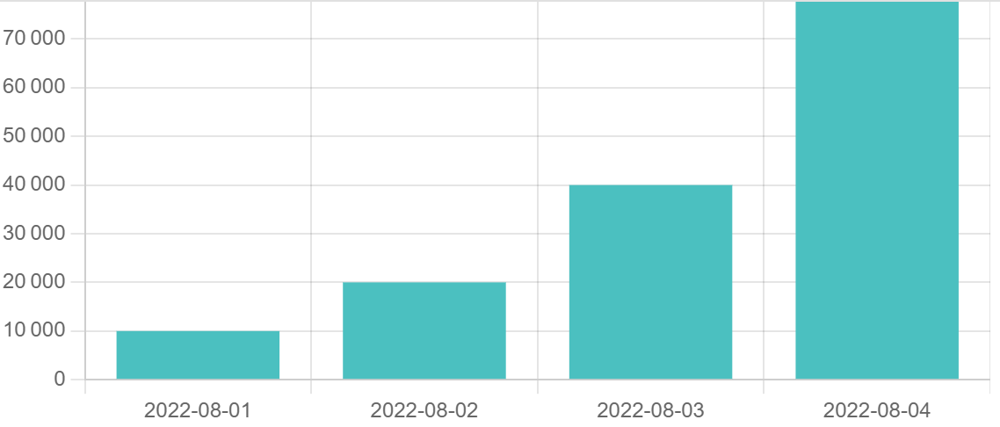
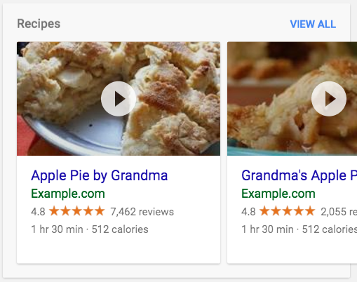

!!! note ""

    **✅ You can call ANY of the following public BigFunctions from your Google Cloud Project** (*no install*).

    - The functions are deployed in `bigfunctions` GCP project in 39 datasets for all of the 39 BigQuery regions.
    - They are public, so they can be called by anyone.
    - For any question or difficulties, please read [Getting Started](../).
    - If you prefer to deploy the BigFunction in your own project, read [Getting Started](../).
    - Found a bug? Please raise an issue [here](https://github.com/unytics/bigfunctions/issues/new/choose)

??? info "All BigFunctions Datasets >"

    | Region | Dataset |
    |--------|---------|
    | `EU` | `bigfunctions.eu` |
    | `US` | `bigfunctions.us` |
    | `asia-east1` | `bigfunctions.asia_east1` |
    | `asia-east2` | `bigfunctions.asia_east2` |
    | `asia-northeast1` | `bigfunctions.asia_northeast1` |
    | `asia-northeast2` | `bigfunctions.asia_northeast2` |
    | `asia-northeast3` | `bigfunctions.asia_northeast3` |
    | `asia-south1` | `bigfunctions.asia_south1` |
    | `asia-south2` | `bigfunctions.asia_south2` |
    | `asia-southeast1` | `bigfunctions.asia_southeast1` |
    | `asia-southeast2` | `bigfunctions.asia_southeast2` |
    | `australia-southeast1` | `bigfunctions.australia_southeast1` |
    | `australia-southeast2` | `bigfunctions.australia_southeast2` |
    | `europe-central2` | `bigfunctions.europe_central2` |
    | `europe-north1` | `bigfunctions.europe_north1` |
    | `europe-southwest1` | `bigfunctions.europe_southwest1` |
    | `europe-west1` | `bigfunctions.europe_west1` |
    | `europe-west2` | `bigfunctions.europe_west2` |
    | `europe-west3` | `bigfunctions.europe_west3` |
    | `europe-west4` | `bigfunctions.europe_west4` |
    | `europe-west6` | `bigfunctions.europe_west6` |
    | `europe-west8` | `bigfunctions.europe_west8` |
    | `europe-west9` | `bigfunctions.europe_west9` |
    | `europe-west12` | `bigfunctions.europe_west12` |
    | `me-central1` | `bigfunctions.me_central1` |
    | `me-west1` | `bigfunctions.me_west1` |
    | `northamerica-northeast1` | `bigfunctions.northamerica_northeast1` |
    | `northamerica-northeast2` | `bigfunctions.northamerica_northeast2` |
    | `southamerica-east1` | `bigfunctions.southamerica_east1` |
    | `southamerica-west1` | `bigfunctions.southamerica_west1` |
    | `us-central1` | `bigfunctions.us_central1` |
    | `us-east1` | `bigfunctions.us_east1` |
    | `us-east4` | `bigfunctions.us_east4` |
    | `us-east5` | `bigfunctions.us_east5` |
    | `us-south1` | `bigfunctions.us_south1` |
    | `us-west1` | `bigfunctions.us_west1` |
    | `us-west2` | `bigfunctions.us_west2` |
    | `us-west3` | `bigfunctions.us_west3` |
    | `us-west4` | `bigfunctions.us_west4` |


## 📄 Overview


BigFunctions are open-source BigQuery routines that give you **SQL-superpowers** in BigQuery 💪.

!!! note ""


    

    **👀 Explore**

    
    - [<code>chart(data, chart_type, ylabel)</code>](#chart): Return html with a chartjs chart
    
    - [<code>explore_column(fully_qualified_column)</code>](#explore_column): Show column statistics
    
    - [<code>explore_dataset(fully_qualified_dataset)</code>](#explore_dataset): Show infos about dataset tables
    
    - [<code>explore_table(fully_qualified_table)</code>](#explore_table): Show table infos and column statistics
    
    - [<code>sankey_chart(data)</code>](#sankey_chart): Return html with a Sankey Google chart
    

    

    **🧠 AI**

    
    - [<code>ask_ai(prompt, model)</code>](#ask_ai): Ask Anything!
    
    - [<code>ask_my_data(question, fully_qualified_table)</code>](#ask_my_data): Ask your data any `question` in natural language.
    
    - [<code>generate_sql(question, fully_qualified_table)</code>](#generate_sql): Transform `question` to a SQL query.
    

    

    **🛢 Get data**

    
    - [<code>exchange_rate(base, to)</code>](#exchange_rate): Get `exchange_rate`
    
    - [<code>get(url, headers)</code>](#get): Request `url`
    
    - [<code>get_json(url, headers)</code>](#get_json): GET json `data` from `url`
    
    - [<code>get_meteo(latitude, longitude, date)</code>](#get_meteo): Get `meteo`
    
    - [<code>get_webpage_metadata(url)</code>](#get_webpage_metadata): Get webpage metadata
    
    - [<code>get_webpage_structured_data(url)</code>](#get_webpage_structured_data): Get webpage Structured Data
    

    

    **💬 Notify**

    
    - [<code>send_google_chat_message(message, webhook_url)</code>](#send_google_chat_message): Sends `message` to google chat space
    
    - [<code>send_mail(to, subject, content, attachment_filename, attachment_content)</code>](#send_mail): Sends an email
    
    - [<code>send_mail_with_excel(to, subject, content, excel_filename, table_or_view_or_query)</code>](#send_mail_with_excel): Sends an email with `table_or_view_or_query` data attached as excel file
    
    - [<code>send_slack_message(message, webhook_url)</code>](#send_slack_message): Sends `message` to a slack channel.
    
    - [<code>send_sms(message, phone_number)</code>](#send_sms): Sends `message` via SMS to `phone_number`
    
    - [<code>send_teams_message(message, webhook_url)</code>](#send_teams_message): Sends `message` to a Microsoft Teams channel.
    

    

    **🚀 Export**

    
    - [<code>export_to_datastore(project, namespace, kind, key, data)</code>](#export_to_datastore): Exports `data` to Datastore
    
    - [<code>export_to_pubsub(project, topic, data, attributes)</code>](#export_to_pubsub): Exports `data` and `attributes` to Pub/Sub `topic`.
    
    - [<code>post(url, data, headers)</code>](#post): POST `data` to `url`.
    
    - [<code>upload_table_to_gsheet(table_or_view_or_query, max_rows, spreadsheet_url, worksheet_name, write_mode)</code>](#upload_table_to_gsheet): Upload data from `table_or_view_or_query` to Google Sheet
    
    - [<code>upload_to_gsheet(data, spreadsheet_url, worksheet_name, write_mode)</code>](#upload_to_gsheet): Upload `data` (a json array of objects) to a Google Sheet
    

    

    **1️⃣ Transform numeric**

    
    - [<code>format_percentage(first_number, second_number, nb_decimals)</code>](#format_percentage): Return `first_number / second_number` as a formatted percentage
    
    - [<code>quantize_into_bins(value, bin_bounds)</code>](#quantize_into_bins): Get the `bin_range` in which belongs `value`
    
    - [<code>quantize_into_fixed_width_bins(value, min_bound, max_bound, nb_bins)</code>](#quantize_into_fixed_width_bins): Get the `bin_range` in which belongs `value`
    

    

    **✨ Transform string**

    
    - [<code>convert_non_ascii_characters_to_unicode_escape_sequences(text)</code>](#convert_non_ascii_characters_to_unicode_escape_sequences): Replace all non ASCII characters with escape unicode
    
    - [<code>deidentify(text, info_types)</code>](#deidentify): Masks sensitive information of type `info_types` in `text`
    
    - [<code>detect_sensitive_info(text)</code>](#detect_sensitive_info): Detect sensitive information in `text`
    
    - [<code>faker(what, locale)</code>](#faker): Generates fake data
    
    - [<code>ip2asn(ip)</code>](#ip2asn): Get `asn` of `ip`
    
    - [<code>ip2continent(ip)</code>](#ip2continent): Get `continent_code` of `ip`
    
    - [<code>ip2continent_name(ip)</code>](#ip2continent_name): Get `continent` of `ip`
    
    - [<code>ip2country(ip)</code>](#ip2country): Get `country_code` of `ip`
    
    - [<code>ip2country_name(ip)</code>](#ip2country_name): Get `country_name` of `ip`
    
    - [<code>ip_range2ip_networks(first_ip, last_ip)</code>](#ip_range2ip_networks): Convert an IP range into a json list of IP networks in CIDR notation
    
    - [<code>is_email_valid(email)</code>](#is_email_valid): Return true if `email` is valid
    
    - [<code>is_phone_number_valid(phone_number, options)</code>](#is_phone_number_valid): Return if `phone_number` is valid
    
    - [<code>levenshtein(string1, string2)</code>](#levenshtein): Compute levenshtein distance between `string1` and `string2`
    
    - [<code>parse_url(url)</code>](#parse_url): Return `url` parts
    
    - [<code>parse_user_agent(user_agent_string)</code>](#parse_user_agent): Parses User Agent strings into several components
    
    - [<code>phone_number_info(phone_number, options)</code>](#phone_number_info): Get `phone_number` info
    
    - [<code>remove_accents(str)</code>](#remove_accents): Remove accents
    
    - [<code>remove_extra_whitespaces(str)</code>](#remove_extra_whitespaces): Remove unwanted whitespaces
    
    - [<code>remove_strings(string, strings_to_remove)</code>](#remove_strings): Remove any string of `strings_to_remove` from `string`
    
    - [<code>remove_words(string, words_to_remove)</code>](#remove_words): Remove any word of `words_to_remove` from `string`
    
    - [<code>render_template(template, context)</code>](#render_template): Render template with context using nunjucks.js templating library
    
    - [<code>replace_special_characters(string, replacement)</code>](#replace_special_characters): Replace most common special characters in a `string` with `replacement`
    
    - [<code>translate(text, target_language)</code>](#translate): Translate `text` into `target_language`
    
    - [<code>url_decode(url_encoded_string)</code>](#url_decode): Decode `url_encoded_string`
    
    - [<code>xml_extract(xml, x_path)</code>](#xml_extract): Returns content extracted from XML from given XPATH
    

    

    **🌐 Transform geo data**

    
    - [<code>geocode(address)</code>](#geocode): Get `address` details from Google Maps
    
    - [<code>h3(function_name, arguments)</code>](#h3): Wrapper around [Uber H3](https://github.com/uber/h3-js)
    
    - [<code>reverse_geocode(latitude, longitude)</code>](#reverse_geocode): Get address details at `latitude`, `longitude`
    
    - [<code>validate_address(address)</code>](#validate_address): Validate `address` using Google Maps
    

    

    **📆 Transform date**

    
    - [<code>date_sub_isoyear(date, years)</code>](#date_sub_isoyear): Returns same day `years` before
    
    - [<code>generate_dates(start_date, end_date)</code>](#generate_dates): Generate a table of dates
    
    - [<code>is_public_holiday(date, country_code)</code>](#is_public_holiday): Return true if `date` corresponds to a public holiday in `country_code`
    
    - [<code>parse_date(date_string)</code>](#parse_date): Parse date with automatic format detection
    
    - [<code>translated_month_name(date, language)</code>](#translated_month_name): Get `translated_month_name`
    
    - [<code>translated_weekday_name(date, language)</code>](#translated_weekday_name): Get `translated_weekday_name`
    

    

    **<span style="color: var(--md-primary-fg-color);">{...}</span> Transform json**

    
    - [<code>items2json(key_value_items)</code>](#items2json): Returns `json` object from array of `key_value_items`
    
    - [<code>json_items(json_string)</code>](#json_items): Extract `key_value_items` from `json_string`
    
    - [<code>json_keys(json_string)</code>](#json_keys): Extract `keys` from `json_string`
    
    - [<code>json_merge(json_string1, json_string2)</code>](#json_merge): Merge `json_string1` and `json_string2`
    
    - [<code>json_query(json_string, query)</code>](#json_query): Extract data from `json_string` using advanced json querying
    
    - [<code>json_schema(json_string)</code>](#json_schema): Return the schema of a json string as `[{path, type}]`
    
    - [<code>json_values(json_string)</code>](#json_values): Extract `values` from `json_string`
    

    

    **<span style="color: var(--md-primary-fg-color);">[...]</span> Transform array**

    
    - [<code>are_arrays_equal(array1, array2)</code>](#are_arrays_equal): Return true if `array1` = `array2`
    
    - [<code>array_intersect(array1, array2)</code>](#array_intersect): Returns the intersection of two arrays.
    
    - [<code>array_union(array1, array2)</code>](#array_union): Returns the union of two arrays.
    
    - [<code>distinct_values(arr)</code>](#distinct_values): Return distinct values
    
    - [<code>find_greater_value(arr, x)</code>](#find_greater_value): Return the `offset` (zero-based index) of the first `value` in `arr` where `value >= x`
    
    - [<code>find_lower_value(arr, x)</code>](#find_lower_value): Return the `offset` (zero-based index) of the first `value` in `arr` where `value <= x`
    
    - [<code>find_value(arr, value)</code>](#find_value): Return the first `offset` (zero-based index) of `value` in array `arr`
    
    - [<code>get_value(key_value_items, search_key)</code>](#get_value): Return the first `value` with a key `search_key` from `key_value_items`
    
    - [<code>last_value(arr)</code>](#last_value): Return last value of array
    
    - [<code>max_value(arr)</code>](#max_value): Return max value of array
    
    - [<code>median_value(arr)</code>](#median_value): Return median value of array
    
    - [<code>min_value(arr)</code>](#min_value): Return min value of array
    
    - [<code>percentile_value(arr, percentile)</code>](#percentile_value): Returns percentile of an array with percentile a float in range [0, 1].
    
    - [<code>remove_value(arr, value)</code>](#remove_value): Return an array with all values except `value`.
    
    - [<code>sort_values(arr)</code>](#sort_values): Return sorted array (ascending)
    
    - [<code>sort_values_desc(arr)</code>](#sort_values_desc): Return sorted array (descending)
    
    - [<code>sum_values(arr)</code>](#sum_values): Return the sum of array values
    

    

    **🧠 Machine learning**

    
    - [<code>precision_recall_auc(predictions)</code>](#precision_recall_auc): Returns the Area Under the Precision Recall Curve (a.k.a. AUC PR)
    
    - [<code>precision_recall_curve(predictions)</code>](#precision_recall_curve): Returns the Precision-Recall Curve
    
    - [<code>prophet(records, periods, kwargs)</code>](#prophet): Forecast time-series using prophet
    
    - [<code>roc_auc(predictions)</code>](#roc_auc): Returns the Area Under the Receiver Operating Characteristic Curve (a.k.a. ROC AUC)
    
    - [<code>roc_curve(predictions)</code>](#roc_curve): Returns the Receiver Operating Characteristic Curve (a.k.a. ROC Curve)
    
    - [<code>sentiment_score(content)</code>](#sentiment_score): Compute sentiment score of `content`
    

    

    **🌐 Graph**

    
    - [<code>connected_components(fully_qualified_table)</code>](#connected_components): Compute the connected components of a non-directed graph.
    

    

    **🔨 Convert data format**

    
    - [<code>html2pdf(html)</code>](#html2pdf): Convert `html` to `pdf`
    
    - [<code>json2excel(data)</code>](#json2excel): Dump data to excel file
    
    - [<code>json2xml(json)</code>](#json2xml): Returns XML for given JSON string
    
    - [<code>xml2json(xml)</code>](#xml2json): Returns JSON as a string for given XML string
    

    

    **🔨 Utils**

    
    - [<code>deduplicate_rows(query_or_table_or_view)</code>](#deduplicate_rows): Returns the deduplicated rows of `query_or_table_or_view`
    
    - [<code>get_latest_partition_timestamp(fully_qualified_table)</code>](#get_latest_partition_timestamp): Return the maximum of the partition column of `fully_qualified_table`
    
    - [<code>get_table_columns(fully_qualified_table)</code>](#get_table_columns): Get the column information of the given table from `INFORMATION_SCHEMA.COLUMNS`
    
    - [<code>get_view_history(fully_qualified_view)</code>](#get_view_history): Get BigQuery View history
    
    - [<code>run_python(python_code, requirements, kwargs)</code>](#run_python): Run any `python_code`.
    
    - [<code>sleep(seconds)</code>](#sleep): Sleep during `seconds` seconds
    
    - [<code>timestamp_from_unix_date_time(unix_date_time, date_time_part)</code>](#timestamp_from_unix_date_time): Interprets `unix_date_time` as the number of `date_time_part` since `1970-01-01 00:00:00 UTC`.
    
    - [<code>timestamp_to_unix_date_time(timestamp_expression, date_time_part)</code>](#timestamp_to_unix_date_time): Returns the number of `date_time_part` since `1970-01-01 00:00:00 UTC`.
    
    - [<code>upsert(query_or_table_or_view, destination_table, insertion_mode, primary_keys, recency_field)</code>](#upsert): Merges `query_or_table_or_view` into the `destination_table`.
    

    


<div style="margin-top: 6rem;"></div>


## 👀 Explore

!!! note ""
    **Explore data within BigQuery console **

    Make computations on BigQuery and display the results as data-vizualizations directly in BigQuery console.

---


### chart
<div style="position: relative; top: -2rem; margin-bottom:  -2rem; text-align: right; z-index: 9999;">
  
  <a href="https://www.linkedin.com/in/paul-marcombes" title="Author: Paul Marcombes" target="_blank">
    
  </a>
  
  <a href="https://github.com/unytics/bigfunctions/blob/main/bigfunctions/chart.yaml" title="Edit on GitHub" target="_blank"><svg xmlns="http://www.w3.org/2000/svg" width="32" height="32" viewBox="0 0 24 24"><path fill="#5d6cc0" d="M12 0c-6.626 0-12 5.373-12 12 0 5.302 3.438 9.8 8.207 11.387.599.111.793-.261.793-.577v-2.234c-3.338.726-4.033-1.416-4.033-1.416-.546-1.387-1.333-1.756-1.333-1.756-1.089-.745.083-.729.083-.729 1.205.084 1.839 1.237 1.839 1.237 1.07 1.834 2.807 1.304 3.492.997.107-.775.418-1.305.762-1.604-2.665-.305-5.467-1.334-5.467-5.931 0-1.311.469-2.381 1.236-3.221-.124-.303-.535-1.524.117-3.176 0 0 1.008-.322 3.301 1.23.957-.266 1.983-.399 3.003-.404 1.02.005 2.047.138 3.006.404 2.291-1.552 3.297-1.23 3.297-1.23.653 1.653.242 2.874.118 3.176.77.84 1.235 1.911 1.235 3.221 0 4.609-2.807 5.624-5.479 5.921.43.372.823 1.102.823 2.222v3.293c0 .319.192.694.801.576 4.765-1.589 8.199-6.086 8.199-11.386 0-6.627-5.373-12-12-12z"/></svg></a></div>
```
chart(data, chart_type, ylabel)
```

**Description**

Return html with a chartjs chart

??? example "See the result as a data visualization in BigQuery Console!"

    **The result of this function can be vizualized as an html report directly in BigQuery Console!**

    1. Install this bookmarklet: <a href="javascript:(function()%7Blet%20isChartJsLoaded%20%3D%20false%3B%0Alet%20isGoogleChartsLoaded%20%3D%20false%3B%0Alet%20isFunnelGraphJsLoaded%20%3D%20false%3B%0A%0A%0Awindow.escapeHTML%20%3D%20function(html)%20%7B%0A%20%20if(!trustedTypes)%20%7B%0A%20%20%20%20return%20html%3B%0A%20%20%7D%0A%20%20const%20policy%20%3D%20trustedTypes.createPolicy(%22forceInner%22%2C%20%7BcreateHTML%3A%20(to_escape)%20%3D%3E%20to_escape%7D)%3B%0A%20%20return%20policy.createHTML(html)%3B%0A%7D%3B%0A%0A%0Aconst%20escapeScript%20%3D%20function(script)%20%7B%0A%20%20if(!trustedTypes)%20%7B%0A%20%20%20%20return%20script%3B%0A%20%20%7D%0A%20%20const%20policy%20%3D%20trustedTypes.createPolicy(%22forceInner%22%2C%20%7BcreateScript%3A%20(to_escape)%20%3D%3E%20to_escape%7D)%3B%0A%20%20return%20policy.createScript(script)%3B%0A%7D%3B%0A%0A%0Aconst%20setInnerHTML%20%3D%20function(elm%2C%20html)%20%7B%0A%20%20elm.innerHTML%20%3D%20window.escapeHTML(html)%3B%0A%20%20Array.from(elm.querySelectorAll('script')).forEach(%20oldScript%20%3D%3E%20%7B%0A%20%20%20%20%20%20const%20newScript%20%3D%20document.createElement('script')%3B%0A%20%20%20%20%20%20Array.from(oldScript.attributes).forEach(%20attr%20%3D%3E%20newScript.setAttribute(attr.name%2C%20attr.value)%20)%3B%0A%20%20%20%20%20%20newScript.text%20%3D%20escapeScript(oldScript.innerHTML)%3B%0A%20%20%20%20%20%20oldScript.parentNode.replaceChild(newScript%2C%20oldScript)%3B%0A%20%20%7D)%3B%0A%7D%3B%0A%0A%0Aconst%20run%20%3D%20async%20function()%20%7B%0A%20%20if%20(!isChartJsLoaded%20%7C%7C%20!isGoogleChartsLoaded%20%7C%7C%20!isFunnelGraphJsLoaded)%20%7B%0A%20%20%20%20return%3B%0A%20%20%7D%0A%20%20const%20results_table_container%20%3D%20document.querySelector('bq-tab-content%3Anot(.cfc-hidden)%20bq-results-table')%3B%0A%20%20if%20(!results_table_container)%20%7B%0A%20%20%20%20return%3B%0A%20%20%7D%0A%20%20const%20cells%20%3D%20results_table_container.querySelectorAll('td%20div%3Anot(.cfc-flex-container)')%3B%0A%20%20if%20(cells.length%20!%3D%3D%201)%20%7B%0A%20%20%20%20return%3B%0A%20%20%7D%0A%20%20const%20cell%20%3D%20cells%5B0%5D%3B%0A%20%20const%20content%20%3D%20cell.innerText%3B%0A%20%20if%20(!content.startsWith(%22%3Chtml%22))%20%7B%0A%20%20%20%20return%3B%0A%20%20%7D%0A%20%20if%20(content.endsWith(%22...%22))%20%7B%0A%20%20%20%20cell.nextElementSibling.firstElementChild.click()%3B%0A%20%20%20%20return%3B%0A%20%20%7D%0A%20%20const%20html%20%3D%20%60%3Csection%20id%3D%22bf-container%22%20class%3D%22section%22%3E%24%7Bcontent%7D%3C%2Fsection%3E%60%0A%20%20setInnerHTML(results_table_container%2C%20html)%3B%0A%7D%3B%0A%0A%0Aconst%20loadBulmaCss%20%3D%20function()%20%7B%0A%20%20const%20bulma%20%3D%20document.createElement('link')%3B%0A%20%20bulma.setAttribute('rel'%2C%20'stylesheet')%3B%0A%20%20bulma.setAttribute('href'%2C%20'https%3A%2F%2Fcdn.jsdelivr.net%2Fnpm%2Fbulma%400.9.4%2Fcss%2Fbulma.min.css')%3B%0A%20%20document.head.appendChild(bulma)%3B%0A%7D%3B%0A%0A%0Aconst%20loadChartJs%20%3D%20function()%20%7B%0A%20%20fetch('https%3A%2F%2Fcdnjs.cloudflare.com%2Fajax%2Flibs%2FChart.js%2F3.9.1%2Fchart.min.js')%0A%20%20.then((response)%20%3D%3E%20response.text())%0A%20%20.then((text)%20%3D%3E%20%7B%0A%20%20%20%20const%20script%20%3D%20document.createElement('script')%3B%0A%20%20%20%20script.text%20%3D%20escapeScript(text)%3B%0A%20%20%20%20document.head.appendChild(script)%3B%0A%20%20%20%20isChartJsLoaded%20%3D%20true%3B%0A%20%20%7D)%3B%0A%7D%3B%0A%0A%0Aconst%20loadGoogleChart%20%3D%20function()%20%7B%0A%20%20fetch('https%3A%2F%2Fwww.gstatic.com%2Fcharts%2Floader.js')%0A%20%20.then((response)%20%3D%3E%20response.text())%0A%20%20.then((text)%20%3D%3E%20%7B%0A%20%20%20%20const%20script%20%3D%20document.createElement('script')%3B%0A%20%20%20%20script.text%20%3D%20escapeScript(text)%3B%0A%20%20%20%20document.head.appendChild(script)%3B%0A%20%20%20%20google.charts.load('current'%2C%20%7Bpackages%3A%20%5B'sankey'%5D%7D)%3B%0A%20%20%20%20google.charts.setOnLoadCallback(function()%20%7B%20isGoogleChartsLoaded%20%3D%20true%3B%20%7D)%3B%0A%20%20%7D)%3B%0A%7D%3B%0A%0A%0Aconst%20loadFunnelGraphJs%20%3D%20function()%20%7B%0A%20%20const%20css%20%3D%20document.createElement('link')%3B%0A%20%20css.setAttribute('rel'%2C%20'stylesheet')%3B%0A%20%20css.setAttribute('href'%2C%20'https%3A%2F%2Funpkg.com%2Ffunnel-graph-js%401.3.9%2Fdist%2Fcss%2Fmain.min.css')%3B%0A%20%20document.head.appendChild(css)%3B%0A%0A%20%20const%20css2%20%3D%20document.createElement('link')%3B%0A%20%20css2.setAttribute('rel'%2C%20'stylesheet')%3B%0A%20%20css2.setAttribute('href'%2C%20'https%3A%2F%2Funpkg.com%2Ffunnel-graph-js%401.3.9%2Fdist%2Fcss%2Ftheme.min.css')%3B%0A%20%20document.head.appendChild(css2)%3B%0A%0A%20%20fetch('https%3A%2F%2Funpkg.com%2Ffunnel-graph-js%401.3.9%2Fdist%2Fjs%2Ffunnel-graph.min.js')%0A%20%20.then((response)%20%3D%3E%20response.text())%0A%20%20.then((text)%20%3D%3E%20%7B%0A%20%20%20%20const%20regex%20%3D%20%2FinnerHTML%3D(%5Cw%2B)%2Fgi%3B%0A%20%20%20%20text%20%3D%20text.replace(regex%2C%20'innerHTML%3Dwindow.escapeHTML(%241)')%3B%0A%20%20%20%20console.log(text)%3B%0A%20%20%20%20const%20script%20%3D%20document.createElement('script')%3B%0A%20%20%20%20script.text%20%3D%20escapeScript(text)%3B%0A%20%20%20%20document.head.appendChild(script)%3B%0A%20%20%20%20isFunnelGraphJsLoaded%20%3D%20true%3B%0A%20%20%7D)%3B%0A%0A%0A%7D%0A%0AloadBulmaCss()%3B%0AloadFunnelGraphJs()%3B%0AloadChartJs()%3B%0AloadGoogleChart()%3B%0AsetInterval(run%2C%20100)%3B%7D)()%3B">bigfunctions</a> *(it has to be done only once)*
    2. Open BigQuery console
    3. Click on the installed bookmarklet.
        - From now on, the bookmarklet code will observe the BigQuery console page.
        - If a BigQuery result appears with a unique cell containing html content, it will be rendered.
    4. You will have to click on the bookmarklet *again*:
        - If you refresh the Bigquery console page,
        - If you open the BigQuery console in a new tab of your browser.
    5. Run the query of the example and open the result of the latest subquery. The result will be shown as a nice html content.

    <br>

    


**Examples**


=== "EU"

    ```sql
    select bigfunctions.eu.chart([('2022-08-01', 10000.), ('2022-08-02', 20000.), ('2022-08-03', 40000.), ('2022-08-04', 80000.)], 'bar', 'sales') as html
    
    ```


=== "US"

    ```sql
    select bigfunctions.us.chart([('2022-08-01', 10000.), ('2022-08-02', 20000.), ('2022-08-03', 40000.), ('2022-08-04', 80000.)], 'bar', 'sales') as html
    
    ```


=== "europe-west1"

    ```sql
    select bigfunctions.europe_west1.chart([('2022-08-01', 10000.), ('2022-08-02', 20000.), ('2022-08-03', 40000.), ('2022-08-04', 80000.)], 'bar', 'sales') as html
    
    ```


=== "your-region2"

    ```sql
    select bigfunctions.your_region2.chart([('2022-08-01', 10000.), ('2022-08-02', 20000.), ('2022-08-03', 40000.), ('2022-08-04', 80000.)], 'bar', 'sales') as html
    
    ```


<a href="chart.png"></a>


---


### explore_column
<div style="position: relative; top: -2rem; margin-bottom:  -2rem; text-align: right; z-index: 9999;">
  
  <a href="https://www.linkedin.com/in/paul-marcombes" title="Author: Paul Marcombes" target="_blank">
    
  </a>
  
  <a href="https://github.com/unytics/bigfunctions/blob/main/bigfunctions/explore_column.yaml" title="Edit on GitHub" target="_blank"><svg xmlns="http://www.w3.org/2000/svg" width="32" height="32" viewBox="0 0 24 24"><path fill="#5d6cc0" d="M12 0c-6.626 0-12 5.373-12 12 0 5.302 3.438 9.8 8.207 11.387.599.111.793-.261.793-.577v-2.234c-3.338.726-4.033-1.416-4.033-1.416-.546-1.387-1.333-1.756-1.333-1.756-1.089-.745.083-.729.083-.729 1.205.084 1.839 1.237 1.839 1.237 1.07 1.834 2.807 1.304 3.492.997.107-.775.418-1.305.762-1.604-2.665-.305-5.467-1.334-5.467-5.931 0-1.311.469-2.381 1.236-3.221-.124-.303-.535-1.524.117-3.176 0 0 1.008-.322 3.301 1.23.957-.266 1.983-.399 3.003-.404 1.02.005 2.047.138 3.006.404 2.291-1.552 3.297-1.23 3.297-1.23.653 1.653.242 2.874.118 3.176.77.84 1.235 1.911 1.235 3.221 0 4.609-2.807 5.624-5.479 5.921.43.372.823 1.102.823 2.222v3.293c0 .319.192.694.801.576 4.765-1.589 8.199-6.086 8.199-11.386 0-6.627-5.373-12-12-12z"/></svg></a></div>
```
explore_column(fully_qualified_column)
```

**Description**

Show column statistics

??? example "See the result as a data visualization in BigQuery Console!"

    **The result of this function can be vizualized as an html report directly in BigQuery Console!**

    1. Install this bookmarklet: <a href="javascript:(function()%7Blet%20isChartJsLoaded%20%3D%20false%3B%0Alet%20isGoogleChartsLoaded%20%3D%20false%3B%0Alet%20isFunnelGraphJsLoaded%20%3D%20false%3B%0A%0A%0Awindow.escapeHTML%20%3D%20function(html)%20%7B%0A%20%20if(!trustedTypes)%20%7B%0A%20%20%20%20return%20html%3B%0A%20%20%7D%0A%20%20const%20policy%20%3D%20trustedTypes.createPolicy(%22forceInner%22%2C%20%7BcreateHTML%3A%20(to_escape)%20%3D%3E%20to_escape%7D)%3B%0A%20%20return%20policy.createHTML(html)%3B%0A%7D%3B%0A%0A%0Aconst%20escapeScript%20%3D%20function(script)%20%7B%0A%20%20if(!trustedTypes)%20%7B%0A%20%20%20%20return%20script%3B%0A%20%20%7D%0A%20%20const%20policy%20%3D%20trustedTypes.createPolicy(%22forceInner%22%2C%20%7BcreateScript%3A%20(to_escape)%20%3D%3E%20to_escape%7D)%3B%0A%20%20return%20policy.createScript(script)%3B%0A%7D%3B%0A%0A%0Aconst%20setInnerHTML%20%3D%20function(elm%2C%20html)%20%7B%0A%20%20elm.innerHTML%20%3D%20window.escapeHTML(html)%3B%0A%20%20Array.from(elm.querySelectorAll('script')).forEach(%20oldScript%20%3D%3E%20%7B%0A%20%20%20%20%20%20const%20newScript%20%3D%20document.createElement('script')%3B%0A%20%20%20%20%20%20Array.from(oldScript.attributes).forEach(%20attr%20%3D%3E%20newScript.setAttribute(attr.name%2C%20attr.value)%20)%3B%0A%20%20%20%20%20%20newScript.text%20%3D%20escapeScript(oldScript.innerHTML)%3B%0A%20%20%20%20%20%20oldScript.parentNode.replaceChild(newScript%2C%20oldScript)%3B%0A%20%20%7D)%3B%0A%7D%3B%0A%0A%0Aconst%20run%20%3D%20async%20function()%20%7B%0A%20%20if%20(!isChartJsLoaded%20%7C%7C%20!isGoogleChartsLoaded%20%7C%7C%20!isFunnelGraphJsLoaded)%20%7B%0A%20%20%20%20return%3B%0A%20%20%7D%0A%20%20const%20results_table_container%20%3D%20document.querySelector('bq-tab-content%3Anot(.cfc-hidden)%20bq-results-table')%3B%0A%20%20if%20(!results_table_container)%20%7B%0A%20%20%20%20return%3B%0A%20%20%7D%0A%20%20const%20cells%20%3D%20results_table_container.querySelectorAll('td%20div%3Anot(.cfc-flex-container)')%3B%0A%20%20if%20(cells.length%20!%3D%3D%201)%20%7B%0A%20%20%20%20return%3B%0A%20%20%7D%0A%20%20const%20cell%20%3D%20cells%5B0%5D%3B%0A%20%20const%20content%20%3D%20cell.innerText%3B%0A%20%20if%20(!content.startsWith(%22%3Chtml%22))%20%7B%0A%20%20%20%20return%3B%0A%20%20%7D%0A%20%20if%20(content.endsWith(%22...%22))%20%7B%0A%20%20%20%20cell.nextElementSibling.firstElementChild.click()%3B%0A%20%20%20%20return%3B%0A%20%20%7D%0A%20%20const%20html%20%3D%20%60%3Csection%20id%3D%22bf-container%22%20class%3D%22section%22%3E%24%7Bcontent%7D%3C%2Fsection%3E%60%0A%20%20setInnerHTML(results_table_container%2C%20html)%3B%0A%7D%3B%0A%0A%0Aconst%20loadBulmaCss%20%3D%20function()%20%7B%0A%20%20const%20bulma%20%3D%20document.createElement('link')%3B%0A%20%20bulma.setAttribute('rel'%2C%20'stylesheet')%3B%0A%20%20bulma.setAttribute('href'%2C%20'https%3A%2F%2Fcdn.jsdelivr.net%2Fnpm%2Fbulma%400.9.4%2Fcss%2Fbulma.min.css')%3B%0A%20%20document.head.appendChild(bulma)%3B%0A%7D%3B%0A%0A%0Aconst%20loadChartJs%20%3D%20function()%20%7B%0A%20%20fetch('https%3A%2F%2Fcdnjs.cloudflare.com%2Fajax%2Flibs%2FChart.js%2F3.9.1%2Fchart.min.js')%0A%20%20.then((response)%20%3D%3E%20response.text())%0A%20%20.then((text)%20%3D%3E%20%7B%0A%20%20%20%20const%20script%20%3D%20document.createElement('script')%3B%0A%20%20%20%20script.text%20%3D%20escapeScript(text)%3B%0A%20%20%20%20document.head.appendChild(script)%3B%0A%20%20%20%20isChartJsLoaded%20%3D%20true%3B%0A%20%20%7D)%3B%0A%7D%3B%0A%0A%0Aconst%20loadGoogleChart%20%3D%20function()%20%7B%0A%20%20fetch('https%3A%2F%2Fwww.gstatic.com%2Fcharts%2Floader.js')%0A%20%20.then((response)%20%3D%3E%20response.text())%0A%20%20.then((text)%20%3D%3E%20%7B%0A%20%20%20%20const%20script%20%3D%20document.createElement('script')%3B%0A%20%20%20%20script.text%20%3D%20escapeScript(text)%3B%0A%20%20%20%20document.head.appendChild(script)%3B%0A%20%20%20%20google.charts.load('current'%2C%20%7Bpackages%3A%20%5B'sankey'%5D%7D)%3B%0A%20%20%20%20google.charts.setOnLoadCallback(function()%20%7B%20isGoogleChartsLoaded%20%3D%20true%3B%20%7D)%3B%0A%20%20%7D)%3B%0A%7D%3B%0A%0A%0Aconst%20loadFunnelGraphJs%20%3D%20function()%20%7B%0A%20%20const%20css%20%3D%20document.createElement('link')%3B%0A%20%20css.setAttribute('rel'%2C%20'stylesheet')%3B%0A%20%20css.setAttribute('href'%2C%20'https%3A%2F%2Funpkg.com%2Ffunnel-graph-js%401.3.9%2Fdist%2Fcss%2Fmain.min.css')%3B%0A%20%20document.head.appendChild(css)%3B%0A%0A%20%20const%20css2%20%3D%20document.createElement('link')%3B%0A%20%20css2.setAttribute('rel'%2C%20'stylesheet')%3B%0A%20%20css2.setAttribute('href'%2C%20'https%3A%2F%2Funpkg.com%2Ffunnel-graph-js%401.3.9%2Fdist%2Fcss%2Ftheme.min.css')%3B%0A%20%20document.head.appendChild(css2)%3B%0A%0A%20%20fetch('https%3A%2F%2Funpkg.com%2Ffunnel-graph-js%401.3.9%2Fdist%2Fjs%2Ffunnel-graph.min.js')%0A%20%20.then((response)%20%3D%3E%20response.text())%0A%20%20.then((text)%20%3D%3E%20%7B%0A%20%20%20%20const%20regex%20%3D%20%2FinnerHTML%3D(%5Cw%2B)%2Fgi%3B%0A%20%20%20%20text%20%3D%20text.replace(regex%2C%20'innerHTML%3Dwindow.escapeHTML(%241)')%3B%0A%20%20%20%20console.log(text)%3B%0A%20%20%20%20const%20script%20%3D%20document.createElement('script')%3B%0A%20%20%20%20script.text%20%3D%20escapeScript(text)%3B%0A%20%20%20%20document.head.appendChild(script)%3B%0A%20%20%20%20isFunnelGraphJsLoaded%20%3D%20true%3B%0A%20%20%7D)%3B%0A%0A%0A%7D%0A%0AloadBulmaCss()%3B%0AloadFunnelGraphJs()%3B%0AloadChartJs()%3B%0AloadGoogleChart()%3B%0AsetInterval(run%2C%20100)%3B%7D)()%3B">bigfunctions</a> *(it has to be done only once)*
    2. Open BigQuery console
    3. Click on the installed bookmarklet.
        - From now on, the bookmarklet code will observe the BigQuery console page.
        - If a BigQuery result appears with a unique cell containing html content, it will be rendered.
    4. You will have to click on the bookmarklet *again*:
        - If you refresh the Bigquery console page,
        - If you open the BigQuery console in a new tab of your browser.
    5. Run the query of the example and open the result of the latest subquery. The result will be shown as a nice html content.

    <br>

    


**Examples**


=== "EU"

    ```sql
    call bigfunctions.eu.explore_column("bigfunctions.eu.natality.weight_pounds");
    select html from bigfunction_result;
    ```


=== "US"

    ```sql
    call bigfunctions.us.explore_column("bigfunctions.us.natality.weight_pounds");
    select html from bigfunction_result;
    ```


=== "europe-west1"

    ```sql
    call bigfunctions.europe_west1.explore_column("bigfunctions.europe_west1.natality.weight_pounds");
    select html from bigfunction_result;
    ```


=== "your-region2"

    ```sql
    call bigfunctions.your_region2.explore_column("bigfunctions.your_region2.natality.weight_pounds");
    select html from bigfunction_result;
    ```


<a href="explore_column.png"></a>


---


### explore_dataset
<div style="position: relative; top: -2rem; margin-bottom:  -2rem; text-align: right; z-index: 9999;">
  
  <a href="https://www.linkedin.com/in/paul-marcombes" title="Author: Paul Marcombes" target="_blank">
    
  </a>
  
  <a href="https://github.com/unytics/bigfunctions/blob/main/bigfunctions/explore_dataset.yaml" title="Edit on GitHub" target="_blank"><svg xmlns="http://www.w3.org/2000/svg" width="32" height="32" viewBox="0 0 24 24"><path fill="#5d6cc0" d="M12 0c-6.626 0-12 5.373-12 12 0 5.302 3.438 9.8 8.207 11.387.599.111.793-.261.793-.577v-2.234c-3.338.726-4.033-1.416-4.033-1.416-.546-1.387-1.333-1.756-1.333-1.756-1.089-.745.083-.729.083-.729 1.205.084 1.839 1.237 1.839 1.237 1.07 1.834 2.807 1.304 3.492.997.107-.775.418-1.305.762-1.604-2.665-.305-5.467-1.334-5.467-5.931 0-1.311.469-2.381 1.236-3.221-.124-.303-.535-1.524.117-3.176 0 0 1.008-.322 3.301 1.23.957-.266 1.983-.399 3.003-.404 1.02.005 2.047.138 3.006.404 2.291-1.552 3.297-1.23 3.297-1.23.653 1.653.242 2.874.118 3.176.77.84 1.235 1.911 1.235 3.221 0 4.609-2.807 5.624-5.479 5.921.43.372.823 1.102.823 2.222v3.293c0 .319.192.694.801.576 4.765-1.589 8.199-6.086 8.199-11.386 0-6.627-5.373-12-12-12z"/></svg></a></div>
```
explore_dataset(fully_qualified_dataset)
```

**Description**

Show infos about dataset tables

??? example "See the result as a data visualization in BigQuery Console!"

    **The result of this function can be vizualized as an html report directly in BigQuery Console!**

    1. Install this bookmarklet: <a href="javascript:(function()%7Blet%20isChartJsLoaded%20%3D%20false%3B%0Alet%20isGoogleChartsLoaded%20%3D%20false%3B%0Alet%20isFunnelGraphJsLoaded%20%3D%20false%3B%0A%0A%0Awindow.escapeHTML%20%3D%20function(html)%20%7B%0A%20%20if(!trustedTypes)%20%7B%0A%20%20%20%20return%20html%3B%0A%20%20%7D%0A%20%20const%20policy%20%3D%20trustedTypes.createPolicy(%22forceInner%22%2C%20%7BcreateHTML%3A%20(to_escape)%20%3D%3E%20to_escape%7D)%3B%0A%20%20return%20policy.createHTML(html)%3B%0A%7D%3B%0A%0A%0Aconst%20escapeScript%20%3D%20function(script)%20%7B%0A%20%20if(!trustedTypes)%20%7B%0A%20%20%20%20return%20script%3B%0A%20%20%7D%0A%20%20const%20policy%20%3D%20trustedTypes.createPolicy(%22forceInner%22%2C%20%7BcreateScript%3A%20(to_escape)%20%3D%3E%20to_escape%7D)%3B%0A%20%20return%20policy.createScript(script)%3B%0A%7D%3B%0A%0A%0Aconst%20setInnerHTML%20%3D%20function(elm%2C%20html)%20%7B%0A%20%20elm.innerHTML%20%3D%20window.escapeHTML(html)%3B%0A%20%20Array.from(elm.querySelectorAll('script')).forEach(%20oldScript%20%3D%3E%20%7B%0A%20%20%20%20%20%20const%20newScript%20%3D%20document.createElement('script')%3B%0A%20%20%20%20%20%20Array.from(oldScript.attributes).forEach(%20attr%20%3D%3E%20newScript.setAttribute(attr.name%2C%20attr.value)%20)%3B%0A%20%20%20%20%20%20newScript.text%20%3D%20escapeScript(oldScript.innerHTML)%3B%0A%20%20%20%20%20%20oldScript.parentNode.replaceChild(newScript%2C%20oldScript)%3B%0A%20%20%7D)%3B%0A%7D%3B%0A%0A%0Aconst%20run%20%3D%20async%20function()%20%7B%0A%20%20if%20(!isChartJsLoaded%20%7C%7C%20!isGoogleChartsLoaded%20%7C%7C%20!isFunnelGraphJsLoaded)%20%7B%0A%20%20%20%20return%3B%0A%20%20%7D%0A%20%20const%20results_table_container%20%3D%20document.querySelector('bq-tab-content%3Anot(.cfc-hidden)%20bq-results-table')%3B%0A%20%20if%20(!results_table_container)%20%7B%0A%20%20%20%20return%3B%0A%20%20%7D%0A%20%20const%20cells%20%3D%20results_table_container.querySelectorAll('td%20div%3Anot(.cfc-flex-container)')%3B%0A%20%20if%20(cells.length%20!%3D%3D%201)%20%7B%0A%20%20%20%20return%3B%0A%20%20%7D%0A%20%20const%20cell%20%3D%20cells%5B0%5D%3B%0A%20%20const%20content%20%3D%20cell.innerText%3B%0A%20%20if%20(!content.startsWith(%22%3Chtml%22))%20%7B%0A%20%20%20%20return%3B%0A%20%20%7D%0A%20%20if%20(content.endsWith(%22...%22))%20%7B%0A%20%20%20%20cell.nextElementSibling.firstElementChild.click()%3B%0A%20%20%20%20return%3B%0A%20%20%7D%0A%20%20const%20html%20%3D%20%60%3Csection%20id%3D%22bf-container%22%20class%3D%22section%22%3E%24%7Bcontent%7D%3C%2Fsection%3E%60%0A%20%20setInnerHTML(results_table_container%2C%20html)%3B%0A%7D%3B%0A%0A%0Aconst%20loadBulmaCss%20%3D%20function()%20%7B%0A%20%20const%20bulma%20%3D%20document.createElement('link')%3B%0A%20%20bulma.setAttribute('rel'%2C%20'stylesheet')%3B%0A%20%20bulma.setAttribute('href'%2C%20'https%3A%2F%2Fcdn.jsdelivr.net%2Fnpm%2Fbulma%400.9.4%2Fcss%2Fbulma.min.css')%3B%0A%20%20document.head.appendChild(bulma)%3B%0A%7D%3B%0A%0A%0Aconst%20loadChartJs%20%3D%20function()%20%7B%0A%20%20fetch('https%3A%2F%2Fcdnjs.cloudflare.com%2Fajax%2Flibs%2FChart.js%2F3.9.1%2Fchart.min.js')%0A%20%20.then((response)%20%3D%3E%20response.text())%0A%20%20.then((text)%20%3D%3E%20%7B%0A%20%20%20%20const%20script%20%3D%20document.createElement('script')%3B%0A%20%20%20%20script.text%20%3D%20escapeScript(text)%3B%0A%20%20%20%20document.head.appendChild(script)%3B%0A%20%20%20%20isChartJsLoaded%20%3D%20true%3B%0A%20%20%7D)%3B%0A%7D%3B%0A%0A%0Aconst%20loadGoogleChart%20%3D%20function()%20%7B%0A%20%20fetch('https%3A%2F%2Fwww.gstatic.com%2Fcharts%2Floader.js')%0A%20%20.then((response)%20%3D%3E%20response.text())%0A%20%20.then((text)%20%3D%3E%20%7B%0A%20%20%20%20const%20script%20%3D%20document.createElement('script')%3B%0A%20%20%20%20script.text%20%3D%20escapeScript(text)%3B%0A%20%20%20%20document.head.appendChild(script)%3B%0A%20%20%20%20google.charts.load('current'%2C%20%7Bpackages%3A%20%5B'sankey'%5D%7D)%3B%0A%20%20%20%20google.charts.setOnLoadCallback(function()%20%7B%20isGoogleChartsLoaded%20%3D%20true%3B%20%7D)%3B%0A%20%20%7D)%3B%0A%7D%3B%0A%0A%0Aconst%20loadFunnelGraphJs%20%3D%20function()%20%7B%0A%20%20const%20css%20%3D%20document.createElement('link')%3B%0A%20%20css.setAttribute('rel'%2C%20'stylesheet')%3B%0A%20%20css.setAttribute('href'%2C%20'https%3A%2F%2Funpkg.com%2Ffunnel-graph-js%401.3.9%2Fdist%2Fcss%2Fmain.min.css')%3B%0A%20%20document.head.appendChild(css)%3B%0A%0A%20%20const%20css2%20%3D%20document.createElement('link')%3B%0A%20%20css2.setAttribute('rel'%2C%20'stylesheet')%3B%0A%20%20css2.setAttribute('href'%2C%20'https%3A%2F%2Funpkg.com%2Ffunnel-graph-js%401.3.9%2Fdist%2Fcss%2Ftheme.min.css')%3B%0A%20%20document.head.appendChild(css2)%3B%0A%0A%20%20fetch('https%3A%2F%2Funpkg.com%2Ffunnel-graph-js%401.3.9%2Fdist%2Fjs%2Ffunnel-graph.min.js')%0A%20%20.then((response)%20%3D%3E%20response.text())%0A%20%20.then((text)%20%3D%3E%20%7B%0A%20%20%20%20const%20regex%20%3D%20%2FinnerHTML%3D(%5Cw%2B)%2Fgi%3B%0A%20%20%20%20text%20%3D%20text.replace(regex%2C%20'innerHTML%3Dwindow.escapeHTML(%241)')%3B%0A%20%20%20%20console.log(text)%3B%0A%20%20%20%20const%20script%20%3D%20document.createElement('script')%3B%0A%20%20%20%20script.text%20%3D%20escapeScript(text)%3B%0A%20%20%20%20document.head.appendChild(script)%3B%0A%20%20%20%20isFunnelGraphJsLoaded%20%3D%20true%3B%0A%20%20%7D)%3B%0A%0A%0A%7D%0A%0AloadBulmaCss()%3B%0AloadFunnelGraphJs()%3B%0AloadChartJs()%3B%0AloadGoogleChart()%3B%0AsetInterval(run%2C%20100)%3B%7D)()%3B">bigfunctions</a> *(it has to be done only once)*
    2. Open BigQuery console
    3. Click on the installed bookmarklet.
        - From now on, the bookmarklet code will observe the BigQuery console page.
        - If a BigQuery result appears with a unique cell containing html content, it will be rendered.
    4. You will have to click on the bookmarklet *again*:
        - If you refresh the Bigquery console page,
        - If you open the BigQuery console in a new tab of your browser.
    5. Run the query of the example and open the result of the latest subquery. The result will be shown as a nice html content.

    <br>

    


**Examples**


=== "EU"

    ```sql
    call bigfunctions.eu.explore_dataset("bigfunctions.eu");
    select html from bigfunction_result;
    ```


=== "US"

    ```sql
    call bigfunctions.us.explore_dataset("bigfunctions.us");
    select html from bigfunction_result;
    ```


=== "europe-west1"

    ```sql
    call bigfunctions.europe_west1.explore_dataset("bigfunctions.europe_west1");
    select html from bigfunction_result;
    ```


=== "your-region2"

    ```sql
    call bigfunctions.your_region2.explore_dataset("bigfunctions.your_region2");
    select html from bigfunction_result;
    ```


<a href="explore_dataset.png"></a>


---


### explore_table
<div style="position: relative; top: -2rem; margin-bottom:  -2rem; text-align: right; z-index: 9999;">
  
  <a href="https://www.linkedin.com/in/paul-marcombes" title="Author: Paul Marcombes" target="_blank">
    
  </a>
  
  <a href="https://github.com/unytics/bigfunctions/blob/main/bigfunctions/explore_table.yaml" title="Edit on GitHub" target="_blank"><svg xmlns="http://www.w3.org/2000/svg" width="32" height="32" viewBox="0 0 24 24"><path fill="#5d6cc0" d="M12 0c-6.626 0-12 5.373-12 12 0 5.302 3.438 9.8 8.207 11.387.599.111.793-.261.793-.577v-2.234c-3.338.726-4.033-1.416-4.033-1.416-.546-1.387-1.333-1.756-1.333-1.756-1.089-.745.083-.729.083-.729 1.205.084 1.839 1.237 1.839 1.237 1.07 1.834 2.807 1.304 3.492.997.107-.775.418-1.305.762-1.604-2.665-.305-5.467-1.334-5.467-5.931 0-1.311.469-2.381 1.236-3.221-.124-.303-.535-1.524.117-3.176 0 0 1.008-.322 3.301 1.23.957-.266 1.983-.399 3.003-.404 1.02.005 2.047.138 3.006.404 2.291-1.552 3.297-1.23 3.297-1.23.653 1.653.242 2.874.118 3.176.77.84 1.235 1.911 1.235 3.221 0 4.609-2.807 5.624-5.479 5.921.43.372.823 1.102.823 2.222v3.293c0 .319.192.694.801.576 4.765-1.589 8.199-6.086 8.199-11.386 0-6.627-5.373-12-12-12z"/></svg></a></div>
```
explore_table(fully_qualified_table)
```

**Description**

Show table infos and column statistics

??? example "See the result as a data visualization in BigQuery Console!"

    **The result of this function can be vizualized as an html report directly in BigQuery Console!**

    1. Install this bookmarklet: <a href="javascript:(function()%7Blet%20isChartJsLoaded%20%3D%20false%3B%0Alet%20isGoogleChartsLoaded%20%3D%20false%3B%0Alet%20isFunnelGraphJsLoaded%20%3D%20false%3B%0A%0A%0Awindow.escapeHTML%20%3D%20function(html)%20%7B%0A%20%20if(!trustedTypes)%20%7B%0A%20%20%20%20return%20html%3B%0A%20%20%7D%0A%20%20const%20policy%20%3D%20trustedTypes.createPolicy(%22forceInner%22%2C%20%7BcreateHTML%3A%20(to_escape)%20%3D%3E%20to_escape%7D)%3B%0A%20%20return%20policy.createHTML(html)%3B%0A%7D%3B%0A%0A%0Aconst%20escapeScript%20%3D%20function(script)%20%7B%0A%20%20if(!trustedTypes)%20%7B%0A%20%20%20%20return%20script%3B%0A%20%20%7D%0A%20%20const%20policy%20%3D%20trustedTypes.createPolicy(%22forceInner%22%2C%20%7BcreateScript%3A%20(to_escape)%20%3D%3E%20to_escape%7D)%3B%0A%20%20return%20policy.createScript(script)%3B%0A%7D%3B%0A%0A%0Aconst%20setInnerHTML%20%3D%20function(elm%2C%20html)%20%7B%0A%20%20elm.innerHTML%20%3D%20window.escapeHTML(html)%3B%0A%20%20Array.from(elm.querySelectorAll('script')).forEach(%20oldScript%20%3D%3E%20%7B%0A%20%20%20%20%20%20const%20newScript%20%3D%20document.createElement('script')%3B%0A%20%20%20%20%20%20Array.from(oldScript.attributes).forEach(%20attr%20%3D%3E%20newScript.setAttribute(attr.name%2C%20attr.value)%20)%3B%0A%20%20%20%20%20%20newScript.text%20%3D%20escapeScript(oldScript.innerHTML)%3B%0A%20%20%20%20%20%20oldScript.parentNode.replaceChild(newScript%2C%20oldScript)%3B%0A%20%20%7D)%3B%0A%7D%3B%0A%0A%0Aconst%20run%20%3D%20async%20function()%20%7B%0A%20%20if%20(!isChartJsLoaded%20%7C%7C%20!isGoogleChartsLoaded%20%7C%7C%20!isFunnelGraphJsLoaded)%20%7B%0A%20%20%20%20return%3B%0A%20%20%7D%0A%20%20const%20results_table_container%20%3D%20document.querySelector('bq-tab-content%3Anot(.cfc-hidden)%20bq-results-table')%3B%0A%20%20if%20(!results_table_container)%20%7B%0A%20%20%20%20return%3B%0A%20%20%7D%0A%20%20const%20cells%20%3D%20results_table_container.querySelectorAll('td%20div%3Anot(.cfc-flex-container)')%3B%0A%20%20if%20(cells.length%20!%3D%3D%201)%20%7B%0A%20%20%20%20return%3B%0A%20%20%7D%0A%20%20const%20cell%20%3D%20cells%5B0%5D%3B%0A%20%20const%20content%20%3D%20cell.innerText%3B%0A%20%20if%20(!content.startsWith(%22%3Chtml%22))%20%7B%0A%20%20%20%20return%3B%0A%20%20%7D%0A%20%20if%20(content.endsWith(%22...%22))%20%7B%0A%20%20%20%20cell.nextElementSibling.firstElementChild.click()%3B%0A%20%20%20%20return%3B%0A%20%20%7D%0A%20%20const%20html%20%3D%20%60%3Csection%20id%3D%22bf-container%22%20class%3D%22section%22%3E%24%7Bcontent%7D%3C%2Fsection%3E%60%0A%20%20setInnerHTML(results_table_container%2C%20html)%3B%0A%7D%3B%0A%0A%0Aconst%20loadBulmaCss%20%3D%20function()%20%7B%0A%20%20const%20bulma%20%3D%20document.createElement('link')%3B%0A%20%20bulma.setAttribute('rel'%2C%20'stylesheet')%3B%0A%20%20bulma.setAttribute('href'%2C%20'https%3A%2F%2Fcdn.jsdelivr.net%2Fnpm%2Fbulma%400.9.4%2Fcss%2Fbulma.min.css')%3B%0A%20%20document.head.appendChild(bulma)%3B%0A%7D%3B%0A%0A%0Aconst%20loadChartJs%20%3D%20function()%20%7B%0A%20%20fetch('https%3A%2F%2Fcdnjs.cloudflare.com%2Fajax%2Flibs%2FChart.js%2F3.9.1%2Fchart.min.js')%0A%20%20.then((response)%20%3D%3E%20response.text())%0A%20%20.then((text)%20%3D%3E%20%7B%0A%20%20%20%20const%20script%20%3D%20document.createElement('script')%3B%0A%20%20%20%20script.text%20%3D%20escapeScript(text)%3B%0A%20%20%20%20document.head.appendChild(script)%3B%0A%20%20%20%20isChartJsLoaded%20%3D%20true%3B%0A%20%20%7D)%3B%0A%7D%3B%0A%0A%0Aconst%20loadGoogleChart%20%3D%20function()%20%7B%0A%20%20fetch('https%3A%2F%2Fwww.gstatic.com%2Fcharts%2Floader.js')%0A%20%20.then((response)%20%3D%3E%20response.text())%0A%20%20.then((text)%20%3D%3E%20%7B%0A%20%20%20%20const%20script%20%3D%20document.createElement('script')%3B%0A%20%20%20%20script.text%20%3D%20escapeScript(text)%3B%0A%20%20%20%20document.head.appendChild(script)%3B%0A%20%20%20%20google.charts.load('current'%2C%20%7Bpackages%3A%20%5B'sankey'%5D%7D)%3B%0A%20%20%20%20google.charts.setOnLoadCallback(function()%20%7B%20isGoogleChartsLoaded%20%3D%20true%3B%20%7D)%3B%0A%20%20%7D)%3B%0A%7D%3B%0A%0A%0Aconst%20loadFunnelGraphJs%20%3D%20function()%20%7B%0A%20%20const%20css%20%3D%20document.createElement('link')%3B%0A%20%20css.setAttribute('rel'%2C%20'stylesheet')%3B%0A%20%20css.setAttribute('href'%2C%20'https%3A%2F%2Funpkg.com%2Ffunnel-graph-js%401.3.9%2Fdist%2Fcss%2Fmain.min.css')%3B%0A%20%20document.head.appendChild(css)%3B%0A%0A%20%20const%20css2%20%3D%20document.createElement('link')%3B%0A%20%20css2.setAttribute('rel'%2C%20'stylesheet')%3B%0A%20%20css2.setAttribute('href'%2C%20'https%3A%2F%2Funpkg.com%2Ffunnel-graph-js%401.3.9%2Fdist%2Fcss%2Ftheme.min.css')%3B%0A%20%20document.head.appendChild(css2)%3B%0A%0A%20%20fetch('https%3A%2F%2Funpkg.com%2Ffunnel-graph-js%401.3.9%2Fdist%2Fjs%2Ffunnel-graph.min.js')%0A%20%20.then((response)%20%3D%3E%20response.text())%0A%20%20.then((text)%20%3D%3E%20%7B%0A%20%20%20%20const%20regex%20%3D%20%2FinnerHTML%3D(%5Cw%2B)%2Fgi%3B%0A%20%20%20%20text%20%3D%20text.replace(regex%2C%20'innerHTML%3Dwindow.escapeHTML(%241)')%3B%0A%20%20%20%20console.log(text)%3B%0A%20%20%20%20const%20script%20%3D%20document.createElement('script')%3B%0A%20%20%20%20script.text%20%3D%20escapeScript(text)%3B%0A%20%20%20%20document.head.appendChild(script)%3B%0A%20%20%20%20isFunnelGraphJsLoaded%20%3D%20true%3B%0A%20%20%7D)%3B%0A%0A%0A%7D%0A%0AloadBulmaCss()%3B%0AloadFunnelGraphJs()%3B%0AloadChartJs()%3B%0AloadGoogleChart()%3B%0AsetInterval(run%2C%20100)%3B%7D)()%3B">bigfunctions</a> *(it has to be done only once)*
    2. Open BigQuery console
    3. Click on the installed bookmarklet.
        - From now on, the bookmarklet code will observe the BigQuery console page.
        - If a BigQuery result appears with a unique cell containing html content, it will be rendered.
    4. You will have to click on the bookmarklet *again*:
        - If you refresh the Bigquery console page,
        - If you open the BigQuery console in a new tab of your browser.
    5. Run the query of the example and open the result of the latest subquery. The result will be shown as a nice html content.

    <br>

    


**Examples**


=== "EU"

    ```sql
    call bigfunctions.eu.explore_table("bigfunctions.eu.natality");
    select html from bigfunction_result;
    ```


=== "US"

    ```sql
    call bigfunctions.us.explore_table("bigfunctions.us.natality");
    select html from bigfunction_result;
    ```


=== "europe-west1"

    ```sql
    call bigfunctions.europe_west1.explore_table("bigfunctions.europe_west1.natality");
    select html from bigfunction_result;
    ```


=== "your-region2"

    ```sql
    call bigfunctions.your_region2.explore_table("bigfunctions.your_region2.natality");
    select html from bigfunction_result;
    ```


<a href="explore_column.png"></a>


---


### sankey_chart
<div style="position: relative; top: -2rem; margin-bottom:  -2rem; text-align: right; z-index: 9999;">
  
  <a href="https://www.linkedin.com/in/paul-marcombes" title="Author: Paul Marcombes" target="_blank">
    
  </a>
  
  <a href="https://github.com/unytics/bigfunctions/blob/main/bigfunctions/sankey_chart.yaml" title="Edit on GitHub" target="_blank"><svg xmlns="http://www.w3.org/2000/svg" width="32" height="32" viewBox="0 0 24 24"><path fill="#5d6cc0" d="M12 0c-6.626 0-12 5.373-12 12 0 5.302 3.438 9.8 8.207 11.387.599.111.793-.261.793-.577v-2.234c-3.338.726-4.033-1.416-4.033-1.416-.546-1.387-1.333-1.756-1.333-1.756-1.089-.745.083-.729.083-.729 1.205.084 1.839 1.237 1.839 1.237 1.07 1.834 2.807 1.304 3.492.997.107-.775.418-1.305.762-1.604-2.665-.305-5.467-1.334-5.467-5.931 0-1.311.469-2.381 1.236-3.221-.124-.303-.535-1.524.117-3.176 0 0 1.008-.322 3.301 1.23.957-.266 1.983-.399 3.003-.404 1.02.005 2.047.138 3.006.404 2.291-1.552 3.297-1.23 3.297-1.23.653 1.653.242 2.874.118 3.176.77.84 1.235 1.911 1.235 3.221 0 4.609-2.807 5.624-5.479 5.921.43.372.823 1.102.823 2.222v3.293c0 .319.192.694.801.576 4.765-1.589 8.199-6.086 8.199-11.386 0-6.627-5.373-12-12-12z"/></svg></a></div>
```
sankey_chart(data)
```

**Description**

Return html with a Sankey Google chart

??? example "See the result as a data visualization in BigQuery Console!"

    **The result of this function can be vizualized as an html report directly in BigQuery Console!**

    1. Install this bookmarklet: <a href="javascript:(function()%7Blet%20isChartJsLoaded%20%3D%20false%3B%0Alet%20isGoogleChartsLoaded%20%3D%20false%3B%0Alet%20isFunnelGraphJsLoaded%20%3D%20false%3B%0A%0A%0Awindow.escapeHTML%20%3D%20function(html)%20%7B%0A%20%20if(!trustedTypes)%20%7B%0A%20%20%20%20return%20html%3B%0A%20%20%7D%0A%20%20const%20policy%20%3D%20trustedTypes.createPolicy(%22forceInner%22%2C%20%7BcreateHTML%3A%20(to_escape)%20%3D%3E%20to_escape%7D)%3B%0A%20%20return%20policy.createHTML(html)%3B%0A%7D%3B%0A%0A%0Aconst%20escapeScript%20%3D%20function(script)%20%7B%0A%20%20if(!trustedTypes)%20%7B%0A%20%20%20%20return%20script%3B%0A%20%20%7D%0A%20%20const%20policy%20%3D%20trustedTypes.createPolicy(%22forceInner%22%2C%20%7BcreateScript%3A%20(to_escape)%20%3D%3E%20to_escape%7D)%3B%0A%20%20return%20policy.createScript(script)%3B%0A%7D%3B%0A%0A%0Aconst%20setInnerHTML%20%3D%20function(elm%2C%20html)%20%7B%0A%20%20elm.innerHTML%20%3D%20window.escapeHTML(html)%3B%0A%20%20Array.from(elm.querySelectorAll('script')).forEach(%20oldScript%20%3D%3E%20%7B%0A%20%20%20%20%20%20const%20newScript%20%3D%20document.createElement('script')%3B%0A%20%20%20%20%20%20Array.from(oldScript.attributes).forEach(%20attr%20%3D%3E%20newScript.setAttribute(attr.name%2C%20attr.value)%20)%3B%0A%20%20%20%20%20%20newScript.text%20%3D%20escapeScript(oldScript.innerHTML)%3B%0A%20%20%20%20%20%20oldScript.parentNode.replaceChild(newScript%2C%20oldScript)%3B%0A%20%20%7D)%3B%0A%7D%3B%0A%0A%0Aconst%20run%20%3D%20async%20function()%20%7B%0A%20%20if%20(!isChartJsLoaded%20%7C%7C%20!isGoogleChartsLoaded%20%7C%7C%20!isFunnelGraphJsLoaded)%20%7B%0A%20%20%20%20return%3B%0A%20%20%7D%0A%20%20const%20results_table_container%20%3D%20document.querySelector('bq-tab-content%3Anot(.cfc-hidden)%20bq-results-table')%3B%0A%20%20if%20(!results_table_container)%20%7B%0A%20%20%20%20return%3B%0A%20%20%7D%0A%20%20const%20cells%20%3D%20results_table_container.querySelectorAll('td%20div%3Anot(.cfc-flex-container)')%3B%0A%20%20if%20(cells.length%20!%3D%3D%201)%20%7B%0A%20%20%20%20return%3B%0A%20%20%7D%0A%20%20const%20cell%20%3D%20cells%5B0%5D%3B%0A%20%20const%20content%20%3D%20cell.innerText%3B%0A%20%20if%20(!content.startsWith(%22%3Chtml%22))%20%7B%0A%20%20%20%20return%3B%0A%20%20%7D%0A%20%20if%20(content.endsWith(%22...%22))%20%7B%0A%20%20%20%20cell.nextElementSibling.firstElementChild.click()%3B%0A%20%20%20%20return%3B%0A%20%20%7D%0A%20%20const%20html%20%3D%20%60%3Csection%20id%3D%22bf-container%22%20class%3D%22section%22%3E%24%7Bcontent%7D%3C%2Fsection%3E%60%0A%20%20setInnerHTML(results_table_container%2C%20html)%3B%0A%7D%3B%0A%0A%0Aconst%20loadBulmaCss%20%3D%20function()%20%7B%0A%20%20const%20bulma%20%3D%20document.createElement('link')%3B%0A%20%20bulma.setAttribute('rel'%2C%20'stylesheet')%3B%0A%20%20bulma.setAttribute('href'%2C%20'https%3A%2F%2Fcdn.jsdelivr.net%2Fnpm%2Fbulma%400.9.4%2Fcss%2Fbulma.min.css')%3B%0A%20%20document.head.appendChild(bulma)%3B%0A%7D%3B%0A%0A%0Aconst%20loadChartJs%20%3D%20function()%20%7B%0A%20%20fetch('https%3A%2F%2Fcdnjs.cloudflare.com%2Fajax%2Flibs%2FChart.js%2F3.9.1%2Fchart.min.js')%0A%20%20.then((response)%20%3D%3E%20response.text())%0A%20%20.then((text)%20%3D%3E%20%7B%0A%20%20%20%20const%20script%20%3D%20document.createElement('script')%3B%0A%20%20%20%20script.text%20%3D%20escapeScript(text)%3B%0A%20%20%20%20document.head.appendChild(script)%3B%0A%20%20%20%20isChartJsLoaded%20%3D%20true%3B%0A%20%20%7D)%3B%0A%7D%3B%0A%0A%0Aconst%20loadGoogleChart%20%3D%20function()%20%7B%0A%20%20fetch('https%3A%2F%2Fwww.gstatic.com%2Fcharts%2Floader.js')%0A%20%20.then((response)%20%3D%3E%20response.text())%0A%20%20.then((text)%20%3D%3E%20%7B%0A%20%20%20%20const%20script%20%3D%20document.createElement('script')%3B%0A%20%20%20%20script.text%20%3D%20escapeScript(text)%3B%0A%20%20%20%20document.head.appendChild(script)%3B%0A%20%20%20%20google.charts.load('current'%2C%20%7Bpackages%3A%20%5B'sankey'%5D%7D)%3B%0A%20%20%20%20google.charts.setOnLoadCallback(function()%20%7B%20isGoogleChartsLoaded%20%3D%20true%3B%20%7D)%3B%0A%20%20%7D)%3B%0A%7D%3B%0A%0A%0Aconst%20loadFunnelGraphJs%20%3D%20function()%20%7B%0A%20%20const%20css%20%3D%20document.createElement('link')%3B%0A%20%20css.setAttribute('rel'%2C%20'stylesheet')%3B%0A%20%20css.setAttribute('href'%2C%20'https%3A%2F%2Funpkg.com%2Ffunnel-graph-js%401.3.9%2Fdist%2Fcss%2Fmain.min.css')%3B%0A%20%20document.head.appendChild(css)%3B%0A%0A%20%20const%20css2%20%3D%20document.createElement('link')%3B%0A%20%20css2.setAttribute('rel'%2C%20'stylesheet')%3B%0A%20%20css2.setAttribute('href'%2C%20'https%3A%2F%2Funpkg.com%2Ffunnel-graph-js%401.3.9%2Fdist%2Fcss%2Ftheme.min.css')%3B%0A%20%20document.head.appendChild(css2)%3B%0A%0A%20%20fetch('https%3A%2F%2Funpkg.com%2Ffunnel-graph-js%401.3.9%2Fdist%2Fjs%2Ffunnel-graph.min.js')%0A%20%20.then((response)%20%3D%3E%20response.text())%0A%20%20.then((text)%20%3D%3E%20%7B%0A%20%20%20%20const%20regex%20%3D%20%2FinnerHTML%3D(%5Cw%2B)%2Fgi%3B%0A%20%20%20%20text%20%3D%20text.replace(regex%2C%20'innerHTML%3Dwindow.escapeHTML(%241)')%3B%0A%20%20%20%20console.log(text)%3B%0A%20%20%20%20const%20script%20%3D%20document.createElement('script')%3B%0A%20%20%20%20script.text%20%3D%20escapeScript(text)%3B%0A%20%20%20%20document.head.appendChild(script)%3B%0A%20%20%20%20isFunnelGraphJsLoaded%20%3D%20true%3B%0A%20%20%7D)%3B%0A%0A%0A%7D%0A%0AloadBulmaCss()%3B%0AloadFunnelGraphJs()%3B%0AloadChartJs()%3B%0AloadGoogleChart()%3B%0AsetInterval(run%2C%20100)%3B%7D)()%3B">bigfunctions</a> *(it has to be done only once)*
    2. Open BigQuery console
    3. Click on the installed bookmarklet.
        - From now on, the bookmarklet code will observe the BigQuery console page.
        - If a BigQuery result appears with a unique cell containing html content, it will be rendered.
    4. You will have to click on the bookmarklet *again*:
        - If you refresh the Bigquery console page,
        - If you open the BigQuery console in a new tab of your browser.
    5. Run the query of the example and open the result of the latest subquery. The result will be shown as a nice html content.

    <br>

    


**Examples**


=== "EU"

    ```sql
    select bigfunctions.eu.sankey_chart([('event1', 'event2', 12), ('event1', 'event3', 12)]) as html
    
    ```


=== "US"

    ```sql
    select bigfunctions.us.sankey_chart([('event1', 'event2', 12), ('event1', 'event3', 12)]) as html
    
    ```


=== "europe-west1"

    ```sql
    select bigfunctions.europe_west1.sankey_chart([('event1', 'event2', 12), ('event1', 'event3', 12)]) as html
    
    ```


=== "your-region2"

    ```sql
    select bigfunctions.your_region2.sankey_chart([('event1', 'event2', 12), ('event1', 'event3', 12)]) as html
    
    ```


---


<div style="margin-top: 6rem;"></div>


## 🧠 AI

!!! note ""
    **Generative AI! **

    Query your data in Natural Language!

---


### ask_ai
<div style="position: relative; top: -2rem; margin-bottom:  -2rem; text-align: right; z-index: 9999;">
  
  <a href="https://www.linkedin.com/in/paul-marcombes" title="Author: Paul Marcombes" target="_blank">
    
  </a>
  
  <a href="https://github.com/unytics/bigfunctions/blob/main/bigfunctions/ask_ai.yaml" title="Edit on GitHub" target="_blank"><svg xmlns="http://www.w3.org/2000/svg" width="32" height="32" viewBox="0 0 24 24"><path fill="#5d6cc0" d="M12 0c-6.626 0-12 5.373-12 12 0 5.302 3.438 9.8 8.207 11.387.599.111.793-.261.793-.577v-2.234c-3.338.726-4.033-1.416-4.033-1.416-.546-1.387-1.333-1.756-1.333-1.756-1.089-.745.083-.729.083-.729 1.205.084 1.839 1.237 1.839 1.237 1.07 1.834 2.807 1.304 3.492.997.107-.775.418-1.305.762-1.604-2.665-.305-5.467-1.334-5.467-5.931 0-1.311.469-2.381 1.236-3.221-.124-.303-.535-1.524.117-3.176 0 0 1.008-.322 3.301 1.23.957-.266 1.983-.399 3.003-.404 1.02.005 2.047.138 3.006.404 2.291-1.552 3.297-1.23 3.297-1.23.653 1.653.242 2.874.118 3.176.77.84 1.235 1.911 1.235 3.221 0 4.609-2.807 5.624-5.479 5.921.43.372.823 1.102.823 2.222v3.293c0 .319.192.694.801.576 4.765-1.589 8.199-6.086 8.199-11.386 0-6.627-5.373-12-12-12z"/></svg></a></div>
```
ask_ai(prompt, model)
```

**Description**

Ask Anything!

Google Generative AI `model` will get you an answer.

`model` must be one of:

- `gemini-pro`
- `text-bison@001`
- `text-bison@002`
- `text-unicorn@001`
- `code-bison@001`
- `code-bison@002`
- ... any future model
- `null`, then `gemini-pro` will be used

Default parameters are used for each model.


**Examples**


<span style="color: var(--md-typeset-a-color);">1. Clean data</span>


=== "EU"

    ```sql
    select bigfunctions.eu.ask_ai(
      '''
      Question: what is the country from the following user input: 'I live in frace' ?
      Answer: formatted as alpha three code
      '''
      , 'gemini-pro') as answer
    
    ```


=== "US"

    ```sql
    select bigfunctions.us.ask_ai(
      '''
      Question: what is the country from the following user input: 'I live in frace' ?
      Answer: formatted as alpha three code
      '''
      , 'gemini-pro') as answer
    
    ```


=== "europe-west1"

    ```sql
    select bigfunctions.europe_west1.ask_ai(
      '''
      Question: what is the country from the following user input: 'I live in frace' ?
      Answer: formatted as alpha three code
      '''
      , 'gemini-pro') as answer
    
    ```


=== "your-region2"

    ```sql
    select bigfunctions.your_region2.ask_ai(
      '''
      Question: what is the country from the following user input: 'I live in frace' ?
      Answer: formatted as alpha three code
      '''
      , 'gemini-pro') as answer
    
    ```


<pre style="margin-top: -1rem;">
<code style="padding-top: 0px; padding-bottom: 0px;">+--------+
| answer |
+--------+
| FRA    |
+--------+
</code>
</pre>


<span style="color: var(--md-typeset-a-color);">2. Generate SQL</span>


=== "EU"

    ```sql
    select bigfunctions.eu.ask_ai(
      '''
      Question: get the 10 products which generated the most revenue in 2023
      Table: sales
      Columns: product_id, price, quantity, timestamp
      Answer: bigquery sql query
      '''
      , 'code-bison@002') as answer
    
    ```


=== "US"

    ```sql
    select bigfunctions.us.ask_ai(
      '''
      Question: get the 10 products which generated the most revenue in 2023
      Table: sales
      Columns: product_id, price, quantity, timestamp
      Answer: bigquery sql query
      '''
      , 'code-bison@002') as answer
    
    ```


=== "europe-west1"

    ```sql
    select bigfunctions.europe_west1.ask_ai(
      '''
      Question: get the 10 products which generated the most revenue in 2023
      Table: sales
      Columns: product_id, price, quantity, timestamp
      Answer: bigquery sql query
      '''
      , 'code-bison@002') as answer
    
    ```


=== "your-region2"

    ```sql
    select bigfunctions.your_region2.ask_ai(
      '''
      Question: get the 10 products which generated the most revenue in 2023
      Table: sales
      Columns: product_id, price, quantity, timestamp
      Answer: bigquery sql query
      '''
      , 'code-bison@002') as answer
    
    ```


<pre style="margin-top: -1rem;">
<code style="padding-top: 0px; padding-bottom: 0px;">+--------------------------------------------------------------------------------------------------------------------------------------------------------------------------+
| answer                                                                                                                                                                   |
+--------------------------------------------------------------------------------------------------------------------------------------------------------------------------+
| SELECT product_id, SUM(price * quantity) AS revenue
FROM sales
WHERE timestamp BETWEEN &#39;2023-01-01&#39; AND &#39;2023-12-31&#39;
GROUP BY product_id
ORDER BY revenue DESC
LIMIT 10
 |
+--------------------------------------------------------------------------------------------------------------------------------------------------------------------------+
</code>
</pre>


---


### ask_my_data
<div style="position: relative; top: -2rem; margin-bottom:  -2rem; text-align: right; z-index: 9999;">
  
  <a href="https://www.linkedin.com/in/paul-marcombes" title="Author: Paul Marcombes" target="_blank">
    
  </a>
  
  <a href="https://github.com/unytics/bigfunctions/blob/main/bigfunctions/ask_my_data.yaml" title="Edit on GitHub" target="_blank"><svg xmlns="http://www.w3.org/2000/svg" width="32" height="32" viewBox="0 0 24 24"><path fill="#5d6cc0" d="M12 0c-6.626 0-12 5.373-12 12 0 5.302 3.438 9.8 8.207 11.387.599.111.793-.261.793-.577v-2.234c-3.338.726-4.033-1.416-4.033-1.416-.546-1.387-1.333-1.756-1.333-1.756-1.089-.745.083-.729.083-.729 1.205.084 1.839 1.237 1.839 1.237 1.07 1.834 2.807 1.304 3.492.997.107-.775.418-1.305.762-1.604-2.665-.305-5.467-1.334-5.467-5.931 0-1.311.469-2.381 1.236-3.221-.124-.303-.535-1.524.117-3.176 0 0 1.008-.322 3.301 1.23.957-.266 1.983-.399 3.003-.404 1.02.005 2.047.138 3.006.404 2.291-1.552 3.297-1.23 3.297-1.23.653 1.653.242 2.874.118 3.176.77.84 1.235 1.911 1.235 3.221 0 4.609-2.807 5.624-5.479 5.921.43.372.823 1.102.823 2.222v3.293c0 .319.192.694.801.576 4.765-1.589 8.199-6.086 8.199-11.386 0-6.627-5.373-12-12-12z"/></svg></a></div>
```
ask_my_data(question, fully_qualified_table)
```

**Description**

Ask your data any `question` in natural language.

> This function calls  [`generate_sql`](#generate_sql) to convert the `question` into a SQL query adapted to your data and execute it.<br>
> *(If the execution fails, the temporary table `bigfunction_result` gives details).*

| Param                   | Description  |
|-------------------------|--------------|
| `question`              | A question to ask over your data. It may start with a verb |
| `fully_qualified_table` | A table whose schema will be given to the generative AI model for context.<br> - `fully_qualified_table` format must be like `PROJECT.DATASET.TABLE`.<br>  - `fully_qualified_table` must exist.<br>  - You must have read permission on the table schema  |


**Examples**


=== "EU"

    ```sql
    call bigfunctions.eu.ask_my_data('get the 3 products which generated the most revenue in 2023', 'bigfunctions.eu.sales');
    select * from bigfunction_result;
    ```


=== "US"

    ```sql
    call bigfunctions.us.ask_my_data('get the 3 products which generated the most revenue in 2023', 'bigfunctions.us.sales');
    select * from bigfunction_result;
    ```


=== "europe-west1"

    ```sql
    call bigfunctions.europe_west1.ask_my_data('get the 3 products which generated the most revenue in 2023', 'bigfunctions.europe_west1.sales');
    select * from bigfunction_result;
    ```


=== "your-region2"

    ```sql
    call bigfunctions.your_region2.ask_my_data('get the 3 products which generated the most revenue in 2023', 'bigfunctions.your_region2.sales');
    select * from bigfunction_result;
    ```


<pre style="margin-top: -1rem;">
<code style="padding-top: 0px; padding-bottom: 0px;">
+------------+---------+
| product_id | revenue |
+------------+---------+
+ 8          + 50286   |
+ 6          + 46172   |
+ 10         + 27972   |
+------------+---------+

</code>
</pre>


---


### generate_sql
<div style="position: relative; top: -2rem; margin-bottom:  -2rem; text-align: right; z-index: 9999;">
  
  <a href="https://www.linkedin.com/in/paul-marcombes" title="Author: Paul Marcombes" target="_blank">
    
  </a>
  
  <a href="https://github.com/unytics/bigfunctions/blob/main/bigfunctions/generate_sql.yaml" title="Edit on GitHub" target="_blank"><svg xmlns="http://www.w3.org/2000/svg" width="32" height="32" viewBox="0 0 24 24"><path fill="#5d6cc0" d="M12 0c-6.626 0-12 5.373-12 12 0 5.302 3.438 9.8 8.207 11.387.599.111.793-.261.793-.577v-2.234c-3.338.726-4.033-1.416-4.033-1.416-.546-1.387-1.333-1.756-1.333-1.756-1.089-.745.083-.729.083-.729 1.205.084 1.839 1.237 1.839 1.237 1.07 1.834 2.807 1.304 3.492.997.107-.775.418-1.305.762-1.604-2.665-.305-5.467-1.334-5.467-5.931 0-1.311.469-2.381 1.236-3.221-.124-.303-.535-1.524.117-3.176 0 0 1.008-.322 3.301 1.23.957-.266 1.983-.399 3.003-.404 1.02.005 2.047.138 3.006.404 2.291-1.552 3.297-1.23 3.297-1.23.653 1.653.242 2.874.118 3.176.77.84 1.235 1.911 1.235 3.221 0 4.609-2.807 5.624-5.479 5.921.43.372.823 1.102.823 2.222v3.293c0 .319.192.694.801.576 4.765-1.589 8.199-6.086 8.199-11.386 0-6.627-5.373-12-12-12z"/></svg></a></div>
```
generate_sql(question, fully_qualified_table)
```

**Description**

Transform `question` to a SQL query.

>  This function sends the following enriched question to [`ask_ai`](#ask_ai) (*the schema of `fully_qualified_table` is sent so that the generated SQL query is adapted to your data*):
>
>  ```
>  Question: {{question}}
>  Table:    {{fully_qualified_table}}
>  Columns:  {{columns of fully_qualified_table}}
>  Answer:   bigquery sql query
>  ```

| Param  | Description  |
|---|---|
| `question`  | A question to ask over your data. It may start with a verb |
| `fully_qualified_table`  | A table whose schema will be given to the generative AI model for context.<br> - `fully_qualified_table` format must be like `PROJECT.DATASET.TABLE`.<br>  - `fully_qualified_table` must exist.<br>  - You must have read permission on the table schema  |


**Examples**


=== "EU"

    ```sql
    call bigfunctions.eu.generate_sql('get the 3 products which generated the most revenue in 2023', 'bigfunctions.eu.sales');
    select * from bigfunction_result;
    ```


=== "US"

    ```sql
    call bigfunctions.us.generate_sql('get the 3 products which generated the most revenue in 2023', 'bigfunctions.us.sales');
    select * from bigfunction_result;
    ```


=== "europe-west1"

    ```sql
    call bigfunctions.europe_west1.generate_sql('get the 3 products which generated the most revenue in 2023', 'bigfunctions.europe_west1.sales');
    select * from bigfunction_result;
    ```


=== "your-region2"

    ```sql
    call bigfunctions.your_region2.generate_sql('get the 3 products which generated the most revenue in 2023', 'bigfunctions.your_region2.sales');
    select * from bigfunction_result;
    ```


<pre style="margin-top: -1rem;">
<code style="padding-top: 0px; padding-bottom: 0px;">
+---------------+-------------------+-------------------------+
| generated_sql | question          | raw_answer_before_clean |
+---------------+-------------------+-------------------------+
+ SELECT ...    + Question: get ... | sql``` SELECT...        |
+---------------+-------------------+-------------------------+

</code>
</pre>


---


<div style="margin-top: 6rem;"></div>


## 🛢 Get data

!!! note ""
    **Get Data **

    Get data from any API or any website!

---


### exchange_rate
<div style="position: relative; top: -2rem; margin-bottom:  -2rem; text-align: right; z-index: 9999;">
  
  <a href="https://www.linkedin.com/in/johan-protin" title="Author: Johan PROTIN" target="_blank">
    
  </a>
  
  <a href="https://github.com/unytics/bigfunctions/blob/main/bigfunctions/exchange_rate.yaml" title="Edit on GitHub" target="_blank"><svg xmlns="http://www.w3.org/2000/svg" width="32" height="32" viewBox="0 0 24 24"><path fill="#5d6cc0" d="M12 0c-6.626 0-12 5.373-12 12 0 5.302 3.438 9.8 8.207 11.387.599.111.793-.261.793-.577v-2.234c-3.338.726-4.033-1.416-4.033-1.416-.546-1.387-1.333-1.756-1.333-1.756-1.089-.745.083-.729.083-.729 1.205.084 1.839 1.237 1.839 1.237 1.07 1.834 2.807 1.304 3.492.997.107-.775.418-1.305.762-1.604-2.665-.305-5.467-1.334-5.467-5.931 0-1.311.469-2.381 1.236-3.221-.124-.303-.535-1.524.117-3.176 0 0 1.008-.322 3.301 1.23.957-.266 1.983-.399 3.003-.404 1.02.005 2.047.138 3.006.404 2.291-1.552 3.297-1.23 3.297-1.23.653 1.653.242 2.874.118 3.176.77.84 1.235 1.911 1.235 3.221 0 4.609-2.807 5.624-5.479 5.921.43.372.823 1.102.823 2.222v3.293c0 .319.192.694.801.576 4.765-1.589 8.199-6.086 8.199-11.386 0-6.627-5.373-12-12-12z"/></svg></a></div>
```
exchange_rate(base, to)
```

**Description**

Get `exchange_rate`
from `base` (e.g. `USD`) to `to` (e.g. `EUR`)
from [Yahoo Finance](https://finance.yahoo.com/quote/USDEUR=X/).

This functions uses [yfinance python package](https://github.com/ranaroussi/yfinance) and returns the average of the `bid price` and the `ask price`. If the data is not available in Yahoo Finance, will return `null`

| Param  | Possible values  |
|---|---|
| `base`<br>and<br>`to`  | Iso 4217 currency codes such as `EUR` or `USD`. See active codes on [wikipedia](https://en.wikipedia.org/wiki/ISO_4217#Active_codes_(List_One)) |


**Examples**


<span style="color: var(--md-typeset-a-color);">To know how many euros a dollar is worth</span>


=== "EU"

    ```sql
    select bigfunctions.eu.exchange_rate('USD', 'EUR') as exchange_rate
    
    ```


=== "US"

    ```sql
    select bigfunctions.us.exchange_rate('USD', 'EUR') as exchange_rate
    
    ```


=== "europe-west1"

    ```sql
    select bigfunctions.europe_west1.exchange_rate('USD', 'EUR') as exchange_rate
    
    ```


=== "your-region2"

    ```sql
    select bigfunctions.your_region2.exchange_rate('USD', 'EUR') as exchange_rate
    
    ```


<pre style="margin-top: -1rem;">
<code style="padding-top: 0px; padding-bottom: 0px;">+---------------+
| exchange_rate |
+---------------+
| 0.910437      |
+---------------+
</code>
</pre>


---


### get
<div style="position: relative; top: -2rem; margin-bottom:  -2rem; text-align: right; z-index: 9999;">
  
  <a href="https://www.linkedin.com/in/paul-marcombes" title="Author: Paul Marcombes" target="_blank">
    
  </a>
  
  <a href="https://github.com/unytics/bigfunctions/blob/main/bigfunctions/get.yaml" title="Edit on GitHub" target="_blank"><svg xmlns="http://www.w3.org/2000/svg" width="32" height="32" viewBox="0 0 24 24"><path fill="#5d6cc0" d="M12 0c-6.626 0-12 5.373-12 12 0 5.302 3.438 9.8 8.207 11.387.599.111.793-.261.793-.577v-2.234c-3.338.726-4.033-1.416-4.033-1.416-.546-1.387-1.333-1.756-1.333-1.756-1.089-.745.083-.729.083-.729 1.205.084 1.839 1.237 1.839 1.237 1.07 1.834 2.807 1.304 3.492.997.107-.775.418-1.305.762-1.604-2.665-.305-5.467-1.334-5.467-5.931 0-1.311.469-2.381 1.236-3.221-.124-.303-.535-1.524.117-3.176 0 0 1.008-.322 3.301 1.23.957-.266 1.983-.399 3.003-.404 1.02.005 2.047.138 3.006.404 2.291-1.552 3.297-1.23 3.297-1.23.653 1.653.242 2.874.118 3.176.77.84 1.235 1.911 1.235 3.221 0 4.609-2.807 5.624-5.479 5.921.43.372.823 1.102.823 2.222v3.293c0 .319.192.694.801.576 4.765-1.589 8.199-6.086 8.199-11.386 0-6.627-5.373-12-12-12z"/></svg></a></div>
```
get(url, headers)
```

**Description**

Request `url`

**Examples**


<span style="color: var(--md-typeset-a-color);">1. Without headers</span>


=== "EU"

    ```sql
    select bigfunctions.eu.get('https://unytics.io/bigfunctions', null) as response
    
    ```


=== "US"

    ```sql
    select bigfunctions.us.get('https://unytics.io/bigfunctions', null) as response
    
    ```


=== "europe-west1"

    ```sql
    select bigfunctions.europe_west1.get('https://unytics.io/bigfunctions', null) as response
    
    ```


=== "your-region2"

    ```sql
    select bigfunctions.your_region2.get('https://unytics.io/bigfunctions', null) as response
    
    ```


<pre style="margin-top: -1rem;">
<code style="padding-top: 0px; padding-bottom: 0px;">+------------------------+
| response               |
+------------------------+
| &amp;lt;html&gt;...&amp;lt;/html&gt; |
+------------------------+
</code>
</pre>


<span style="color: var(--md-typeset-a-color);">2. With Content-Type = application/json headers</span>


=== "EU"

    ```sql
    select bigfunctions.eu.get('https://api.github.com/repos/unytics/bigfunctions', json '{"Content-Type": "application/json"}') as response
    
    ```


=== "US"

    ```sql
    select bigfunctions.us.get('https://api.github.com/repos/unytics/bigfunctions', json '{"Content-Type": "application/json"}') as response
    
    ```


=== "europe-west1"

    ```sql
    select bigfunctions.europe_west1.get('https://api.github.com/repos/unytics/bigfunctions', json '{"Content-Type": "application/json"}') as response
    
    ```


=== "your-region2"

    ```sql
    select bigfunctions.your_region2.get('https://api.github.com/repos/unytics/bigfunctions', json '{"Content-Type": "application/json"}') as response
    
    ```


<pre style="margin-top: -1rem;">
<code style="padding-top: 0px; padding-bottom: 0px;">+----------+
| response |
+----------+
| {...}    |
+----------+
</code>
</pre>


---


### get_json
<div style="position: relative; top: -2rem; margin-bottom:  -2rem; text-align: right; z-index: 9999;">
  
  <a href="https://www.linkedin.com/in/paul-marcombes" title="Author: Paul Marcombes" target="_blank">
    
  </a>
  
  <a href="https://github.com/unytics/bigfunctions/blob/main/bigfunctions/get_json.yaml" title="Edit on GitHub" target="_blank"><svg xmlns="http://www.w3.org/2000/svg" width="32" height="32" viewBox="0 0 24 24"><path fill="#5d6cc0" d="M12 0c-6.626 0-12 5.373-12 12 0 5.302 3.438 9.8 8.207 11.387.599.111.793-.261.793-.577v-2.234c-3.338.726-4.033-1.416-4.033-1.416-.546-1.387-1.333-1.756-1.333-1.756-1.089-.745.083-.729.083-.729 1.205.084 1.839 1.237 1.839 1.237 1.07 1.834 2.807 1.304 3.492.997.107-.775.418-1.305.762-1.604-2.665-.305-5.467-1.334-5.467-5.931 0-1.311.469-2.381 1.236-3.221-.124-.303-.535-1.524.117-3.176 0 0 1.008-.322 3.301 1.23.957-.266 1.983-.399 3.003-.404 1.02.005 2.047.138 3.006.404 2.291-1.552 3.297-1.23 3.297-1.23.653 1.653.242 2.874.118 3.176.77.84 1.235 1.911 1.235 3.221 0 4.609-2.807 5.624-5.479 5.921.43.372.823 1.102.823 2.222v3.293c0 .319.192.694.801.576 4.765-1.589 8.199-6.086 8.199-11.386 0-6.627-5.373-12-12-12z"/></svg></a></div>
```
get_json(url, headers)
```

**Description**

GET json `data` from `url`

**Examples**


=== "EU"

    ```sql
    select bigfunctions.eu.get_json('https://api.github.com/repos/unytics/bigfunctions', null) as data
    
    ```


=== "US"

    ```sql
    select bigfunctions.us.get_json('https://api.github.com/repos/unytics/bigfunctions', null) as data
    
    ```


=== "europe-west1"

    ```sql
    select bigfunctions.europe_west1.get_json('https://api.github.com/repos/unytics/bigfunctions', null) as data
    
    ```


=== "your-region2"

    ```sql
    select bigfunctions.your_region2.get_json('https://api.github.com/repos/unytics/bigfunctions', null) as data
    
    ```


<pre style="margin-top: -1rem;">
<code style="padding-top: 0px; padding-bottom: 0px;">+-------+
| data  |
+-------+
| {...} |
+-------+
</code>
</pre>


---


### get_meteo
<div style="position: relative; top: -2rem; margin-bottom:  -2rem; text-align: right; z-index: 9999;">
  
  <a href="https://www.linkedin.com/in/matthieu-rousseau" title="Author: Matthieu Rousseau" target="_blank">
    
  </a>
  
  <a href="https://github.com/unytics/bigfunctions/blob/main/bigfunctions/get_meteo.yaml" title="Edit on GitHub" target="_blank"><svg xmlns="http://www.w3.org/2000/svg" width="32" height="32" viewBox="0 0 24 24"><path fill="#5d6cc0" d="M12 0c-6.626 0-12 5.373-12 12 0 5.302 3.438 9.8 8.207 11.387.599.111.793-.261.793-.577v-2.234c-3.338.726-4.033-1.416-4.033-1.416-.546-1.387-1.333-1.756-1.333-1.756-1.089-.745.083-.729.083-.729 1.205.084 1.839 1.237 1.839 1.237 1.07 1.834 2.807 1.304 3.492.997.107-.775.418-1.305.762-1.604-2.665-.305-5.467-1.334-5.467-5.931 0-1.311.469-2.381 1.236-3.221-.124-.303-.535-1.524.117-3.176 0 0 1.008-.322 3.301 1.23.957-.266 1.983-.399 3.003-.404 1.02.005 2.047.138 3.006.404 2.291-1.552 3.297-1.23 3.297-1.23.653 1.653.242 2.874.118 3.176.77.84 1.235 1.911 1.235 3.221 0 4.609-2.807 5.624-5.479 5.921.43.372.823 1.102.823 2.222v3.293c0 .319.192.694.801.576 4.765-1.589 8.199-6.086 8.199-11.386 0-6.627-5.373-12-12-12z"/></svg></a></div>
```
get_meteo(latitude, longitude, date)
```

**Description**

Get `meteo`
for `latitude` , `longitude` and `date`


**Examples**


=== "EU"

    ```sql
    select bigfunctions.eu.get_meteo(52.52, 13.41, '2023-05-10') as meteo
    
    ```


=== "US"

    ```sql
    select bigfunctions.us.get_meteo(52.52, 13.41, '2023-05-10') as meteo
    
    ```


=== "europe-west1"

    ```sql
    select bigfunctions.europe_west1.get_meteo(52.52, 13.41, '2023-05-10') as meteo
    
    ```


=== "your-region2"

    ```sql
    select bigfunctions.your_region2.get_meteo(52.52, 13.41, '2023-05-10') as meteo
    
    ```


<pre style="margin-top: -1rem;">
<code style="padding-top: 0px; padding-bottom: 0px;">+-------+
| meteo |
+-------+
| {...} |
+-------+
</code>
</pre>


---


### get_webpage_metadata
<div style="position: relative; top: -2rem; margin-bottom:  -2rem; text-align: right; z-index: 9999;">
  
  <a href="https://www.linkedin.com/in/paul-marcombes" title="Author: Paul Marcombes" target="_blank">
    
  </a>
  
  <a href="https://github.com/unytics/bigfunctions/blob/main/bigfunctions/get_webpage_metadata.yaml" title="Edit on GitHub" target="_blank"><svg xmlns="http://www.w3.org/2000/svg" width="32" height="32" viewBox="0 0 24 24"><path fill="#5d6cc0" d="M12 0c-6.626 0-12 5.373-12 12 0 5.302 3.438 9.8 8.207 11.387.599.111.793-.261.793-.577v-2.234c-3.338.726-4.033-1.416-4.033-1.416-.546-1.387-1.333-1.756-1.333-1.756-1.089-.745.083-.729.083-.729 1.205.084 1.839 1.237 1.839 1.237 1.07 1.834 2.807 1.304 3.492.997.107-.775.418-1.305.762-1.604-2.665-.305-5.467-1.334-5.467-5.931 0-1.311.469-2.381 1.236-3.221-.124-.303-.535-1.524.117-3.176 0 0 1.008-.322 3.301 1.23.957-.266 1.983-.399 3.003-.404 1.02.005 2.047.138 3.006.404 2.291-1.552 3.297-1.23 3.297-1.23.653 1.653.242 2.874.118 3.176.77.84 1.235 1.911 1.235 3.221 0 4.609-2.807 5.624-5.479 5.921.43.372.823 1.102.823 2.222v3.293c0 .319.192.694.801.576 4.765-1.589 8.199-6.086 8.199-11.386 0-6.627-5.373-12-12-12z"/></svg></a></div>
```
get_webpage_metadata(url)
```

**Description**

Get webpage metadata
(using [metadata_parser](https://github.com/jvanasco/metadata_parser) python library)


**Examples**


=== "EU"

    ```sql
    select bigfunctions.eu.get_webpage_metadata('https://apps.apple.com/fr/app/nickel-compte-pour-tous/id1119225763') as metadata
    
    ```


=== "US"

    ```sql
    select bigfunctions.us.get_webpage_metadata('https://apps.apple.com/fr/app/nickel-compte-pour-tous/id1119225763') as metadata
    
    ```


=== "europe-west1"

    ```sql
    select bigfunctions.europe_west1.get_webpage_metadata('https://apps.apple.com/fr/app/nickel-compte-pour-tous/id1119225763') as metadata
    
    ```


=== "your-region2"

    ```sql
    select bigfunctions.your_region2.get_webpage_metadata('https://apps.apple.com/fr/app/nickel-compte-pour-tous/id1119225763') as metadata
    
    ```


<pre style="margin-top: -1rem;">
<code style="padding-top: 0px; padding-bottom: 0px;">+----------+
| metadata |
+----------+
| {...}    |
+----------+
</code>
</pre>


---


### get_webpage_structured_data
<div style="position: relative; top: -2rem; margin-bottom:  -2rem; text-align: right; z-index: 9999;">
  
  <a href="https://www.linkedin.com/in/paul-marcombes" title="Author: Paul Marcombes" target="_blank">
    
  </a>
  
  <a href="https://github.com/unytics/bigfunctions/blob/main/bigfunctions/get_webpage_structured_data.yaml" title="Edit on GitHub" target="_blank"><svg xmlns="http://www.w3.org/2000/svg" width="32" height="32" viewBox="0 0 24 24"><path fill="#5d6cc0" d="M12 0c-6.626 0-12 5.373-12 12 0 5.302 3.438 9.8 8.207 11.387.599.111.793-.261.793-.577v-2.234c-3.338.726-4.033-1.416-4.033-1.416-.546-1.387-1.333-1.756-1.333-1.756-1.089-.745.083-.729.083-.729 1.205.084 1.839 1.237 1.839 1.237 1.07 1.834 2.807 1.304 3.492.997.107-.775.418-1.305.762-1.604-2.665-.305-5.467-1.334-5.467-5.931 0-1.311.469-2.381 1.236-3.221-.124-.303-.535-1.524.117-3.176 0 0 1.008-.322 3.301 1.23.957-.266 1.983-.399 3.003-.404 1.02.005 2.047.138 3.006.404 2.291-1.552 3.297-1.23 3.297-1.23.653 1.653.242 2.874.118 3.176.77.84 1.235 1.911 1.235 3.221 0 4.609-2.807 5.624-5.479 5.921.43.372.823 1.102.823 2.222v3.293c0 .319.192.694.801.576 4.765-1.589 8.199-6.086 8.199-11.386 0-6.627-5.373-12-12-12z"/></svg></a></div>
```
get_webpage_structured_data(url)
```

**Description**

Get webpage Structured Data
that [Google shows in search results](https://developers.google.com/search/docs/appearance/structured-data/intro-structured-data).


**Examples**


=== "EU"

    ```sql
    select bigfunctions.eu.get_webpage_structured_data('https://apps.apple.com/fr/app/nickel-compte-pour-tous/id1119225763') as structured_data
    
    ```


=== "US"

    ```sql
    select bigfunctions.us.get_webpage_structured_data('https://apps.apple.com/fr/app/nickel-compte-pour-tous/id1119225763') as structured_data
    
    ```


=== "europe-west1"

    ```sql
    select bigfunctions.europe_west1.get_webpage_structured_data('https://apps.apple.com/fr/app/nickel-compte-pour-tous/id1119225763') as structured_data
    
    ```


=== "your-region2"

    ```sql
    select bigfunctions.your_region2.get_webpage_structured_data('https://apps.apple.com/fr/app/nickel-compte-pour-tous/id1119225763') as structured_data
    
    ```


<pre style="margin-top: -1rem;">
<code style="padding-top: 0px; padding-bottom: 0px;">+-----------------+
| structured_data |
+-----------------+
| {...}           |
+-----------------+
</code>
</pre>


<a href="get_webpage_structured_data.png"></a>


---


<div style="margin-top: 6rem;"></div>


## 💬 Notify

!!! note ""
    **Send infos to your customers, alert the operations teams, send reportings to business **

    Spread the word to the world!

---


### send_google_chat_message
<div style="position: relative; top: -2rem; margin-bottom:  -2rem; text-align: right; z-index: 9999;">
  
  <a href="https://www.linkedin.com/in/shivamsingh012/" title="Author: Shivam Singh" target="_blank">
    
  </a>
  
  <a href="https://github.com/unytics/bigfunctions/blob/main/bigfunctions/send_google_chat_message.yaml" title="Edit on GitHub" target="_blank"><svg xmlns="http://www.w3.org/2000/svg" width="32" height="32" viewBox="0 0 24 24"><path fill="#5d6cc0" d="M12 0c-6.626 0-12 5.373-12 12 0 5.302 3.438 9.8 8.207 11.387.599.111.793-.261.793-.577v-2.234c-3.338.726-4.033-1.416-4.033-1.416-.546-1.387-1.333-1.756-1.333-1.756-1.089-.745.083-.729.083-.729 1.205.084 1.839 1.237 1.839 1.237 1.07 1.834 2.807 1.304 3.492.997.107-.775.418-1.305.762-1.604-2.665-.305-5.467-1.334-5.467-5.931 0-1.311.469-2.381 1.236-3.221-.124-.303-.535-1.524.117-3.176 0 0 1.008-.322 3.301 1.23.957-.266 1.983-.399 3.003-.404 1.02.005 2.047.138 3.006.404 2.291-1.552 3.297-1.23 3.297-1.23.653 1.653.242 2.874.118 3.176.77.84 1.235 1.911 1.235 3.221 0 4.609-2.807 5.624-5.479 5.921.43.372.823 1.102.823 2.222v3.293c0 .319.192.694.801.576 4.765-1.589 8.199-6.086 8.199-11.386 0-6.627-5.373-12-12-12z"/></svg></a></div>
```
send_google_chat_message(message, webhook_url)
```

**Description**

Sends `message` to google chat space
using incoming webhook.


> To get the incoming `webhook_url`:
>
> - In a web browser, open Google Chat.
> - Go to the space to which you want to add a webhook.
> - At the top, next to space title, click Down Arrow arrow_drop_down > Apps & integrations.
> - Click Manage webhooks.
> - If this space already has other webhooks, click Add another. Otherwise, skip this step.
> - For Name, enter "Quickstart Webhook".
> - For Avatar URL, enter https://developers.google.com/chat/images/chat-product-icon.png.
> - Click SAVE.
> - To copy the full webhook URL, click Copy.


**Examples**


=== "EU"

    ```sql
    select bigfunctions.eu.send_google_chat_message("Hello 👋 from bigfunctions!", "YOUR_WEBHOOK_URL") as response
    
    ```


=== "US"

    ```sql
    select bigfunctions.us.send_google_chat_message("Hello 👋 from bigfunctions!", "YOUR_WEBHOOK_URL") as response
    
    ```


=== "europe-west1"

    ```sql
    select bigfunctions.europe_west1.send_google_chat_message("Hello 👋 from bigfunctions!", "YOUR_WEBHOOK_URL") as response
    
    ```


=== "your-region2"

    ```sql
    select bigfunctions.your_region2.send_google_chat_message("Hello 👋 from bigfunctions!", "YOUR_WEBHOOK_URL") as response
    
    ```


<pre style="margin-top: -1rem;">
<code style="padding-top: 0px; padding-bottom: 0px;">+--------------------------------------------------------------------------------------------------+
| response                                                                                         |
+--------------------------------------------------------------------------------------------------+
| {
  &#34;name&#34;: ...,
  &#34;sender&#34;: ...,
  &#34;createTime&#34;: ...,
  &#34;text&#34;: &#34;Hello 👋 from bigfunctions!&#34;
}
 |
+--------------------------------------------------------------------------------------------------+
</code>
</pre>


---


### send_mail
<div style="position: relative; top: -2rem; margin-bottom:  -2rem; text-align: right; z-index: 9999;">
  
  <a href="https://www.linkedin.com/in/guillaume-pivette/" title="Author: Guillaume Pivette from Neoxia" target="_blank">
    
  </a>
  
  <a href="https://github.com/unytics/bigfunctions/blob/main/bigfunctions/send_mail.yaml" title="Edit on GitHub" target="_blank"><svg xmlns="http://www.w3.org/2000/svg" width="32" height="32" viewBox="0 0 24 24"><path fill="#5d6cc0" d="M12 0c-6.626 0-12 5.373-12 12 0 5.302 3.438 9.8 8.207 11.387.599.111.793-.261.793-.577v-2.234c-3.338.726-4.033-1.416-4.033-1.416-.546-1.387-1.333-1.756-1.333-1.756-1.089-.745.083-.729.083-.729 1.205.084 1.839 1.237 1.839 1.237 1.07 1.834 2.807 1.304 3.492.997.107-.775.418-1.305.762-1.604-2.665-.305-5.467-1.334-5.467-5.931 0-1.311.469-2.381 1.236-3.221-.124-.303-.535-1.524.117-3.176 0 0 1.008-.322 3.301 1.23.957-.266 1.983-.399 3.003-.404 1.02.005 2.047.138 3.006.404 2.291-1.552 3.297-1.23 3.297-1.23.653 1.653.242 2.874.118 3.176.77.84 1.235 1.911 1.235 3.221 0 4.609-2.807 5.624-5.479 5.921.43.372.823 1.102.823 2.222v3.293c0 .319.192.694.801.576 4.765-1.589 8.199-6.086 8.199-11.386 0-6.627-5.373-12-12-12z"/></svg></a></div>
```
send_mail(to, subject, content, attachment_filename, attachment_content)
```

**Description**

Sends an email
to `to` email with `subject`, `content` and possible attachment (defined by `attachment_filename` and `attachment_content`).

| Param      | Possible values  |
|------------|------------------|
| `to     `  | One or multiple comma separated emails.<br>For instance `contact@unytics.io` or `contact@unytics.io, paul.marcombes@unytics.io`   |
| `subject`  | Email subject |
| `content`  | Can be plain text, html or **markdown**   |
| `attachment_filename`  | `null` or filename with extension such as `report.xlsx`  |
| `attachment_content`  | `null` or can be plain text or base64 encoded content (useful to send excel files, pdf or images)  |

> This function uses [SendGrid](https://sendgrid.com/) to send the emails and [Lee Munroe HTML template](https://github.com/leemunroe/responsive-html-email-template) for styling emails.


**Examples**


<span style="color: var(--md-typeset-a-color);">1. Send email without file attached</span>


=== "EU"

    ```sql
    select bigfunctions.eu.send_mail('contact@unytics.io', 'I love BigFunctions', 'Hey Paul, could you deploy more BigFunctions 🙏?', null, null) as success
    
    ```


=== "US"

    ```sql
    select bigfunctions.us.send_mail('contact@unytics.io', 'I love BigFunctions', 'Hey Paul, could you deploy more BigFunctions 🙏?', null, null) as success
    
    ```


=== "europe-west1"

    ```sql
    select bigfunctions.europe_west1.send_mail('contact@unytics.io', 'I love BigFunctions', 'Hey Paul, could you deploy more BigFunctions 🙏?', null, null) as success
    
    ```


=== "your-region2"

    ```sql
    select bigfunctions.your_region2.send_mail('contact@unytics.io', 'I love BigFunctions', 'Hey Paul, could you deploy more BigFunctions 🙏?', null, null) as success
    
    ```


<pre style="margin-top: -1rem;">
<code style="padding-top: 0px; padding-bottom: 0px;">+---------+
| success |
+---------+
| true    |
+---------+
</code>
</pre>


<span style="color: var(--md-typeset-a-color);">2. Send email with plain text file attached</span>


=== "EU"

    ```sql
    select bigfunctions.eu.send_mail('contact@unytics.io', 'I love BigFunctions', 'Hey Paul, could you deploy more BigFunctions 🙏?', 'report.csv', 'col1,col2\nval1,val2\nval3,val4') as success
    
    ```


=== "US"

    ```sql
    select bigfunctions.us.send_mail('contact@unytics.io', 'I love BigFunctions', 'Hey Paul, could you deploy more BigFunctions 🙏?', 'report.csv', 'col1,col2\nval1,val2\nval3,val4') as success
    
    ```


=== "europe-west1"

    ```sql
    select bigfunctions.europe_west1.send_mail('contact@unytics.io', 'I love BigFunctions', 'Hey Paul, could you deploy more BigFunctions 🙏?', 'report.csv', 'col1,col2\nval1,val2\nval3,val4') as success
    
    ```


=== "your-region2"

    ```sql
    select bigfunctions.your_region2.send_mail('contact@unytics.io', 'I love BigFunctions', 'Hey Paul, could you deploy more BigFunctions 🙏?', 'report.csv', 'col1,col2\nval1,val2\nval3,val4') as success
    
    ```


<pre style="margin-top: -1rem;">
<code style="padding-top: 0px; padding-bottom: 0px;">+---------+
| success |
+---------+
| true    |
+---------+
</code>
</pre>


<span style="color: var(--md-typeset-a-color);">3. Send email with excel file attached</span>


=== "EU"

    ```sql
    select bigfunctions.eu.send_mail('contact@unytics.io', 'I love BigFunctions', 'Hey Paul, could you deploy more BigFunctions 🙏?', 'report.xlsx', (select bigfunctions.eu.json2excel('[{"col1": "val1", "col2": "val2"}, {"col1": "val3", "col2": "val4"}]'))) as success
    
    ```


=== "US"

    ```sql
    select bigfunctions.us.send_mail('contact@unytics.io', 'I love BigFunctions', 'Hey Paul, could you deploy more BigFunctions 🙏?', 'report.xlsx', (select bigfunctions.us.json2excel('[{"col1": "val1", "col2": "val2"}, {"col1": "val3", "col2": "val4"}]'))) as success
    
    ```


=== "europe-west1"

    ```sql
    select bigfunctions.europe_west1.send_mail('contact@unytics.io', 'I love BigFunctions', 'Hey Paul, could you deploy more BigFunctions 🙏?', 'report.xlsx', (select bigfunctions.europe_west1.json2excel('[{"col1": "val1", "col2": "val2"}, {"col1": "val3", "col2": "val4"}]'))) as success
    
    ```


=== "your-region2"

    ```sql
    select bigfunctions.your_region2.send_mail('contact@unytics.io', 'I love BigFunctions', 'Hey Paul, could you deploy more BigFunctions 🙏?', 'report.xlsx', (select bigfunctions.your_region2.json2excel('[{"col1": "val1", "col2": "val2"}, {"col1": "val3", "col2": "val4"}]'))) as success
    
    ```


<pre style="margin-top: -1rem;">
<code style="padding-top: 0px; padding-bottom: 0px;">+---------+
| success |
+---------+
| true    |
+---------+
</code>
</pre>


---


### send_mail_with_excel
<div style="position: relative; top: -2rem; margin-bottom:  -2rem; text-align: right; z-index: 9999;">
  
  <a href="https://www.linkedin.com/in/paul-marcombes" title="Author: Paul Marcombes" target="_blank">
    
  </a>
  
  <a href="https://github.com/unytics/bigfunctions/blob/main/bigfunctions/send_mail_with_excel.yaml" title="Edit on GitHub" target="_blank"><svg xmlns="http://www.w3.org/2000/svg" width="32" height="32" viewBox="0 0 24 24"><path fill="#5d6cc0" d="M12 0c-6.626 0-12 5.373-12 12 0 5.302 3.438 9.8 8.207 11.387.599.111.793-.261.793-.577v-2.234c-3.338.726-4.033-1.416-4.033-1.416-.546-1.387-1.333-1.756-1.333-1.756-1.089-.745.083-.729.083-.729 1.205.084 1.839 1.237 1.839 1.237 1.07 1.834 2.807 1.304 3.492.997.107-.775.418-1.305.762-1.604-2.665-.305-5.467-1.334-5.467-5.931 0-1.311.469-2.381 1.236-3.221-.124-.303-.535-1.524.117-3.176 0 0 1.008-.322 3.301 1.23.957-.266 1.983-.399 3.003-.404 1.02.005 2.047.138 3.006.404 2.291-1.552 3.297-1.23 3.297-1.23.653 1.653.242 2.874.118 3.176.77.84 1.235 1.911 1.235 3.221 0 4.609-2.807 5.624-5.479 5.921.43.372.823 1.102.823 2.222v3.293c0 .319.192.694.801.576 4.765-1.589 8.199-6.086 8.199-11.386 0-6.627-5.373-12-12-12z"/></svg></a></div>
```
send_mail_with_excel(to, subject, content, excel_filename, table_or_view_or_query)
```

**Description**

Sends an email with `table_or_view_or_query` data attached as excel file
(only the first 1000 rows will be copied to the excel file)

> This function calls `json2excel` and `send_mail` functions.

| Param      | Possible values  |
|------------|------------------|
| `to     `  | One or multiple comma separated emails.<br>For instance `contact@unytics.io` or `contact@unytics.io, paul.marcombes@unytics.io`   |
| `subject`  | Email subject |
| `content`  | Can be plain text, html or **markdown**   |
| `attachment_filename`  | filename with extension such as `report.xlsx`  |
| `table_or_view_or_query`  | A fully qualified table or view you have permission to read or a sql query starting with `select`  |


**Examples**


=== "EU"

    ```sql
    call bigfunctions.eu.send_mail_with_excel(
      'contact@unytics.io', 
      'Financial Report', 
      '''
      # Monthly Report from BigQuery
      
      ## KPIs
      
      - **MRR**: 32,343 USD
      - **Churn**: 4.2 %
      - **Subscriptions**: +3452
      ''', 
      'report.xlsx', 
      'bigfunctions.eu.sales');
    
    ```


=== "US"

    ```sql
    call bigfunctions.us.send_mail_with_excel(
      'contact@unytics.io', 
      'Financial Report', 
      '''
      # Monthly Report from BigQuery
      
      ## KPIs
      
      - **MRR**: 32,343 USD
      - **Churn**: 4.2 %
      - **Subscriptions**: +3452
      ''', 
      'report.xlsx', 
      'bigfunctions.us.sales');
    
    ```


=== "europe-west1"

    ```sql
    call bigfunctions.europe_west1.send_mail_with_excel(
      'contact@unytics.io', 
      'Financial Report', 
      '''
      # Monthly Report from BigQuery
      
      ## KPIs
      
      - **MRR**: 32,343 USD
      - **Churn**: 4.2 %
      - **Subscriptions**: +3452
      ''', 
      'report.xlsx', 
      'bigfunctions.europe_west1.sales');
    
    ```


=== "your-region2"

    ```sql
    call bigfunctions.your_region2.send_mail_with_excel(
      'contact@unytics.io', 
      'Financial Report', 
      '''
      # Monthly Report from BigQuery
      
      ## KPIs
      
      - **MRR**: 32,343 USD
      - **Churn**: 4.2 %
      - **Subscriptions**: +3452
      ''', 
      'report.xlsx', 
      'bigfunctions.your_region2.sales');
    
    ```


<a href="send_mail_with_excel.png"></a>


---


### send_slack_message
<div style="position: relative; top: -2rem; margin-bottom:  -2rem; text-align: right; z-index: 9999;">
  
  <a href="https://www.linkedin.com/in/guillaume-pivette/" title="Author: Guillaume Pivette from Neoxia" target="_blank">
    
  </a>
  
  <a href="https://github.com/unytics/bigfunctions/blob/main/bigfunctions/send_slack_message.yaml" title="Edit on GitHub" target="_blank"><svg xmlns="http://www.w3.org/2000/svg" width="32" height="32" viewBox="0 0 24 24"><path fill="#5d6cc0" d="M12 0c-6.626 0-12 5.373-12 12 0 5.302 3.438 9.8 8.207 11.387.599.111.793-.261.793-.577v-2.234c-3.338.726-4.033-1.416-4.033-1.416-.546-1.387-1.333-1.756-1.333-1.756-1.089-.745.083-.729.083-.729 1.205.084 1.839 1.237 1.839 1.237 1.07 1.834 2.807 1.304 3.492.997.107-.775.418-1.305.762-1.604-2.665-.305-5.467-1.334-5.467-5.931 0-1.311.469-2.381 1.236-3.221-.124-.303-.535-1.524.117-3.176 0 0 1.008-.322 3.301 1.23.957-.266 1.983-.399 3.003-.404 1.02.005 2.047.138 3.006.404 2.291-1.552 3.297-1.23 3.297-1.23.653 1.653.242 2.874.118 3.176.77.84 1.235 1.911 1.235 3.221 0 4.609-2.807 5.624-5.479 5.921.43.372.823 1.102.823 2.222v3.293c0 .319.192.694.801.576 4.765-1.589 8.199-6.086 8.199-11.386 0-6.627-5.373-12-12-12z"/></svg></a></div>
```
send_slack_message(message, webhook_url)
```

**Description**

Sends `message` to a slack channel.

> To get the `webhook_url` for a channel, follow this [doc from Slack](https://api.slack.com/messaging/webhooks).


**Examples**


=== "EU"

    ```sql
    select bigfunctions.eu.send_slack_message("Hello 👋 from bigfunctions!", "YOUR_WEBHOOK_URL") as response
    
    ```


=== "US"

    ```sql
    select bigfunctions.us.send_slack_message("Hello 👋 from bigfunctions!", "YOUR_WEBHOOK_URL") as response
    
    ```


=== "europe-west1"

    ```sql
    select bigfunctions.europe_west1.send_slack_message("Hello 👋 from bigfunctions!", "YOUR_WEBHOOK_URL") as response
    
    ```


=== "your-region2"

    ```sql
    select bigfunctions.your_region2.send_slack_message("Hello 👋 from bigfunctions!", "YOUR_WEBHOOK_URL") as response
    
    ```


<pre style="margin-top: -1rem;">
<code style="padding-top: 0px; padding-bottom: 0px;">+----------+
| response |
+----------+
| ok       |
+----------+
</code>
</pre>


---


### send_sms
<div style="position: relative; top: -2rem; margin-bottom:  -2rem; text-align: right; z-index: 9999;">
  
  <a href="https://www.linkedin.com/in/pascal-casteran/" title="Author: Pascal Castéran" target="_blank">
    
  </a>
  
  <a href="https://github.com/unytics/bigfunctions/blob/main/bigfunctions/send_sms.yaml" title="Edit on GitHub" target="_blank"><svg xmlns="http://www.w3.org/2000/svg" width="32" height="32" viewBox="0 0 24 24"><path fill="#5d6cc0" d="M12 0c-6.626 0-12 5.373-12 12 0 5.302 3.438 9.8 8.207 11.387.599.111.793-.261.793-.577v-2.234c-3.338.726-4.033-1.416-4.033-1.416-.546-1.387-1.333-1.756-1.333-1.756-1.089-.745.083-.729.083-.729 1.205.084 1.839 1.237 1.839 1.237 1.07 1.834 2.807 1.304 3.492.997.107-.775.418-1.305.762-1.604-2.665-.305-5.467-1.334-5.467-5.931 0-1.311.469-2.381 1.236-3.221-.124-.303-.535-1.524.117-3.176 0 0 1.008-.322 3.301 1.23.957-.266 1.983-.399 3.003-.404 1.02.005 2.047.138 3.006.404 2.291-1.552 3.297-1.23 3.297-1.23.653 1.653.242 2.874.118 3.176.77.84 1.235 1.911 1.235 3.221 0 4.609-2.807 5.624-5.479 5.921.43.372.823 1.102.823 2.222v3.293c0 .319.192.694.801.576 4.765-1.589 8.199-6.086 8.199-11.386 0-6.627-5.373-12-12-12z"/></svg></a></div>
```
send_sms(message, phone_number)
```

**Description**

Sends `message` via SMS to `phone_number`

**Examples**


<span style="color: var(--md-typeset-a-color);">To a French phone number</span>


=== "EU"

    ```sql
    select bigfunctions.eu.send_sms("Hello 👋 from bigfunctions!", "+33xxxxxxxxx") as response
    
    ```


=== "US"

    ```sql
    select bigfunctions.us.send_sms("Hello 👋 from bigfunctions!", "+33xxxxxxxxx") as response
    
    ```


=== "europe-west1"

    ```sql
    select bigfunctions.europe_west1.send_sms("Hello 👋 from bigfunctions!", "+33xxxxxxxxx") as response
    
    ```


=== "your-region2"

    ```sql
    select bigfunctions.your_region2.send_sms("Hello 👋 from bigfunctions!", "+33xxxxxxxxx") as response
    
    ```


<pre style="margin-top: -1rem;">
<code style="padding-top: 0px; padding-bottom: 0px;">+----------------------------------------------------+
| response                                           |
+----------------------------------------------------+
| {
  &#34;body&#34;: &#34;Hello 👋 from bigfunctions!&#34;,
  ...
}
 |
+----------------------------------------------------+
</code>
</pre>


---


### send_teams_message
<div style="position: relative; top: -2rem; margin-bottom:  -2rem; text-align: right; z-index: 9999;">
  
  <a href="https://www.linkedin.com/in/baptistepirault/" title="Author: Baptiste PIRAULT" target="_blank">
    
  </a>
  
  <a href="https://github.com/unytics/bigfunctions/blob/main/bigfunctions/send_teams_message.yaml" title="Edit on GitHub" target="_blank"><svg xmlns="http://www.w3.org/2000/svg" width="32" height="32" viewBox="0 0 24 24"><path fill="#5d6cc0" d="M12 0c-6.626 0-12 5.373-12 12 0 5.302 3.438 9.8 8.207 11.387.599.111.793-.261.793-.577v-2.234c-3.338.726-4.033-1.416-4.033-1.416-.546-1.387-1.333-1.756-1.333-1.756-1.089-.745.083-.729.083-.729 1.205.084 1.839 1.237 1.839 1.237 1.07 1.834 2.807 1.304 3.492.997.107-.775.418-1.305.762-1.604-2.665-.305-5.467-1.334-5.467-5.931 0-1.311.469-2.381 1.236-3.221-.124-.303-.535-1.524.117-3.176 0 0 1.008-.322 3.301 1.23.957-.266 1.983-.399 3.003-.404 1.02.005 2.047.138 3.006.404 2.291-1.552 3.297-1.23 3.297-1.23.653 1.653.242 2.874.118 3.176.77.84 1.235 1.911 1.235 3.221 0 4.609-2.807 5.624-5.479 5.921.43.372.823 1.102.823 2.222v3.293c0 .319.192.694.801.576 4.765-1.589 8.199-6.086 8.199-11.386 0-6.627-5.373-12-12-12z"/></svg></a></div>
```
send_teams_message(message, webhook_url)
```

**Description**

Sends `message` to a Microsoft Teams channel.

> To get the `webhook_url` for a channel, follow this [doc from Microsoft](https://learn.microsoft.com/en-us/microsoftteams/platform/webhooks-and-connectors/how-to/add-incoming-webhook).


**Examples**


=== "EU"

    ```sql
    select bigfunctions.eu.send_teams_message("Hello 👋 from bigfunctions!", "YOUR_WEBHOOK_URL") as response
    
    ```


=== "US"

    ```sql
    select bigfunctions.us.send_teams_message("Hello 👋 from bigfunctions!", "YOUR_WEBHOOK_URL") as response
    
    ```


=== "europe-west1"

    ```sql
    select bigfunctions.europe_west1.send_teams_message("Hello 👋 from bigfunctions!", "YOUR_WEBHOOK_URL") as response
    
    ```


=== "your-region2"

    ```sql
    select bigfunctions.your_region2.send_teams_message("Hello 👋 from bigfunctions!", "YOUR_WEBHOOK_URL") as response
    
    ```


<pre style="margin-top: -1rem;">
<code style="padding-top: 0px; padding-bottom: 0px;">+----------+
| response |
+----------+
| ok       |
+----------+
</code>
</pre>


---


<div style="margin-top: 6rem;"></div>


## 🚀 Export

!!! note ""
    **Get the data out to the outside world **

    Make BigQuery as the golden source of all your SAAS and for all your usages

---


### export_to_datastore
<div style="position: relative; top: -2rem; margin-bottom:  -2rem; text-align: right; z-index: 9999;">
  
  <a href="https://www.linkedin.com/in/el-walid/" title="Author: El-Walid" target="_blank">
    
  </a>
  
  <a href="https://github.com/unytics/bigfunctions/blob/main/bigfunctions/export_to_datastore.yaml" title="Edit on GitHub" target="_blank"><svg xmlns="http://www.w3.org/2000/svg" width="32" height="32" viewBox="0 0 24 24"><path fill="#5d6cc0" d="M12 0c-6.626 0-12 5.373-12 12 0 5.302 3.438 9.8 8.207 11.387.599.111.793-.261.793-.577v-2.234c-3.338.726-4.033-1.416-4.033-1.416-.546-1.387-1.333-1.756-1.333-1.756-1.089-.745.083-.729.083-.729 1.205.084 1.839 1.237 1.839 1.237 1.07 1.834 2.807 1.304 3.492.997.107-.775.418-1.305.762-1.604-2.665-.305-5.467-1.334-5.467-5.931 0-1.311.469-2.381 1.236-3.221-.124-.303-.535-1.524.117-3.176 0 0 1.008-.322 3.301 1.23.957-.266 1.983-.399 3.003-.404 1.02.005 2.047.138 3.006.404 2.291-1.552 3.297-1.23 3.297-1.23.653 1.653.242 2.874.118 3.176.77.84 1.235 1.911 1.235 3.221 0 4.609-2.807 5.624-5.479 5.921.43.372.823 1.102.823 2.222v3.293c0 .319.192.694.801.576 4.765-1.589 8.199-6.086 8.199-11.386 0-6.627-5.373-12-12-12z"/></svg></a></div>
```
export_to_datastore(project, namespace, kind, key, data)
```

**Description**

Exports `data` to Datastore
(Firestore in Datastore mode).

(💡 *For this to work, `749389685934-compute@developer.gserviceaccount.com` must have datastore user role in your project.*)

| Param       | Possible values  |
|-------------|---|
| `project`   | Google Cloud project hosting the Datastore data. Should be unique for one query  |
| `namespace` | A namespace is like a dataset / a folder. It has many `kinds` which are like tables. If `namespace`is `null`, `default` namespace will be used. |
| `kind`      | `kind` is like a table: a set of similar objects. Cannot be `null`. |
| `key`       | Unique identifier where `data` is stored inside `kind`. Can be an integer represented as a string (`key` is then named `id` in Datastore) or any string (`key` is named `name` in Datastore). If `null` a integer key (represented as string) will be generated. |
| `data`      | A json dict of data  |


**Examples**


<span style="color: var(--md-typeset-a-color);">1. Export `data` to default namespace with auto-generated `key`.</span>


=== "EU"

    ```sql
    select bigfunctions.eu.export_to_datastore('your-project', null, 'user', null, json '{"name": "Marc Harris", "email": "marc@harris.com"}') as key
    
    ```


=== "US"

    ```sql
    select bigfunctions.us.export_to_datastore('your-project', null, 'user', null, json '{"name": "Marc Harris", "email": "marc@harris.com"}') as key
    
    ```


=== "europe-west1"

    ```sql
    select bigfunctions.europe_west1.export_to_datastore('your-project', null, 'user', null, json '{"name": "Marc Harris", "email": "marc@harris.com"}') as key
    
    ```


=== "your-region2"

    ```sql
    select bigfunctions.your_region2.export_to_datastore('your-project', null, 'user', null, json '{"name": "Marc Harris", "email": "marc@harris.com"}') as key
    
    ```


<pre style="margin-top: -1rem;">
<code style="padding-top: 0px; padding-bottom: 0px;">+------------------+
| key              |
+------------------+
| 4503604769587200 |
+------------------+
</code>
</pre>


<span style="color: var(--md-typeset-a-color);">2. Export `data` to default namespace, with email as `key`.</span>


=== "EU"

    ```sql
    select bigfunctions.eu.export_to_datastore('your-project', null, 'user', 'marc@harris.com', json '{"name": "Marc Harris"}') as key
    
    ```


=== "US"

    ```sql
    select bigfunctions.us.export_to_datastore('your-project', null, 'user', 'marc@harris.com', json '{"name": "Marc Harris"}') as key
    
    ```


=== "europe-west1"

    ```sql
    select bigfunctions.europe_west1.export_to_datastore('your-project', null, 'user', 'marc@harris.com', json '{"name": "Marc Harris"}') as key
    
    ```


=== "your-region2"

    ```sql
    select bigfunctions.your_region2.export_to_datastore('your-project', null, 'user', 'marc@harris.com', json '{"name": "Marc Harris"}') as key
    
    ```


<pre style="margin-top: -1rem;">
<code style="padding-top: 0px; padding-bottom: 0px;">+-----------------+
| key             |
+-----------------+
| marc@harris.com |
+-----------------+
</code>
</pre>


---


### export_to_pubsub
<div style="position: relative; top: -2rem; margin-bottom:  -2rem; text-align: right; z-index: 9999;">
  
  <a href="https://www.linkedin.com/in/valentin-cordonnier-99482b1b5" title="Author: Valentin Cordonnier" target="_blank">
    
  </a>
  
  <a href="https://github.com/unytics/bigfunctions/blob/main/bigfunctions/export_to_pubsub.yaml" title="Edit on GitHub" target="_blank"><svg xmlns="http://www.w3.org/2000/svg" width="32" height="32" viewBox="0 0 24 24"><path fill="#5d6cc0" d="M12 0c-6.626 0-12 5.373-12 12 0 5.302 3.438 9.8 8.207 11.387.599.111.793-.261.793-.577v-2.234c-3.338.726-4.033-1.416-4.033-1.416-.546-1.387-1.333-1.756-1.333-1.756-1.089-.745.083-.729.083-.729 1.205.084 1.839 1.237 1.839 1.237 1.07 1.834 2.807 1.304 3.492.997.107-.775.418-1.305.762-1.604-2.665-.305-5.467-1.334-5.467-5.931 0-1.311.469-2.381 1.236-3.221-.124-.303-.535-1.524.117-3.176 0 0 1.008-.322 3.301 1.23.957-.266 1.983-.399 3.003-.404 1.02.005 2.047.138 3.006.404 2.291-1.552 3.297-1.23 3.297-1.23.653 1.653.242 2.874.118 3.176.77.84 1.235 1.911 1.235 3.221 0 4.609-2.807 5.624-5.479 5.921.43.372.823 1.102.823 2.222v3.293c0 .319.192.694.801.576 4.765-1.589 8.199-6.086 8.199-11.386 0-6.627-5.373-12-12-12z"/></svg></a></div>
```
export_to_pubsub(project, topic, data, attributes)
```

**Description**

Exports `data` and `attributes` to Pub/Sub `topic`.

> 💡 For this to work, `749389685934-compute@developer.gserviceaccount.com` must have publish permission on your topic.


**Examples**


=== "EU"

    ```sql
    select bigfunctions.eu.export_to_pubsub('your-project', 'your_topic', 'Your message data', '{"attribute1": "value1", "attribute2": "value2"}') as published_message_id
    
    ```


=== "US"

    ```sql
    select bigfunctions.us.export_to_pubsub('your-project', 'your_topic', 'Your message data', '{"attribute1": "value1", "attribute2": "value2"}') as published_message_id
    
    ```


=== "europe-west1"

    ```sql
    select bigfunctions.europe_west1.export_to_pubsub('your-project', 'your_topic', 'Your message data', '{"attribute1": "value1", "attribute2": "value2"}') as published_message_id
    
    ```


=== "your-region2"

    ```sql
    select bigfunctions.your_region2.export_to_pubsub('your-project', 'your_topic', 'Your message data', '{"attribute1": "value1", "attribute2": "value2"}') as published_message_id
    
    ```


<pre style="margin-top: -1rem;">
<code style="padding-top: 0px; padding-bottom: 0px;">+----------------------+
| published_message_id |
+----------------------+
| 1123432546           |
+----------------------+
</code>
</pre>


---


### post
<div style="position: relative; top: -2rem; margin-bottom:  -2rem; text-align: right; z-index: 9999;">
  
  <a href="https://www.linkedin.com/in/yves-marcel-ngabirano/" title="Author: Yves Marcel Ngabirano" target="_blank">
    
  </a>
  
  <a href="https://github.com/unytics/bigfunctions/blob/main/bigfunctions/post.yaml" title="Edit on GitHub" target="_blank"><svg xmlns="http://www.w3.org/2000/svg" width="32" height="32" viewBox="0 0 24 24"><path fill="#5d6cc0" d="M12 0c-6.626 0-12 5.373-12 12 0 5.302 3.438 9.8 8.207 11.387.599.111.793-.261.793-.577v-2.234c-3.338.726-4.033-1.416-4.033-1.416-.546-1.387-1.333-1.756-1.333-1.756-1.089-.745.083-.729.083-.729 1.205.084 1.839 1.237 1.839 1.237 1.07 1.834 2.807 1.304 3.492.997.107-.775.418-1.305.762-1.604-2.665-.305-5.467-1.334-5.467-5.931 0-1.311.469-2.381 1.236-3.221-.124-.303-.535-1.524.117-3.176 0 0 1.008-.322 3.301 1.23.957-.266 1.983-.399 3.003-.404 1.02.005 2.047.138 3.006.404 2.291-1.552 3.297-1.23 3.297-1.23.653 1.653.242 2.874.118 3.176.77.84 1.235 1.911 1.235 3.221 0 4.609-2.807 5.624-5.479 5.921.43.372.823 1.102.823 2.222v3.293c0 .319.192.694.801.576 4.765-1.589 8.199-6.086 8.199-11.386 0-6.627-5.373-12-12-12z"/></svg></a></div>
```
post(url, data, headers)
```

**Description**

POST `data` to `url`.
`response` is a json formatted as `{status_code, content}`


**Examples**


<span style="color: var(--md-typeset-a-color);">Without headers</span>


=== "EU"

    ```sql
    select bigfunctions.eu.post('https://httpbin.org/post', json '{"hello": "world"}', null) as response
    
    ```


=== "US"

    ```sql
    select bigfunctions.us.post('https://httpbin.org/post', json '{"hello": "world"}', null) as response
    
    ```


=== "europe-west1"

    ```sql
    select bigfunctions.europe_west1.post('https://httpbin.org/post', json '{"hello": "world"}', null) as response
    
    ```


=== "your-region2"

    ```sql
    select bigfunctions.your_region2.post('https://httpbin.org/post', json '{"hello": "world"}', null) as response
    
    ```


<pre style="margin-top: -1rem;">
<code style="padding-top: 0px; padding-bottom: 0px;">+-----------------------------------------------+
| response                                      |
+-----------------------------------------------+
| {
  &#34;content&#34;: {...},
  &#34;status_code&#34;: 200
}
 |
+-----------------------------------------------+
</code>
</pre>


---


### upload_table_to_gsheet
<div style="position: relative; top: -2rem; margin-bottom:  -2rem; text-align: right; z-index: 9999;">
  
  <a href="https://www.linkedin.com/in/shivamsingh012/" title="Author: Shivam Singh" target="_blank">
    
  </a>
  
  <a href="https://github.com/unytics/bigfunctions/blob/main/bigfunctions/upload_table_to_gsheet.yaml" title="Edit on GitHub" target="_blank"><svg xmlns="http://www.w3.org/2000/svg" width="32" height="32" viewBox="0 0 24 24"><path fill="#5d6cc0" d="M12 0c-6.626 0-12 5.373-12 12 0 5.302 3.438 9.8 8.207 11.387.599.111.793-.261.793-.577v-2.234c-3.338.726-4.033-1.416-4.033-1.416-.546-1.387-1.333-1.756-1.333-1.756-1.089-.745.083-.729.083-.729 1.205.084 1.839 1.237 1.839 1.237 1.07 1.834 2.807 1.304 3.492.997.107-.775.418-1.305.762-1.604-2.665-.305-5.467-1.334-5.467-5.931 0-1.311.469-2.381 1.236-3.221-.124-.303-.535-1.524.117-3.176 0 0 1.008-.322 3.301 1.23.957-.266 1.983-.399 3.003-.404 1.02.005 2.047.138 3.006.404 2.291-1.552 3.297-1.23 3.297-1.23.653 1.653.242 2.874.118 3.176.77.84 1.235 1.911 1.235 3.221 0 4.609-2.807 5.624-5.479 5.921.43.372.823 1.102.823 2.222v3.293c0 .319.192.694.801.576 4.765-1.589 8.199-6.086 8.199-11.386 0-6.627-5.373-12-12-12z"/></svg></a></div>
```
upload_table_to_gsheet(table_or_view_or_query, max_rows, spreadsheet_url, worksheet_name, write_mode)
```

**Description**

Upload data from `table_or_view_or_query` to Google Sheet
(maximum `max_rows` rows will be uploaded).

> 1. 💡 For this to work, share your Google Sheet in edit mode to `749389685934-compute@developer.gserviceaccount.com`
> 2. `write_mode` controls what is done if a worksheet with `worksheet_name` already exists. It must be one of:
>     - `write_truncate`: if the sheet already exists, it will be recreated.
>     - `write_append`: if the sheet already exists, data will be appended to it.
>     - `raise_error`:  if the sheet already exists, an error will be raised.
>     - `do_nothing`:  if the sheet already exists, nothing will be done.
>     - `null`: same as `write_truncate`


**Examples**


<span style="color: var(--md-typeset-a-color);">1. upload 1000 rows from a table</span>


=== "EU"

    ```sql
    call bigfunctions.eu.upload_table_to_gsheet(
      'bigfunctions.eu.sales', 
      1000, 
      'https://docs.google.com/spreadsheets/d/xxxxxxxxx', 
      'my worksheet', 
      'write_truncate');
    
    ```


=== "US"

    ```sql
    call bigfunctions.us.upload_table_to_gsheet(
      'bigfunctions.us.sales', 
      1000, 
      'https://docs.google.com/spreadsheets/d/xxxxxxxxx', 
      'my worksheet', 
      'write_truncate');
    
    ```


=== "europe-west1"

    ```sql
    call bigfunctions.europe_west1.upload_table_to_gsheet(
      'bigfunctions.europe_west1.sales', 
      1000, 
      'https://docs.google.com/spreadsheets/d/xxxxxxxxx', 
      'my worksheet', 
      'write_truncate');
    
    ```


=== "your-region2"

    ```sql
    call bigfunctions.your_region2.upload_table_to_gsheet(
      'bigfunctions.your_region2.sales', 
      1000, 
      'https://docs.google.com/spreadsheets/d/xxxxxxxxx', 
      'my worksheet', 
      'write_truncate');
    
    ```


<a href="upload_table_to_gsheet.png"></a>


<span style="color: var(--md-typeset-a-color);">2. with a query</span>


=== "EU"

    ```sql
    call bigfunctions.eu.upload_table_to_gsheet(
      '(select 1 as foo)', 
      null, 
      'https://docs.google.com/spreadsheets/d/xxxxxxxxx', 
      'my worksheet', 
      'write_truncate');
    
    ```


=== "US"

    ```sql
    call bigfunctions.us.upload_table_to_gsheet(
      '(select 1 as foo)', 
      null, 
      'https://docs.google.com/spreadsheets/d/xxxxxxxxx', 
      'my worksheet', 
      'write_truncate');
    
    ```


=== "europe-west1"

    ```sql
    call bigfunctions.europe_west1.upload_table_to_gsheet(
      '(select 1 as foo)', 
      null, 
      'https://docs.google.com/spreadsheets/d/xxxxxxxxx', 
      'my worksheet', 
      'write_truncate');
    
    ```


=== "your-region2"

    ```sql
    call bigfunctions.your_region2.upload_table_to_gsheet(
      '(select 1 as foo)', 
      null, 
      'https://docs.google.com/spreadsheets/d/xxxxxxxxx', 
      'my worksheet', 
      'write_truncate');
    
    ```


---


### upload_to_gsheet
<div style="position: relative; top: -2rem; margin-bottom:  -2rem; text-align: right; z-index: 9999;">
  
  <a href="https://www.linkedin.com/in/shivamsingh012/" title="Author: Shivam Singh" target="_blank">
    
  </a>
  
  <a href="https://github.com/unytics/bigfunctions/blob/main/bigfunctions/upload_to_gsheet.yaml" title="Edit on GitHub" target="_blank"><svg xmlns="http://www.w3.org/2000/svg" width="32" height="32" viewBox="0 0 24 24"><path fill="#5d6cc0" d="M12 0c-6.626 0-12 5.373-12 12 0 5.302 3.438 9.8 8.207 11.387.599.111.793-.261.793-.577v-2.234c-3.338.726-4.033-1.416-4.033-1.416-.546-1.387-1.333-1.756-1.333-1.756-1.089-.745.083-.729.083-.729 1.205.084 1.839 1.237 1.839 1.237 1.07 1.834 2.807 1.304 3.492.997.107-.775.418-1.305.762-1.604-2.665-.305-5.467-1.334-5.467-5.931 0-1.311.469-2.381 1.236-3.221-.124-.303-.535-1.524.117-3.176 0 0 1.008-.322 3.301 1.23.957-.266 1.983-.399 3.003-.404 1.02.005 2.047.138 3.006.404 2.291-1.552 3.297-1.23 3.297-1.23.653 1.653.242 2.874.118 3.176.77.84 1.235 1.911 1.235 3.221 0 4.609-2.807 5.624-5.479 5.921.43.372.823 1.102.823 2.222v3.293c0 .319.192.694.801.576 4.765-1.589 8.199-6.086 8.199-11.386 0-6.627-5.373-12-12-12z"/></svg></a></div>
```
upload_to_gsheet(data, spreadsheet_url, worksheet_name, write_mode)
```

**Description**

Upload `data` (a json array of objects) to a Google Sheet
in `write_mode`.

> 1. 💡 For this to work, share your Google Sheet in edit mode to `749389685934-compute@developer.gserviceaccount.com`
> 2. `write_mode` controls what is done if a worksheet with `worksheet_name` already exists. It must be one of:
>     - `write_truncate`: if the sheet already exists, it will be recreated.
>     - `write_append`: if the sheet already exists, data will be appended to it.
>     - `raise_error`:  if the sheet already exists, an error will be raised.
>     - `do_nothing`:  if the sheet already exists, nothing will be done.
>     - `null`: same as `write_truncate`


**Examples**


=== "EU"

    ```sql
    select bigfunctions.eu.upload_to_gsheet(json '[{"col1": "row1", "col2": 1}, {"col1": "row2", "col2": 2}]', "https://docs.google.com/spreadsheets/d/xxxxxxxxx", "my worksheet", "write_truncate") as result
    
    ```


=== "US"

    ```sql
    select bigfunctions.us.upload_to_gsheet(json '[{"col1": "row1", "col2": 1}, {"col1": "row2", "col2": 2}]', "https://docs.google.com/spreadsheets/d/xxxxxxxxx", "my worksheet", "write_truncate") as result
    
    ```


=== "europe-west1"

    ```sql
    select bigfunctions.europe_west1.upload_to_gsheet(json '[{"col1": "row1", "col2": 1}, {"col1": "row2", "col2": 2}]', "https://docs.google.com/spreadsheets/d/xxxxxxxxx", "my worksheet", "write_truncate") as result
    
    ```


=== "your-region2"

    ```sql
    select bigfunctions.your_region2.upload_to_gsheet(json '[{"col1": "row1", "col2": 1}, {"col1": "row2", "col2": 2}]', "https://docs.google.com/spreadsheets/d/xxxxxxxxx", "my worksheet", "write_truncate") as result
    
    ```


<pre style="margin-top: -1rem;">
<code style="padding-top: 0px; padding-bottom: 0px;">+---------------+
| result        |
+---------------+
| DATA_UPLOADED |
+---------------+
</code>
</pre>


---


<div style="margin-top: 6rem;"></div>


## 1️⃣ Transform numeric

!!! note ""
    **Transform data creatively **

    

---


### format_percentage
<div style="position: relative; top: -2rem; margin-bottom:  -2rem; text-align: right; z-index: 9999;">
  
  <a href="https://www.linkedin.com/in/thomas-ellyatt-84a51b218/" title="Author: Thomas Ellyatt" target="_blank">
    
  </a>
  
  <a href="https://github.com/unytics/bigfunctions/blob/main/bigfunctions/format_percentage.yaml" title="Edit on GitHub" target="_blank"><svg xmlns="http://www.w3.org/2000/svg" width="32" height="32" viewBox="0 0 24 24"><path fill="#5d6cc0" d="M12 0c-6.626 0-12 5.373-12 12 0 5.302 3.438 9.8 8.207 11.387.599.111.793-.261.793-.577v-2.234c-3.338.726-4.033-1.416-4.033-1.416-.546-1.387-1.333-1.756-1.333-1.756-1.089-.745.083-.729.083-.729 1.205.084 1.839 1.237 1.839 1.237 1.07 1.834 2.807 1.304 3.492.997.107-.775.418-1.305.762-1.604-2.665-.305-5.467-1.334-5.467-5.931 0-1.311.469-2.381 1.236-3.221-.124-.303-.535-1.524.117-3.176 0 0 1.008-.322 3.301 1.23.957-.266 1.983-.399 3.003-.404 1.02.005 2.047.138 3.006.404 2.291-1.552 3.297-1.23 3.297-1.23.653 1.653.242 2.874.118 3.176.77.84 1.235 1.911 1.235 3.221 0 4.609-2.807 5.624-5.479 5.921.43.372.823 1.102.823 2.222v3.293c0 .319.192.694.801.576 4.765-1.589 8.199-6.086 8.199-11.386 0-6.627-5.373-12-12-12z"/></svg></a></div>
```
format_percentage(first_number, second_number, nb_decimals)
```

**Description**

Return `first_number / second_number` as a formatted percentage
in a user-friendly format. You can use this function
to handle a safe divide of the two numbers as well as your desired level of rounding.

**Examples**


=== "EU"

    ```sql
    select bigfunctions.eu.format_percentage(1, 3, 2) as formatted_percentage
    
    ```


=== "US"

    ```sql
    select bigfunctions.us.format_percentage(1, 3, 2) as formatted_percentage
    
    ```


=== "europe-west1"

    ```sql
    select bigfunctions.europe_west1.format_percentage(1, 3, 2) as formatted_percentage
    
    ```


=== "your-region2"

    ```sql
    select bigfunctions.your_region2.format_percentage(1, 3, 2) as formatted_percentage
    
    ```


<pre style="margin-top: -1rem;">
<code style="padding-top: 0px; padding-bottom: 0px;">+----------------------+
| formatted_percentage |
+----------------------+
| 33.33 %              |
+----------------------+
</code>
</pre>


---


### quantize_into_bins
<div style="position: relative; top: -2rem; margin-bottom:  -2rem; text-align: right; z-index: 9999;">
  
  <a href="https://www.linkedin.com/in/paul-marcombes" title="Author: Paul Marcombes" target="_blank">
    
  </a>
  
  <a href="https://github.com/unytics/bigfunctions/blob/main/bigfunctions/quantize_into_bins.yaml" title="Edit on GitHub" target="_blank"><svg xmlns="http://www.w3.org/2000/svg" width="32" height="32" viewBox="0 0 24 24"><path fill="#5d6cc0" d="M12 0c-6.626 0-12 5.373-12 12 0 5.302 3.438 9.8 8.207 11.387.599.111.793-.261.793-.577v-2.234c-3.338.726-4.033-1.416-4.033-1.416-.546-1.387-1.333-1.756-1.333-1.756-1.089-.745.083-.729.083-.729 1.205.084 1.839 1.237 1.839 1.237 1.07 1.834 2.807 1.304 3.492.997.107-.775.418-1.305.762-1.604-2.665-.305-5.467-1.334-5.467-5.931 0-1.311.469-2.381 1.236-3.221-.124-.303-.535-1.524.117-3.176 0 0 1.008-.322 3.301 1.23.957-.266 1.983-.399 3.003-.404 1.02.005 2.047.138 3.006.404 2.291-1.552 3.297-1.23 3.297-1.23.653 1.653.242 2.874.118 3.176.77.84 1.235 1.911 1.235 3.221 0 4.609-2.807 5.624-5.479 5.921.43.372.823 1.102.823 2.222v3.293c0 .319.192.694.801.576 4.765-1.589 8.199-6.086 8.199-11.386 0-6.627-5.373-12-12-12z"/></svg></a></div>
```
quantize_into_bins(value, bin_bounds)
```

**Description**

Get the `bin_range` in which belongs `value`
with bins defined by their `bin_bounds`.


**Examples**


=== "EU"

    ```sql
    select bigfunctions.eu.quantize_into_bins(-4, [0, 1, 5, 10]) as bin_range
    
    ```


=== "US"

    ```sql
    select bigfunctions.us.quantize_into_bins(-4, [0, 1, 5, 10]) as bin_range
    
    ```


=== "europe-west1"

    ```sql
    select bigfunctions.europe_west1.quantize_into_bins(-4, [0, 1, 5, 10]) as bin_range
    
    ```


=== "your-region2"

    ```sql
    select bigfunctions.your_region2.quantize_into_bins(-4, [0, 1, 5, 10]) as bin_range
    
    ```


<pre style="margin-top: -1rem;">
<code style="padding-top: 0px; padding-bottom: 0px;">+-----------+
| bin_range |
+-----------+
| ]-∞, 0[   |
+-----------+
</code>
</pre>


=== "EU"

    ```sql
    select bigfunctions.eu.quantize_into_bins(3, [0, 1, 5, 10]) as bin_range
    
    ```


=== "US"

    ```sql
    select bigfunctions.us.quantize_into_bins(3, [0, 1, 5, 10]) as bin_range
    
    ```


=== "europe-west1"

    ```sql
    select bigfunctions.europe_west1.quantize_into_bins(3, [0, 1, 5, 10]) as bin_range
    
    ```


=== "your-region2"

    ```sql
    select bigfunctions.your_region2.quantize_into_bins(3, [0, 1, 5, 10]) as bin_range
    
    ```


<pre style="margin-top: -1rem;">
<code style="padding-top: 0px; padding-bottom: 0px;">+-----------+
| bin_range |
+-----------+
| [1, 5[    |
+-----------+
</code>
</pre>


=== "EU"

    ```sql
    select bigfunctions.eu.quantize_into_bins(9, [0, 1, 5, 10]) as bin_range
    
    ```


=== "US"

    ```sql
    select bigfunctions.us.quantize_into_bins(9, [0, 1, 5, 10]) as bin_range
    
    ```


=== "europe-west1"

    ```sql
    select bigfunctions.europe_west1.quantize_into_bins(9, [0, 1, 5, 10]) as bin_range
    
    ```


=== "your-region2"

    ```sql
    select bigfunctions.your_region2.quantize_into_bins(9, [0, 1, 5, 10]) as bin_range
    
    ```


<pre style="margin-top: -1rem;">
<code style="padding-top: 0px; padding-bottom: 0px;">+-----------+
| bin_range |
+-----------+
| [5, 10]   |
+-----------+
</code>
</pre>


=== "EU"

    ```sql
    select bigfunctions.eu.quantize_into_bins(130, [0, 1, 5, 10]) as bin_range
    
    ```


=== "US"

    ```sql
    select bigfunctions.us.quantize_into_bins(130, [0, 1, 5, 10]) as bin_range
    
    ```


=== "europe-west1"

    ```sql
    select bigfunctions.europe_west1.quantize_into_bins(130, [0, 1, 5, 10]) as bin_range
    
    ```


=== "your-region2"

    ```sql
    select bigfunctions.your_region2.quantize_into_bins(130, [0, 1, 5, 10]) as bin_range
    
    ```


<pre style="margin-top: -1rem;">
<code style="padding-top: 0px; padding-bottom: 0px;">+-----------+
| bin_range |
+-----------+
| ]10, +∞[  |
+-----------+
</code>
</pre>


---


### quantize_into_fixed_width_bins
<div style="position: relative; top: -2rem; margin-bottom:  -2rem; text-align: right; z-index: 9999;">
  
  <a href="https://www.linkedin.com/in/paul-marcombes" title="Author: Paul Marcombes" target="_blank">
    
  </a>
  
  <a href="https://github.com/unytics/bigfunctions/blob/main/bigfunctions/quantize_into_fixed_width_bins.yaml" title="Edit on GitHub" target="_blank"><svg xmlns="http://www.w3.org/2000/svg" width="32" height="32" viewBox="0 0 24 24"><path fill="#5d6cc0" d="M12 0c-6.626 0-12 5.373-12 12 0 5.302 3.438 9.8 8.207 11.387.599.111.793-.261.793-.577v-2.234c-3.338.726-4.033-1.416-4.033-1.416-.546-1.387-1.333-1.756-1.333-1.756-1.089-.745.083-.729.083-.729 1.205.084 1.839 1.237 1.839 1.237 1.07 1.834 2.807 1.304 3.492.997.107-.775.418-1.305.762-1.604-2.665-.305-5.467-1.334-5.467-5.931 0-1.311.469-2.381 1.236-3.221-.124-.303-.535-1.524.117-3.176 0 0 1.008-.322 3.301 1.23.957-.266 1.983-.399 3.003-.404 1.02.005 2.047.138 3.006.404 2.291-1.552 3.297-1.23 3.297-1.23.653 1.653.242 2.874.118 3.176.77.84 1.235 1.911 1.235 3.221 0 4.609-2.807 5.624-5.479 5.921.43.372.823 1.102.823 2.222v3.293c0 .319.192.694.801.576 4.765-1.589 8.199-6.086 8.199-11.386 0-6.627-5.373-12-12-12z"/></svg></a></div>
```
quantize_into_fixed_width_bins(value, min_bound, max_bound, nb_bins)
```

**Description**

Get the `bin_range` in which belongs `value`
with bins defined so that there are `nb_bins` bins of same width between `min_bound` and `max_bound` plus a bin `]-∞, min_bound[` and a bin `]max_bound, +∞[`


**Examples**


=== "EU"

    ```sql
    select bigfunctions.eu.quantize_into_fixed_width_bins(-4, 0, 100, 10) as bin_range
    
    ```


=== "US"

    ```sql
    select bigfunctions.us.quantize_into_fixed_width_bins(-4, 0, 100, 10) as bin_range
    
    ```


=== "europe-west1"

    ```sql
    select bigfunctions.europe_west1.quantize_into_fixed_width_bins(-4, 0, 100, 10) as bin_range
    
    ```


=== "your-region2"

    ```sql
    select bigfunctions.your_region2.quantize_into_fixed_width_bins(-4, 0, 100, 10) as bin_range
    
    ```


<pre style="margin-top: -1rem;">
<code style="padding-top: 0px; padding-bottom: 0px;">+-----------+
| bin_range |
+-----------+
| ]-∞, 0[   |
+-----------+
</code>
</pre>


=== "EU"

    ```sql
    select bigfunctions.eu.quantize_into_fixed_width_bins(5, 0, 100, 10) as bin_range
    
    ```


=== "US"

    ```sql
    select bigfunctions.us.quantize_into_fixed_width_bins(5, 0, 100, 10) as bin_range
    
    ```


=== "europe-west1"

    ```sql
    select bigfunctions.europe_west1.quantize_into_fixed_width_bins(5, 0, 100, 10) as bin_range
    
    ```


=== "your-region2"

    ```sql
    select bigfunctions.your_region2.quantize_into_fixed_width_bins(5, 0, 100, 10) as bin_range
    
    ```


<pre style="margin-top: -1rem;">
<code style="padding-top: 0px; padding-bottom: 0px;">+-----------+
| bin_range |
+-----------+
| [0, 10[   |
+-----------+
</code>
</pre>


=== "EU"

    ```sql
    select bigfunctions.eu.quantize_into_fixed_width_bins(97, 0, 100, 10) as bin_range
    
    ```


=== "US"

    ```sql
    select bigfunctions.us.quantize_into_fixed_width_bins(97, 0, 100, 10) as bin_range
    
    ```


=== "europe-west1"

    ```sql
    select bigfunctions.europe_west1.quantize_into_fixed_width_bins(97, 0, 100, 10) as bin_range
    
    ```


=== "your-region2"

    ```sql
    select bigfunctions.your_region2.quantize_into_fixed_width_bins(97, 0, 100, 10) as bin_range
    
    ```


<pre style="margin-top: -1rem;">
<code style="padding-top: 0px; padding-bottom: 0px;">+-----------+
| bin_range |
+-----------+
| [90, 100] |
+-----------+
</code>
</pre>


=== "EU"

    ```sql
    select bigfunctions.eu.quantize_into_fixed_width_bins(130, 0, 100, 10) as bin_range
    
    ```


=== "US"

    ```sql
    select bigfunctions.us.quantize_into_fixed_width_bins(130, 0, 100, 10) as bin_range
    
    ```


=== "europe-west1"

    ```sql
    select bigfunctions.europe_west1.quantize_into_fixed_width_bins(130, 0, 100, 10) as bin_range
    
    ```


=== "your-region2"

    ```sql
    select bigfunctions.your_region2.quantize_into_fixed_width_bins(130, 0, 100, 10) as bin_range
    
    ```


<pre style="margin-top: -1rem;">
<code style="padding-top: 0px; padding-bottom: 0px;">+-----------+
| bin_range |
+-----------+
| ]100, +∞[ |
+-----------+
</code>
</pre>


---


<div style="margin-top: 6rem;"></div>


## ✨ Transform string

!!! note ""
    **Transform data creatively **

    Be amazed with your new SQL powers.

---


### convert_non_ascii_characters_to_unicode_escape_sequences
<div style="position: relative; top: -2rem; margin-bottom:  -2rem; text-align: right; z-index: 9999;">
  
  <a href="https://www.linkedin.com/in/benjamin-tabet" title="Author: Benjamin Tabet" target="_blank">
    
  </a>
  
  <a href="https://github.com/unytics/bigfunctions/blob/main/bigfunctions/convert_non_ascii_characters_to_unicode_escape_sequences.yaml" title="Edit on GitHub" target="_blank"><svg xmlns="http://www.w3.org/2000/svg" width="32" height="32" viewBox="0 0 24 24"><path fill="#5d6cc0" d="M12 0c-6.626 0-12 5.373-12 12 0 5.302 3.438 9.8 8.207 11.387.599.111.793-.261.793-.577v-2.234c-3.338.726-4.033-1.416-4.033-1.416-.546-1.387-1.333-1.756-1.333-1.756-1.089-.745.083-.729.083-.729 1.205.084 1.839 1.237 1.839 1.237 1.07 1.834 2.807 1.304 3.492.997.107-.775.418-1.305.762-1.604-2.665-.305-5.467-1.334-5.467-5.931 0-1.311.469-2.381 1.236-3.221-.124-.303-.535-1.524.117-3.176 0 0 1.008-.322 3.301 1.23.957-.266 1.983-.399 3.003-.404 1.02.005 2.047.138 3.006.404 2.291-1.552 3.297-1.23 3.297-1.23.653 1.653.242 2.874.118 3.176.77.84 1.235 1.911 1.235 3.221 0 4.609-2.807 5.624-5.479 5.921.43.372.823 1.102.823 2.222v3.293c0 .319.192.694.801.576 4.765-1.589 8.199-6.086 8.199-11.386 0-6.627-5.373-12-12-12z"/></svg></a></div>
```
convert_non_ascii_characters_to_unicode_escape_sequences(text)
```

**Description**

Replace all non ASCII characters with escape unicode

**Examples**


=== "EU"

    ```sql
    select bigfunctions.eu.convert_non_ascii_characters_to_unicode_escape_sequences('SCHÜMANN') as text_unicode_escaped
    
    ```


=== "US"

    ```sql
    select bigfunctions.us.convert_non_ascii_characters_to_unicode_escape_sequences('SCHÜMANN') as text_unicode_escaped
    
    ```


=== "europe-west1"

    ```sql
    select bigfunctions.europe_west1.convert_non_ascii_characters_to_unicode_escape_sequences('SCHÜMANN') as text_unicode_escaped
    
    ```


=== "your-region2"

    ```sql
    select bigfunctions.your_region2.convert_non_ascii_characters_to_unicode_escape_sequences('SCHÜMANN') as text_unicode_escaped
    
    ```


<pre style="margin-top: -1rem;">
<code style="padding-top: 0px; padding-bottom: 0px;">+----------------------+
| text_unicode_escaped |
+----------------------+
| SCH\u00dcMANN        |
+----------------------+
</code>
</pre>


---


### deidentify
<div style="position: relative; top: -2rem; margin-bottom:  -2rem; text-align: right; z-index: 9999;">
  
  <a href="https://www.linkedin.com/in/shivamsingh012/" title="Author: Shivam Singh" target="_blank">
    
  </a>
  
  <a href="https://github.com/unytics/bigfunctions/blob/main/bigfunctions/deidentify.yaml" title="Edit on GitHub" target="_blank"><svg xmlns="http://www.w3.org/2000/svg" width="32" height="32" viewBox="0 0 24 24"><path fill="#5d6cc0" d="M12 0c-6.626 0-12 5.373-12 12 0 5.302 3.438 9.8 8.207 11.387.599.111.793-.261.793-.577v-2.234c-3.338.726-4.033-1.416-4.033-1.416-.546-1.387-1.333-1.756-1.333-1.756-1.089-.745.083-.729.083-.729 1.205.084 1.839 1.237 1.839 1.237 1.07 1.834 2.807 1.304 3.492.997.107-.775.418-1.305.762-1.604-2.665-.305-5.467-1.334-5.467-5.931 0-1.311.469-2.381 1.236-3.221-.124-.303-.535-1.524.117-3.176 0 0 1.008-.322 3.301 1.23.957-.266 1.983-.399 3.003-.404 1.02.005 2.047.138 3.006.404 2.291-1.552 3.297-1.23 3.297-1.23.653 1.653.242 2.874.118 3.176.77.84 1.235 1.911 1.235 3.221 0 4.609-2.807 5.624-5.479 5.921.43.372.823 1.102.823 2.222v3.293c0 .319.192.694.801.576 4.765-1.589 8.199-6.086 8.199-11.386 0-6.627-5.373-12-12-12z"/></svg></a></div>
```
deidentify(text, info_types)
```

**Description**

Masks sensitive information of type `info_types` in `text`
using [Cloud Data Loss Prevention](https://cloud.google.com/dlp)

| Param  | Possible values (can be one or any combination of the following values separated by comma)  |
|---|---|
| `info_types` | `ADVERTISING_ID`, `AGE`, `AUTH_TOKEN`, `AWS_CREDENTIALS`, `AZURE_AUTH_TOKEN`, `BASIC_AUTH_HEADER`, `CREDIT_CARD_NUMBER`, `CREDIT_CARD_TRACK_NUMBER`, `DATE`, `DATE_OF_BIRTH`, `DOMAIN_NAME`, `EMAIL_ADDRESS`, `ENCRYPTION_KEY`, `ETHNIC_GROUP`, `FEMALE_NAME`, `FIRST_NAME`, `GCP_API_KEY`, `GCP_CREDENTIALS`, `GENDER`, `GENERIC_ID`, `HTTP_COOKIE`, `HTTP_COOKIE`, `IBAN_CODE`, `ICCID_NUMBER`, `ICD10_CODE`, `ICD9_CODE`, `IMEI_HARDWARE_ID`, `IMSI_ID`, `IP_ADDRESS`, `JSON_WEB_TOKEN`, `LAST_NAME`, `LOCATION`, `LOCATION_COORDINATES`, `MAC_ADDRESS`, `MAC_ADDRESS_LOCAL`, `MALE_NAME`, `MARITAL_STATUS`, `MEDICAL_RECORD_NUMBER`, `MEDICAL_TERM`, `OAUTH_CLIENT_SECRET`, `ORGANIZATION_NAME`, `PASSPORT`, `PASSWORD`, `PERSON_NAME`, `PHONE_NUMBER`, `SSL_CERTIFICATE`, `STORAGE_SIGNED_POLICY_DOCUMENT`, `STORAGE_SIGNED_URL`, `STREET_ADDRESS`, `SWIFT_CODE`, `TIME`, `URL`, `VAT_NUMBER`, `VEHICLE_IDENTIFICATION_NUMBER`, `WEAK_PASSWORD_HASH`, `XSRF_TOKEN` |


**Examples**


<span style="color: var(--md-typeset-a-color);">1. String with email in it.</span>


=== "EU"

    ```sql
    select bigfunctions.eu.deidentify("My email is shivam@google.co.in", "PHONE_NUMBER, EMAIL_ADDRESS") as masked_info
    
    ```


=== "US"

    ```sql
    select bigfunctions.us.deidentify("My email is shivam@google.co.in", "PHONE_NUMBER, EMAIL_ADDRESS") as masked_info
    
    ```


=== "europe-west1"

    ```sql
    select bigfunctions.europe_west1.deidentify("My email is shivam@google.co.in", "PHONE_NUMBER, EMAIL_ADDRESS") as masked_info
    
    ```


=== "your-region2"

    ```sql
    select bigfunctions.your_region2.deidentify("My email is shivam@google.co.in", "PHONE_NUMBER, EMAIL_ADDRESS") as masked_info
    
    ```


<pre style="margin-top: -1rem;">
<code style="padding-top: 0px; padding-bottom: 0px;">+-----------------------------+
| masked_info                 |
+-----------------------------+
| My email is [EMAIL_ADDRESS] |
+-----------------------------+
</code>
</pre>


<span style="color: var(--md-typeset-a-color);">2. String with phone number in it.</span>


=== "EU"

    ```sql
    select bigfunctions.eu.deidentify("My phone number is 0123456789", "PHONE_NUMBER, email_address") as masked_info
    
    ```


=== "US"

    ```sql
    select bigfunctions.us.deidentify("My phone number is 0123456789", "PHONE_NUMBER, email_address") as masked_info
    
    ```


=== "europe-west1"

    ```sql
    select bigfunctions.europe_west1.deidentify("My phone number is 0123456789", "PHONE_NUMBER, email_address") as masked_info
    
    ```


=== "your-region2"

    ```sql
    select bigfunctions.your_region2.deidentify("My phone number is 0123456789", "PHONE_NUMBER, email_address") as masked_info
    
    ```


<pre style="margin-top: -1rem;">
<code style="padding-top: 0px; padding-bottom: 0px;">+-----------------------------------+
| masked_info                       |
+-----------------------------------+
| My phone number is [PHONE_NUMBER] |
+-----------------------------------+
</code>
</pre>


<span style="color: var(--md-typeset-a-color);">3. If `info_types` is `null` or empty, all built-in info types may be used</span>


=== "EU"

    ```sql
    select bigfunctions.eu.deidentify("My email is shivam@google.co.in", null) as masked_info
    
    ```


=== "US"

    ```sql
    select bigfunctions.us.deidentify("My email is shivam@google.co.in", null) as masked_info
    
    ```


=== "europe-west1"

    ```sql
    select bigfunctions.europe_west1.deidentify("My email is shivam@google.co.in", null) as masked_info
    
    ```


=== "your-region2"

    ```sql
    select bigfunctions.your_region2.deidentify("My email is shivam@google.co.in", null) as masked_info
    
    ```


<pre style="margin-top: -1rem;">
<code style="padding-top: 0px; padding-bottom: 0px;">+------------------------------------------+
| masked_info                              |
+------------------------------------------+
| My email is [PERSON_NAME][EMAIL_ADDRESS] |
+------------------------------------------+
</code>
</pre>


---


### detect_sensitive_info
<div style="position: relative; top: -2rem; margin-bottom:  -2rem; text-align: right; z-index: 9999;">
  
  <a href="https://www.linkedin.com/in/shivamsingh012/" title="Author: Shivam Singh" target="_blank">
    
  </a>
  
  <a href="https://github.com/unytics/bigfunctions/blob/main/bigfunctions/detect_sensitive_info.yaml" title="Edit on GitHub" target="_blank"><svg xmlns="http://www.w3.org/2000/svg" width="32" height="32" viewBox="0 0 24 24"><path fill="#5d6cc0" d="M12 0c-6.626 0-12 5.373-12 12 0 5.302 3.438 9.8 8.207 11.387.599.111.793-.261.793-.577v-2.234c-3.338.726-4.033-1.416-4.033-1.416-.546-1.387-1.333-1.756-1.333-1.756-1.089-.745.083-.729.083-.729 1.205.084 1.839 1.237 1.839 1.237 1.07 1.834 2.807 1.304 3.492.997.107-.775.418-1.305.762-1.604-2.665-.305-5.467-1.334-5.467-5.931 0-1.311.469-2.381 1.236-3.221-.124-.303-.535-1.524.117-3.176 0 0 1.008-.322 3.301 1.23.957-.266 1.983-.399 3.003-.404 1.02.005 2.047.138 3.006.404 2.291-1.552 3.297-1.23 3.297-1.23.653 1.653.242 2.874.118 3.176.77.84 1.235 1.911 1.235 3.221 0 4.609-2.807 5.624-5.479 5.921.43.372.823 1.102.823 2.222v3.293c0 .319.192.694.801.576 4.765-1.589 8.199-6.086 8.199-11.386 0-6.627-5.373-12-12-12z"/></svg></a></div>
```
detect_sensitive_info(text)
```

**Description**

Detect sensitive information in `text`
using [Cloud Data Loss Prevention](https://cloud.google.com/dlp)


**Examples**


<span style="color: var(--md-typeset-a-color);">1. String with email in it.</span>


=== "EU"

    ```sql
    select bigfunctions.eu.detect_sensitive_info("My email is shivam@google.co.in") as sensitive_info
    
    ```


=== "US"

    ```sql
    select bigfunctions.us.detect_sensitive_info("My email is shivam@google.co.in") as sensitive_info
    
    ```


=== "europe-west1"

    ```sql
    select bigfunctions.europe_west1.detect_sensitive_info("My email is shivam@google.co.in") as sensitive_info
    
    ```


=== "your-region2"

    ```sql
    select bigfunctions.your_region2.detect_sensitive_info("My email is shivam@google.co.in") as sensitive_info
    
    ```


<pre style="margin-top: -1rem;">
<code style="padding-top: 0px; padding-bottom: 0px;">+-------------------------------------------------------------------------------------------------------------------------------------------------------------------------------------------------------------------------------------------------------------------------------------------------------------------------------------------------------------------------------------------------------------------------------------------------------------------------------------------------------------------------------------------------------------------------------+
| sensitive_info                                                                                                                                                                                                                                                                                                                                                                                                                                                                                                                                                                |
+-------------------------------------------------------------------------------------------------------------------------------------------------------------------------------------------------------------------------------------------------------------------------------------------------------------------------------------------------------------------------------------------------------------------------------------------------------------------------------------------------------------------------------------------------------------------------------+
| [{&#34;string&#34;: &#34;shivam&#34;, &#34;info_type&#34;: &#34;PERSON_NAME&#34;, &#34;confidence&#34;: &#34;POSSIBLE&#34;}, {&#34;string&#34;: &#34;shivam&#34;, &#34;info_type&#34;: &#34;FIRST_NAME&#34;, &#34;confidence&#34;: &#34;POSSIBLE&#34;}, {&#34;string&#34;: &#34;shivam&#34;, &#34;info_type&#34;: &#34;FEMALE_NAME&#34;, &#34;confidence&#34;: &#34;POSSIBLE&#34;}, {&#34;string&#34;: &#34;shivam&#34;, &#34;info_type&#34;: &#34;MALE_NAME&#34;, &#34;confidence&#34;: &#34;POSSIBLE&#34;}, {&#34;string&#34;: &#34;google&#34;, &#34;info_type&#34;: &#34;ORGANIZATION_NAME&#34;, &#34;confidence&#34;: &#34;POSSIBLE&#34;}, {&#34;string&#34;: &#34;shivam@google.co.in&#34;, &#34;info_type&#34;: &#34;EMAIL_ADDRESS&#34;, &#34;confidence&#34;: &#34;VERY_LIKELY&#34;}, {&#34;string&#34;: &#34;google.co.in&#34;, &#34;info_type&#34;: &#34;DOMAIN_NAME&#34;, &#34;confidence&#34;: &#34;LIKELY&#34;}] |
+-------------------------------------------------------------------------------------------------------------------------------------------------------------------------------------------------------------------------------------------------------------------------------------------------------------------------------------------------------------------------------------------------------------------------------------------------------------------------------------------------------------------------------------------------------------------------------+
</code>
</pre>


<span style="color: var(--md-typeset-a-color);">2. String with phone number in it.</span>


=== "EU"

    ```sql
    select bigfunctions.eu.detect_sensitive_info("My phone number is 0123456789") as sensitive_info
    
    ```


=== "US"

    ```sql
    select bigfunctions.us.detect_sensitive_info("My phone number is 0123456789") as sensitive_info
    
    ```


=== "europe-west1"

    ```sql
    select bigfunctions.europe_west1.detect_sensitive_info("My phone number is 0123456789") as sensitive_info
    
    ```


=== "your-region2"

    ```sql
    select bigfunctions.your_region2.detect_sensitive_info("My phone number is 0123456789") as sensitive_info
    
    ```


<pre style="margin-top: -1rem;">
<code style="padding-top: 0px; padding-bottom: 0px;">+---------------------------------------------------------------------------------+
| sensitive_info                                                                  |
+---------------------------------------------------------------------------------+
| [{&#34;string&#34;: &#34;0123456789&#34;, &#34;info_type&#34;: &#34;PHONE_NUMBER&#34;, &#34;confidence&#34;: &#34;LIKELY&#34;}] |
+---------------------------------------------------------------------------------+
</code>
</pre>


---


### faker
<div style="position: relative; top: -2rem; margin-bottom:  -2rem; text-align: right; z-index: 9999;">
  
  <a href="https://www.linkedin.com/in/shivamsingh012/" title="Author: Shivam Singh" target="_blank">
    
  </a>
  
  <a href="https://github.com/unytics/bigfunctions/blob/main/bigfunctions/faker.yaml" title="Edit on GitHub" target="_blank"><svg xmlns="http://www.w3.org/2000/svg" width="32" height="32" viewBox="0 0 24 24"><path fill="#5d6cc0" d="M12 0c-6.626 0-12 5.373-12 12 0 5.302 3.438 9.8 8.207 11.387.599.111.793-.261.793-.577v-2.234c-3.338.726-4.033-1.416-4.033-1.416-.546-1.387-1.333-1.756-1.333-1.756-1.089-.745.083-.729.083-.729 1.205.084 1.839 1.237 1.839 1.237 1.07 1.834 2.807 1.304 3.492.997.107-.775.418-1.305.762-1.604-2.665-.305-5.467-1.334-5.467-5.931 0-1.311.469-2.381 1.236-3.221-.124-.303-.535-1.524.117-3.176 0 0 1.008-.322 3.301 1.23.957-.266 1.983-.399 3.003-.404 1.02.005 2.047.138 3.006.404 2.291-1.552 3.297-1.23 3.297-1.23.653 1.653.242 2.874.118 3.176.77.84 1.235 1.911 1.235 3.221 0 4.609-2.807 5.624-5.479 5.921.43.372.823 1.102.823 2.222v3.293c0 .319.192.694.801.576 4.765-1.589 8.199-6.086 8.199-11.386 0-6.627-5.373-12-12-12z"/></svg></a></div>
```
faker(what, locale)
```

**Description**

Generates fake data
of type `what` and localized with `locale` parameter (using [faker python library](https://faker.readthedocs.io/))

| Param  | Possible values  |
|---|---|
| `what`  | `aba`, `address`, `administrative_unit`, `am_pm`, `android_platform_token`, `ascii_company_email`, `ascii_email`, `ascii_free_email`, `ascii_safe_email`, `bank_country`, `bban`, `binary`, `boolean`, `bothify`, `bs`, `building_number`, `catch_phrase`, `century`, `chrome`, `city`, `city_prefix`, `city_suffix`, `color`, `color_name`, `company`, `company_email`, `company_suffix`, `coordinate`, `country`, `country_calling_code`, `country_code`, `credit_card_expire`, `credit_card_full`, `credit_card_number`, `credit_card_provider`, `credit_card_security_code`, `cryptocurrency`, `cryptocurrency_code`, `cryptocurrency_name`, `csv`, `currency`, `currency_code`, `currency_name`, `currency_symbol`, `current_country`, `current_country_code`, `date`, `date_between`, `date_between_dates`, `date_object`, `date_of_birth`, `date_this_century`, `date_this_decade`, `date_this_month`, `date_this_year`, `date_time`, `date_time_ad`, `date_time_between`, `date_time_between_dates`, `date_time_this_century`, `date_time_this_decade`, `date_time_this_month`, `date_time_this_year`, `day_of_month`, `day_of_week`, `dga`, `domain_name`, `domain_word`, `dsv`, `ean`, `ean13`, `ean8`, `ein`, `email`, `emoji`, `file_extension`, `file_name`, `file_path`, `firefox`, `first_name`, `first_name_female`, `first_name_male`, `first_name_nonbinary`, `fixed_width`, `free_email`, `free_email_domain`, `future_date`, `future_datetime`, `get_providers`, `hex_color`, `hexify`, `hostname`, `http_method`, `iana_id`, `iban`, `image_url`, `internet_explorer`, `invalid_ssn`, `ios_platform_token`, `ipv4`, `ipv4_network_class`, `ipv4_private`, `ipv4_public`, `ipv6`, `isbn10`, `isbn13`, `iso8601`, `items`, `itin`, `job`, `json`, `json_bytes`, `language_code`, `language_name`, `last_name`, `last_name_female`, `last_name_male`, `last_name_nonbinary`, `latitude`, `latlng`, `lexify`, `license_plate`, `linux_platform_token`, `linux_processor`, `local_latlng`, `locale`, `localized_ean`, `localized_ean13`, `localized_ean8`, `location_on_land`, `longitude`, `mac_address`, `mac_platform_token`, `mac_processor`, `md5`, `military_apo`, `military_dpo`, `military_ship`, `military_state`, `mime_type`, `month`, `month_name`, `msisdn`, `name`, `name_female`, `name_male`, `name_nonbinary`, `nic_handle`, `nic_handles`, `null_boolean`, `numerify`, `opera`, `paragraph`, `paragraphs`, `password`, `past_date`, `past_datetime`, `phone_number`, `port_number`, `postalcode`, `postalcode_in_state`, `postalcode_plus4`, `postcode`, `postcode_in_state`, `prefix`, `prefix_female`, `prefix_male`, `prefix_nonbinary`, `pricetag`, `profile`, `psv`, `pybool`, `pydecimal`, `pydict`, `pyfloat`, `pyint`, `pyiterable`, `pylist`, `pyobject`, `pyset`, `pystr`, `pystr_format`, `pystruct`, `pytimezone`, `pytuple`, `random_choices`, `random_digit`, `random_digit_not_null`, `random_digit_not_null_or_empty`, `random_digit_or_empty`, `random_element`, `random_elements`, `random_int`, `random_letter`, `random_letters`, `random_lowercase_letter`, `random_number`, `random_sample`, `random_uppercase_letter`, `randomize_nb_elements`, `rgb_color`, `rgb_css_color`, `ripe_id`, `safari`, `safe_color_name`, `safe_domain_name`, `safe_email`, `safe_hex_color`, `sbn9`, `secondary_address`, `seed_instance`, `sentence`, `sentences`, `sha1`, `sha256`, `simple_profile`, `slug`, `ssn`, `state`, `state_abbr`, `street_address`, `street_name`, `street_suffix`, `suffix`, `suffix_female`, `suffix_male`, `suffix_nonbinary`, `swift`, `swift11`, `swift8`, `tar`, `text`, `texts`, `time`, `time_delta`, `time_object`, `time_series`, `timezone`, `tld`, `tsv`, `unix_device`, `unix_partition`, `unix_time`, `upc_a`, `upc_e`, `uri`, `uri_extension`, `uri_page`, `uri_path`, `url`, `user_agent`, `user_name`, `uuid4`, `windows_platform_token`, `word`, `words`, `year`, `zip`, `zipcode`, `zipcode_in_state`, `zipcode_plus4` |
| `locale`  | `null`, `ar_AA`, `ar_AE`, `ar_BH`, `ar_EG`, `ar_JO`, `ar_PS`, `ar_SA`, `az_AZ`, `bg_BG`, `bn_BD`, `bs_BA`, `cs_CZ`, `da_DK`, `de`, `de_AT`, `de_CH`, `de_DE`, `dk_DK`, `el_CY`, `el_GR`, `en`, `en_AU`, `en_CA`, `en_GB`, `en_IE`, `en_IN`, `en_NZ`, `en_PH`, `en_TH`, `en_US`, `es`, `es_AR`, `es_CA`, `es_CL`, `es_CO`, `es_ES`, `es_MX`, `et_EE`, `fa_IR`, `fi_FI`, `fil_PH`, `fr_BE`, `fr_CA`, `fr_CH`, `fr_FR`, `fr_QC`, `ga_IE`, `he_IL`, `hi_IN`, `hr_HR`, `hu_HU`, `hy_AM`, `id_ID`, `it_CH`, `it_IT`, `ja_JP`, `ka_GE`, `ko_KR`, `la`, `lb_LU`, `lt_LT`, `lv_LV`, `mt_MT`, `ne_NP`, `nl_BE`, `nl_NL`, `no_NO`, `or_IN`, `pl_PL`, `pt_BR`, `pt_PT`, `ro_RO`, `ru_RU`, `sk_SK`, `sl_SI`, `sq_AL`, `sv_SE`, `ta_IN`, `th`, `th_TH`, `tl_PH`, `tr_TR`, `tw_GH`, `uk_UA`, `vi_VN`, `zh_CN`, `zh_TW`  |


**Examples**


<span style="color: var(--md-typeset-a-color);">1. Generate fake italian name</span>


=== "EU"

    ```sql
    select bigfunctions.eu.faker("name", "it_IT") as fake_data
    
    ```


=== "US"

    ```sql
    select bigfunctions.us.faker("name", "it_IT") as fake_data
    
    ```


=== "europe-west1"

    ```sql
    select bigfunctions.europe_west1.faker("name", "it_IT") as fake_data
    
    ```


=== "your-region2"

    ```sql
    select bigfunctions.your_region2.faker("name", "it_IT") as fake_data
    
    ```


<pre style="margin-top: -1rem;">
<code style="padding-top: 0px; padding-bottom: 0px;">+------------------+
| fake_data        |
+------------------+
| Michela Beccaria |
+------------------+
</code>
</pre>


<span style="color: var(--md-typeset-a-color);">2. Generate fake IPv4 address (without specifying locale)</span>


=== "EU"

    ```sql
    select bigfunctions.eu.faker("ipv4_private", null) as fake_data
    
    ```


=== "US"

    ```sql
    select bigfunctions.us.faker("ipv4_private", null) as fake_data
    
    ```


=== "europe-west1"

    ```sql
    select bigfunctions.europe_west1.faker("ipv4_private", null) as fake_data
    
    ```


=== "your-region2"

    ```sql
    select bigfunctions.your_region2.faker("ipv4_private", null) as fake_data
    
    ```


<pre style="margin-top: -1rem;">
<code style="padding-top: 0px; padding-bottom: 0px;">+---------------+
| fake_data     |
+---------------+
| 10.52.207.187 |
+---------------+
</code>
</pre>


---


### ip2asn
<div style="position: relative; top: -2rem; margin-bottom:  -2rem; text-align: right; z-index: 9999;">
  
  <a href="https://www.linkedin.com/in/paul-marcombes" title="Author: Paul Marcombes" target="_blank">
    
  </a>
  
  <a href="https://github.com/unytics/bigfunctions/blob/main/bigfunctions/ip2asn.yaml" title="Edit on GitHub" target="_blank"><svg xmlns="http://www.w3.org/2000/svg" width="32" height="32" viewBox="0 0 24 24"><path fill="#5d6cc0" d="M12 0c-6.626 0-12 5.373-12 12 0 5.302 3.438 9.8 8.207 11.387.599.111.793-.261.793-.577v-2.234c-3.338.726-4.033-1.416-4.033-1.416-.546-1.387-1.333-1.756-1.333-1.756-1.089-.745.083-.729.083-.729 1.205.084 1.839 1.237 1.839 1.237 1.07 1.834 2.807 1.304 3.492.997.107-.775.418-1.305.762-1.604-2.665-.305-5.467-1.334-5.467-5.931 0-1.311.469-2.381 1.236-3.221-.124-.303-.535-1.524.117-3.176 0 0 1.008-.322 3.301 1.23.957-.266 1.983-.399 3.003-.404 1.02.005 2.047.138 3.006.404 2.291-1.552 3.297-1.23 3.297-1.23.653 1.653.242 2.874.118 3.176.77.84 1.235 1.911 1.235 3.221 0 4.609-2.807 5.624-5.479 5.921.43.372.823 1.102.823 2.222v3.293c0 .319.192.694.801.576 4.765-1.589 8.199-6.086 8.199-11.386 0-6.627-5.373-12-12-12z"/></svg></a></div>
```
ip2asn(ip)
```

**Description**

Get `asn` of `ip`

> This functions uses IP address data powered by [IPinfo](https://ipinfo.io)
> and released under [Creative Commons Attribution-ShareAlike 4.0 International License](https://creativecommons.org/licenses/by-sa/4.0/).
> You are required to attribute IPinfo to use their free datasets.
> The attribution requirements can be met by giving their service credit as your data source.
> Simply place a link to IPinfo on the website, application, or social media account that uses their data.


**Examples**


=== "EU"

    ```sql
    select bigfunctions.eu.ip2asn('152.216.7.110') as asn
    
    ```


=== "US"

    ```sql
    select bigfunctions.us.ip2asn('152.216.7.110') as asn
    
    ```


=== "europe-west1"

    ```sql
    select bigfunctions.europe_west1.ip2asn('152.216.7.110') as asn
    
    ```


=== "your-region2"

    ```sql
    select bigfunctions.your_region2.ip2asn('152.216.7.110') as asn
    
    ```


<pre style="margin-top: -1rem;">
<code style="padding-top: 0px; padding-bottom: 0px;">+------------------------------------------------------------------------+
| asn                                                                    |
+------------------------------------------------------------------------+
| {&#34;asn&#34;:&#34;AS30313&#34;,&#34;domain&#34;:&#34;irs.gov&#34;,&#34;name&#34;:&#34;Internal Revenue Service&#34;} |
+------------------------------------------------------------------------+
</code>
</pre>


---


### ip2continent
<div style="position: relative; top: -2rem; margin-bottom:  -2rem; text-align: right; z-index: 9999;">
  
  <a href="https://www.linkedin.com/in/paul-marcombes" title="Author: Paul Marcombes" target="_blank">
    
  </a>
  
  <a href="https://github.com/unytics/bigfunctions/blob/main/bigfunctions/ip2continent.yaml" title="Edit on GitHub" target="_blank"><svg xmlns="http://www.w3.org/2000/svg" width="32" height="32" viewBox="0 0 24 24"><path fill="#5d6cc0" d="M12 0c-6.626 0-12 5.373-12 12 0 5.302 3.438 9.8 8.207 11.387.599.111.793-.261.793-.577v-2.234c-3.338.726-4.033-1.416-4.033-1.416-.546-1.387-1.333-1.756-1.333-1.756-1.089-.745.083-.729.083-.729 1.205.084 1.839 1.237 1.839 1.237 1.07 1.834 2.807 1.304 3.492.997.107-.775.418-1.305.762-1.604-2.665-.305-5.467-1.334-5.467-5.931 0-1.311.469-2.381 1.236-3.221-.124-.303-.535-1.524.117-3.176 0 0 1.008-.322 3.301 1.23.957-.266 1.983-.399 3.003-.404 1.02.005 2.047.138 3.006.404 2.291-1.552 3.297-1.23 3.297-1.23.653 1.653.242 2.874.118 3.176.77.84 1.235 1.911 1.235 3.221 0 4.609-2.807 5.624-5.479 5.921.43.372.823 1.102.823 2.222v3.293c0 .319.192.694.801.576 4.765-1.589 8.199-6.086 8.199-11.386 0-6.627-5.373-12-12-12z"/></svg></a></div>
```
ip2continent(ip)
```

**Description**

Get `continent_code` of `ip`

> This functions uses IP address data powered by [IPinfo](https://ipinfo.io)
> and released under [Creative Commons Attribution-ShareAlike 4.0 International License](https://creativecommons.org/licenses/by-sa/4.0/).
> You are required to attribute IPinfo to use their free datasets.
> The attribution requirements can be met by giving their service credit as your data source.
> Simply place a link to IPinfo on the website, application, or social media account that uses their data.


**Examples**


=== "EU"

    ```sql
    select bigfunctions.eu.ip2continent('152.216.7.110') as continent_code
    
    ```


=== "US"

    ```sql
    select bigfunctions.us.ip2continent('152.216.7.110') as continent_code
    
    ```


=== "europe-west1"

    ```sql
    select bigfunctions.europe_west1.ip2continent('152.216.7.110') as continent_code
    
    ```


=== "your-region2"

    ```sql
    select bigfunctions.your_region2.ip2continent('152.216.7.110') as continent_code
    
    ```


<pre style="margin-top: -1rem;">
<code style="padding-top: 0px; padding-bottom: 0px;">+----------------+
| continent_code |
+----------------+
| NA             |
+----------------+
</code>
</pre>


---


### ip2continent_name
<div style="position: relative; top: -2rem; margin-bottom:  -2rem; text-align: right; z-index: 9999;">
  
  <a href="https://www.linkedin.com/in/paul-marcombes" title="Author: Paul Marcombes" target="_blank">
    
  </a>
  
  <a href="https://github.com/unytics/bigfunctions/blob/main/bigfunctions/ip2continent_name.yaml" title="Edit on GitHub" target="_blank"><svg xmlns="http://www.w3.org/2000/svg" width="32" height="32" viewBox="0 0 24 24"><path fill="#5d6cc0" d="M12 0c-6.626 0-12 5.373-12 12 0 5.302 3.438 9.8 8.207 11.387.599.111.793-.261.793-.577v-2.234c-3.338.726-4.033-1.416-4.033-1.416-.546-1.387-1.333-1.756-1.333-1.756-1.089-.745.083-.729.083-.729 1.205.084 1.839 1.237 1.839 1.237 1.07 1.834 2.807 1.304 3.492.997.107-.775.418-1.305.762-1.604-2.665-.305-5.467-1.334-5.467-5.931 0-1.311.469-2.381 1.236-3.221-.124-.303-.535-1.524.117-3.176 0 0 1.008-.322 3.301 1.23.957-.266 1.983-.399 3.003-.404 1.02.005 2.047.138 3.006.404 2.291-1.552 3.297-1.23 3.297-1.23.653 1.653.242 2.874.118 3.176.77.84 1.235 1.911 1.235 3.221 0 4.609-2.807 5.624-5.479 5.921.43.372.823 1.102.823 2.222v3.293c0 .319.192.694.801.576 4.765-1.589 8.199-6.086 8.199-11.386 0-6.627-5.373-12-12-12z"/></svg></a></div>
```
ip2continent_name(ip)
```

**Description**

Get `continent` of `ip`

> This functions uses IP address data powered by [IPinfo](https://ipinfo.io)
> and released under [Creative Commons Attribution-ShareAlike 4.0 International License](https://creativecommons.org/licenses/by-sa/4.0/).
> You are required to attribute IPinfo to use their free datasets.
> The attribution requirements can be met by giving their service credit as your data source.
> Simply place a link to IPinfo on the website, application, or social media account that uses their data.


**Examples**


=== "EU"

    ```sql
    select bigfunctions.eu.ip2continent_name('152.216.7.110') as continent
    
    ```


=== "US"

    ```sql
    select bigfunctions.us.ip2continent_name('152.216.7.110') as continent
    
    ```


=== "europe-west1"

    ```sql
    select bigfunctions.europe_west1.ip2continent_name('152.216.7.110') as continent
    
    ```


=== "your-region2"

    ```sql
    select bigfunctions.your_region2.ip2continent_name('152.216.7.110') as continent
    
    ```


<pre style="margin-top: -1rem;">
<code style="padding-top: 0px; padding-bottom: 0px;">+---------------+
| continent     |
+---------------+
| North America |
+---------------+
</code>
</pre>


---


### ip2country
<div style="position: relative; top: -2rem; margin-bottom:  -2rem; text-align: right; z-index: 9999;">
  
  <a href="https://www.linkedin.com/in/paul-marcombes" title="Author: Paul Marcombes" target="_blank">
    
  </a>
  
  <a href="https://github.com/unytics/bigfunctions/blob/main/bigfunctions/ip2country.yaml" title="Edit on GitHub" target="_blank"><svg xmlns="http://www.w3.org/2000/svg" width="32" height="32" viewBox="0 0 24 24"><path fill="#5d6cc0" d="M12 0c-6.626 0-12 5.373-12 12 0 5.302 3.438 9.8 8.207 11.387.599.111.793-.261.793-.577v-2.234c-3.338.726-4.033-1.416-4.033-1.416-.546-1.387-1.333-1.756-1.333-1.756-1.089-.745.083-.729.083-.729 1.205.084 1.839 1.237 1.839 1.237 1.07 1.834 2.807 1.304 3.492.997.107-.775.418-1.305.762-1.604-2.665-.305-5.467-1.334-5.467-5.931 0-1.311.469-2.381 1.236-3.221-.124-.303-.535-1.524.117-3.176 0 0 1.008-.322 3.301 1.23.957-.266 1.983-.399 3.003-.404 1.02.005 2.047.138 3.006.404 2.291-1.552 3.297-1.23 3.297-1.23.653 1.653.242 2.874.118 3.176.77.84 1.235 1.911 1.235 3.221 0 4.609-2.807 5.624-5.479 5.921.43.372.823 1.102.823 2.222v3.293c0 .319.192.694.801.576 4.765-1.589 8.199-6.086 8.199-11.386 0-6.627-5.373-12-12-12z"/></svg></a></div>
```
ip2country(ip)
```

**Description**

Get `country_code` of `ip`

> This functions uses IP address data powered by [IPinfo](https://ipinfo.io)
> and released under [Creative Commons Attribution-ShareAlike 4.0 International License](https://creativecommons.org/licenses/by-sa/4.0/).
> You are required to attribute IPinfo to use their free datasets.
> The attribution requirements can be met by giving their service credit as your data source.
> Simply place a link to IPinfo on the website, application, or social media account that uses their data.


**Examples**


=== "EU"

    ```sql
    select bigfunctions.eu.ip2country('152.216.7.110') as country_code
    
    ```


=== "US"

    ```sql
    select bigfunctions.us.ip2country('152.216.7.110') as country_code
    
    ```


=== "europe-west1"

    ```sql
    select bigfunctions.europe_west1.ip2country('152.216.7.110') as country_code
    
    ```


=== "your-region2"

    ```sql
    select bigfunctions.your_region2.ip2country('152.216.7.110') as country_code
    
    ```


<pre style="margin-top: -1rem;">
<code style="padding-top: 0px; padding-bottom: 0px;">+--------------+
| country_code |
+--------------+
| US           |
+--------------+
</code>
</pre>


---


### ip2country_name
<div style="position: relative; top: -2rem; margin-bottom:  -2rem; text-align: right; z-index: 9999;">
  
  <a href="https://www.linkedin.com/in/paul-marcombes" title="Author: Paul Marcombes" target="_blank">
    
  </a>
  
  <a href="https://github.com/unytics/bigfunctions/blob/main/bigfunctions/ip2country_name.yaml" title="Edit on GitHub" target="_blank"><svg xmlns="http://www.w3.org/2000/svg" width="32" height="32" viewBox="0 0 24 24"><path fill="#5d6cc0" d="M12 0c-6.626 0-12 5.373-12 12 0 5.302 3.438 9.8 8.207 11.387.599.111.793-.261.793-.577v-2.234c-3.338.726-4.033-1.416-4.033-1.416-.546-1.387-1.333-1.756-1.333-1.756-1.089-.745.083-.729.083-.729 1.205.084 1.839 1.237 1.839 1.237 1.07 1.834 2.807 1.304 3.492.997.107-.775.418-1.305.762-1.604-2.665-.305-5.467-1.334-5.467-5.931 0-1.311.469-2.381 1.236-3.221-.124-.303-.535-1.524.117-3.176 0 0 1.008-.322 3.301 1.23.957-.266 1.983-.399 3.003-.404 1.02.005 2.047.138 3.006.404 2.291-1.552 3.297-1.23 3.297-1.23.653 1.653.242 2.874.118 3.176.77.84 1.235 1.911 1.235 3.221 0 4.609-2.807 5.624-5.479 5.921.43.372.823 1.102.823 2.222v3.293c0 .319.192.694.801.576 4.765-1.589 8.199-6.086 8.199-11.386 0-6.627-5.373-12-12-12z"/></svg></a></div>
```
ip2country_name(ip)
```

**Description**

Get `country_name` of `ip`

> This functions uses IP address data powered by [IPinfo](https://ipinfo.io)
> and released under [Creative Commons Attribution-ShareAlike 4.0 International License](https://creativecommons.org/licenses/by-sa/4.0/).
> You are required to attribute IPinfo to use their free datasets.
> The attribution requirements can be met by giving their service credit as your data source.
> Simply place a link to IPinfo on the website, application, or social media account that uses their data.


**Examples**


=== "EU"

    ```sql
    select bigfunctions.eu.ip2country_name('152.216.7.110') as country_name
    
    ```


=== "US"

    ```sql
    select bigfunctions.us.ip2country_name('152.216.7.110') as country_name
    
    ```


=== "europe-west1"

    ```sql
    select bigfunctions.europe_west1.ip2country_name('152.216.7.110') as country_name
    
    ```


=== "your-region2"

    ```sql
    select bigfunctions.your_region2.ip2country_name('152.216.7.110') as country_name
    
    ```


<pre style="margin-top: -1rem;">
<code style="padding-top: 0px; padding-bottom: 0px;">+---------------+
| country_name  |
+---------------+
| United States |
+---------------+
</code>
</pre>


---


### ip_range2ip_networks
<div style="position: relative; top: -2rem; margin-bottom:  -2rem; text-align: right; z-index: 9999;">
  
  <a href="https://www.linkedin.com/in/paul-marcombes" title="Author: Paul Marcombes" target="_blank">
    
  </a>
  
  <a href="https://github.com/unytics/bigfunctions/blob/main/bigfunctions/ip_range2ip_networks.yaml" title="Edit on GitHub" target="_blank"><svg xmlns="http://www.w3.org/2000/svg" width="32" height="32" viewBox="0 0 24 24"><path fill="#5d6cc0" d="M12 0c-6.626 0-12 5.373-12 12 0 5.302 3.438 9.8 8.207 11.387.599.111.793-.261.793-.577v-2.234c-3.338.726-4.033-1.416-4.033-1.416-.546-1.387-1.333-1.756-1.333-1.756-1.089-.745.083-.729.083-.729 1.205.084 1.839 1.237 1.839 1.237 1.07 1.834 2.807 1.304 3.492.997.107-.775.418-1.305.762-1.604-2.665-.305-5.467-1.334-5.467-5.931 0-1.311.469-2.381 1.236-3.221-.124-.303-.535-1.524.117-3.176 0 0 1.008-.322 3.301 1.23.957-.266 1.983-.399 3.003-.404 1.02.005 2.047.138 3.006.404 2.291-1.552 3.297-1.23 3.297-1.23.653 1.653.242 2.874.118 3.176.77.84 1.235 1.911 1.235 3.221 0 4.609-2.807 5.624-5.479 5.921.43.372.823 1.102.823 2.222v3.293c0 .319.192.694.801.576 4.765-1.589 8.199-6.086 8.199-11.386 0-6.627-5.373-12-12-12z"/></svg></a></div>
```
ip_range2ip_networks(first_ip, last_ip)
```

**Description**

Convert an IP range into a json list of IP networks in CIDR notation
(the list can have only one element)


**Examples**


=== "EU"

    ```sql
    select bigfunctions.eu.ip_range2ip_networks('1.0.0.0', '1.0.0.255') as ip_networks
    
    ```


=== "US"

    ```sql
    select bigfunctions.us.ip_range2ip_networks('1.0.0.0', '1.0.0.255') as ip_networks
    
    ```


=== "europe-west1"

    ```sql
    select bigfunctions.europe_west1.ip_range2ip_networks('1.0.0.0', '1.0.0.255') as ip_networks
    
    ```


=== "your-region2"

    ```sql
    select bigfunctions.your_region2.ip_range2ip_networks('1.0.0.0', '1.0.0.255') as ip_networks
    
    ```


<pre style="margin-top: -1rem;">
<code style="padding-top: 0px; padding-bottom: 0px;">+--------------+
| ip_networks  |
+--------------+
| [1.0.0.0/24] |
+--------------+
</code>
</pre>


=== "EU"

    ```sql
    select bigfunctions.eu.ip_range2ip_networks('192.0.2.1', '192.0.2.15') as ip_networks
    
    ```


=== "US"

    ```sql
    select bigfunctions.us.ip_range2ip_networks('192.0.2.1', '192.0.2.15') as ip_networks
    
    ```


=== "europe-west1"

    ```sql
    select bigfunctions.europe_west1.ip_range2ip_networks('192.0.2.1', '192.0.2.15') as ip_networks
    
    ```


=== "your-region2"

    ```sql
    select bigfunctions.your_region2.ip_range2ip_networks('192.0.2.1', '192.0.2.15') as ip_networks
    
    ```


<pre style="margin-top: -1rem;">
<code style="padding-top: 0px; padding-bottom: 0px;">+----------------------------------------------------------+
| ip_networks                                              |
+----------------------------------------------------------+
| [192.0.2.1/32, 192.0.2.2/31, 192.0.2.4/30, 192.0.2.8/29] |
+----------------------------------------------------------+
</code>
</pre>


---


### is_email_valid
<div style="position: relative; top: -2rem; margin-bottom:  -2rem; text-align: right; z-index: 9999;">
  
  <a href="https://www.linkedin.com/in/chris-j-goddard/" title="Credits: Chris Goddard" target="_blank">
    
  </a>
  
  <a href="https://github.com/unytics/bigfunctions/blob/main/bigfunctions/is_email_valid.yaml" title="Edit on GitHub" target="_blank"><svg xmlns="http://www.w3.org/2000/svg" width="32" height="32" viewBox="0 0 24 24"><path fill="#5d6cc0" d="M12 0c-6.626 0-12 5.373-12 12 0 5.302 3.438 9.8 8.207 11.387.599.111.793-.261.793-.577v-2.234c-3.338.726-4.033-1.416-4.033-1.416-.546-1.387-1.333-1.756-1.333-1.756-1.089-.745.083-.729.083-.729 1.205.084 1.839 1.237 1.839 1.237 1.07 1.834 2.807 1.304 3.492.997.107-.775.418-1.305.762-1.604-2.665-.305-5.467-1.334-5.467-5.931 0-1.311.469-2.381 1.236-3.221-.124-.303-.535-1.524.117-3.176 0 0 1.008-.322 3.301 1.23.957-.266 1.983-.399 3.003-.404 1.02.005 2.047.138 3.006.404 2.291-1.552 3.297-1.23 3.297-1.23.653 1.653.242 2.874.118 3.176.77.84 1.235 1.911 1.235 3.221 0 4.609-2.807 5.624-5.479 5.921.43.372.823 1.102.823 2.222v3.293c0 .319.192.694.801.576 4.765-1.589 8.199-6.086 8.199-11.386 0-6.627-5.373-12-12-12z"/></svg></a></div>
```
is_email_valid(email)
```

**Description**

Return true if `email` is valid
*(inspired from [this reddit answer](https://www.reddit.com/r/bigquery/comments/dshge0/comment/f6r7rpt/))*

**Examples**


<span style="color: var(--md-typeset-a-color);">1. with a valid email</span>


=== "EU"

    ```sql
    select bigfunctions.eu.is_email_valid('paul.marcombes@unytics.io') as is_email_valid
    
    ```


=== "US"

    ```sql
    select bigfunctions.us.is_email_valid('paul.marcombes@unytics.io') as is_email_valid
    
    ```


=== "europe-west1"

    ```sql
    select bigfunctions.europe_west1.is_email_valid('paul.marcombes@unytics.io') as is_email_valid
    
    ```


=== "your-region2"

    ```sql
    select bigfunctions.your_region2.is_email_valid('paul.marcombes@unytics.io') as is_email_valid
    
    ```


<pre style="margin-top: -1rem;">
<code style="padding-top: 0px; padding-bottom: 0px;">+----------------+
| is_email_valid |
+----------------+
| true           |
+----------------+
</code>
</pre>


<span style="color: var(--md-typeset-a-color);">2. with incorrect format</span>


=== "EU"

    ```sql
    select bigfunctions.eu.is_email_valid('paul/marcombes@example.com') as is_email_valid
    
    ```


=== "US"

    ```sql
    select bigfunctions.us.is_email_valid('paul/marcombes@example.com') as is_email_valid
    
    ```


=== "europe-west1"

    ```sql
    select bigfunctions.europe_west1.is_email_valid('paul/marcombes@example.com') as is_email_valid
    
    ```


=== "your-region2"

    ```sql
    select bigfunctions.your_region2.is_email_valid('paul/marcombes@example.com') as is_email_valid
    
    ```


<pre style="margin-top: -1rem;">
<code style="padding-top: 0px; padding-bottom: 0px;">+----------------+
| is_email_valid |
+----------------+
| false          |
+----------------+
</code>
</pre>


<span style="color: var(--md-typeset-a-color);">3. with a domain not registrable</span>


=== "EU"

    ```sql
    select bigfunctions.eu.is_email_valid('paul.marcombes@example.con') as is_email_valid
    
    ```


=== "US"

    ```sql
    select bigfunctions.us.is_email_valid('paul.marcombes@example.con') as is_email_valid
    
    ```


=== "europe-west1"

    ```sql
    select bigfunctions.europe_west1.is_email_valid('paul.marcombes@example.con') as is_email_valid
    
    ```


=== "your-region2"

    ```sql
    select bigfunctions.your_region2.is_email_valid('paul.marcombes@example.con') as is_email_valid
    
    ```


<pre style="margin-top: -1rem;">
<code style="padding-top: 0px; padding-bottom: 0px;">+----------------+
| is_email_valid |
+----------------+
| false          |
+----------------+
</code>
</pre>


---


### is_phone_number_valid
<div style="position: relative; top: -2rem; margin-bottom:  -2rem; text-align: right; z-index: 9999;">
  
  <a href="https://www.linkedin.com/in/paul-marcombes" title="Author: Paul Marcombes" target="_blank">
    
  </a>
  
  <a href="https://github.com/unytics/bigfunctions/blob/main/bigfunctions/is_phone_number_valid.yaml" title="Edit on GitHub" target="_blank"><svg xmlns="http://www.w3.org/2000/svg" width="32" height="32" viewBox="0 0 24 24"><path fill="#5d6cc0" d="M12 0c-6.626 0-12 5.373-12 12 0 5.302 3.438 9.8 8.207 11.387.599.111.793-.261.793-.577v-2.234c-3.338.726-4.033-1.416-4.033-1.416-.546-1.387-1.333-1.756-1.333-1.756-1.089-.745.083-.729.083-.729 1.205.084 1.839 1.237 1.839 1.237 1.07 1.834 2.807 1.304 3.492.997.107-.775.418-1.305.762-1.604-2.665-.305-5.467-1.334-5.467-5.931 0-1.311.469-2.381 1.236-3.221-.124-.303-.535-1.524.117-3.176 0 0 1.008-.322 3.301 1.23.957-.266 1.983-.399 3.003-.404 1.02.005 2.047.138 3.006.404 2.291-1.552 3.297-1.23 3.297-1.23.653 1.653.242 2.874.118 3.176.77.84 1.235 1.911 1.235 3.221 0 4.609-2.807 5.624-5.479 5.921.43.372.823 1.102.823 2.222v3.293c0 .319.192.694.801.576 4.765-1.589 8.199-6.086 8.199-11.386 0-6.627-5.373-12-12-12z"/></svg></a></div>
```
is_phone_number_valid(phone_number, options)
```

**Description**

Return if `phone_number` is valid
using [libphonenumber-js library](https://www.npmjs.com/package/libphonenumber-js).

Argument `options` can be `null` or must be a json with the following keys:
`defaultCountry`, `defaultCallingCode` and `extract` as described in the
[library documentation](https://www.npmjs.com/package/libphonenumber-js#parsephonenumberstring-defaultcountry-string--options-object-phonenumber).


**Examples**


<span style="color: var(--md-typeset-a-color);">1. Check an international `phone_number` (starting with `+`)</span>


=== "EU"

    ```sql
    select bigfunctions.eu.is_phone_number_valid('+33123456789', null) as is_valid
    
    ```


=== "US"

    ```sql
    select bigfunctions.us.is_phone_number_valid('+33123456789', null) as is_valid
    
    ```


=== "europe-west1"

    ```sql
    select bigfunctions.europe_west1.is_phone_number_valid('+33123456789', null) as is_valid
    
    ```


=== "your-region2"

    ```sql
    select bigfunctions.your_region2.is_phone_number_valid('+33123456789', null) as is_valid
    
    ```


<pre style="margin-top: -1rem;">
<code style="padding-top: 0px; padding-bottom: 0px;">+----------+
| is_valid |
+----------+
| true     |
+----------+
</code>
</pre>


<span style="color: var(--md-typeset-a-color);">2. Check a national `phone_number`</span>


=== "EU"

    ```sql
    select bigfunctions.eu.is_phone_number_valid('0123456789', json '{"defaultCountry": "FR"}') as is_valid
    
    ```


=== "US"

    ```sql
    select bigfunctions.us.is_phone_number_valid('0123456789', json '{"defaultCountry": "FR"}') as is_valid
    
    ```


=== "europe-west1"

    ```sql
    select bigfunctions.europe_west1.is_phone_number_valid('0123456789', json '{"defaultCountry": "FR"}') as is_valid
    
    ```


=== "your-region2"

    ```sql
    select bigfunctions.your_region2.is_phone_number_valid('0123456789', json '{"defaultCountry": "FR"}') as is_valid
    
    ```


<pre style="margin-top: -1rem;">
<code style="padding-top: 0px; padding-bottom: 0px;">+----------+
| is_valid |
+----------+
| true     |
+----------+
</code>
</pre>


<span style="color: var(--md-typeset-a-color);">3. If no phone number is found in `phone_number`, it returns false</span>


=== "EU"

    ```sql
    select bigfunctions.eu.is_phone_number_valid('Hello!', null) as is_valid
    
    ```


=== "US"

    ```sql
    select bigfunctions.us.is_phone_number_valid('Hello!', null) as is_valid
    
    ```


=== "europe-west1"

    ```sql
    select bigfunctions.europe_west1.is_phone_number_valid('Hello!', null) as is_valid
    
    ```


=== "your-region2"

    ```sql
    select bigfunctions.your_region2.is_phone_number_valid('Hello!', null) as is_valid
    
    ```


<pre style="margin-top: -1rem;">
<code style="padding-top: 0px; padding-bottom: 0px;">+----------+
| is_valid |
+----------+
| false    |
+----------+
</code>
</pre>


<span style="color: var(--md-typeset-a-color);">4. By default, if the given `phone_number` text contains a valid phone number among other text, it returns true.</span>


=== "EU"

    ```sql
    select bigfunctions.eu.is_phone_number_valid('Hello +33123456789 !', null) as is_valid
    
    ```


=== "US"

    ```sql
    select bigfunctions.us.is_phone_number_valid('Hello +33123456789 !', null) as is_valid
    
    ```


=== "europe-west1"

    ```sql
    select bigfunctions.europe_west1.is_phone_number_valid('Hello +33123456789 !', null) as is_valid
    
    ```


=== "your-region2"

    ```sql
    select bigfunctions.your_region2.is_phone_number_valid('Hello +33123456789 !', null) as is_valid
    
    ```


<pre style="margin-top: -1rem;">
<code style="padding-top: 0px; padding-bottom: 0px;">+----------+
| is_valid |
+----------+
| true     |
+----------+
</code>
</pre>


<span style="color: var(--md-typeset-a-color);">5. To consider that `phone_number` cannot have additional text use `extract:  false` as option</span>


=== "EU"

    ```sql
    select bigfunctions.eu.is_phone_number_valid('Hello +33123456789 !', json '{"extract": false}') as is_valid
    
    ```


=== "US"

    ```sql
    select bigfunctions.us.is_phone_number_valid('Hello +33123456789 !', json '{"extract": false}') as is_valid
    
    ```


=== "europe-west1"

    ```sql
    select bigfunctions.europe_west1.is_phone_number_valid('Hello +33123456789 !', json '{"extract": false}') as is_valid
    
    ```


=== "your-region2"

    ```sql
    select bigfunctions.your_region2.is_phone_number_valid('Hello +33123456789 !', json '{"extract": false}') as is_valid
    
    ```


<pre style="margin-top: -1rem;">
<code style="padding-top: 0px; padding-bottom: 0px;">+----------+
| is_valid |
+----------+
| false    |
+----------+
</code>
</pre>


---


### levenshtein
<div style="position: relative; top: -2rem; margin-bottom:  -2rem; text-align: right; z-index: 9999;">
  
  <a href="https://www.linkedin.com/in/paul-marcombes" title="Author: Paul Marcombes" target="_blank">
    
  </a>
  
  <a href="https://github.com/unytics/bigfunctions/blob/main/bigfunctions/levenshtein.yaml" title="Edit on GitHub" target="_blank"><svg xmlns="http://www.w3.org/2000/svg" width="32" height="32" viewBox="0 0 24 24"><path fill="#5d6cc0" d="M12 0c-6.626 0-12 5.373-12 12 0 5.302 3.438 9.8 8.207 11.387.599.111.793-.261.793-.577v-2.234c-3.338.726-4.033-1.416-4.033-1.416-.546-1.387-1.333-1.756-1.333-1.756-1.089-.745.083-.729.083-.729 1.205.084 1.839 1.237 1.839 1.237 1.07 1.834 2.807 1.304 3.492.997.107-.775.418-1.305.762-1.604-2.665-.305-5.467-1.334-5.467-5.931 0-1.311.469-2.381 1.236-3.221-.124-.303-.535-1.524.117-3.176 0 0 1.008-.322 3.301 1.23.957-.266 1.983-.399 3.003-.404 1.02.005 2.047.138 3.006.404 2.291-1.552 3.297-1.23 3.297-1.23.653 1.653.242 2.874.118 3.176.77.84 1.235 1.911 1.235 3.221 0 4.609-2.807 5.624-5.479 5.921.43.372.823 1.102.823 2.222v3.293c0 .319.192.694.801.576 4.765-1.589 8.199-6.086 8.199-11.386 0-6.627-5.373-12-12-12z"/></svg></a></div>
```
levenshtein(string1, string2)
```

**Description**

Compute levenshtein distance between `string1` and `string2`

**Examples**


=== "EU"

    ```sql
    select bigfunctions.eu.levenshtein('bak', 'book') as distance
    
    ```


=== "US"

    ```sql
    select bigfunctions.us.levenshtein('bak', 'book') as distance
    
    ```


=== "europe-west1"

    ```sql
    select bigfunctions.europe_west1.levenshtein('bak', 'book') as distance
    
    ```


=== "your-region2"

    ```sql
    select bigfunctions.your_region2.levenshtein('bak', 'book') as distance
    
    ```


<pre style="margin-top: -1rem;">
<code style="padding-top: 0px; padding-bottom: 0px;">+----------+
| distance |
+----------+
| 2        |
+----------+
</code>
</pre>


---


### parse_url
<div style="position: relative; top: -2rem; margin-bottom:  -2rem; text-align: right; z-index: 9999;">
  
  <a href="https://www.linkedin.com/in/taylorabrownlow/" title="Credits: Taylor Brownlow" target="_blank">
    
  </a>
  
  <a href="https://github.com/unytics/bigfunctions/blob/main/bigfunctions/parse_url.yaml" title="Edit on GitHub" target="_blank"><svg xmlns="http://www.w3.org/2000/svg" width="32" height="32" viewBox="0 0 24 24"><path fill="#5d6cc0" d="M12 0c-6.626 0-12 5.373-12 12 0 5.302 3.438 9.8 8.207 11.387.599.111.793-.261.793-.577v-2.234c-3.338.726-4.033-1.416-4.033-1.416-.546-1.387-1.333-1.756-1.333-1.756-1.089-.745.083-.729.083-.729 1.205.084 1.839 1.237 1.839 1.237 1.07 1.834 2.807 1.304 3.492.997.107-.775.418-1.305.762-1.604-2.665-.305-5.467-1.334-5.467-5.931 0-1.311.469-2.381 1.236-3.221-.124-.303-.535-1.524.117-3.176 0 0 1.008-.322 3.301 1.23.957-.266 1.983-.399 3.003-.404 1.02.005 2.047.138 3.006.404 2.291-1.552 3.297-1.23 3.297-1.23.653 1.653.242 2.874.118 3.176.77.84 1.235 1.911 1.235 3.221 0 4.609-2.807 5.624-5.479 5.921.43.372.823 1.102.823 2.222v3.293c0 .319.192.694.801.576 4.765-1.589 8.199-6.086 8.199-11.386 0-6.627-5.373-12-12-12z"/></svg></a></div>
```
parse_url(url)
```

**Description**

Return `url` parts
*(inspired from [sql-snippets repo](https://github.com/count/sql-snippets/blob/main/bigquery/regex-parse-url.md))*

**Examples**


=== "EU"

    ```sql
    select bigfunctions.eu.parse_url('https://www.yoursite.com/pricing/details?myparam1=123&myparam2=abc#newsfeed') as url_parts
    
    ```


=== "US"

    ```sql
    select bigfunctions.us.parse_url('https://www.yoursite.com/pricing/details?myparam1=123&myparam2=abc#newsfeed') as url_parts
    
    ```


=== "europe-west1"

    ```sql
    select bigfunctions.europe_west1.parse_url('https://www.yoursite.com/pricing/details?myparam1=123&myparam2=abc#newsfeed') as url_parts
    
    ```


=== "your-region2"

    ```sql
    select bigfunctions.your_region2.parse_url('https://www.yoursite.com/pricing/details?myparam1=123&myparam2=abc#newsfeed') as url_parts
    
    ```


<pre style="margin-top: -1rem;">
<code style="padding-top: 0px; padding-bottom: 0px;">+------------------------------------------------------------------------------------------------------------------------------------------------------+
| url_parts                                                                                                                                            |
+------------------------------------------------------------------------------------------------------------------------------------------------------+
| struct&lt;&#39;www.yoursite.com&#39; as host, &#39;pricing/details&#39; as path, &#39;myparam1=123&amp;myparam2=abc#newsfeed&#39; as query, &#39;newsfeed&#39; as ref, &#39;https&#39; as protocol&gt; |
+------------------------------------------------------------------------------------------------------------------------------------------------------+
</code>
</pre>


---


### parse_user_agent
<div style="position: relative; top: -2rem; margin-bottom:  -2rem; text-align: right; z-index: 9999;">
  
  <a href="https://www.linkedin.com/in/anatolec/" title="Author: Anatole Callies" target="_blank">
    
  </a>
  
  <a href="https://github.com/unytics/bigfunctions/blob/main/bigfunctions/parse_user_agent.yaml" title="Edit on GitHub" target="_blank"><svg xmlns="http://www.w3.org/2000/svg" width="32" height="32" viewBox="0 0 24 24"><path fill="#5d6cc0" d="M12 0c-6.626 0-12 5.373-12 12 0 5.302 3.438 9.8 8.207 11.387.599.111.793-.261.793-.577v-2.234c-3.338.726-4.033-1.416-4.033-1.416-.546-1.387-1.333-1.756-1.333-1.756-1.089-.745.083-.729.083-.729 1.205.084 1.839 1.237 1.839 1.237 1.07 1.834 2.807 1.304 3.492.997.107-.775.418-1.305.762-1.604-2.665-.305-5.467-1.334-5.467-5.931 0-1.311.469-2.381 1.236-3.221-.124-.303-.535-1.524.117-3.176 0 0 1.008-.322 3.301 1.23.957-.266 1.983-.399 3.003-.404 1.02.005 2.047.138 3.006.404 2.291-1.552 3.297-1.23 3.297-1.23.653 1.653.242 2.874.118 3.176.77.84 1.235 1.911 1.235 3.221 0 4.609-2.807 5.624-5.479 5.921.43.372.823 1.102.823 2.222v3.293c0 .319.192.694.801.576 4.765-1.589 8.199-6.086 8.199-11.386 0-6.627-5.373-12-12-12z"/></svg></a></div>
```
parse_user_agent(user_agent_string)
```

**Description**

Parses User Agent strings into several components

**Examples**


<span style="color: var(--md-typeset-a-color);">Mobile User Agent</span>


=== "EU"

    ```sql
    select bigfunctions.eu.parse_user_agent('Mozilla/5.0 (Linux; Android 12; SM-S906N Build/QP1A.190711.020; wv) AppleWebKit/537.36 (KHTML, like Gecko) Version/4.0 Chrome/80.0.3987.119 Mobile Safari/537.36') as parsed_user_agent
    
    ```


=== "US"

    ```sql
    select bigfunctions.us.parse_user_agent('Mozilla/5.0 (Linux; Android 12; SM-S906N Build/QP1A.190711.020; wv) AppleWebKit/537.36 (KHTML, like Gecko) Version/4.0 Chrome/80.0.3987.119 Mobile Safari/537.36') as parsed_user_agent
    
    ```


=== "europe-west1"

    ```sql
    select bigfunctions.europe_west1.parse_user_agent('Mozilla/5.0 (Linux; Android 12; SM-S906N Build/QP1A.190711.020; wv) AppleWebKit/537.36 (KHTML, like Gecko) Version/4.0 Chrome/80.0.3987.119 Mobile Safari/537.36') as parsed_user_agent
    
    ```


=== "your-region2"

    ```sql
    select bigfunctions.your_region2.parse_user_agent('Mozilla/5.0 (Linux; Android 12; SM-S906N Build/QP1A.190711.020; wv) AppleWebKit/537.36 (KHTML, like Gecko) Version/4.0 Chrome/80.0.3987.119 Mobile Safari/537.36') as parsed_user_agent
    
    ```


<pre style="margin-top: -1rem;">
<code style="padding-top: 0px; padding-bottom: 0px;">+-------------------------------------------------------------------------------------------------------------------------------------------------------------------------------------------------------------------------------------------------------------------------------------------------------------+
| parsed_user_agent                                                                                                                                                                                                                                                                                           |
+-------------------------------------------------------------------------------------------------------------------------------------------------------------------------------------------------------------------------------------------------------------------------------------------------------------+
| STRUCT&lt;STRUCT&lt;&#39;Chrome WebView&#39; as name, &#39;80.0.3987.119&#39; as version, &#39;80&#39; as major&gt; as browser, STRUCT&lt;&#39;Blink&#39; as name, &#39;80.0.3987.119&#39; as version&gt; as engine, STRUCT&lt;&#39;Android&#39; as name, &#39;12&#39; as version&gt; as os, STRUCT&lt;&#39;Samsung&#39; as vendor, &#39;SM-S906N&#39; as model, &#39;mobile&#39; as type&gt; as device, null as arch&gt; |
+-------------------------------------------------------------------------------------------------------------------------------------------------------------------------------------------------------------------------------------------------------------------------------------------------------------+
</code>
</pre>


---


### phone_number_info
<div style="position: relative; top: -2rem; margin-bottom:  -2rem; text-align: right; z-index: 9999;">
  
  <a href="https://www.linkedin.com/in/paul-marcombes" title="Author: Paul Marcombes" target="_blank">
    
  </a>
  
  <a href="https://github.com/unytics/bigfunctions/blob/main/bigfunctions/phone_number_info.yaml" title="Edit on GitHub" target="_blank"><svg xmlns="http://www.w3.org/2000/svg" width="32" height="32" viewBox="0 0 24 24"><path fill="#5d6cc0" d="M12 0c-6.626 0-12 5.373-12 12 0 5.302 3.438 9.8 8.207 11.387.599.111.793-.261.793-.577v-2.234c-3.338.726-4.033-1.416-4.033-1.416-.546-1.387-1.333-1.756-1.333-1.756-1.089-.745.083-.729.083-.729 1.205.084 1.839 1.237 1.839 1.237 1.07 1.834 2.807 1.304 3.492.997.107-.775.418-1.305.762-1.604-2.665-.305-5.467-1.334-5.467-5.931 0-1.311.469-2.381 1.236-3.221-.124-.303-.535-1.524.117-3.176 0 0 1.008-.322 3.301 1.23.957-.266 1.983-.399 3.003-.404 1.02.005 2.047.138 3.006.404 2.291-1.552 3.297-1.23 3.297-1.23.653 1.653.242 2.874.118 3.176.77.84 1.235 1.911 1.235 3.221 0 4.609-2.807 5.624-5.479 5.921.43.372.823 1.102.823 2.222v3.293c0 .319.192.694.801.576 4.765-1.589 8.199-6.086 8.199-11.386 0-6.627-5.373-12-12-12z"/></svg></a></div>
```
phone_number_info(phone_number, options)
```

**Description**

Get `phone_number` info
such as:

- `country`,
- `isValid`,
- etc

using [libphonenumber-js library](https://www.npmjs.com/package/libphonenumber-js).

Argument `options` can be `null` or must be a json with the following keys:
`defaultCountry`, `defaultCallingCode` and `extract` as described in the
[library documentation](https://www.npmjs.com/package/libphonenumber-js#parsephonenumberstring-defaultcountry-string--options-object-phonenumber).


**Examples**


<span style="color: var(--md-typeset-a-color);">1. Get info about an international `phone_number` (starting with `+`)</span>


=== "EU"

    ```sql
    select bigfunctions.eu.phone_number_info('+33123456789', null) as info
    
    ```


=== "US"

    ```sql
    select bigfunctions.us.phone_number_info('+33123456789', null) as info
    
    ```


=== "europe-west1"

    ```sql
    select bigfunctions.europe_west1.phone_number_info('+33123456789', null) as info
    
    ```


=== "your-region2"

    ```sql
    select bigfunctions.your_region2.phone_number_info('+33123456789', null) as info
    
    ```


<pre style="margin-top: -1rem;">
<code style="padding-top: 0px; padding-bottom: 0px;">+--------------------------------------------------------------------------------------------------------------------------------------------------------------------------------------------------------------------------------------------------------------------------------------------------------------------------------------------------------------------------------------------+
| info                                                                                                                                                                                                                                                                                                                                                                                       |
+--------------------------------------------------------------------------------------------------------------------------------------------------------------------------------------------------------------------------------------------------------------------------------------------------------------------------------------------------------------------------------------------+
| {
  &#34;isPossible&#34;: true,
  &#34;isValid&#34;: true,
  &#34;parseError&#34;: null,
  &#34;country&#34;: &#34;FR&#34;,
  &#34;countryCallingCode&#34;: &#34;33&#34;,
  &#34;formattedInternational&#34;: &#34;+33 1 23 45 67 89&#34;,
  &#34;formattedNational&#34;: &#34;01 23 45 67 89&#34;,
  &#34;isNonGeographic&#34;: false,
  &#34;nationalNumber&#34;: &#34;123456789&#34;,
  &#34;number&#34;: &#34;+33123456789&#34;,
  &#34;possibleCountries&#34;: [&#34;FR&#34;],
  &#34;type&#34;: &#34;FIXED_LINE&#34;,
  &#34;uri&#34;: &#34;tel:+33123456789&#34;
}
 |
+--------------------------------------------------------------------------------------------------------------------------------------------------------------------------------------------------------------------------------------------------------------------------------------------------------------------------------------------------------------------------------------------+
</code>
</pre>


<span style="color: var(--md-typeset-a-color);">2. Get info about a national `phone_number`</span>


=== "EU"

    ```sql
    select bigfunctions.eu.phone_number_info('0123456789', json '{"defaultCountry": "FR"}') as info
    
    ```


=== "US"

    ```sql
    select bigfunctions.us.phone_number_info('0123456789', json '{"defaultCountry": "FR"}') as info
    
    ```


=== "europe-west1"

    ```sql
    select bigfunctions.europe_west1.phone_number_info('0123456789', json '{"defaultCountry": "FR"}') as info
    
    ```


=== "your-region2"

    ```sql
    select bigfunctions.your_region2.phone_number_info('0123456789', json '{"defaultCountry": "FR"}') as info
    
    ```


<pre style="margin-top: -1rem;">
<code style="padding-top: 0px; padding-bottom: 0px;">+--------------------------------------------------------------------------------------------------------------------------------------------------------------------------------------------------------------------------------------------------------------------------------------------------------------------------------------------------------------------------------------------+
| info                                                                                                                                                                                                                                                                                                                                                                                       |
+--------------------------------------------------------------------------------------------------------------------------------------------------------------------------------------------------------------------------------------------------------------------------------------------------------------------------------------------------------------------------------------------+
| {
  &#34;isPossible&#34;: true,
  &#34;isValid&#34;: true,
  &#34;parseError&#34;: null,
  &#34;country&#34;: &#34;FR&#34;,
  &#34;countryCallingCode&#34;: &#34;33&#34;,
  &#34;formattedInternational&#34;: &#34;+33 1 23 45 67 89&#34;,
  &#34;formattedNational&#34;: &#34;01 23 45 67 89&#34;,
  &#34;isNonGeographic&#34;: false,
  &#34;nationalNumber&#34;: &#34;123456789&#34;,
  &#34;number&#34;: &#34;+33123456789&#34;,
  &#34;possibleCountries&#34;: [&#34;FR&#34;],
  &#34;type&#34;: &#34;FIXED_LINE&#34;,
  &#34;uri&#34;: &#34;tel:+33123456789&#34;
}
 |
+--------------------------------------------------------------------------------------------------------------------------------------------------------------------------------------------------------------------------------------------------------------------------------------------------------------------------------------------------------------------------------------------+
</code>
</pre>


<span style="color: var(--md-typeset-a-color);">3. If no phone number is found in `phone_number` argument, a reason in given in `parseError`</span>


=== "EU"

    ```sql
    select bigfunctions.eu.phone_number_info('Hello!', null) as info
    
    ```


=== "US"

    ```sql
    select bigfunctions.us.phone_number_info('Hello!', null) as info
    
    ```


=== "europe-west1"

    ```sql
    select bigfunctions.europe_west1.phone_number_info('Hello!', null) as info
    
    ```


=== "your-region2"

    ```sql
    select bigfunctions.your_region2.phone_number_info('Hello!', null) as info
    
    ```


<pre style="margin-top: -1rem;">
<code style="padding-top: 0px; padding-bottom: 0px;">+------------------------------------------------------------------------------------------------------------------------------------------------------------------------------------------------------------------------------------------------------------------------------------------------------------------------------------+
| info                                                                                                                                                                                                                                                                                                                               |
+------------------------------------------------------------------------------------------------------------------------------------------------------------------------------------------------------------------------------------------------------------------------------------------------------------------------------------+
| {
  &#34;isPossible&#34;: false,
  &#34;isValid&#34;: false,
  &#34;parseError&#34;: &#34;NOT_A_NUMBER&#34;,
  &#34;country&#34;: null,
  &#34;countryCallingCode&#34;: null,
  &#34;formattedInternational&#34;: null,
  &#34;formattedNational&#34;: null,
  &#34;isNonGeographic&#34;: null,
  &#34;nationalNumber&#34;: null,
  &#34;number&#34;: null,
  &#34;possibleCountries&#34;: null,
  &#34;type&#34;: null,
  &#34;uri&#34;: null,
}
 |
+------------------------------------------------------------------------------------------------------------------------------------------------------------------------------------------------------------------------------------------------------------------------------------------------------------------------------------+
</code>
</pre>


<span style="color: var(--md-typeset-a-color);">4. By default, if the given `phone_number` text contains a phone number among other text, it will be extracted.</span>


=== "EU"

    ```sql
    select bigfunctions.eu.phone_number_info('Hello +33123456789 !', null) as info
    
    ```


=== "US"

    ```sql
    select bigfunctions.us.phone_number_info('Hello +33123456789 !', null) as info
    
    ```


=== "europe-west1"

    ```sql
    select bigfunctions.europe_west1.phone_number_info('Hello +33123456789 !', null) as info
    
    ```


=== "your-region2"

    ```sql
    select bigfunctions.your_region2.phone_number_info('Hello +33123456789 !', null) as info
    
    ```


<pre style="margin-top: -1rem;">
<code style="padding-top: 0px; padding-bottom: 0px;">+--------------------------------------------------------------------------------------------------------------------------------------------------------------------------------------------------------------------------------------------------------------------------------------------------------------------------------------------------------------------------------------------+
| info                                                                                                                                                                                                                                                                                                                                                                                       |
+--------------------------------------------------------------------------------------------------------------------------------------------------------------------------------------------------------------------------------------------------------------------------------------------------------------------------------------------------------------------------------------------+
| {
  &#34;isPossible&#34;: true,
  &#34;isValid&#34;: true,
  &#34;parseError&#34;: null,
  &#34;country&#34;: &#34;FR&#34;,
  &#34;countryCallingCode&#34;: &#34;33&#34;,
  &#34;formattedInternational&#34;: &#34;+33 1 23 45 67 89&#34;,
  &#34;formattedNational&#34;: &#34;01 23 45 67 89&#34;,
  &#34;isNonGeographic&#34;: false,
  &#34;nationalNumber&#34;: &#34;123456789&#34;,
  &#34;number&#34;: &#34;+33123456789&#34;,
  &#34;possibleCountries&#34;: [&#34;FR&#34;],
  &#34;type&#34;: &#34;FIXED_LINE&#34;,
  &#34;uri&#34;: &#34;tel:+33123456789&#34;
}
 |
+--------------------------------------------------------------------------------------------------------------------------------------------------------------------------------------------------------------------------------------------------------------------------------------------------------------------------------------------------------------------------------------------+
</code>
</pre>


<span style="color: var(--md-typeset-a-color);">5. To consider that `phone_number` cannot have additional text use `extract:  false` as option</span>


=== "EU"

    ```sql
    select bigfunctions.eu.phone_number_info('Hello +33123456789 !', json '{"extract": false}') as info
    
    ```


=== "US"

    ```sql
    select bigfunctions.us.phone_number_info('Hello +33123456789 !', json '{"extract": false}') as info
    
    ```


=== "europe-west1"

    ```sql
    select bigfunctions.europe_west1.phone_number_info('Hello +33123456789 !', json '{"extract": false}') as info
    
    ```


=== "your-region2"

    ```sql
    select bigfunctions.your_region2.phone_number_info('Hello +33123456789 !', json '{"extract": false}') as info
    
    ```


<pre style="margin-top: -1rem;">
<code style="padding-top: 0px; padding-bottom: 0px;">+------------------------------------------------------------------------------------------------------------------------------------------------------------------------------------------------------------------------------------------------------------------------------------------------------------------------------------+
| info                                                                                                                                                                                                                                                                                                                               |
+------------------------------------------------------------------------------------------------------------------------------------------------------------------------------------------------------------------------------------------------------------------------------------------------------------------------------------+
| {
  &#34;isPossible&#34;: false,
  &#34;isValid&#34;: false,
  &#34;parseError&#34;: &#34;NOT_A_NUMBER&#34;,
  &#34;country&#34;: null,
  &#34;countryCallingCode&#34;: null,
  &#34;formattedInternational&#34;: null,
  &#34;formattedNational&#34;: null,
  &#34;isNonGeographic&#34;: null,
  &#34;nationalNumber&#34;: null,
  &#34;number&#34;: null,
  &#34;possibleCountries&#34;: null,
  &#34;type&#34;: null,
  &#34;uri&#34;: null,
}
 |
+------------------------------------------------------------------------------------------------------------------------------------------------------------------------------------------------------------------------------------------------------------------------------------------------------------------------------------+
</code>
</pre>


---


### remove_accents
<div style="position: relative; top: -2rem; margin-bottom:  -2rem; text-align: right; z-index: 9999;">
  
  <a href="https://www.linkedin.com/company/esmoz/" title="Author: Sid Ali" target="_blank">
    
  </a>
  
  <a href="https://github.com/unytics/bigfunctions/blob/main/bigfunctions/remove_accents.yaml" title="Edit on GitHub" target="_blank"><svg xmlns="http://www.w3.org/2000/svg" width="32" height="32" viewBox="0 0 24 24"><path fill="#5d6cc0" d="M12 0c-6.626 0-12 5.373-12 12 0 5.302 3.438 9.8 8.207 11.387.599.111.793-.261.793-.577v-2.234c-3.338.726-4.033-1.416-4.033-1.416-.546-1.387-1.333-1.756-1.333-1.756-1.089-.745.083-.729.083-.729 1.205.084 1.839 1.237 1.839 1.237 1.07 1.834 2.807 1.304 3.492.997.107-.775.418-1.305.762-1.604-2.665-.305-5.467-1.334-5.467-5.931 0-1.311.469-2.381 1.236-3.221-.124-.303-.535-1.524.117-3.176 0 0 1.008-.322 3.301 1.23.957-.266 1.983-.399 3.003-.404 1.02.005 2.047.138 3.006.404 2.291-1.552 3.297-1.23 3.297-1.23.653 1.653.242 2.874.118 3.176.77.84 1.235 1.911 1.235 3.221 0 4.609-2.807 5.624-5.479 5.921.43.372.823 1.102.823 2.222v3.293c0 .319.192.694.801.576 4.765-1.589 8.199-6.086 8.199-11.386 0-6.627-5.373-12-12-12z"/></svg></a></div>
```
remove_accents(str)
```

**Description**

Remove accents

**Examples**


=== "EU"

    ```sql
    select bigfunctions.eu.remove_accents('Voilà !') as cleaned_string
    
    ```


=== "US"

    ```sql
    select bigfunctions.us.remove_accents('Voilà !') as cleaned_string
    
    ```


=== "europe-west1"

    ```sql
    select bigfunctions.europe_west1.remove_accents('Voilà !') as cleaned_string
    
    ```


=== "your-region2"

    ```sql
    select bigfunctions.your_region2.remove_accents('Voilà !') as cleaned_string
    
    ```


<pre style="margin-top: -1rem;">
<code style="padding-top: 0px; padding-bottom: 0px;">+----------------+
| cleaned_string |
+----------------+
| Voila !        |
+----------------+
</code>
</pre>


---


### remove_extra_whitespaces
<div style="position: relative; top: -2rem; margin-bottom:  -2rem; text-align: right; z-index: 9999;">
  
  <a href="https://www.linkedin.com/company/redata/" title="Author: re_data" target="_blank">
    
  </a>
  
  <a href="https://github.com/unytics/bigfunctions/blob/main/bigfunctions/remove_extra_whitespaces.yaml" title="Edit on GitHub" target="_blank"><svg xmlns="http://www.w3.org/2000/svg" width="32" height="32" viewBox="0 0 24 24"><path fill="#5d6cc0" d="M12 0c-6.626 0-12 5.373-12 12 0 5.302 3.438 9.8 8.207 11.387.599.111.793-.261.793-.577v-2.234c-3.338.726-4.033-1.416-4.033-1.416-.546-1.387-1.333-1.756-1.333-1.756-1.089-.745.083-.729.083-.729 1.205.084 1.839 1.237 1.839 1.237 1.07 1.834 2.807 1.304 3.492.997.107-.775.418-1.305.762-1.604-2.665-.305-5.467-1.334-5.467-5.931 0-1.311.469-2.381 1.236-3.221-.124-.303-.535-1.524.117-3.176 0 0 1.008-.322 3.301 1.23.957-.266 1.983-.399 3.003-.404 1.02.005 2.047.138 3.006.404 2.291-1.552 3.297-1.23 3.297-1.23.653 1.653.242 2.874.118 3.176.77.84 1.235 1.911 1.235 3.221 0 4.609-2.807 5.624-5.479 5.921.43.372.823 1.102.823 2.222v3.293c0 .319.192.694.801.576 4.765-1.589 8.199-6.086 8.199-11.386 0-6.627-5.373-12-12-12z"/></svg></a></div>
```
remove_extra_whitespaces(str)
```

**Description**

Remove unwanted whitespaces
*(inspired from [re_data dbt repo](https://github.com/re-data/dbt-re-data/blob/main/macros/public/cleaning/clean_additional_whitespace.sql))*

**Examples**


=== "EU"

    ```sql
    select bigfunctions.eu.remove_extra_whitespaces('Hi   Madison  and Mateusz!\n How are you doing?') as cleaned_string
    
    ```


=== "US"

    ```sql
    select bigfunctions.us.remove_extra_whitespaces('Hi   Madison  and Mateusz!\n How are you doing?') as cleaned_string
    
    ```


=== "europe-west1"

    ```sql
    select bigfunctions.europe_west1.remove_extra_whitespaces('Hi   Madison  and Mateusz!\n How are you doing?') as cleaned_string
    
    ```


=== "your-region2"

    ```sql
    select bigfunctions.your_region2.remove_extra_whitespaces('Hi   Madison  and Mateusz!\n How are you doing?') as cleaned_string
    
    ```


<pre style="margin-top: -1rem;">
<code style="padding-top: 0px; padding-bottom: 0px;">+--------------------------------------------+
| cleaned_string                             |
+--------------------------------------------+
| Hi Madison and Mateusz! How are you doing? |
+--------------------------------------------+
</code>
</pre>


---


### remove_strings
<div style="position: relative; top: -2rem; margin-bottom:  -2rem; text-align: right; z-index: 9999;">
  
  <a href="https://www.linkedin.com/in/benjamin-tabet" title="Author: Benjamin Tabet" target="_blank">
    
  </a>
  
  <a href="https://github.com/unytics/bigfunctions/blob/main/bigfunctions/remove_strings.yaml" title="Edit on GitHub" target="_blank"><svg xmlns="http://www.w3.org/2000/svg" width="32" height="32" viewBox="0 0 24 24"><path fill="#5d6cc0" d="M12 0c-6.626 0-12 5.373-12 12 0 5.302 3.438 9.8 8.207 11.387.599.111.793-.261.793-.577v-2.234c-3.338.726-4.033-1.416-4.033-1.416-.546-1.387-1.333-1.756-1.333-1.756-1.089-.745.083-.729.083-.729 1.205.084 1.839 1.237 1.839 1.237 1.07 1.834 2.807 1.304 3.492.997.107-.775.418-1.305.762-1.604-2.665-.305-5.467-1.334-5.467-5.931 0-1.311.469-2.381 1.236-3.221-.124-.303-.535-1.524.117-3.176 0 0 1.008-.322 3.301 1.23.957-.266 1.983-.399 3.003-.404 1.02.005 2.047.138 3.006.404 2.291-1.552 3.297-1.23 3.297-1.23.653 1.653.242 2.874.118 3.176.77.84 1.235 1.911 1.235 3.221 0 4.609-2.807 5.624-5.479 5.921.43.372.823 1.102.823 2.222v3.293c0 .319.192.694.801.576 4.765-1.589 8.199-6.086 8.199-11.386 0-6.627-5.373-12-12-12z"/></svg></a></div>
```
remove_strings(string, strings_to_remove)
```

**Description**

Remove any string of `strings_to_remove` from `string`

**Examples**


=== "EU"

    ```sql
    select bigfunctions.eu.remove_strings('I can eat candies', ['can', 'eat']) as cleaned_string
    
    ```


=== "US"

    ```sql
    select bigfunctions.us.remove_strings('I can eat candies', ['can', 'eat']) as cleaned_string
    
    ```


=== "europe-west1"

    ```sql
    select bigfunctions.europe_west1.remove_strings('I can eat candies', ['can', 'eat']) as cleaned_string
    
    ```


=== "your-region2"

    ```sql
    select bigfunctions.your_region2.remove_strings('I can eat candies', ['can', 'eat']) as cleaned_string
    
    ```


<pre style="margin-top: -1rem;">
<code style="padding-top: 0px; padding-bottom: 0px;">+----------------+
| cleaned_string |
+----------------+
| I  dies        |
+----------------+
</code>
</pre>


---


### remove_words
<div style="position: relative; top: -2rem; margin-bottom:  -2rem; text-align: right; z-index: 9999;">
  
  <a href="https://www.linkedin.com/in/benjamin-tabet" title="Author: Benjamin Tabet" target="_blank">
    
  </a>
  
  <a href="https://github.com/unytics/bigfunctions/blob/main/bigfunctions/remove_words.yaml" title="Edit on GitHub" target="_blank"><svg xmlns="http://www.w3.org/2000/svg" width="32" height="32" viewBox="0 0 24 24"><path fill="#5d6cc0" d="M12 0c-6.626 0-12 5.373-12 12 0 5.302 3.438 9.8 8.207 11.387.599.111.793-.261.793-.577v-2.234c-3.338.726-4.033-1.416-4.033-1.416-.546-1.387-1.333-1.756-1.333-1.756-1.089-.745.083-.729.083-.729 1.205.084 1.839 1.237 1.839 1.237 1.07 1.834 2.807 1.304 3.492.997.107-.775.418-1.305.762-1.604-2.665-.305-5.467-1.334-5.467-5.931 0-1.311.469-2.381 1.236-3.221-.124-.303-.535-1.524.117-3.176 0 0 1.008-.322 3.301 1.23.957-.266 1.983-.399 3.003-.404 1.02.005 2.047.138 3.006.404 2.291-1.552 3.297-1.23 3.297-1.23.653 1.653.242 2.874.118 3.176.77.84 1.235 1.911 1.235 3.221 0 4.609-2.807 5.624-5.479 5.921.43.372.823 1.102.823 2.222v3.293c0 .319.192.694.801.576 4.765-1.589 8.199-6.086 8.199-11.386 0-6.627-5.373-12-12-12z"/></svg></a></div>
```
remove_words(string, words_to_remove)
```

**Description**

Remove any word of `words_to_remove` from `string`

**Examples**


=== "EU"

    ```sql
    select bigfunctions.eu.remove_words('I can eat candies', ['can', 'eat']) as cleaned_string
    
    ```


=== "US"

    ```sql
    select bigfunctions.us.remove_words('I can eat candies', ['can', 'eat']) as cleaned_string
    
    ```


=== "europe-west1"

    ```sql
    select bigfunctions.europe_west1.remove_words('I can eat candies', ['can', 'eat']) as cleaned_string
    
    ```


=== "your-region2"

    ```sql
    select bigfunctions.your_region2.remove_words('I can eat candies', ['can', 'eat']) as cleaned_string
    
    ```


<pre style="margin-top: -1rem;">
<code style="padding-top: 0px; padding-bottom: 0px;">+----------------+
| cleaned_string |
+----------------+
| I  candies     |
+----------------+
</code>
</pre>


---


### render_template
<div style="position: relative; top: -2rem; margin-bottom:  -2rem; text-align: right; z-index: 9999;">
  
  <a href="https://www.linkedin.com/in/paul-marcombes" title="Author: Paul Marcombes" target="_blank">
    
  </a>
  
  <a href="https://github.com/unytics/bigfunctions/blob/main/bigfunctions/render_template.yaml" title="Edit on GitHub" target="_blank"><svg xmlns="http://www.w3.org/2000/svg" width="32" height="32" viewBox="0 0 24 24"><path fill="#5d6cc0" d="M12 0c-6.626 0-12 5.373-12 12 0 5.302 3.438 9.8 8.207 11.387.599.111.793-.261.793-.577v-2.234c-3.338.726-4.033-1.416-4.033-1.416-.546-1.387-1.333-1.756-1.333-1.756-1.089-.745.083-.729.083-.729 1.205.084 1.839 1.237 1.839 1.237 1.07 1.834 2.807 1.304 3.492.997.107-.775.418-1.305.762-1.604-2.665-.305-5.467-1.334-5.467-5.931 0-1.311.469-2.381 1.236-3.221-.124-.303-.535-1.524.117-3.176 0 0 1.008-.322 3.301 1.23.957-.266 1.983-.399 3.003-.404 1.02.005 2.047.138 3.006.404 2.291-1.552 3.297-1.23 3.297-1.23.653 1.653.242 2.874.118 3.176.77.84 1.235 1.911 1.235 3.221 0 4.609-2.807 5.624-5.479 5.921.43.372.823 1.102.823 2.222v3.293c0 .319.192.694.801.576 4.765-1.589 8.199-6.086 8.199-11.386 0-6.627-5.373-12-12-12z"/></svg></a></div>
```
render_template(template, context)
```

**Description**

Render template with context using nunjucks.js templating library

**Examples**


=== "EU"

    ```sql
    select bigfunctions.eu.render_template('Hello {{ user }}', json '{"user": "James"}') as rendered_content
    
    ```


=== "US"

    ```sql
    select bigfunctions.us.render_template('Hello {{ user }}', json '{"user": "James"}') as rendered_content
    
    ```


=== "europe-west1"

    ```sql
    select bigfunctions.europe_west1.render_template('Hello {{ user }}', json '{"user": "James"}') as rendered_content
    
    ```


=== "your-region2"

    ```sql
    select bigfunctions.your_region2.render_template('Hello {{ user }}', json '{"user": "James"}') as rendered_content
    
    ```


<pre style="margin-top: -1rem;">
<code style="padding-top: 0px; padding-bottom: 0px;">+------------------+
| rendered_content |
+------------------+
| Hello James      |
+------------------+
</code>
</pre>


---


### replace_special_characters
<div style="position: relative; top: -2rem; margin-bottom:  -2rem; text-align: right; z-index: 9999;">
  
  <a href="https://www.linkedin.com/company/68295200/" title="Author: Jason Tragakis" target="_blank">
    
  </a>
  
  <a href="https://github.com/unytics/bigfunctions/blob/main/bigfunctions/replace_special_characters.yaml" title="Edit on GitHub" target="_blank"><svg xmlns="http://www.w3.org/2000/svg" width="32" height="32" viewBox="0 0 24 24"><path fill="#5d6cc0" d="M12 0c-6.626 0-12 5.373-12 12 0 5.302 3.438 9.8 8.207 11.387.599.111.793-.261.793-.577v-2.234c-3.338.726-4.033-1.416-4.033-1.416-.546-1.387-1.333-1.756-1.333-1.756-1.089-.745.083-.729.083-.729 1.205.084 1.839 1.237 1.839 1.237 1.07 1.834 2.807 1.304 3.492.997.107-.775.418-1.305.762-1.604-2.665-.305-5.467-1.334-5.467-5.931 0-1.311.469-2.381 1.236-3.221-.124-.303-.535-1.524.117-3.176 0 0 1.008-.322 3.301 1.23.957-.266 1.983-.399 3.003-.404 1.02.005 2.047.138 3.006.404 2.291-1.552 3.297-1.23 3.297-1.23.653 1.653.242 2.874.118 3.176.77.84 1.235 1.911 1.235 3.221 0 4.609-2.807 5.624-5.479 5.921.43.372.823 1.102.823 2.222v3.293c0 .319.192.694.801.576 4.765-1.589 8.199-6.086 8.199-11.386 0-6.627-5.373-12-12-12z"/></svg></a></div>
```
replace_special_characters(string, replacement)
```

**Description**

Replace most common special characters in a `string` with `replacement`

**Examples**


=== "EU"

    ```sql
    select bigfunctions.eu.replace_special_characters('%♥!Hello!*♥#', '') as cleaned_string
    
    ```


=== "US"

    ```sql
    select bigfunctions.us.replace_special_characters('%♥!Hello!*♥#', '') as cleaned_string
    
    ```


=== "europe-west1"

    ```sql
    select bigfunctions.europe_west1.replace_special_characters('%♥!Hello!*♥#', '') as cleaned_string
    
    ```


=== "your-region2"

    ```sql
    select bigfunctions.your_region2.replace_special_characters('%♥!Hello!*♥#', '') as cleaned_string
    
    ```


<pre style="margin-top: -1rem;">
<code style="padding-top: 0px; padding-bottom: 0px;">+----------------+
| cleaned_string |
+----------------+
| Hello          |
+----------------+
</code>
</pre>


---


### translate
<div style="position: relative; top: -2rem; margin-bottom:  -2rem; text-align: right; z-index: 9999;">
  
  <a href="https://www.linkedin.com/in/floriancaringi/" title="Author: Florian Caringi" target="_blank">
    
  </a>
  
  <a href="https://github.com/unytics/bigfunctions/blob/main/bigfunctions/translate.yaml" title="Edit on GitHub" target="_blank"><svg xmlns="http://www.w3.org/2000/svg" width="32" height="32" viewBox="0 0 24 24"><path fill="#5d6cc0" d="M12 0c-6.626 0-12 5.373-12 12 0 5.302 3.438 9.8 8.207 11.387.599.111.793-.261.793-.577v-2.234c-3.338.726-4.033-1.416-4.033-1.416-.546-1.387-1.333-1.756-1.333-1.756-1.089-.745.083-.729.083-.729 1.205.084 1.839 1.237 1.839 1.237 1.07 1.834 2.807 1.304 3.492.997.107-.775.418-1.305.762-1.604-2.665-.305-5.467-1.334-5.467-5.931 0-1.311.469-2.381 1.236-3.221-.124-.303-.535-1.524.117-3.176 0 0 1.008-.322 3.301 1.23.957-.266 1.983-.399 3.003-.404 1.02.005 2.047.138 3.006.404 2.291-1.552 3.297-1.23 3.297-1.23.653 1.653.242 2.874.118 3.176.77.84 1.235 1.911 1.235 3.221 0 4.609-2.807 5.624-5.479 5.921.43.372.823 1.102.823 2.222v3.293c0 .319.192.694.801.576 4.765-1.589 8.199-6.086 8.199-11.386 0-6.627-5.373-12-12-12z"/></svg></a></div>
```
translate(text, target_language)
```

**Description**

Translate `text` into `target_language`

**Examples**


=== "EU"

    ```sql
    select bigfunctions.eu.translate("Salut 👋 Florian. Merci d'avoir contribué !", 'en') as translated_text
    
    ```


=== "US"

    ```sql
    select bigfunctions.us.translate("Salut 👋 Florian. Merci d'avoir contribué !", 'en') as translated_text
    
    ```


=== "europe-west1"

    ```sql
    select bigfunctions.europe_west1.translate("Salut 👋 Florian. Merci d'avoir contribué !", 'en') as translated_text
    
    ```


=== "your-region2"

    ```sql
    select bigfunctions.your_region2.translate("Salut 👋 Florian. Merci d'avoir contribué !", 'en') as translated_text
    
    ```


<pre style="margin-top: -1rem;">
<code style="padding-top: 0px; padding-bottom: 0px;">+-------------------------------------------+
| translated_text                           |
+-------------------------------------------+
| Hello 👋 Florian. Thanks for contributing! |
+-------------------------------------------+
</code>
</pre>


---


### url_decode
<div style="position: relative; top: -2rem; margin-bottom:  -2rem; text-align: right; z-index: 9999;">
  
  <a href="https://stackoverflow.com/users/5221944/mikhail-berlyant" title="Credits: Mikhail Berlyant" target="_blank">
    
  </a>
  
  <a href="https://github.com/unytics/bigfunctions/blob/main/bigfunctions/url_decode.yaml" title="Edit on GitHub" target="_blank"><svg xmlns="http://www.w3.org/2000/svg" width="32" height="32" viewBox="0 0 24 24"><path fill="#5d6cc0" d="M12 0c-6.626 0-12 5.373-12 12 0 5.302 3.438 9.8 8.207 11.387.599.111.793-.261.793-.577v-2.234c-3.338.726-4.033-1.416-4.033-1.416-.546-1.387-1.333-1.756-1.333-1.756-1.089-.745.083-.729.083-.729 1.205.084 1.839 1.237 1.839 1.237 1.07 1.834 2.807 1.304 3.492.997.107-.775.418-1.305.762-1.604-2.665-.305-5.467-1.334-5.467-5.931 0-1.311.469-2.381 1.236-3.221-.124-.303-.535-1.524.117-3.176 0 0 1.008-.322 3.301 1.23.957-.266 1.983-.399 3.003-.404 1.02.005 2.047.138 3.006.404 2.291-1.552 3.297-1.23 3.297-1.23.653 1.653.242 2.874.118 3.176.77.84 1.235 1.911 1.235 3.221 0 4.609-2.807 5.624-5.479 5.921.43.372.823 1.102.823 2.222v3.293c0 .319.192.694.801.576 4.765-1.589 8.199-6.086 8.199-11.386 0-6.627-5.373-12-12-12z"/></svg></a></div>
```
url_decode(url_encoded_string)
```

**Description**

Decode `url_encoded_string`
*(inspired from [this stackoverflow solution](https://stackoverflow.com/questions/13831391/bigquery-url-decode))*

**Examples**


=== "EU"

    ```sql
    select bigfunctions.eu.url_decode('http%3A%2F%2Fwww.example.com%2Fhello%3Fv%3D12345') as string
    
    ```


=== "US"

    ```sql
    select bigfunctions.us.url_decode('http%3A%2F%2Fwww.example.com%2Fhello%3Fv%3D12345') as string
    
    ```


=== "europe-west1"

    ```sql
    select bigfunctions.europe_west1.url_decode('http%3A%2F%2Fwww.example.com%2Fhello%3Fv%3D12345') as string
    
    ```


=== "your-region2"

    ```sql
    select bigfunctions.your_region2.url_decode('http%3A%2F%2Fwww.example.com%2Fhello%3Fv%3D12345') as string
    
    ```


<pre style="margin-top: -1rem;">
<code style="padding-top: 0px; padding-bottom: 0px;">+--------------------------------------+
| string                               |
+--------------------------------------+
| http://www.example.com/hello?v=12345 |
+--------------------------------------+
</code>
</pre>


---


### xml_extract
<div style="position: relative; top: -2rem; margin-bottom:  -2rem; text-align: right; z-index: 9999;">
  
  <a href="https://www.linkedin.com/in/shivamsingh012/" title="Author: Shivam Singh" target="_blank">
    
  </a>
  
  <a href="https://github.com/unytics/bigfunctions/blob/main/bigfunctions/xml_extract.yaml" title="Edit on GitHub" target="_blank"><svg xmlns="http://www.w3.org/2000/svg" width="32" height="32" viewBox="0 0 24 24"><path fill="#5d6cc0" d="M12 0c-6.626 0-12 5.373-12 12 0 5.302 3.438 9.8 8.207 11.387.599.111.793-.261.793-.577v-2.234c-3.338.726-4.033-1.416-4.033-1.416-.546-1.387-1.333-1.756-1.333-1.756-1.089-.745.083-.729.083-.729 1.205.084 1.839 1.237 1.839 1.237 1.07 1.834 2.807 1.304 3.492.997.107-.775.418-1.305.762-1.604-2.665-.305-5.467-1.334-5.467-5.931 0-1.311.469-2.381 1.236-3.221-.124-.303-.535-1.524.117-3.176 0 0 1.008-.322 3.301 1.23.957-.266 1.983-.399 3.003-.404 1.02.005 2.047.138 3.006.404 2.291-1.552 3.297-1.23 3.297-1.23.653 1.653.242 2.874.118 3.176.77.84 1.235 1.911 1.235 3.221 0 4.609-2.807 5.624-5.479 5.921.43.372.823 1.102.823 2.222v3.293c0 .319.192.694.801.576 4.765-1.589 8.199-6.086 8.199-11.386 0-6.627-5.373-12-12-12z"/></svg></a></div>
```
xml_extract(xml, x_path)
```

**Description**

Returns content extracted from XML from given XPATH

**Examples**


<span style="color: var(--md-typeset-a-color);">1. Only one element for the xpath</span>


=== "EU"

    ```sql
    select bigfunctions.eu.xml_extract("<customer><name>John Doe</name></customer>", "/customer/name") as extracted_value
    
    ```


=== "US"

    ```sql
    select bigfunctions.us.xml_extract("<customer><name>John Doe</name></customer>", "/customer/name") as extracted_value
    
    ```


=== "europe-west1"

    ```sql
    select bigfunctions.europe_west1.xml_extract("<customer><name>John Doe</name></customer>", "/customer/name") as extracted_value
    
    ```


=== "your-region2"

    ```sql
    select bigfunctions.your_region2.xml_extract("<customer><name>John Doe</name></customer>", "/customer/name") as extracted_value
    
    ```


<pre style="margin-top: -1rem;">
<code style="padding-top: 0px; padding-bottom: 0px;">+-----------------+
| extracted_value |
+-----------------+
| [&#34;John Doe&#34;]    |
+-----------------+
</code>
</pre>


<span style="color: var(--md-typeset-a-color);">2. Multiple elements for the xpath</span>


=== "EU"

    ```sql
    select bigfunctions.eu.xml_extract("<customer><name>John Doe</name><name>Jane Doe</name></customer>", "/customer/name") as extracted_value
    
    ```


=== "US"

    ```sql
    select bigfunctions.us.xml_extract("<customer><name>John Doe</name><name>Jane Doe</name></customer>", "/customer/name") as extracted_value
    
    ```


=== "europe-west1"

    ```sql
    select bigfunctions.europe_west1.xml_extract("<customer><name>John Doe</name><name>Jane Doe</name></customer>", "/customer/name") as extracted_value
    
    ```


=== "your-region2"

    ```sql
    select bigfunctions.your_region2.xml_extract("<customer><name>John Doe</name><name>Jane Doe</name></customer>", "/customer/name") as extracted_value
    
    ```


<pre style="margin-top: -1rem;">
<code style="padding-top: 0px; padding-bottom: 0px;">+--------------------------+
| extracted_value          |
+--------------------------+
| [&#34;John Doe&#34;, &#34;Jane Doe&#34;] |
+--------------------------+
</code>
</pre>


<span style="color: var(--md-typeset-a-color);">3. Incorrect xpath</span>


=== "EU"

    ```sql
    select bigfunctions.eu.xml_extract("<customer><name>John Doe</name></customer>", "/customer/na") as extracted_value
    
    ```


=== "US"

    ```sql
    select bigfunctions.us.xml_extract("<customer><name>John Doe</name></customer>", "/customer/na") as extracted_value
    
    ```


=== "europe-west1"

    ```sql
    select bigfunctions.europe_west1.xml_extract("<customer><name>John Doe</name></customer>", "/customer/na") as extracted_value
    
    ```


=== "your-region2"

    ```sql
    select bigfunctions.your_region2.xml_extract("<customer><name>John Doe</name></customer>", "/customer/na") as extracted_value
    
    ```


<pre style="margin-top: -1rem;">
<code style="padding-top: 0px; padding-bottom: 0px;">+-----------------+
| extracted_value |
+-----------------+
| null            |
+-----------------+
</code>
</pre>


---


<div style="margin-top: 6rem;"></div>


## 🌐 Transform geo data

!!! note ""
    **Geo Functions **

    

---


### geocode
<div style="position: relative; top: -2rem; margin-bottom:  -2rem; text-align: right; z-index: 9999;">
  
  <a href="https://www.linkedin.com/in/paul-marcombes" title="Author: Paul Marcombes" target="_blank">
    
  </a>
  
  <a href="https://github.com/unytics/bigfunctions/blob/main/bigfunctions/geocode.yaml" title="Edit on GitHub" target="_blank"><svg xmlns="http://www.w3.org/2000/svg" width="32" height="32" viewBox="0 0 24 24"><path fill="#5d6cc0" d="M12 0c-6.626 0-12 5.373-12 12 0 5.302 3.438 9.8 8.207 11.387.599.111.793-.261.793-.577v-2.234c-3.338.726-4.033-1.416-4.033-1.416-.546-1.387-1.333-1.756-1.333-1.756-1.089-.745.083-.729.083-.729 1.205.084 1.839 1.237 1.839 1.237 1.07 1.834 2.807 1.304 3.492.997.107-.775.418-1.305.762-1.604-2.665-.305-5.467-1.334-5.467-5.931 0-1.311.469-2.381 1.236-3.221-.124-.303-.535-1.524.117-3.176 0 0 1.008-.322 3.301 1.23.957-.266 1.983-.399 3.003-.404 1.02.005 2.047.138 3.006.404 2.291-1.552 3.297-1.23 3.297-1.23.653 1.653.242 2.874.118 3.176.77.84 1.235 1.911 1.235 3.221 0 4.609-2.807 5.624-5.479 5.921.43.372.823 1.102.823 2.222v3.293c0 .319.192.694.801.576 4.765-1.589 8.199-6.086 8.199-11.386 0-6.627-5.373-12-12-12z"/></svg></a></div>
```
geocode(address)
```

**Description**

Get `address` details from Google Maps

**Examples**


=== "EU"

    ```sql
    select bigfunctions.eu.geocode('1 rue des champs elysees, Paris') as address_details
    
    ```


=== "US"

    ```sql
    select bigfunctions.us.geocode('1 rue des champs elysees, Paris') as address_details
    
    ```


=== "europe-west1"

    ```sql
    select bigfunctions.europe_west1.geocode('1 rue des champs elysees, Paris') as address_details
    
    ```


=== "your-region2"

    ```sql
    select bigfunctions.your_region2.geocode('1 rue des champs elysees, Paris') as address_details
    
    ```


<pre style="margin-top: -1rem;">
<code style="padding-top: 0px; padding-bottom: 0px;">+-----------------------------------------------------------------------------------------------------------------------------------------------------------------------------------------------------------------------------------------------------------------------------------------------------------------------------------------------------------------+
| address_details                                                                                                                                                                                                                                                                                                                                                 |
+-----------------------------------------------------------------------------------------------------------------------------------------------------------------------------------------------------------------------------------------------------------------------------------------------------------------------------------------------------------------+
| {
    &#34;address_components&#34;: [...],
    &#34;formatted_address&#34;: &#34;1 Av. des Champs-Élysées, 75008 Paris, France&#34;,
    &#34;geometry&#34;: {
        &#34;location&#34;: {
            &#34;lat&#34;: 48.86988770000001,
            &#34;lng&#34;: 2.3079341
        },
        ...
    },
    &#34;place_id&#34;: &#34;ChIJ6499V8Rv5kcR5f9dbz3OeBI&#34;,
    &#34;plus_code&#34;: {...},
    &#34;types&#34;: [&#34;street_address&#34;]
}
 |
+-----------------------------------------------------------------------------------------------------------------------------------------------------------------------------------------------------------------------------------------------------------------------------------------------------------------------------------------------------------------+
</code>
</pre>


---


### h3
<div style="position: relative; top: -2rem; margin-bottom:  -2rem; text-align: right; z-index: 9999;">
  
  <a href="https://www.linkedin.com/in/paul-marcombes" title="Author: Paul Marcombes" target="_blank">
    
  </a>
  
  <a href="https://github.com/unytics/bigfunctions/blob/main/bigfunctions/h3.yaml" title="Edit on GitHub" target="_blank"><svg xmlns="http://www.w3.org/2000/svg" width="32" height="32" viewBox="0 0 24 24"><path fill="#5d6cc0" d="M12 0c-6.626 0-12 5.373-12 12 0 5.302 3.438 9.8 8.207 11.387.599.111.793-.261.793-.577v-2.234c-3.338.726-4.033-1.416-4.033-1.416-.546-1.387-1.333-1.756-1.333-1.756-1.089-.745.083-.729.083-.729 1.205.084 1.839 1.237 1.839 1.237 1.07 1.834 2.807 1.304 3.492.997.107-.775.418-1.305.762-1.604-2.665-.305-5.467-1.334-5.467-5.931 0-1.311.469-2.381 1.236-3.221-.124-.303-.535-1.524.117-3.176 0 0 1.008-.322 3.301 1.23.957-.266 1.983-.399 3.003-.404 1.02.005 2.047.138 3.006.404 2.291-1.552 3.297-1.23 3.297-1.23.653 1.653.242 2.874.118 3.176.77.84 1.235 1.911 1.235 3.221 0 4.609-2.807 5.624-5.479 5.921.43.372.823 1.102.823 2.222v3.293c0 .319.192.694.801.576 4.765-1.589 8.199-6.086 8.199-11.386 0-6.627-5.373-12-12-12z"/></svg></a></div>
```
h3(function_name, arguments)
```

**Description**

Wrapper around [Uber H3](https://github.com/uber/h3-js)
(A Hexagonal Hierarchical Geospatial Indexing System).


**Examples**


=== "EU"

    ```sql
    select bigfunctions.eu.h3('latLngToCell', json '[37.3615593, -122.0553238, 7]') as result
    
    ```


=== "US"

    ```sql
    select bigfunctions.us.h3('latLngToCell', json '[37.3615593, -122.0553238, 7]') as result
    
    ```


=== "europe-west1"

    ```sql
    select bigfunctions.europe_west1.h3('latLngToCell', json '[37.3615593, -122.0553238, 7]') as result
    
    ```


=== "your-region2"

    ```sql
    select bigfunctions.your_region2.h3('latLngToCell', json '[37.3615593, -122.0553238, 7]') as result
    
    ```


<pre style="margin-top: -1rem;">
<code style="padding-top: 0px; padding-bottom: 0px;">+-------------------+
| result            |
+-------------------+
| &#34;87283472bffffff&#34; |
+-------------------+
</code>
</pre>


---


### reverse_geocode
<div style="position: relative; top: -2rem; margin-bottom:  -2rem; text-align: right; z-index: 9999;">
  
  <a href="https://www.linkedin.com/in/guillaume-pivette" title="Author: Guillaume Pivette" target="_blank">
    
  </a>
  
  <a href="https://github.com/unytics/bigfunctions/blob/main/bigfunctions/reverse_geocode.yaml" title="Edit on GitHub" target="_blank"><svg xmlns="http://www.w3.org/2000/svg" width="32" height="32" viewBox="0 0 24 24"><path fill="#5d6cc0" d="M12 0c-6.626 0-12 5.373-12 12 0 5.302 3.438 9.8 8.207 11.387.599.111.793-.261.793-.577v-2.234c-3.338.726-4.033-1.416-4.033-1.416-.546-1.387-1.333-1.756-1.333-1.756-1.089-.745.083-.729.083-.729 1.205.084 1.839 1.237 1.839 1.237 1.07 1.834 2.807 1.304 3.492.997.107-.775.418-1.305.762-1.604-2.665-.305-5.467-1.334-5.467-5.931 0-1.311.469-2.381 1.236-3.221-.124-.303-.535-1.524.117-3.176 0 0 1.008-.322 3.301 1.23.957-.266 1.983-.399 3.003-.404 1.02.005 2.047.138 3.006.404 2.291-1.552 3.297-1.23 3.297-1.23.653 1.653.242 2.874.118 3.176.77.84 1.235 1.911 1.235 3.221 0 4.609-2.807 5.624-5.479 5.921.43.372.823 1.102.823 2.222v3.293c0 .319.192.694.801.576 4.765-1.589 8.199-6.086 8.199-11.386 0-6.627-5.373-12-12-12z"/></svg></a></div>
```
reverse_geocode(latitude, longitude)
```

**Description**

Get address details at `latitude`, `longitude`
using Google Maps


**Examples**


=== "EU"

    ```sql
    select bigfunctions.eu.reverse_geocode(48.86988770000001, 2.3079341) as address_details
    
    ```


=== "US"

    ```sql
    select bigfunctions.us.reverse_geocode(48.86988770000001, 2.3079341) as address_details
    
    ```


=== "europe-west1"

    ```sql
    select bigfunctions.europe_west1.reverse_geocode(48.86988770000001, 2.3079341) as address_details
    
    ```


=== "your-region2"

    ```sql
    select bigfunctions.your_region2.reverse_geocode(48.86988770000001, 2.3079341) as address_details
    
    ```


<pre style="margin-top: -1rem;">
<code style="padding-top: 0px; padding-bottom: 0px;">+-----------------------------------------------------------------------------------------------------------------------------------------------------------------------------------------------------------------------------------------------------------------------------------------------------------------------------------------------------------------+
| address_details                                                                                                                                                                                                                                                                                                                                                 |
+-----------------------------------------------------------------------------------------------------------------------------------------------------------------------------------------------------------------------------------------------------------------------------------------------------------------------------------------------------------------+
| {
    &#34;address_components&#34;: [...],
    &#34;formatted_address&#34;: &#34;1 Av. des Champs-Élysées, 75008 Paris, France&#34;,
    &#34;geometry&#34;: {
        &#34;location&#34;: {
            &#34;lat&#34;: 48.86988770000001,
            &#34;lng&#34;: 2.3079341
        },
        ...
    },
    &#34;place_id&#34;: &#34;ChIJ6499V8Rv5kcR5f9dbz3OeBI&#34;,
    &#34;plus_code&#34;: {...},
    &#34;types&#34;: [&#34;street_address&#34;]
}
 |
+-----------------------------------------------------------------------------------------------------------------------------------------------------------------------------------------------------------------------------------------------------------------------------------------------------------------------------------------------------------------+
</code>
</pre>


---


### validate_address
<div style="position: relative; top: -2rem; margin-bottom:  -2rem; text-align: right; z-index: 9999;">
  
  <a href="https://www.linkedin.com/in/guillaume-pivette" title="Author: Guillaume Pivette" target="_blank">
    
  </a>
  
  <a href="https://github.com/unytics/bigfunctions/blob/main/bigfunctions/validate_address.yaml" title="Edit on GitHub" target="_blank"><svg xmlns="http://www.w3.org/2000/svg" width="32" height="32" viewBox="0 0 24 24"><path fill="#5d6cc0" d="M12 0c-6.626 0-12 5.373-12 12 0 5.302 3.438 9.8 8.207 11.387.599.111.793-.261.793-.577v-2.234c-3.338.726-4.033-1.416-4.033-1.416-.546-1.387-1.333-1.756-1.333-1.756-1.089-.745.083-.729.083-.729 1.205.084 1.839 1.237 1.839 1.237 1.07 1.834 2.807 1.304 3.492.997.107-.775.418-1.305.762-1.604-2.665-.305-5.467-1.334-5.467-5.931 0-1.311.469-2.381 1.236-3.221-.124-.303-.535-1.524.117-3.176 0 0 1.008-.322 3.301 1.23.957-.266 1.983-.399 3.003-.404 1.02.005 2.047.138 3.006.404 2.291-1.552 3.297-1.23 3.297-1.23.653 1.653.242 2.874.118 3.176.77.84 1.235 1.911 1.235 3.221 0 4.609-2.807 5.624-5.479 5.921.43.372.823 1.102.823 2.222v3.293c0 .319.192.694.801.576 4.765-1.589 8.199-6.086 8.199-11.386 0-6.627-5.373-12-12-12z"/></svg></a></div>
```
validate_address(address)
```

**Description**

Validate `address` using Google Maps

**Examples**


<span style="color: var(--md-typeset-a-color);">1. Correct address</span>


=== "EU"

    ```sql
    select bigfunctions.eu.validate_address('1 Avenue des Champs-Élysées, 75008 Paris, France') as validation_result
    
    ```


=== "US"

    ```sql
    select bigfunctions.us.validate_address('1 Avenue des Champs-Élysées, 75008 Paris, France') as validation_result
    
    ```


=== "europe-west1"

    ```sql
    select bigfunctions.europe_west1.validate_address('1 Avenue des Champs-Élysées, 75008 Paris, France') as validation_result
    
    ```


=== "your-region2"

    ```sql
    select bigfunctions.your_region2.validate_address('1 Avenue des Champs-Élysées, 75008 Paris, France') as validation_result
    
    ```


<pre style="margin-top: -1rem;">
<code style="padding-top: 0px; padding-bottom: 0px;">+----------------------------------------------------------------------------------------------------------------------------------------------------------------------------------------------------------------------------------------------------------------------------------------------------------------------------------------------------------------------------------------------------------------------------------------------------------------------------------------------------------------+
| validation_result                                                                                                                                                                                                                                                                                                                                                                                                                                                                                              |
+----------------------------------------------------------------------------------------------------------------------------------------------------------------------------------------------------------------------------------------------------------------------------------------------------------------------------------------------------------------------------------------------------------------------------------------------------------------------------------------------------------------+
| {&#39;result&#39;: {&#39;verdict&#39;: {&#39;inputGranularity&#39;: &#39;PREMISE&#39;,
  &#39;validationGranularity&#39;: &#39;PREMISE&#39;,
  &#39;geocodeGranularity&#39;: &#39;PREMISE&#39;,
  &#39;addressComplete&#39;: True},
  &#39;address&#39;: {&#39;formattedAddress&#39;: &#39;1 Avenue des Champs-Élysées, 75008 Paris, France&#39;,
  ...},
  &#39;geocode&#39;: {&#39;location&#39;: {&#39;latitude&#39;: 48.8698877, &#39;longitude&#39;: 2.3079341},
  ...,
  &#39;bounds&#39;: {&#39;low&#39;: {&#39;latitude&#39;: 48.8698877, &#39;longitude&#39;: 2.3079341},
    &#39;high&#39;: {&#39;latitude&#39;: 48.8698877, &#39;longitude&#39;: 2.3079341}},
  ...}},
&#39;responseId&#39;: ...}
 |
+----------------------------------------------------------------------------------------------------------------------------------------------------------------------------------------------------------------------------------------------------------------------------------------------------------------------------------------------------------------------------------------------------------------------------------------------------------------------------------------------------------------+
</code>
</pre>


<span style="color: var(--md-typeset-a-color);">2. Address with inference</span>


=== "EU"

    ```sql
    select bigfunctions.eu.validate_address('1 Avenue des Champs-Élysées, 75008 Paris, France') as validation_result
    
    ```


=== "US"

    ```sql
    select bigfunctions.us.validate_address('1 Avenue des Champs-Élysées, 75008 Paris, France') as validation_result
    
    ```


=== "europe-west1"

    ```sql
    select bigfunctions.europe_west1.validate_address('1 Avenue des Champs-Élysées, 75008 Paris, France') as validation_result
    
    ```


=== "your-region2"

    ```sql
    select bigfunctions.your_region2.validate_address('1 Avenue des Champs-Élysées, 75008 Paris, France') as validation_result
    
    ```


<pre style="margin-top: -1rem;">
<code style="padding-top: 0px; padding-bottom: 0px;">+------------------------------------------------------------------------------------------------------------------------------------------------------------------------------------------------------------------------------------------------------------------------------------------------------------------------------------------------------------------------------------------------------------------------------------------------------------------------------------------------------------------------------------------------------------------------------------------------------------------------------------------------------------------------------------------------------------------------------------------------------------------------------------------------------------------------------------------------------------------------------------------------------------------------------------------------------------------------------------------------------+
| validation_result                                                                                                                                                                                                                                                                                                                                                                                                                                                                                                                                                                                                                                                                                                                                                                                                                                                                                                                                                                                    |
+------------------------------------------------------------------------------------------------------------------------------------------------------------------------------------------------------------------------------------------------------------------------------------------------------------------------------------------------------------------------------------------------------------------------------------------------------------------------------------------------------------------------------------------------------------------------------------------------------------------------------------------------------------------------------------------------------------------------------------------------------------------------------------------------------------------------------------------------------------------------------------------------------------------------------------------------------------------------------------------------------+
| {&#39;result&#39;: {&#39;verdict&#39;: {&#39;inputGranularity&#39;: &#39;PREMISE&#39;,
  &#39;validationGranularity&#39;: &#39;PREMISE&#39;,
  &#39;geocodeGranularity&#39;: &#39;PREMISE&#39;,
  &#39;addressComplete&#39;: True,
  &#39;hasUnconfirmedComponents&#39;: True,
  &#39;hasInferredComponents&#39;: True},
  &#39;address&#39;: {
    &#39;formattedAddress&#39;: &#39;1 Avenue des Champs-Élysées, 75008 Paris, France&#39;,
    &#39;addressComponents&#39;: [
      {&#39;componentName&#39;: {&#39;text&#39;: &#39;1&#39;, &#39;languageCode&#39;: &#39;fr&#39;},
        &#39;componentType&#39;: &#39;street_number&#39;,
        &#39;confirmationLevel&#39;: &#39;CONFIRMED&#39;},
      {&#39;componentName&#39;: {&#39;text&#39;: &#39;rue des champs elysees&#39;, &#39;languageCode&#39;: &#39;fr&#39;},
        &#39;componentType&#39;: &#39;route&#39;,
        &#39;confirmationLevel&#39;: &#39;UNCONFIRMED_BUT_PLAUSIBLE&#39;},
      ...,]
    &#39;unconfirmedComponentTypes&#39;: [&#39;route&#39;]}
  &#39;geocode&#39;: {&#39;location&#39;: {&#39;latitude&#39;: 48.8698877, &#39;longitude&#39;: 2.3079341},
  ...,
  &#39;bounds&#39;: {&#39;low&#39;: {&#39;latitude&#39;: 48.8698877, &#39;longitude&#39;: 2.3079341},
    &#39;high&#39;: {&#39;latitude&#39;: 48.8698877, &#39;longitude&#39;: 2.3079341}},
  ...}},
&#39;responseId&#39;: ...}
 |
+------------------------------------------------------------------------------------------------------------------------------------------------------------------------------------------------------------------------------------------------------------------------------------------------------------------------------------------------------------------------------------------------------------------------------------------------------------------------------------------------------------------------------------------------------------------------------------------------------------------------------------------------------------------------------------------------------------------------------------------------------------------------------------------------------------------------------------------------------------------------------------------------------------------------------------------------------------------------------------------------------+
</code>
</pre>


<span style="color: var(--md-typeset-a-color);">3. Route granularity</span>


=== "EU"

    ```sql
    select bigfunctions.eu.validate_address('Avenue des Champs-Élysées, 75008 Paris, France') as validation_result
    
    ```


=== "US"

    ```sql
    select bigfunctions.us.validate_address('Avenue des Champs-Élysées, 75008 Paris, France') as validation_result
    
    ```


=== "europe-west1"

    ```sql
    select bigfunctions.europe_west1.validate_address('Avenue des Champs-Élysées, 75008 Paris, France') as validation_result
    
    ```


=== "your-region2"

    ```sql
    select bigfunctions.your_region2.validate_address('Avenue des Champs-Élysées, 75008 Paris, France') as validation_result
    
    ```


<pre style="margin-top: -1rem;">
<code style="padding-top: 0px; padding-bottom: 0px;">+------------------------------------------------------------------------------------------------------------------------------------------------------------------------------------------------------------------------------------------------------------------------------------------------------------------------------------------------------------------------------------------------------------------------------------------------------------------------------------------------------------------------------------------------------------------------------------------------------------------------------------------------------------------------------------------------------------------------------------------+
| validation_result                                                                                                                                                                                                                                                                                                                                                                                                                                                                                                                                                                                                                                                                                                                        |
+------------------------------------------------------------------------------------------------------------------------------------------------------------------------------------------------------------------------------------------------------------------------------------------------------------------------------------------------------------------------------------------------------------------------------------------------------------------------------------------------------------------------------------------------------------------------------------------------------------------------------------------------------------------------------------------------------------------------------------------+
| {&#39;result&#39;: {&#39;verdict&#39;: {inputGranularity&#39;: &#39;ROUTE&#39;,
  &#39;validationGranularity&#39;: &#39;ROUTE&#39;,
  &#39;geocodeGranularity&#39;: &#39;ROUTE&#39;},
  &#39;address&#39;: {
    &#39;formattedAddress&#39;: &#39;Avenue des Champs-Élysées, 75008 Paris, France&#39;,
    &#39;addressComponents&#39;: [
      {&#39;componentName&#39;: {&#39;text&#39;: &#39;Avenue des Champs-Élysées&#39;,
        &#39;languageCode&#39;: &#39;fr&#39;},
        &#39;componentType&#39;: &#39;route&#39;,
        &#39;confirmationLevel&#39;: &#39;CONFIRMED&#39;},
      ...,]
    &#39;missingComponentTypes&#39;: [&#39;street_number&#39;]}
  &#39;geocode&#39;: {&#39;location&#39;: {&#39;latitude&#39;: 48.8729602, &#39;longitude&#39;: 2.2978526},
  ...,
  &#39;bounds&#39;: {&#39;low&#39;: {&#39;latitude&#39;: 48.8655318, &#39;longitude&#39;: 2.2952047},
    &#39;high&#39;: {&#39;latitude&#39;: 48.8748338, &#39;longitude&#39;: 2.3200376}},
  ...}},
&#39;responseId&#39;: ...}
 |
+------------------------------------------------------------------------------------------------------------------------------------------------------------------------------------------------------------------------------------------------------------------------------------------------------------------------------------------------------------------------------------------------------------------------------------------------------------------------------------------------------------------------------------------------------------------------------------------------------------------------------------------------------------------------------------------------------------------------------------------+
</code>
</pre>


---


<div style="margin-top: 6rem;"></div>


## 📆 Transform date

!!! note ""
    **Transform data creatively **

    Be amazed with your new SQL powers.

---


### date_sub_isoyear
<div style="position: relative; top: -2rem; margin-bottom:  -2rem; text-align: right; z-index: 9999;">
  
  <a href="https://www.linkedin.com/in/knockaertstephane/" title="Author: Stephane KNOCKAERT" target="_blank">
    
  </a>
  
  <a href="https://github.com/unytics/bigfunctions/blob/main/bigfunctions/date_sub_isoyear.yaml" title="Edit on GitHub" target="_blank"><svg xmlns="http://www.w3.org/2000/svg" width="32" height="32" viewBox="0 0 24 24"><path fill="#5d6cc0" d="M12 0c-6.626 0-12 5.373-12 12 0 5.302 3.438 9.8 8.207 11.387.599.111.793-.261.793-.577v-2.234c-3.338.726-4.033-1.416-4.033-1.416-.546-1.387-1.333-1.756-1.333-1.756-1.089-.745.083-.729.083-.729 1.205.084 1.839 1.237 1.839 1.237 1.07 1.834 2.807 1.304 3.492.997.107-.775.418-1.305.762-1.604-2.665-.305-5.467-1.334-5.467-5.931 0-1.311.469-2.381 1.236-3.221-.124-.303-.535-1.524.117-3.176 0 0 1.008-.322 3.301 1.23.957-.266 1.983-.399 3.003-.404 1.02.005 2.047.138 3.006.404 2.291-1.552 3.297-1.23 3.297-1.23.653 1.653.242 2.874.118 3.176.77.84 1.235 1.911 1.235 3.221 0 4.609-2.807 5.624-5.479 5.921.43.372.823 1.102.823 2.222v3.293c0 .319.192.694.801.576 4.765-1.589 8.199-6.086 8.199-11.386 0-6.627-5.373-12-12-12z"/></svg></a></div>
```
date_sub_isoyear(date, years)
```

**Description**

Returns same day `years` before
(same week number and same day of week)


**Examples**


=== "EU"

    ```sql
    select bigfunctions.eu.date_sub_isoyear('2023-06-02', 3) as substracted_date
    
    ```


=== "US"

    ```sql
    select bigfunctions.us.date_sub_isoyear('2023-06-02', 3) as substracted_date
    
    ```


=== "europe-west1"

    ```sql
    select bigfunctions.europe_west1.date_sub_isoyear('2023-06-02', 3) as substracted_date
    
    ```


=== "your-region2"

    ```sql
    select bigfunctions.your_region2.date_sub_isoyear('2023-06-02', 3) as substracted_date
    
    ```


<pre style="margin-top: -1rem;">
<code style="padding-top: 0px; padding-bottom: 0px;">+------------------+
| substracted_date |
+------------------+
| 2020-05-29       |
+------------------+
</code>
</pre>


---


### generate_dates
<div style="position: relative; top: -2rem; margin-bottom:  -2rem; text-align: right; z-index: 9999;">
  
  <a href="https://www.linkedin.com/in/thomas-ellyatt-84a51b218/" title="Author: Thomas Ellyatt" target="_blank">
    
  </a>
  
  <a href="https://github.com/unytics/bigfunctions/blob/main/bigfunctions/generate_dates.yaml" title="Edit on GitHub" target="_blank"><svg xmlns="http://www.w3.org/2000/svg" width="32" height="32" viewBox="0 0 24 24"><path fill="#5d6cc0" d="M12 0c-6.626 0-12 5.373-12 12 0 5.302 3.438 9.8 8.207 11.387.599.111.793-.261.793-.577v-2.234c-3.338.726-4.033-1.416-4.033-1.416-.546-1.387-1.333-1.756-1.333-1.756-1.089-.745.083-.729.083-.729 1.205.084 1.839 1.237 1.839 1.237 1.07 1.834 2.807 1.304 3.492.997.107-.775.418-1.305.762-1.604-2.665-.305-5.467-1.334-5.467-5.931 0-1.311.469-2.381 1.236-3.221-.124-.303-.535-1.524.117-3.176 0 0 1.008-.322 3.301 1.23.957-.266 1.983-.399 3.003-.404 1.02.005 2.047.138 3.006.404 2.291-1.552 3.297-1.23 3.297-1.23.653 1.653.242 2.874.118 3.176.77.84 1.235 1.911 1.235 3.221 0 4.609-2.807 5.624-5.479 5.921.43.372.823 1.102.823 2.222v3.293c0 .319.192.694.801.576 4.765-1.589 8.199-6.086 8.199-11.386 0-6.627-5.373-12-12-12z"/></svg></a></div>
```
generate_dates(start_date, end_date)
```

**Description**

Generate a table of dates

**Examples**


=== "EU"

    ```sql
    select * from bigfunctions.eu.generate_dates(date('2023-01-01'), date('2023-01-05'))
    
    ```


=== "US"

    ```sql
    select * from bigfunctions.us.generate_dates(date('2023-01-01'), date('2023-01-05'))
    
    ```


=== "europe-west1"

    ```sql
    select * from bigfunctions.europe_west1.generate_dates(date('2023-01-01'), date('2023-01-05'))
    
    ```


=== "your-region2"

    ```sql
    select * from bigfunctions.your_region2.generate_dates(date('2023-01-01'), date('2023-01-05'))
    
    ```


<pre style="margin-top: -1rem;">
<code style="padding-top: 0px; padding-bottom: 0px;">
+------------+-------------+-------------------+-----------------+-------------------+-----------------+-------------+------------+---------------+-------------+
|    date    | day_of_week | week_start_monday | week_end_monday | week_start_sunday | week_end_sunday | month_start | month_end  | quarter_start | quarter_end |
+------------+-------------+-------------------+-----------------+-------------------+-----------------+-------------+------------+---------------+-------------+
| 2023-01-01 |     Sun     |    2022-12-26     |    2023-01-01   |     2023-01-01    |    2023-01-07   |  2023-01-01 | 2023-01-31 |   2023-01-01  | 2023-03-31  |
| 2023-01-02 |     Mon     |    2023-01-02     |    2023-01-08   |     2023-01-01    |    2023-01-07   |  2023-01-01 | 2023-01-31 |   2023-01-01  | 2023-03-31  |
| 2023-01-03 |     Tue     |    2023-01-02     |    2023-01-08   |     2023-01-01    |    2023-01-07   |  2023-01-01 | 2023-01-31 |   2023-01-01  | 2023-03-31  |
| 2023-01-04 |     Wed     |    2023-01-02     |    2023-01-08   |     2023-01-01    |    2023-01-07   |  2023-01-01 | 2023-01-31 |   2023-01-01  | 2023-03-31  |
| 2023-01-05 |     Thu     |    2023-01-02     |    2023-01-08   |     2023-01-01    |    2023-01-07   |  2023-01-01 | 2023-01-31 |   2023-01-01  | 2023-03-31  |
+------------+-------------+-------------------+-----------------+-------------------+-----------------+-------------+------------+---------------+-------------+

</code>
</pre>


---


### is_public_holiday
<div style="position: relative; top: -2rem; margin-bottom:  -2rem; text-align: right; z-index: 9999;">
  
  <a href="https://www.linkedin.com/in/paul-marcombes" title="Author: Paul Marcombes" target="_blank">
    
  </a>
  
  <a href="https://github.com/unytics/bigfunctions/blob/main/bigfunctions/is_public_holiday.yaml" title="Edit on GitHub" target="_blank"><svg xmlns="http://www.w3.org/2000/svg" width="32" height="32" viewBox="0 0 24 24"><path fill="#5d6cc0" d="M12 0c-6.626 0-12 5.373-12 12 0 5.302 3.438 9.8 8.207 11.387.599.111.793-.261.793-.577v-2.234c-3.338.726-4.033-1.416-4.033-1.416-.546-1.387-1.333-1.756-1.333-1.756-1.089-.745.083-.729.083-.729 1.205.084 1.839 1.237 1.839 1.237 1.07 1.834 2.807 1.304 3.492.997.107-.775.418-1.305.762-1.604-2.665-.305-5.467-1.334-5.467-5.931 0-1.311.469-2.381 1.236-3.221-.124-.303-.535-1.524.117-3.176 0 0 1.008-.322 3.301 1.23.957-.266 1.983-.399 3.003-.404 1.02.005 2.047.138 3.006.404 2.291-1.552 3.297-1.23 3.297-1.23.653 1.653.242 2.874.118 3.176.77.84 1.235 1.911 1.235 3.221 0 4.609-2.807 5.624-5.479 5.921.43.372.823 1.102.823 2.222v3.293c0 .319.192.694.801.576 4.765-1.589 8.199-6.086 8.199-11.386 0-6.627-5.373-12-12-12z"/></svg></a></div>
```
is_public_holiday(date, country_code)
```

**Description**

Return true if `date` corresponds to a public holiday in `country_code`

- Always return `false` if date is not between year 1974 and year 2076.
- `country_code` must be among `[AO, AR, AW, AU, AT, AZ, BD, BY, BE, BO, BW, BR, BG, BI, CA, CL, CN, CO, HR, CU, CW, CY, CZ, DK, DJ, DO, EG, EE, ET, FI, FR, GE, DE, GR, HN, HK, HU, IS, IN, IE, IL, IT, JM, JP, KZ, KE, KR, LV, LS, LT, LU, MG, MW, MY, MT, MX, MD, MA, MZ, NA, NL, NZ, NI, NG, MK, NO, PY, PE, PL, PT, RO, RU, SA, RS, SG, SK, SI, ZA, ES, SZ, SE, CH, TW, TN, TR, UA, AE, GB, US, UY, UZ, VE, VN, ZM, ZW]`
- Holiday dates come from <a href="https://python-holidays.readthedocs.io/" target="_blank">`python-holidays`</a>.


**Examples**


=== "EU"

    ```sql
    select bigfunctions.eu.is_public_holiday(date('2022-07-14'), 'FR') as is_public_holiday
    
    ```


=== "US"

    ```sql
    select bigfunctions.us.is_public_holiday(date('2022-07-14'), 'FR') as is_public_holiday
    
    ```


=== "europe-west1"

    ```sql
    select bigfunctions.europe_west1.is_public_holiday(date('2022-07-14'), 'FR') as is_public_holiday
    
    ```


=== "your-region2"

    ```sql
    select bigfunctions.your_region2.is_public_holiday(date('2022-07-14'), 'FR') as is_public_holiday
    
    ```


<pre style="margin-top: -1rem;">
<code style="padding-top: 0px; padding-bottom: 0px;">+-------------------+
| is_public_holiday |
+-------------------+
| true              |
+-------------------+
</code>
</pre>


---


### parse_date
<div style="position: relative; top: -2rem; margin-bottom:  -2rem; text-align: right; z-index: 9999;">
  
  <a href="https://www.linkedin.com/in/sebo-banerjee/" title="Credits: Sebabrata Banerjee" target="_blank">
    
  </a>
  
  <a href="https://github.com/unytics/bigfunctions/blob/main/bigfunctions/parse_date.yaml" title="Edit on GitHub" target="_blank"><svg xmlns="http://www.w3.org/2000/svg" width="32" height="32" viewBox="0 0 24 24"><path fill="#5d6cc0" d="M12 0c-6.626 0-12 5.373-12 12 0 5.302 3.438 9.8 8.207 11.387.599.111.793-.261.793-.577v-2.234c-3.338.726-4.033-1.416-4.033-1.416-.546-1.387-1.333-1.756-1.333-1.756-1.089-.745.083-.729.083-.729 1.205.084 1.839 1.237 1.839 1.237 1.07 1.834 2.807 1.304 3.492.997.107-.775.418-1.305.762-1.604-2.665-.305-5.467-1.334-5.467-5.931 0-1.311.469-2.381 1.236-3.221-.124-.303-.535-1.524.117-3.176 0 0 1.008-.322 3.301 1.23.957-.266 1.983-.399 3.003-.404 1.02.005 2.047.138 3.006.404 2.291-1.552 3.297-1.23 3.297-1.23.653 1.653.242 2.874.118 3.176.77.84 1.235 1.911 1.235 3.221 0 4.609-2.807 5.624-5.479 5.921.43.372.823 1.102.823 2.222v3.293c0 .319.192.694.801.576 4.765-1.589 8.199-6.086 8.199-11.386 0-6.627-5.373-12-12-12z"/></svg></a></div>
```
parse_date(date_string)
```

**Description**

Parse date with automatic format detection
*(inspired from [Sebabrata BigQuery tutorial](https://www.linkedin.com/feed/update/urn:li:activity:6989555205612670976/))*

**Examples**


=== "EU"

    ```sql
    select bigfunctions.eu.parse_date('2021-01-20 ') as cleaned_date
    
    ```


=== "US"

    ```sql
    select bigfunctions.us.parse_date('2021-01-20 ') as cleaned_date
    
    ```


=== "europe-west1"

    ```sql
    select bigfunctions.europe_west1.parse_date('2021-01-20 ') as cleaned_date
    
    ```


=== "your-region2"

    ```sql
    select bigfunctions.your_region2.parse_date('2021-01-20 ') as cleaned_date
    
    ```


<pre style="margin-top: -1rem;">
<code style="padding-top: 0px; padding-bottom: 0px;">+--------------------+
| cleaned_date       |
+--------------------+
| date(&#39;2021-01-20&#39;) |
+--------------------+
</code>
</pre>


=== "EU"

    ```sql
    select bigfunctions.eu.parse_date('2021-1-20 ') as cleaned_date
    
    ```


=== "US"

    ```sql
    select bigfunctions.us.parse_date('2021-1-20 ') as cleaned_date
    
    ```


=== "europe-west1"

    ```sql
    select bigfunctions.europe_west1.parse_date('2021-1-20 ') as cleaned_date
    
    ```


=== "your-region2"

    ```sql
    select bigfunctions.your_region2.parse_date('2021-1-20 ') as cleaned_date
    
    ```


<pre style="margin-top: -1rem;">
<code style="padding-top: 0px; padding-bottom: 0px;">+--------------------+
| cleaned_date       |
+--------------------+
| date(&#39;2021-01-20&#39;) |
+--------------------+
</code>
</pre>


=== "EU"

    ```sql
    select bigfunctions.eu.parse_date('2021/01/20 ') as cleaned_date
    
    ```


=== "US"

    ```sql
    select bigfunctions.us.parse_date('2021/01/20 ') as cleaned_date
    
    ```


=== "europe-west1"

    ```sql
    select bigfunctions.europe_west1.parse_date('2021/01/20 ') as cleaned_date
    
    ```


=== "your-region2"

    ```sql
    select bigfunctions.your_region2.parse_date('2021/01/20 ') as cleaned_date
    
    ```


<pre style="margin-top: -1rem;">
<code style="padding-top: 0px; padding-bottom: 0px;">+--------------------+
| cleaned_date       |
+--------------------+
| date(&#39;2021-01-20&#39;) |
+--------------------+
</code>
</pre>


=== "EU"

    ```sql
    select bigfunctions.eu.parse_date('2021/1/20 ') as cleaned_date
    
    ```


=== "US"

    ```sql
    select bigfunctions.us.parse_date('2021/1/20 ') as cleaned_date
    
    ```


=== "europe-west1"

    ```sql
    select bigfunctions.europe_west1.parse_date('2021/1/20 ') as cleaned_date
    
    ```


=== "your-region2"

    ```sql
    select bigfunctions.your_region2.parse_date('2021/1/20 ') as cleaned_date
    
    ```


<pre style="margin-top: -1rem;">
<code style="padding-top: 0px; padding-bottom: 0px;">+--------------------+
| cleaned_date       |
+--------------------+
| date(&#39;2021-01-20&#39;) |
+--------------------+
</code>
</pre>


=== "EU"

    ```sql
    select bigfunctions.eu.parse_date('01/20/21') as cleaned_date
    
    ```


=== "US"

    ```sql
    select bigfunctions.us.parse_date('01/20/21') as cleaned_date
    
    ```


=== "europe-west1"

    ```sql
    select bigfunctions.europe_west1.parse_date('01/20/21') as cleaned_date
    
    ```


=== "your-region2"

    ```sql
    select bigfunctions.your_region2.parse_date('01/20/21') as cleaned_date
    
    ```


<pre style="margin-top: -1rem;">
<code style="padding-top: 0px; padding-bottom: 0px;">+--------------------+
| cleaned_date       |
+--------------------+
| date(&#39;2021-01-20&#39;) |
+--------------------+
</code>
</pre>


=== "EU"

    ```sql
    select bigfunctions.eu.parse_date('1/20/21') as cleaned_date
    
    ```


=== "US"

    ```sql
    select bigfunctions.us.parse_date('1/20/21') as cleaned_date
    
    ```


=== "europe-west1"

    ```sql
    select bigfunctions.europe_west1.parse_date('1/20/21') as cleaned_date
    
    ```


=== "your-region2"

    ```sql
    select bigfunctions.your_region2.parse_date('1/20/21') as cleaned_date
    
    ```


<pre style="margin-top: -1rem;">
<code style="padding-top: 0px; padding-bottom: 0px;">+--------------------+
| cleaned_date       |
+--------------------+
| date(&#39;2021-01-20&#39;) |
+--------------------+
</code>
</pre>


=== "EU"

    ```sql
    select bigfunctions.eu.parse_date('Wed Jan 20 21:47:00 2021') as cleaned_date
    
    ```


=== "US"

    ```sql
    select bigfunctions.us.parse_date('Wed Jan 20 21:47:00 2021') as cleaned_date
    
    ```


=== "europe-west1"

    ```sql
    select bigfunctions.europe_west1.parse_date('Wed Jan 20 21:47:00 2021') as cleaned_date
    
    ```


=== "your-region2"

    ```sql
    select bigfunctions.your_region2.parse_date('Wed Jan 20 21:47:00 2021') as cleaned_date
    
    ```


<pre style="margin-top: -1rem;">
<code style="padding-top: 0px; padding-bottom: 0px;">+--------------------+
| cleaned_date       |
+--------------------+
| date(&#39;2021-01-20&#39;) |
+--------------------+
</code>
</pre>


---


### translated_month_name
<div style="position: relative; top: -2rem; margin-bottom:  -2rem; text-align: right; z-index: 9999;">
  
  <a href="https://www.linkedin.com/in/farida-sadoun/" title="Author: Farida SADOUN" target="_blank">
    
  </a>
  
  <a href="https://github.com/unytics/bigfunctions/blob/main/bigfunctions/translated_month_name.yaml" title="Edit on GitHub" target="_blank"><svg xmlns="http://www.w3.org/2000/svg" width="32" height="32" viewBox="0 0 24 24"><path fill="#5d6cc0" d="M12 0c-6.626 0-12 5.373-12 12 0 5.302 3.438 9.8 8.207 11.387.599.111.793-.261.793-.577v-2.234c-3.338.726-4.033-1.416-4.033-1.416-.546-1.387-1.333-1.756-1.333-1.756-1.089-.745.083-.729.083-.729 1.205.084 1.839 1.237 1.839 1.237 1.07 1.834 2.807 1.304 3.492.997.107-.775.418-1.305.762-1.604-2.665-.305-5.467-1.334-5.467-5.931 0-1.311.469-2.381 1.236-3.221-.124-.303-.535-1.524.117-3.176 0 0 1.008-.322 3.301 1.23.957-.266 1.983-.399 3.003-.404 1.02.005 2.047.138 3.006.404 2.291-1.552 3.297-1.23 3.297-1.23.653 1.653.242 2.874.118 3.176.77.84 1.235 1.911 1.235 3.221 0 4.609-2.807 5.624-5.479 5.921.43.372.823 1.102.823 2.222v3.293c0 .319.192.694.801.576 4.765-1.589 8.199-6.086 8.199-11.386 0-6.627-5.373-12-12-12z"/></svg></a></div>
```
translated_month_name(date, language)
```

**Description**

Get `translated_month_name`
in targeted `language`

`language` has locale format such as `fr`, `fr_FR`, `fr_BE`, etc.


**Examples**


=== "EU"

    ```sql
    select bigfunctions.eu.translated_month_name('2022-05-01', 'es') as translated_month_name
    
    ```


=== "US"

    ```sql
    select bigfunctions.us.translated_month_name('2022-05-01', 'es') as translated_month_name
    
    ```


=== "europe-west1"

    ```sql
    select bigfunctions.europe_west1.translated_month_name('2022-05-01', 'es') as translated_month_name
    
    ```


=== "your-region2"

    ```sql
    select bigfunctions.your_region2.translated_month_name('2022-05-01', 'es') as translated_month_name
    
    ```


<pre style="margin-top: -1rem;">
<code style="padding-top: 0px; padding-bottom: 0px;">+-----------------------+
| translated_month_name |
+-----------------------+
| mayo                  |
+-----------------------+
</code>
</pre>


---


### translated_weekday_name
<div style="position: relative; top: -2rem; margin-bottom:  -2rem; text-align: right; z-index: 9999;">
  
  <a href="https://www.linkedin.com/in/farida-sadoun/" title="Author: Farida SADOUN" target="_blank">
    
  </a>
  
  <a href="https://github.com/unytics/bigfunctions/blob/main/bigfunctions/translated_weekday_name.yaml" title="Edit on GitHub" target="_blank"><svg xmlns="http://www.w3.org/2000/svg" width="32" height="32" viewBox="0 0 24 24"><path fill="#5d6cc0" d="M12 0c-6.626 0-12 5.373-12 12 0 5.302 3.438 9.8 8.207 11.387.599.111.793-.261.793-.577v-2.234c-3.338.726-4.033-1.416-4.033-1.416-.546-1.387-1.333-1.756-1.333-1.756-1.089-.745.083-.729.083-.729 1.205.084 1.839 1.237 1.839 1.237 1.07 1.834 2.807 1.304 3.492.997.107-.775.418-1.305.762-1.604-2.665-.305-5.467-1.334-5.467-5.931 0-1.311.469-2.381 1.236-3.221-.124-.303-.535-1.524.117-3.176 0 0 1.008-.322 3.301 1.23.957-.266 1.983-.399 3.003-.404 1.02.005 2.047.138 3.006.404 2.291-1.552 3.297-1.23 3.297-1.23.653 1.653.242 2.874.118 3.176.77.84 1.235 1.911 1.235 3.221 0 4.609-2.807 5.624-5.479 5.921.43.372.823 1.102.823 2.222v3.293c0 .319.192.694.801.576 4.765-1.589 8.199-6.086 8.199-11.386 0-6.627-5.373-12-12-12z"/></svg></a></div>
```
translated_weekday_name(date, language)
```

**Description**

Get `translated_weekday_name`
in targeted `language`

`language` has locale format such as `fr`, `fr_FR`, `fr_BE`, etc.


**Examples**


=== "EU"

    ```sql
    select bigfunctions.eu.translated_weekday_name('2023-06-02', 'fr') as translated_weekday_name
    
    ```


=== "US"

    ```sql
    select bigfunctions.us.translated_weekday_name('2023-06-02', 'fr') as translated_weekday_name
    
    ```


=== "europe-west1"

    ```sql
    select bigfunctions.europe_west1.translated_weekday_name('2023-06-02', 'fr') as translated_weekday_name
    
    ```


=== "your-region2"

    ```sql
    select bigfunctions.your_region2.translated_weekday_name('2023-06-02', 'fr') as translated_weekday_name
    
    ```


<pre style="margin-top: -1rem;">
<code style="padding-top: 0px; padding-bottom: 0px;">+-------------------------+
| translated_weekday_name |
+-------------------------+
| vendredi                |
+-------------------------+
</code>
</pre>


---


<div style="margin-top: 6rem;"></div>


## <span style="color: var(--md-primary-fg-color);">{...}</span> Transform json

!!! note ""
    **BigQuery json made easy **

    Be amazed with your new SQL powers.

---


### items2json
<div style="position: relative; top: -2rem; margin-bottom:  -2rem; text-align: right; z-index: 9999;">
  
  <a href="https://www.linkedin.com/in/paul-marcombes" title="Author: Paul Marcombes" target="_blank">
    
  </a>
  
  <a href="https://github.com/unytics/bigfunctions/blob/main/bigfunctions/items2json.yaml" title="Edit on GitHub" target="_blank"><svg xmlns="http://www.w3.org/2000/svg" width="32" height="32" viewBox="0 0 24 24"><path fill="#5d6cc0" d="M12 0c-6.626 0-12 5.373-12 12 0 5.302 3.438 9.8 8.207 11.387.599.111.793-.261.793-.577v-2.234c-3.338.726-4.033-1.416-4.033-1.416-.546-1.387-1.333-1.756-1.333-1.756-1.089-.745.083-.729.083-.729 1.205.084 1.839 1.237 1.839 1.237 1.07 1.834 2.807 1.304 3.492.997.107-.775.418-1.305.762-1.604-2.665-.305-5.467-1.334-5.467-5.931 0-1.311.469-2.381 1.236-3.221-.124-.303-.535-1.524.117-3.176 0 0 1.008-.322 3.301 1.23.957-.266 1.983-.399 3.003-.404 1.02.005 2.047.138 3.006.404 2.291-1.552 3.297-1.23 3.297-1.23.653 1.653.242 2.874.118 3.176.77.84 1.235 1.911 1.235 3.221 0 4.609-2.807 5.624-5.479 5.921.43.372.823 1.102.823 2.222v3.293c0 .319.192.694.801.576 4.765-1.589 8.199-6.086 8.199-11.386 0-6.627-5.373-12-12-12z"/></svg></a></div>
```
items2json(key_value_items)
```

**Description**

Returns `json` object from array of `key_value_items`
which is a `array<struct<key string, value string>>`.


**Examples**


=== "EU"

    ```sql
    select bigfunctions.eu.items2json([('a', 'foo'), ('b': 'bar')]) as json
    
    ```


=== "US"

    ```sql
    select bigfunctions.us.items2json([('a', 'foo'), ('b': 'bar')]) as json
    
    ```


=== "europe-west1"

    ```sql
    select bigfunctions.europe_west1.items2json([('a', 'foo'), ('b': 'bar')]) as json
    
    ```


=== "your-region2"

    ```sql
    select bigfunctions.your_region2.items2json([('a', 'foo'), ('b': 'bar')]) as json
    
    ```


<pre style="margin-top: -1rem;">
<code style="padding-top: 0px; padding-bottom: 0px;">+--------------------------+
| json                     |
+--------------------------+
| {&#34;a&#34;: &#34;foo&#34;, &#34;b&#34;: &#34;bar&#34;} |
+--------------------------+
</code>
</pre>


<span style="color: var(--md-typeset-a-color);">2. ⚠️ Whatever the names of the struct fields: the first field is always considered as the key and the second as the value.</span>


=== "EU"

    ```sql
    select bigfunctions.eu.items2json([struct('a' as value, 'foo' as key), struct('b' as one, 'bar' as two)]) as json
    
    ```


=== "US"

    ```sql
    select bigfunctions.us.items2json([struct('a' as value, 'foo' as key), struct('b' as one, 'bar' as two)]) as json
    
    ```


=== "europe-west1"

    ```sql
    select bigfunctions.europe_west1.items2json([struct('a' as value, 'foo' as key), struct('b' as one, 'bar' as two)]) as json
    
    ```


=== "your-region2"

    ```sql
    select bigfunctions.your_region2.items2json([struct('a' as value, 'foo' as key), struct('b' as one, 'bar' as two)]) as json
    
    ```


<pre style="margin-top: -1rem;">
<code style="padding-top: 0px; padding-bottom: 0px;">+--------------------------+
| json                     |
+--------------------------+
| {&#34;a&#34;: &#34;foo&#34;, &#34;b&#34;: &#34;bar&#34;} |
+--------------------------+
</code>
</pre>


---


### json_items
<div style="position: relative; top: -2rem; margin-bottom:  -2rem; text-align: right; z-index: 9999;">
  
  <a href="https://www.linkedin.com/company/esmoz/" title="Author: Sid Ali" target="_blank">
    
  </a>
  
  <a href="https://github.com/unytics/bigfunctions/blob/main/bigfunctions/json_items.yaml" title="Edit on GitHub" target="_blank"><svg xmlns="http://www.w3.org/2000/svg" width="32" height="32" viewBox="0 0 24 24"><path fill="#5d6cc0" d="M12 0c-6.626 0-12 5.373-12 12 0 5.302 3.438 9.8 8.207 11.387.599.111.793-.261.793-.577v-2.234c-3.338.726-4.033-1.416-4.033-1.416-.546-1.387-1.333-1.756-1.333-1.756-1.089-.745.083-.729.083-.729 1.205.084 1.839 1.237 1.839 1.237 1.07 1.834 2.807 1.304 3.492.997.107-.775.418-1.305.762-1.604-2.665-.305-5.467-1.334-5.467-5.931 0-1.311.469-2.381 1.236-3.221-.124-.303-.535-1.524.117-3.176 0 0 1.008-.322 3.301 1.23.957-.266 1.983-.399 3.003-.404 1.02.005 2.047.138 3.006.404 2.291-1.552 3.297-1.23 3.297-1.23.653 1.653.242 2.874.118 3.176.77.84 1.235 1.911 1.235 3.221 0 4.609-2.807 5.624-5.479 5.921.43.372.823 1.102.823 2.222v3.293c0 .319.192.694.801.576 4.765-1.589 8.199-6.086 8.199-11.386 0-6.627-5.373-12-12-12z"/></svg></a></div>
```
json_items(json_string)
```

**Description**

Extract `key_value_items` from `json_string`
which has only flat (no nested) key-values.
Return `key_value_items` as `array< struct<key string, value string> >`


**Examples**


=== "EU"

    ```sql
    select bigfunctions.eu.json_items('{"created_at": "2022-01-01", "user": "sidali"}') as key_value_items
    
    ```


=== "US"

    ```sql
    select bigfunctions.us.json_items('{"created_at": "2022-01-01", "user": "sidali"}') as key_value_items
    
    ```


=== "europe-west1"

    ```sql
    select bigfunctions.europe_west1.json_items('{"created_at": "2022-01-01", "user": "sidali"}') as key_value_items
    
    ```


=== "your-region2"

    ```sql
    select bigfunctions.your_region2.json_items('{"created_at": "2022-01-01", "user": "sidali"}') as key_value_items
    
    ```


<pre style="margin-top: -1rem;">
<code style="padding-top: 0px; padding-bottom: 0px;">+-----------------------------------------------------------------------------------------------------+
| key_value_items                                                                                     |
+-----------------------------------------------------------------------------------------------------+
| [
|   struct(&#34;created_at&#34; as key, &#34;date&#34; as value),
|   struct(&#34;user&#34; as key, &#34;name&#34; as value)
| ]
 |
+-----------------------------------------------------------------------------------------------------+
</code>
</pre>


---


### json_keys
<div style="position: relative; top: -2rem; margin-bottom:  -2rem; text-align: right; z-index: 9999;">
  
  <a href="https://www.linkedin.com/company/esmoz/" title="Author: Sid Ali" target="_blank">
    
  </a>
  
  <a href="https://github.com/unytics/bigfunctions/blob/main/bigfunctions/json_keys.yaml" title="Edit on GitHub" target="_blank"><svg xmlns="http://www.w3.org/2000/svg" width="32" height="32" viewBox="0 0 24 24"><path fill="#5d6cc0" d="M12 0c-6.626 0-12 5.373-12 12 0 5.302 3.438 9.8 8.207 11.387.599.111.793-.261.793-.577v-2.234c-3.338.726-4.033-1.416-4.033-1.416-.546-1.387-1.333-1.756-1.333-1.756-1.089-.745.083-.729.083-.729 1.205.084 1.839 1.237 1.839 1.237 1.07 1.834 2.807 1.304 3.492.997.107-.775.418-1.305.762-1.604-2.665-.305-5.467-1.334-5.467-5.931 0-1.311.469-2.381 1.236-3.221-.124-.303-.535-1.524.117-3.176 0 0 1.008-.322 3.301 1.23.957-.266 1.983-.399 3.003-.404 1.02.005 2.047.138 3.006.404 2.291-1.552 3.297-1.23 3.297-1.23.653 1.653.242 2.874.118 3.176.77.84 1.235 1.911 1.235 3.221 0 4.609-2.807 5.624-5.479 5.921.43.372.823 1.102.823 2.222v3.293c0 .319.192.694.801.576 4.765-1.589 8.199-6.086 8.199-11.386 0-6.627-5.373-12-12-12z"/></svg></a></div>
```
json_keys(json_string)
```

**Description**

Extract `keys` from `json_string`
which has only flat (no nested) key-values.
Return `keys` as an `array<string>`


**Examples**


=== "EU"

    ```sql
    select bigfunctions.eu.json_keys('{"created_at": "2022-01-01", "user": "sidali"}') as keys
    
    ```


=== "US"

    ```sql
    select bigfunctions.us.json_keys('{"created_at": "2022-01-01", "user": "sidali"}') as keys
    
    ```


=== "europe-west1"

    ```sql
    select bigfunctions.europe_west1.json_keys('{"created_at": "2022-01-01", "user": "sidali"}') as keys
    
    ```


=== "your-region2"

    ```sql
    select bigfunctions.your_region2.json_keys('{"created_at": "2022-01-01", "user": "sidali"}') as keys
    
    ```


<pre style="margin-top: -1rem;">
<code style="padding-top: 0px; padding-bottom: 0px;">+------------------------+
| keys                   |
+------------------------+
| [&#39;created_at&#39;, &#39;user&#39;] |
+------------------------+
</code>
</pre>


---


### json_merge
<div style="position: relative; top: -2rem; margin-bottom:  -2rem; text-align: right; z-index: 9999;">
  
  <a href="https://www.linkedin.com/company/esmoz/" title="Author: Thomas Lépine" target="_blank">
    
  </a>
  
  <a href="https://github.com/unytics/bigfunctions/blob/main/bigfunctions/json_merge.yaml" title="Edit on GitHub" target="_blank"><svg xmlns="http://www.w3.org/2000/svg" width="32" height="32" viewBox="0 0 24 24"><path fill="#5d6cc0" d="M12 0c-6.626 0-12 5.373-12 12 0 5.302 3.438 9.8 8.207 11.387.599.111.793-.261.793-.577v-2.234c-3.338.726-4.033-1.416-4.033-1.416-.546-1.387-1.333-1.756-1.333-1.756-1.089-.745.083-.729.083-.729 1.205.084 1.839 1.237 1.839 1.237 1.07 1.834 2.807 1.304 3.492.997.107-.775.418-1.305.762-1.604-2.665-.305-5.467-1.334-5.467-5.931 0-1.311.469-2.381 1.236-3.221-.124-.303-.535-1.524.117-3.176 0 0 1.008-.322 3.301 1.23.957-.266 1.983-.399 3.003-.404 1.02.005 2.047.138 3.006.404 2.291-1.552 3.297-1.23 3.297-1.23.653 1.653.242 2.874.118 3.176.77.84 1.235 1.911 1.235 3.221 0 4.609-2.807 5.624-5.479 5.921.43.372.823 1.102.823 2.222v3.293c0 .319.192.694.801.576 4.765-1.589 8.199-6.086 8.199-11.386 0-6.627-5.373-12-12-12z"/></svg></a></div>
```
json_merge(json_string1, json_string2)
```

**Description**

Merge `json_string1` and `json_string2`

**Examples**


=== "EU"

    ```sql
    select bigfunctions.eu.json_merge('{"k1": "v1"}', '{"k2": "v2"}') as merged_json
    
    ```


=== "US"

    ```sql
    select bigfunctions.us.json_merge('{"k1": "v1"}', '{"k2": "v2"}') as merged_json
    
    ```


=== "europe-west1"

    ```sql
    select bigfunctions.europe_west1.json_merge('{"k1": "v1"}', '{"k2": "v2"}') as merged_json
    
    ```


=== "your-region2"

    ```sql
    select bigfunctions.your_region2.json_merge('{"k1": "v1"}', '{"k2": "v2"}') as merged_json
    
    ```


<pre style="margin-top: -1rem;">
<code style="padding-top: 0px; padding-bottom: 0px;">+----------------------------+
| merged_json                |
+----------------------------+
| &#39;{&#34;k1&#34;: &#34;v1&#34;, &#34;k2&#34;: &#34;v2&#34;}&#39; |
+----------------------------+
</code>
</pre>


---


### json_query
<div style="position: relative; top: -2rem; margin-bottom:  -2rem; text-align: right; z-index: 9999;">
  
  <a href="https://www.linkedin.com/company/esmoz/" title="Author: Sid Ali" target="_blank">
    
  </a>
  
  <a href="https://github.com/unytics/bigfunctions/blob/main/bigfunctions/json_query.yaml" title="Edit on GitHub" target="_blank"><svg xmlns="http://www.w3.org/2000/svg" width="32" height="32" viewBox="0 0 24 24"><path fill="#5d6cc0" d="M12 0c-6.626 0-12 5.373-12 12 0 5.302 3.438 9.8 8.207 11.387.599.111.793-.261.793-.577v-2.234c-3.338.726-4.033-1.416-4.033-1.416-.546-1.387-1.333-1.756-1.333-1.756-1.089-.745.083-.729.083-.729 1.205.084 1.839 1.237 1.839 1.237 1.07 1.834 2.807 1.304 3.492.997.107-.775.418-1.305.762-1.604-2.665-.305-5.467-1.334-5.467-5.931 0-1.311.469-2.381 1.236-3.221-.124-.303-.535-1.524.117-3.176 0 0 1.008-.322 3.301 1.23.957-.266 1.983-.399 3.003-.404 1.02.005 2.047.138 3.006.404 2.291-1.552 3.297-1.23 3.297-1.23.653 1.653.242 2.874.118 3.176.77.84 1.235 1.911 1.235 3.221 0 4.609-2.807 5.624-5.479 5.921.43.372.823 1.102.823 2.222v3.293c0 .319.192.694.801.576 4.765-1.589 8.199-6.086 8.199-11.386 0-6.627-5.373-12-12-12z"/></svg></a></div>
```
json_query(json_string, query)
```

**Description**

Extract data from `json_string` using advanced json querying
offered by [JMESPath](https://jmespath.org/).

> *JMESPath Links:*
>
> - See [JMESPath Tutorial](https://jmespath.org/tutorial.html) for exhaustive `query` possibilities
> - [GitHub of jmespath.js](https://github.com/jmespath/jmespath.js)


**Examples**


<span style="color: var(--md-typeset-a-color);">1. Basic Query</span>


=== "EU"

    ```sql
    select bigfunctions.eu.json_query('{"foo": [{"first": "a"}, {"first": "c"}]}', 'foo') as result
    
    ```


=== "US"

    ```sql
    select bigfunctions.us.json_query('{"foo": [{"first": "a"}, {"first": "c"}]}', 'foo') as result
    
    ```


=== "europe-west1"

    ```sql
    select bigfunctions.europe_west1.json_query('{"foo": [{"first": "a"}, {"first": "c"}]}', 'foo') as result
    
    ```


=== "your-region2"

    ```sql
    select bigfunctions.your_region2.json_query('{"foo": [{"first": "a"}, {"first": "c"}]}', 'foo') as result
    
    ```


<pre style="margin-top: -1rem;">
<code style="padding-top: 0px; padding-bottom: 0px;">+----------------------------------+
| result                           |
+----------------------------------+
| [{&#34;first&#34;: &#34;a&#34;}, {&#34;first&#34;: &#34;c&#34;}] |
+----------------------------------+
</code>
</pre>


<span style="color: var(--md-typeset-a-color);">2. Getting array sub-items</span>


=== "EU"

    ```sql
    select bigfunctions.eu.json_query('{"foo": [{"first": "a"}, {"first": "c"}]}', 'foo[*].first') as result
    
    ```


=== "US"

    ```sql
    select bigfunctions.us.json_query('{"foo": [{"first": "a"}, {"first": "c"}]}', 'foo[*].first') as result
    
    ```


=== "europe-west1"

    ```sql
    select bigfunctions.europe_west1.json_query('{"foo": [{"first": "a"}, {"first": "c"}]}', 'foo[*].first') as result
    
    ```


=== "your-region2"

    ```sql
    select bigfunctions.your_region2.json_query('{"foo": [{"first": "a"}, {"first": "c"}]}', 'foo[*].first') as result
    
    ```


<pre style="margin-top: -1rem;">
<code style="padding-top: 0px; padding-bottom: 0px;">+------------+
| result     |
+------------+
| [&#39;a&#39;, &#39;c&#39;] |
+------------+
</code>
</pre>


<span style="color: var(--md-typeset-a-color);">3. Slicing</span>


=== "EU"

    ```sql
    select bigfunctions.eu.json_query('{"foo": [{"first": "a"}, {"first": "c"}]}', 'foo[:1].first') as result
    
    ```


=== "US"

    ```sql
    select bigfunctions.us.json_query('{"foo": [{"first": "a"}, {"first": "c"}]}', 'foo[:1].first') as result
    
    ```


=== "europe-west1"

    ```sql
    select bigfunctions.europe_west1.json_query('{"foo": [{"first": "a"}, {"first": "c"}]}', 'foo[:1].first') as result
    
    ```


=== "your-region2"

    ```sql
    select bigfunctions.your_region2.json_query('{"foo": [{"first": "a"}, {"first": "c"}]}', 'foo[:1].first') as result
    
    ```


<pre style="margin-top: -1rem;">
<code style="padding-top: 0px; padding-bottom: 0px;">+--------+
| result |
+--------+
| [&#39;a&#39;]  |
+--------+
</code>
</pre>


<span style="color: var(--md-typeset-a-color);">4. Projecting</span>


=== "EU"

    ```sql
    select bigfunctions.eu.json_query('{"foo": [{"first": "a"}, {"first": "c"}]}', 'foo[*].{name: first}') as result
    
    ```


=== "US"

    ```sql
    select bigfunctions.us.json_query('{"foo": [{"first": "a"}, {"first": "c"}]}', 'foo[*].{name: first}') as result
    
    ```


=== "europe-west1"

    ```sql
    select bigfunctions.europe_west1.json_query('{"foo": [{"first": "a"}, {"first": "c"}]}', 'foo[*].{name: first}') as result
    
    ```


=== "your-region2"

    ```sql
    select bigfunctions.your_region2.json_query('{"foo": [{"first": "a"}, {"first": "c"}]}', 'foo[*].{name: first}') as result
    
    ```


<pre style="margin-top: -1rem;">
<code style="padding-top: 0px; padding-bottom: 0px;">+--------------------------------+
| result                         |
+--------------------------------+
| [{&#34;name&#34;: &#34;a&#34;}, {&#34;name&#34;: &#34;c&#34;}] |
+--------------------------------+
</code>
</pre>


---


### json_schema
<div style="position: relative; top: -2rem; margin-bottom:  -2rem; text-align: right; z-index: 9999;">
  
  <a href="https://www.linkedin.com/in/paul-marcombes" title="Author: Paul Marcombes" target="_blank">
    
  </a>
  
  <a href="https://github.com/unytics/bigfunctions/blob/main/bigfunctions/json_schema.yaml" title="Edit on GitHub" target="_blank"><svg xmlns="http://www.w3.org/2000/svg" width="32" height="32" viewBox="0 0 24 24"><path fill="#5d6cc0" d="M12 0c-6.626 0-12 5.373-12 12 0 5.302 3.438 9.8 8.207 11.387.599.111.793-.261.793-.577v-2.234c-3.338.726-4.033-1.416-4.033-1.416-.546-1.387-1.333-1.756-1.333-1.756-1.089-.745.083-.729.083-.729 1.205.084 1.839 1.237 1.839 1.237 1.07 1.834 2.807 1.304 3.492.997.107-.775.418-1.305.762-1.604-2.665-.305-5.467-1.334-5.467-5.931 0-1.311.469-2.381 1.236-3.221-.124-.303-.535-1.524.117-3.176 0 0 1.008-.322 3.301 1.23.957-.266 1.983-.399 3.003-.404 1.02.005 2.047.138 3.006.404 2.291-1.552 3.297-1.23 3.297-1.23.653 1.653.242 2.874.118 3.176.77.84 1.235 1.911 1.235 3.221 0 4.609-2.807 5.624-5.479 5.921.43.372.823 1.102.823 2.222v3.293c0 .319.192.694.801.576 4.765-1.589 8.199-6.086 8.199-11.386 0-6.627-5.373-12-12-12z"/></svg></a></div>
```
json_schema(json_string)
```

**Description**

Return the schema of a json string as `[{path, type}]`
with `path` the path of the nested field
and `type` among (`string`, `numeric`, `bool`, `date`, `timestamp`)


**Examples**


=== "EU"

    ```sql
    select bigfunctions.eu.json_schema('{"created_at": "2022-01-01", "user": {"name": "James", "friends": ["Jack", "Peter"]}}') as schema
    
    ```


=== "US"

    ```sql
    select bigfunctions.us.json_schema('{"created_at": "2022-01-01", "user": {"name": "James", "friends": ["Jack", "Peter"]}}') as schema
    
    ```


=== "europe-west1"

    ```sql
    select bigfunctions.europe_west1.json_schema('{"created_at": "2022-01-01", "user": {"name": "James", "friends": ["Jack", "Peter"]}}') as schema
    
    ```


=== "your-region2"

    ```sql
    select bigfunctions.your_region2.json_schema('{"created_at": "2022-01-01", "user": {"name": "James", "friends": ["Jack", "Peter"]}}') as schema
    
    ```


<pre style="margin-top: -1rem;">
<code style="padding-top: 0px; padding-bottom: 0px;">+-----------------------------------------------------------------------------------------------------------------------------------------------------------------+
| schema                                                                                                                                                          |
+-----------------------------------------------------------------------------------------------------------------------------------------------------------------+
| [
|   struct(&#34;created_at&#34; as path, &#34;date&#34; as type),
|   struct(&#34;user.name&#34; as path, &#34;string&#34; as type),
|   struct(&#34;user.friends&#34; as path, &#34;array&#34; as type)
| ]
 |
+-----------------------------------------------------------------------------------------------------------------------------------------------------------------+
</code>
</pre>


---


### json_values
<div style="position: relative; top: -2rem; margin-bottom:  -2rem; text-align: right; z-index: 9999;">
  
  <a href="https://www.linkedin.com/company/esmoz/" title="Author: Sid Ali" target="_blank">
    
  </a>
  
  <a href="https://github.com/unytics/bigfunctions/blob/main/bigfunctions/json_values.yaml" title="Edit on GitHub" target="_blank"><svg xmlns="http://www.w3.org/2000/svg" width="32" height="32" viewBox="0 0 24 24"><path fill="#5d6cc0" d="M12 0c-6.626 0-12 5.373-12 12 0 5.302 3.438 9.8 8.207 11.387.599.111.793-.261.793-.577v-2.234c-3.338.726-4.033-1.416-4.033-1.416-.546-1.387-1.333-1.756-1.333-1.756-1.089-.745.083-.729.083-.729 1.205.084 1.839 1.237 1.839 1.237 1.07 1.834 2.807 1.304 3.492.997.107-.775.418-1.305.762-1.604-2.665-.305-5.467-1.334-5.467-5.931 0-1.311.469-2.381 1.236-3.221-.124-.303-.535-1.524.117-3.176 0 0 1.008-.322 3.301 1.23.957-.266 1.983-.399 3.003-.404 1.02.005 2.047.138 3.006.404 2.291-1.552 3.297-1.23 3.297-1.23.653 1.653.242 2.874.118 3.176.77.84 1.235 1.911 1.235 3.221 0 4.609-2.807 5.624-5.479 5.921.43.372.823 1.102.823 2.222v3.293c0 .319.192.694.801.576 4.765-1.589 8.199-6.086 8.199-11.386 0-6.627-5.373-12-12-12z"/></svg></a></div>
```
json_values(json_string)
```

**Description**

Extract `values` from `json_string`
which has only flat (no nested) key-values.
Return `values` as an `array<string>`


**Examples**


=== "EU"

    ```sql
    select bigfunctions.eu.json_values('{"created_at": "2022-01-01", "user": "sidali"}') as values
    
    ```


=== "US"

    ```sql
    select bigfunctions.us.json_values('{"created_at": "2022-01-01", "user": "sidali"}') as values
    
    ```


=== "europe-west1"

    ```sql
    select bigfunctions.europe_west1.json_values('{"created_at": "2022-01-01", "user": "sidali"}') as values
    
    ```


=== "your-region2"

    ```sql
    select bigfunctions.your_region2.json_values('{"created_at": "2022-01-01", "user": "sidali"}') as values
    
    ```


<pre style="margin-top: -1rem;">
<code style="padding-top: 0px; padding-bottom: 0px;">+--------------------------+
| values                   |
+--------------------------+
| [&#39;2022-01-01&#39;, &#39;sidali&#39;] |
+--------------------------+
</code>
</pre>


---


<div style="margin-top: 6rem;"></div>


## <span style="color: var(--md-primary-fg-color);">[...]</span> Transform array

!!! note ""
    **BigQuery arrays made easy **

    Be amazed with your new SQL powers.

---


### are_arrays_equal
<div style="position: relative; top: -2rem; margin-bottom:  -2rem; text-align: right; z-index: 9999;">
  
  <a href="https://www.linkedin.com/company/esmoz/" title="Author: Sid Ali" target="_blank">
    
  </a>
  
  <a href="https://github.com/unytics/bigfunctions/blob/main/bigfunctions/are_arrays_equal.yaml" title="Edit on GitHub" target="_blank"><svg xmlns="http://www.w3.org/2000/svg" width="32" height="32" viewBox="0 0 24 24"><path fill="#5d6cc0" d="M12 0c-6.626 0-12 5.373-12 12 0 5.302 3.438 9.8 8.207 11.387.599.111.793-.261.793-.577v-2.234c-3.338.726-4.033-1.416-4.033-1.416-.546-1.387-1.333-1.756-1.333-1.756-1.089-.745.083-.729.083-.729 1.205.084 1.839 1.237 1.839 1.237 1.07 1.834 2.807 1.304 3.492.997.107-.775.418-1.305.762-1.604-2.665-.305-5.467-1.334-5.467-5.931 0-1.311.469-2.381 1.236-3.221-.124-.303-.535-1.524.117-3.176 0 0 1.008-.322 3.301 1.23.957-.266 1.983-.399 3.003-.404 1.02.005 2.047.138 3.006.404 2.291-1.552 3.297-1.23 3.297-1.23.653 1.653.242 2.874.118 3.176.77.84 1.235 1.911 1.235 3.221 0 4.609-2.807 5.624-5.479 5.921.43.372.823 1.102.823 2.222v3.293c0 .319.192.694.801.576 4.765-1.589 8.199-6.086 8.199-11.386 0-6.627-5.373-12-12-12z"/></svg></a></div>
```
are_arrays_equal(array1, array2)
```

**Description**

Return true if `array1` = `array2`
and false otherwise


**Examples**


=== "EU"

    ```sql
    select bigfunctions.eu.are_arrays_equal([1, 4, 3], [1, 4, 3]) as are_arrays_equal
    
    ```


=== "US"

    ```sql
    select bigfunctions.us.are_arrays_equal([1, 4, 3], [1, 4, 3]) as are_arrays_equal
    
    ```


=== "europe-west1"

    ```sql
    select bigfunctions.europe_west1.are_arrays_equal([1, 4, 3], [1, 4, 3]) as are_arrays_equal
    
    ```


=== "your-region2"

    ```sql
    select bigfunctions.your_region2.are_arrays_equal([1, 4, 3], [1, 4, 3]) as are_arrays_equal
    
    ```


<pre style="margin-top: -1rem;">
<code style="padding-top: 0px; padding-bottom: 0px;">+------------------+
| are_arrays_equal |
+------------------+
| true             |
+------------------+
</code>
</pre>


=== "EU"

    ```sql
    select bigfunctions.eu.are_arrays_equal([1, 4, 3], [1, 4]) as are_arrays_equal
    
    ```


=== "US"

    ```sql
    select bigfunctions.us.are_arrays_equal([1, 4, 3], [1, 4]) as are_arrays_equal
    
    ```


=== "europe-west1"

    ```sql
    select bigfunctions.europe_west1.are_arrays_equal([1, 4, 3], [1, 4]) as are_arrays_equal
    
    ```


=== "your-region2"

    ```sql
    select bigfunctions.your_region2.are_arrays_equal([1, 4, 3], [1, 4]) as are_arrays_equal
    
    ```


<pre style="margin-top: -1rem;">
<code style="padding-top: 0px; padding-bottom: 0px;">+------------------+
| are_arrays_equal |
+------------------+
| false            |
+------------------+
</code>
</pre>


---


### array_intersect
<div style="position: relative; top: -2rem; margin-bottom:  -2rem; text-align: right; z-index: 9999;">
  
  <a href="https://www.linkedin.com/in/axel-thevenot/" title="Author: Axel Thevenot" target="_blank">
    
  </a>
  
  <a href="https://github.com/unytics/bigfunctions/blob/main/bigfunctions/array_intersect.yaml" title="Edit on GitHub" target="_blank"><svg xmlns="http://www.w3.org/2000/svg" width="32" height="32" viewBox="0 0 24 24"><path fill="#5d6cc0" d="M12 0c-6.626 0-12 5.373-12 12 0 5.302 3.438 9.8 8.207 11.387.599.111.793-.261.793-.577v-2.234c-3.338.726-4.033-1.416-4.033-1.416-.546-1.387-1.333-1.756-1.333-1.756-1.089-.745.083-.729.083-.729 1.205.084 1.839 1.237 1.839 1.237 1.07 1.834 2.807 1.304 3.492.997.107-.775.418-1.305.762-1.604-2.665-.305-5.467-1.334-5.467-5.931 0-1.311.469-2.381 1.236-3.221-.124-.303-.535-1.524.117-3.176 0 0 1.008-.322 3.301 1.23.957-.266 1.983-.399 3.003-.404 1.02.005 2.047.138 3.006.404 2.291-1.552 3.297-1.23 3.297-1.23.653 1.653.242 2.874.118 3.176.77.84 1.235 1.911 1.235 3.221 0 4.609-2.807 5.624-5.479 5.921.43.372.823 1.102.823 2.222v3.293c0 .319.192.694.801.576 4.765-1.589 8.199-6.086 8.199-11.386 0-6.627-5.373-12-12-12z"/></svg></a></div>
```
array_intersect(array1, array2)
```

**Description**

Returns the intersection of two arrays.


**Examples**


=== "EU"

    ```sql
    select bigfunctions.eu.array_intersect([1, 2, 3], [2, 6, 7]) as result
    
    ```


=== "US"

    ```sql
    select bigfunctions.us.array_intersect([1, 2, 3], [2, 6, 7]) as result
    
    ```


=== "europe-west1"

    ```sql
    select bigfunctions.europe_west1.array_intersect([1, 2, 3], [2, 6, 7]) as result
    
    ```


=== "your-region2"

    ```sql
    select bigfunctions.your_region2.array_intersect([1, 2, 3], [2, 6, 7]) as result
    
    ```


<pre style="margin-top: -1rem;">
<code style="padding-top: 0px; padding-bottom: 0px;">+--------+
| result |
+--------+
| [2]    |
+--------+
</code>
</pre>


---


### array_union
<div style="position: relative; top: -2rem; margin-bottom:  -2rem; text-align: right; z-index: 9999;">
  
  <a href="https://www.linkedin.com/in/axel-thevenot/" title="Author: Axel Thevenot" target="_blank">
    
  </a>
  
  <a href="https://github.com/unytics/bigfunctions/blob/main/bigfunctions/array_union.yaml" title="Edit on GitHub" target="_blank"><svg xmlns="http://www.w3.org/2000/svg" width="32" height="32" viewBox="0 0 24 24"><path fill="#5d6cc0" d="M12 0c-6.626 0-12 5.373-12 12 0 5.302 3.438 9.8 8.207 11.387.599.111.793-.261.793-.577v-2.234c-3.338.726-4.033-1.416-4.033-1.416-.546-1.387-1.333-1.756-1.333-1.756-1.089-.745.083-.729.083-.729 1.205.084 1.839 1.237 1.839 1.237 1.07 1.834 2.807 1.304 3.492.997.107-.775.418-1.305.762-1.604-2.665-.305-5.467-1.334-5.467-5.931 0-1.311.469-2.381 1.236-3.221-.124-.303-.535-1.524.117-3.176 0 0 1.008-.322 3.301 1.23.957-.266 1.983-.399 3.003-.404 1.02.005 2.047.138 3.006.404 2.291-1.552 3.297-1.23 3.297-1.23.653 1.653.242 2.874.118 3.176.77.84 1.235 1.911 1.235 3.221 0 4.609-2.807 5.624-5.479 5.921.43.372.823 1.102.823 2.222v3.293c0 .319.192.694.801.576 4.765-1.589 8.199-6.086 8.199-11.386 0-6.627-5.373-12-12-12z"/></svg></a></div>
```
array_union(array1, array2)
```

**Description**

Returns the union of two arrays.


**Examples**


=== "EU"

    ```sql
    select bigfunctions.eu.array_union([1, 2, 3], [2, 6, 7]) as result
    
    ```


=== "US"

    ```sql
    select bigfunctions.us.array_union([1, 2, 3], [2, 6, 7]) as result
    
    ```


=== "europe-west1"

    ```sql
    select bigfunctions.europe_west1.array_union([1, 2, 3], [2, 6, 7]) as result
    
    ```


=== "your-region2"

    ```sql
    select bigfunctions.your_region2.array_union([1, 2, 3], [2, 6, 7]) as result
    
    ```


<pre style="margin-top: -1rem;">
<code style="padding-top: 0px; padding-bottom: 0px;">+-----------------+
| result          |
+-----------------+
| [1, 2, 3, 6, 7] |
+-----------------+
</code>
</pre>


---


### distinct_values
<div style="position: relative; top: -2rem; margin-bottom:  -2rem; text-align: right; z-index: 9999;">
  
  <a href="https://www.linkedin.com/in/paul-marcombes" title="Author: Paul Marcombes" target="_blank">
    
  </a>
  
  <a href="https://github.com/unytics/bigfunctions/blob/main/bigfunctions/distinct_values.yaml" title="Edit on GitHub" target="_blank"><svg xmlns="http://www.w3.org/2000/svg" width="32" height="32" viewBox="0 0 24 24"><path fill="#5d6cc0" d="M12 0c-6.626 0-12 5.373-12 12 0 5.302 3.438 9.8 8.207 11.387.599.111.793-.261.793-.577v-2.234c-3.338.726-4.033-1.416-4.033-1.416-.546-1.387-1.333-1.756-1.333-1.756-1.089-.745.083-.729.083-.729 1.205.084 1.839 1.237 1.839 1.237 1.07 1.834 2.807 1.304 3.492.997.107-.775.418-1.305.762-1.604-2.665-.305-5.467-1.334-5.467-5.931 0-1.311.469-2.381 1.236-3.221-.124-.303-.535-1.524.117-3.176 0 0 1.008-.322 3.301 1.23.957-.266 1.983-.399 3.003-.404 1.02.005 2.047.138 3.006.404 2.291-1.552 3.297-1.23 3.297-1.23.653 1.653.242 2.874.118 3.176.77.84 1.235 1.911 1.235 3.221 0 4.609-2.807 5.624-5.479 5.921.43.372.823 1.102.823 2.222v3.293c0 .319.192.694.801.576 4.765-1.589 8.199-6.086 8.199-11.386 0-6.627-5.373-12-12-12z"/></svg></a></div>
```
distinct_values(arr)
```

**Description**

Return distinct values

**Examples**


=== "EU"

    ```sql
    select bigfunctions.eu.distinct_values([1, 4, 3, 4]) as distinct_values
    
    ```


=== "US"

    ```sql
    select bigfunctions.us.distinct_values([1, 4, 3, 4]) as distinct_values
    
    ```


=== "europe-west1"

    ```sql
    select bigfunctions.europe_west1.distinct_values([1, 4, 3, 4]) as distinct_values
    
    ```


=== "your-region2"

    ```sql
    select bigfunctions.your_region2.distinct_values([1, 4, 3, 4]) as distinct_values
    
    ```


<pre style="margin-top: -1rem;">
<code style="padding-top: 0px; padding-bottom: 0px;">+-----------------+
| distinct_values |
+-----------------+
| [1, 4, 3]       |
+-----------------+
</code>
</pre>


---


### find_greater_value
<div style="position: relative; top: -2rem; margin-bottom:  -2rem; text-align: right; z-index: 9999;">
  
  <a href="https://www.linkedin.com/in/paul-marcombes" title="Author: Paul Marcombes" target="_blank">
    
  </a>
  
  <a href="https://github.com/unytics/bigfunctions/blob/main/bigfunctions/find_greater_value.yaml" title="Edit on GitHub" target="_blank"><svg xmlns="http://www.w3.org/2000/svg" width="32" height="32" viewBox="0 0 24 24"><path fill="#5d6cc0" d="M12 0c-6.626 0-12 5.373-12 12 0 5.302 3.438 9.8 8.207 11.387.599.111.793-.261.793-.577v-2.234c-3.338.726-4.033-1.416-4.033-1.416-.546-1.387-1.333-1.756-1.333-1.756-1.089-.745.083-.729.083-.729 1.205.084 1.839 1.237 1.839 1.237 1.07 1.834 2.807 1.304 3.492.997.107-.775.418-1.305.762-1.604-2.665-.305-5.467-1.334-5.467-5.931 0-1.311.469-2.381 1.236-3.221-.124-.303-.535-1.524.117-3.176 0 0 1.008-.322 3.301 1.23.957-.266 1.983-.399 3.003-.404 1.02.005 2.047.138 3.006.404 2.291-1.552 3.297-1.23 3.297-1.23.653 1.653.242 2.874.118 3.176.77.84 1.235 1.911 1.235 3.221 0 4.609-2.807 5.624-5.479 5.921.43.372.823 1.102.823 2.222v3.293c0 .319.192.694.801.576 4.765-1.589 8.199-6.086 8.199-11.386 0-6.627-5.373-12-12-12z"/></svg></a></div>
```
find_greater_value(arr, x)
```

**Description**

Return the `offset` (zero-based index) of the first `value` in `arr` where `value >= x`
(or `null` if no `value` is greater than `x`).


**Examples**


<span style="color: var(--md-typeset-a-color);">1. When a strictly greater `value` exists in array</span>


=== "EU"

    ```sql
    select bigfunctions.eu.find_greater_value([0, 20, 50, 80, 100], 25) as offset
    
    ```


=== "US"

    ```sql
    select bigfunctions.us.find_greater_value([0, 20, 50, 80, 100], 25) as offset
    
    ```


=== "europe-west1"

    ```sql
    select bigfunctions.europe_west1.find_greater_value([0, 20, 50, 80, 100], 25) as offset
    
    ```


=== "your-region2"

    ```sql
    select bigfunctions.your_region2.find_greater_value([0, 20, 50, 80, 100], 25) as offset
    
    ```


<pre style="margin-top: -1rem;">
<code style="padding-top: 0px; padding-bottom: 0px;">+--------+
| offset |
+--------+
| 2      |
+--------+
</code>
</pre>


<span style="color: var(--md-typeset-a-color);">2. When an identical `value` exists in array</span>


=== "EU"

    ```sql
    select bigfunctions.eu.find_greater_value([0, 20, 50, 80, 100], 20) as offset
    
    ```


=== "US"

    ```sql
    select bigfunctions.us.find_greater_value([0, 20, 50, 80, 100], 20) as offset
    
    ```


=== "europe-west1"

    ```sql
    select bigfunctions.europe_west1.find_greater_value([0, 20, 50, 80, 100], 20) as offset
    
    ```


=== "your-region2"

    ```sql
    select bigfunctions.your_region2.find_greater_value([0, 20, 50, 80, 100], 20) as offset
    
    ```


<pre style="margin-top: -1rem;">
<code style="padding-top: 0px; padding-bottom: 0px;">+--------+
| offset |
+--------+
| 1      |
+--------+
</code>
</pre>


<span style="color: var(--md-typeset-a-color);">3. When a greater `value` does NOT exist in array</span>


=== "EU"

    ```sql
    select bigfunctions.eu.find_greater_value([0, 20, 50, 80, 100], 110) as offset
    
    ```


=== "US"

    ```sql
    select bigfunctions.us.find_greater_value([0, 20, 50, 80, 100], 110) as offset
    
    ```


=== "europe-west1"

    ```sql
    select bigfunctions.europe_west1.find_greater_value([0, 20, 50, 80, 100], 110) as offset
    
    ```


=== "your-region2"

    ```sql
    select bigfunctions.your_region2.find_greater_value([0, 20, 50, 80, 100], 110) as offset
    
    ```


<pre style="margin-top: -1rem;">
<code style="padding-top: 0px; padding-bottom: 0px;">+--------+
| offset |
+--------+
| null   |
+--------+
</code>
</pre>


---


### find_lower_value
<div style="position: relative; top: -2rem; margin-bottom:  -2rem; text-align: right; z-index: 9999;">
  
  <a href="https://www.linkedin.com/in/paul-marcombes" title="Author: Paul Marcombes" target="_blank">
    
  </a>
  
  <a href="https://github.com/unytics/bigfunctions/blob/main/bigfunctions/find_lower_value.yaml" title="Edit on GitHub" target="_blank"><svg xmlns="http://www.w3.org/2000/svg" width="32" height="32" viewBox="0 0 24 24"><path fill="#5d6cc0" d="M12 0c-6.626 0-12 5.373-12 12 0 5.302 3.438 9.8 8.207 11.387.599.111.793-.261.793-.577v-2.234c-3.338.726-4.033-1.416-4.033-1.416-.546-1.387-1.333-1.756-1.333-1.756-1.089-.745.083-.729.083-.729 1.205.084 1.839 1.237 1.839 1.237 1.07 1.834 2.807 1.304 3.492.997.107-.775.418-1.305.762-1.604-2.665-.305-5.467-1.334-5.467-5.931 0-1.311.469-2.381 1.236-3.221-.124-.303-.535-1.524.117-3.176 0 0 1.008-.322 3.301 1.23.957-.266 1.983-.399 3.003-.404 1.02.005 2.047.138 3.006.404 2.291-1.552 3.297-1.23 3.297-1.23.653 1.653.242 2.874.118 3.176.77.84 1.235 1.911 1.235 3.221 0 4.609-2.807 5.624-5.479 5.921.43.372.823 1.102.823 2.222v3.293c0 .319.192.694.801.576 4.765-1.589 8.199-6.086 8.199-11.386 0-6.627-5.373-12-12-12z"/></svg></a></div>
```
find_lower_value(arr, x)
```

**Description**

Return the `offset` (zero-based index) of the first `value` in `arr` where `value <= x`
(or `null` if no `value` is lower than `x`).


**Examples**


<span style="color: var(--md-typeset-a-color);">1. When a strictly lower `value` exists in array</span>


=== "EU"

    ```sql
    select bigfunctions.eu.find_lower_value([5, 4, 3, 100], 3.5) as offset
    
    ```


=== "US"

    ```sql
    select bigfunctions.us.find_lower_value([5, 4, 3, 100], 3.5) as offset
    
    ```


=== "europe-west1"

    ```sql
    select bigfunctions.europe_west1.find_lower_value([5, 4, 3, 100], 3.5) as offset
    
    ```


=== "your-region2"

    ```sql
    select bigfunctions.your_region2.find_lower_value([5, 4, 3, 100], 3.5) as offset
    
    ```


<pre style="margin-top: -1rem;">
<code style="padding-top: 0px; padding-bottom: 0px;">+--------+
| offset |
+--------+
| 2      |
+--------+
</code>
</pre>


<span style="color: var(--md-typeset-a-color);">2. When an identical `value` exists in array</span>


=== "EU"

    ```sql
    select bigfunctions.eu.find_lower_value([5, 4, 3, 100], 4) as offset
    
    ```


=== "US"

    ```sql
    select bigfunctions.us.find_lower_value([5, 4, 3, 100], 4) as offset
    
    ```


=== "europe-west1"

    ```sql
    select bigfunctions.europe_west1.find_lower_value([5, 4, 3, 100], 4) as offset
    
    ```


=== "your-region2"

    ```sql
    select bigfunctions.your_region2.find_lower_value([5, 4, 3, 100], 4) as offset
    
    ```


<pre style="margin-top: -1rem;">
<code style="padding-top: 0px; padding-bottom: 0px;">+--------+
| offset |
+--------+
| 1      |
+--------+
</code>
</pre>


<span style="color: var(--md-typeset-a-color);">3. When a lower `value` does NOT exist in array</span>


=== "EU"

    ```sql
    select bigfunctions.eu.find_lower_value([5, 4, 3, 100], 2) as offset
    
    ```


=== "US"

    ```sql
    select bigfunctions.us.find_lower_value([5, 4, 3, 100], 2) as offset
    
    ```


=== "europe-west1"

    ```sql
    select bigfunctions.europe_west1.find_lower_value([5, 4, 3, 100], 2) as offset
    
    ```


=== "your-region2"

    ```sql
    select bigfunctions.your_region2.find_lower_value([5, 4, 3, 100], 2) as offset
    
    ```


<pre style="margin-top: -1rem;">
<code style="padding-top: 0px; padding-bottom: 0px;">+--------+
| offset |
+--------+
| null   |
+--------+
</code>
</pre>


---


### find_value
<div style="position: relative; top: -2rem; margin-bottom:  -2rem; text-align: right; z-index: 9999;">
  
  <a href="https://www.linkedin.com/company/esmoz/" title="Author: Thomas Lépine" target="_blank">
    
  </a>
  
  <a href="https://github.com/unytics/bigfunctions/blob/main/bigfunctions/find_value.yaml" title="Edit on GitHub" target="_blank"><svg xmlns="http://www.w3.org/2000/svg" width="32" height="32" viewBox="0 0 24 24"><path fill="#5d6cc0" d="M12 0c-6.626 0-12 5.373-12 12 0 5.302 3.438 9.8 8.207 11.387.599.111.793-.261.793-.577v-2.234c-3.338.726-4.033-1.416-4.033-1.416-.546-1.387-1.333-1.756-1.333-1.756-1.089-.745.083-.729.083-.729 1.205.084 1.839 1.237 1.839 1.237 1.07 1.834 2.807 1.304 3.492.997.107-.775.418-1.305.762-1.604-2.665-.305-5.467-1.334-5.467-5.931 0-1.311.469-2.381 1.236-3.221-.124-.303-.535-1.524.117-3.176 0 0 1.008-.322 3.301 1.23.957-.266 1.983-.399 3.003-.404 1.02.005 2.047.138 3.006.404 2.291-1.552 3.297-1.23 3.297-1.23.653 1.653.242 2.874.118 3.176.77.84 1.235 1.911 1.235 3.221 0 4.609-2.807 5.624-5.479 5.921.43.372.823 1.102.823 2.222v3.293c0 .319.192.694.801.576 4.765-1.589 8.199-6.086 8.199-11.386 0-6.627-5.373-12-12-12z"/></svg></a></div>
```
find_value(arr, value)
```

**Description**

Return the first `offset` (zero-based index) of `value` in array `arr`
(or `null` if `value` is not in `arr`).

**Examples**


<span style="color: var(--md-typeset-a-color);">1. When `value` is in array</span>


=== "EU"

    ```sql
    select bigfunctions.eu.find_value([3, 4], 4) as offset
    
    ```


=== "US"

    ```sql
    select bigfunctions.us.find_value([3, 4], 4) as offset
    
    ```


=== "europe-west1"

    ```sql
    select bigfunctions.europe_west1.find_value([3, 4], 4) as offset
    
    ```


=== "your-region2"

    ```sql
    select bigfunctions.your_region2.find_value([3, 4], 4) as offset
    
    ```


<pre style="margin-top: -1rem;">
<code style="padding-top: 0px; padding-bottom: 0px;">+--------+
| offset |
+--------+
| 1      |
+--------+
</code>
</pre>


<span style="color: var(--md-typeset-a-color);">2. When `value` is not in array</span>


=== "EU"

    ```sql
    select bigfunctions.eu.find_value([3, 4], 7) as offset
    
    ```


=== "US"

    ```sql
    select bigfunctions.us.find_value([3, 4], 7) as offset
    
    ```


=== "europe-west1"

    ```sql
    select bigfunctions.europe_west1.find_value([3, 4], 7) as offset
    
    ```


=== "your-region2"

    ```sql
    select bigfunctions.your_region2.find_value([3, 4], 7) as offset
    
    ```


<pre style="margin-top: -1rem;">
<code style="padding-top: 0px; padding-bottom: 0px;">+--------+
| offset |
+--------+
| null   |
+--------+
</code>
</pre>


---


### get_value
<div style="position: relative; top: -2rem; margin-bottom:  -2rem; text-align: right; z-index: 9999;">
  
  <a href="https://www.linkedin.com/company/esmoz/" title="Author: Thomas Lépine" target="_blank">
    
  </a>
  
  <a href="https://github.com/unytics/bigfunctions/blob/main/bigfunctions/get_value.yaml" title="Edit on GitHub" target="_blank"><svg xmlns="http://www.w3.org/2000/svg" width="32" height="32" viewBox="0 0 24 24"><path fill="#5d6cc0" d="M12 0c-6.626 0-12 5.373-12 12 0 5.302 3.438 9.8 8.207 11.387.599.111.793-.261.793-.577v-2.234c-3.338.726-4.033-1.416-4.033-1.416-.546-1.387-1.333-1.756-1.333-1.756-1.089-.745.083-.729.083-.729 1.205.084 1.839 1.237 1.839 1.237 1.07 1.834 2.807 1.304 3.492.997.107-.775.418-1.305.762-1.604-2.665-.305-5.467-1.334-5.467-5.931 0-1.311.469-2.381 1.236-3.221-.124-.303-.535-1.524.117-3.176 0 0 1.008-.322 3.301 1.23.957-.266 1.983-.399 3.003-.404 1.02.005 2.047.138 3.006.404 2.291-1.552 3.297-1.23 3.297-1.23.653 1.653.242 2.874.118 3.176.77.84 1.235 1.911 1.235 3.221 0 4.609-2.807 5.624-5.479 5.921.43.372.823 1.102.823 2.222v3.293c0 .319.192.694.801.576 4.765-1.589 8.199-6.086 8.199-11.386 0-6.627-5.373-12-12-12z"/></svg></a></div>
```
get_value(key_value_items, search_key)
```

**Description**

Return the first `value` with a key `search_key` from `key_value_items`
(or return `null` if `search_key` does not exist in `key_value_items`).


**Examples**


=== "EU"

    ```sql
    select bigfunctions.eu.get_value([struct('a' as key, 8 as value), struct('b' as key, 9 as value)], 'a') as value
    
    ```


=== "US"

    ```sql
    select bigfunctions.us.get_value([struct('a' as key, 8 as value), struct('b' as key, 9 as value)], 'a') as value
    
    ```


=== "europe-west1"

    ```sql
    select bigfunctions.europe_west1.get_value([struct('a' as key, 8 as value), struct('b' as key, 9 as value)], 'a') as value
    
    ```


=== "your-region2"

    ```sql
    select bigfunctions.your_region2.get_value([struct('a' as key, 8 as value), struct('b' as key, 9 as value)], 'a') as value
    
    ```


<pre style="margin-top: -1rem;">
<code style="padding-top: 0px; padding-bottom: 0px;">+-------+
| value |
+-------+
| 8     |
+-------+
</code>
</pre>


=== "EU"

    ```sql
    select bigfunctions.eu.get_value([struct('a' as key, 8 as value), struct('b' as key, 9 as value)], 'c') as value
    
    ```


=== "US"

    ```sql
    select bigfunctions.us.get_value([struct('a' as key, 8 as value), struct('b' as key, 9 as value)], 'c') as value
    
    ```


=== "europe-west1"

    ```sql
    select bigfunctions.europe_west1.get_value([struct('a' as key, 8 as value), struct('b' as key, 9 as value)], 'c') as value
    
    ```


=== "your-region2"

    ```sql
    select bigfunctions.your_region2.get_value([struct('a' as key, 8 as value), struct('b' as key, 9 as value)], 'c') as value
    
    ```


<pre style="margin-top: -1rem;">
<code style="padding-top: 0px; padding-bottom: 0px;">+-------+
| value |
+-------+
| null  |
+-------+
</code>
</pre>


<span style="color: var(--md-typeset-a-color);">3. When there are multiple occurences of `search_key`, return the first found `value`</span>


=== "EU"

    ```sql
    select bigfunctions.eu.get_value([struct('a' as key, 8 as value), struct('a' as key, 9 as value)], 'a') as value
    
    ```


=== "US"

    ```sql
    select bigfunctions.us.get_value([struct('a' as key, 8 as value), struct('a' as key, 9 as value)], 'a') as value
    
    ```


=== "europe-west1"

    ```sql
    select bigfunctions.europe_west1.get_value([struct('a' as key, 8 as value), struct('a' as key, 9 as value)], 'a') as value
    
    ```


=== "your-region2"

    ```sql
    select bigfunctions.your_region2.get_value([struct('a' as key, 8 as value), struct('a' as key, 9 as value)], 'a') as value
    
    ```


<pre style="margin-top: -1rem;">
<code style="padding-top: 0px; padding-bottom: 0px;">+-------+
| value |
+-------+
| 8     |
+-------+
</code>
</pre>


---


### last_value
<div style="position: relative; top: -2rem; margin-bottom:  -2rem; text-align: right; z-index: 9999;">
  
  <a href="https://www.linkedin.com/in/taylorabrownlow/" title="Credits: Taylor Brownlow" target="_blank">
    
  </a>
  
  <a href="https://github.com/unytics/bigfunctions/blob/main/bigfunctions/last_value.yaml" title="Edit on GitHub" target="_blank"><svg xmlns="http://www.w3.org/2000/svg" width="32" height="32" viewBox="0 0 24 24"><path fill="#5d6cc0" d="M12 0c-6.626 0-12 5.373-12 12 0 5.302 3.438 9.8 8.207 11.387.599.111.793-.261.793-.577v-2.234c-3.338.726-4.033-1.416-4.033-1.416-.546-1.387-1.333-1.756-1.333-1.756-1.089-.745.083-.729.083-.729 1.205.084 1.839 1.237 1.839 1.237 1.07 1.834 2.807 1.304 3.492.997.107-.775.418-1.305.762-1.604-2.665-.305-5.467-1.334-5.467-5.931 0-1.311.469-2.381 1.236-3.221-.124-.303-.535-1.524.117-3.176 0 0 1.008-.322 3.301 1.23.957-.266 1.983-.399 3.003-.404 1.02.005 2.047.138 3.006.404 2.291-1.552 3.297-1.23 3.297-1.23.653 1.653.242 2.874.118 3.176.77.84 1.235 1.911 1.235 3.221 0 4.609-2.807 5.624-5.479 5.921.43.372.823 1.102.823 2.222v3.293c0 .319.192.694.801.576 4.765-1.589 8.199-6.086 8.199-11.386 0-6.627-5.373-12-12-12z"/></svg></a></div>
```
last_value(arr)
```

**Description**

Return last value of array
*(inspired from [sql-snippets repo](https://github.com/count/sql-snippets/blob/main/bigquery/get-last-array-element.md))*

**Examples**


=== "EU"

    ```sql
    select bigfunctions.eu.last_value([1, 2, 3]) as value
    
    ```


=== "US"

    ```sql
    select bigfunctions.us.last_value([1, 2, 3]) as value
    
    ```


=== "europe-west1"

    ```sql
    select bigfunctions.europe_west1.last_value([1, 2, 3]) as value
    
    ```


=== "your-region2"

    ```sql
    select bigfunctions.your_region2.last_value([1, 2, 3]) as value
    
    ```


<pre style="margin-top: -1rem;">
<code style="padding-top: 0px; padding-bottom: 0px;">+-------+
| value |
+-------+
| 3     |
+-------+
</code>
</pre>


---


### max_value
<div style="position: relative; top: -2rem; margin-bottom:  -2rem; text-align: right; z-index: 9999;">
  
  <a href="https://www.linkedin.com/in/taylorabrownlow/" title="Credits: Taylor Brownlow" target="_blank">
    
  </a>
  
  <a href="https://github.com/unytics/bigfunctions/blob/main/bigfunctions/max_value.yaml" title="Edit on GitHub" target="_blank"><svg xmlns="http://www.w3.org/2000/svg" width="32" height="32" viewBox="0 0 24 24"><path fill="#5d6cc0" d="M12 0c-6.626 0-12 5.373-12 12 0 5.302 3.438 9.8 8.207 11.387.599.111.793-.261.793-.577v-2.234c-3.338.726-4.033-1.416-4.033-1.416-.546-1.387-1.333-1.756-1.333-1.756-1.089-.745.083-.729.083-.729 1.205.084 1.839 1.237 1.839 1.237 1.07 1.834 2.807 1.304 3.492.997.107-.775.418-1.305.762-1.604-2.665-.305-5.467-1.334-5.467-5.931 0-1.311.469-2.381 1.236-3.221-.124-.303-.535-1.524.117-3.176 0 0 1.008-.322 3.301 1.23.957-.266 1.983-.399 3.003-.404 1.02.005 2.047.138 3.006.404 2.291-1.552 3.297-1.23 3.297-1.23.653 1.653.242 2.874.118 3.176.77.84 1.235 1.911 1.235 3.221 0 4.609-2.807 5.624-5.479 5.921.43.372.823 1.102.823 2.222v3.293c0 .319.192.694.801.576 4.765-1.589 8.199-6.086 8.199-11.386 0-6.627-5.373-12-12-12z"/></svg></a></div>
```
max_value(arr)
```

**Description**

Return max value of array
*(inspired from [sql-snippets repo](https://github.com/count/sql-snippets/blob/main/bigquery/least-array.md))*

**Examples**


=== "EU"

    ```sql
    select bigfunctions.eu.max_value([1, 4, 3]) as value
    
    ```


=== "US"

    ```sql
    select bigfunctions.us.max_value([1, 4, 3]) as value
    
    ```


=== "europe-west1"

    ```sql
    select bigfunctions.europe_west1.max_value([1, 4, 3]) as value
    
    ```


=== "your-region2"

    ```sql
    select bigfunctions.your_region2.max_value([1, 4, 3]) as value
    
    ```


<pre style="margin-top: -1rem;">
<code style="padding-top: 0px; padding-bottom: 0px;">+-------+
| value |
+-------+
| 4     |
+-------+
</code>
</pre>


---


### median_value
<div style="position: relative; top: -2rem; margin-bottom:  -2rem; text-align: right; z-index: 9999;">
  
  <a href="https://www.linkedin.com/in/taylorabrownlow/" title="Credits: Taylor Brownlow" target="_blank">
    
  </a>
  
  <a href="https://github.com/unytics/bigfunctions/blob/main/bigfunctions/median_value.yaml" title="Edit on GitHub" target="_blank"><svg xmlns="http://www.w3.org/2000/svg" width="32" height="32" viewBox="0 0 24 24"><path fill="#5d6cc0" d="M12 0c-6.626 0-12 5.373-12 12 0 5.302 3.438 9.8 8.207 11.387.599.111.793-.261.793-.577v-2.234c-3.338.726-4.033-1.416-4.033-1.416-.546-1.387-1.333-1.756-1.333-1.756-1.089-.745.083-.729.083-.729 1.205.084 1.839 1.237 1.839 1.237 1.07 1.834 2.807 1.304 3.492.997.107-.775.418-1.305.762-1.604-2.665-.305-5.467-1.334-5.467-5.931 0-1.311.469-2.381 1.236-3.221-.124-.303-.535-1.524.117-3.176 0 0 1.008-.322 3.301 1.23.957-.266 1.983-.399 3.003-.404 1.02.005 2.047.138 3.006.404 2.291-1.552 3.297-1.23 3.297-1.23.653 1.653.242 2.874.118 3.176.77.84 1.235 1.911 1.235 3.221 0 4.609-2.807 5.624-5.479 5.921.43.372.823 1.102.823 2.222v3.293c0 .319.192.694.801.576 4.765-1.589 8.199-6.086 8.199-11.386 0-6.627-5.373-12-12-12z"/></svg></a></div>
```
median_value(arr)
```

**Description**

Return median value of array
*(inspired from [sql-snippets repo](https://github.com/count/sql-snippets/blob/main/bigquery/median.md))*

**Examples**


<span style="color: var(--md-typeset-a-color);">1. When array length is odd</span>


=== "EU"

    ```sql
    select bigfunctions.eu.median_value([1, 4, 3]) as value
    
    ```


=== "US"

    ```sql
    select bigfunctions.us.median_value([1, 4, 3]) as value
    
    ```


=== "europe-west1"

    ```sql
    select bigfunctions.europe_west1.median_value([1, 4, 3]) as value
    
    ```


=== "your-region2"

    ```sql
    select bigfunctions.your_region2.median_value([1, 4, 3]) as value
    
    ```


<pre style="margin-top: -1rem;">
<code style="padding-top: 0px; padding-bottom: 0px;">+-------+
| value |
+-------+
| 3     |
+-------+
</code>
</pre>


<span style="color: var(--md-typeset-a-color);">2. When array length is even</span>


=== "EU"

    ```sql
    select bigfunctions.eu.median_value([1, 4, 3, 2]) as value
    
    ```


=== "US"

    ```sql
    select bigfunctions.us.median_value([1, 4, 3, 2]) as value
    
    ```


=== "europe-west1"

    ```sql
    select bigfunctions.europe_west1.median_value([1, 4, 3, 2]) as value
    
    ```


=== "your-region2"

    ```sql
    select bigfunctions.your_region2.median_value([1, 4, 3, 2]) as value
    
    ```


<pre style="margin-top: -1rem;">
<code style="padding-top: 0px; padding-bottom: 0px;">+-------+
| value |
+-------+
| 2.5   |
+-------+
</code>
</pre>


---


### min_value
<div style="position: relative; top: -2rem; margin-bottom:  -2rem; text-align: right; z-index: 9999;">
  
  <a href="https://www.linkedin.com/in/taylorabrownlow/" title="Credits: Taylor Brownlow" target="_blank">
    
  </a>
  
  <a href="https://github.com/unytics/bigfunctions/blob/main/bigfunctions/min_value.yaml" title="Edit on GitHub" target="_blank"><svg xmlns="http://www.w3.org/2000/svg" width="32" height="32" viewBox="0 0 24 24"><path fill="#5d6cc0" d="M12 0c-6.626 0-12 5.373-12 12 0 5.302 3.438 9.8 8.207 11.387.599.111.793-.261.793-.577v-2.234c-3.338.726-4.033-1.416-4.033-1.416-.546-1.387-1.333-1.756-1.333-1.756-1.089-.745.083-.729.083-.729 1.205.084 1.839 1.237 1.839 1.237 1.07 1.834 2.807 1.304 3.492.997.107-.775.418-1.305.762-1.604-2.665-.305-5.467-1.334-5.467-5.931 0-1.311.469-2.381 1.236-3.221-.124-.303-.535-1.524.117-3.176 0 0 1.008-.322 3.301 1.23.957-.266 1.983-.399 3.003-.404 1.02.005 2.047.138 3.006.404 2.291-1.552 3.297-1.23 3.297-1.23.653 1.653.242 2.874.118 3.176.77.84 1.235 1.911 1.235 3.221 0 4.609-2.807 5.624-5.479 5.921.43.372.823 1.102.823 2.222v3.293c0 .319.192.694.801.576 4.765-1.589 8.199-6.086 8.199-11.386 0-6.627-5.373-12-12-12z"/></svg></a></div>
```
min_value(arr)
```

**Description**

Return min value of array
*(inspired from [sql-snippets repo](https://github.com/count/sql-snippets/blob/main/bigquery/least-array.md))*

**Examples**


=== "EU"

    ```sql
    select bigfunctions.eu.min_value([1, 4, 3]) as value
    
    ```


=== "US"

    ```sql
    select bigfunctions.us.min_value([1, 4, 3]) as value
    
    ```


=== "europe-west1"

    ```sql
    select bigfunctions.europe_west1.min_value([1, 4, 3]) as value
    
    ```


=== "your-region2"

    ```sql
    select bigfunctions.your_region2.min_value([1, 4, 3]) as value
    
    ```


<pre style="margin-top: -1rem;">
<code style="padding-top: 0px; padding-bottom: 0px;">+-------+
| value |
+-------+
| 1     |
+-------+
</code>
</pre>


---


### percentile_value
<div style="position: relative; top: -2rem; margin-bottom:  -2rem; text-align: right; z-index: 9999;">
  
  <a href="https://www.linkedin.com/in/shivamsingh012/" title="Author: Shivam Singh" target="_blank">
    
  </a>
  
  <a href="https://github.com/unytics/bigfunctions/blob/main/bigfunctions/percentile_value.yaml" title="Edit on GitHub" target="_blank"><svg xmlns="http://www.w3.org/2000/svg" width="32" height="32" viewBox="0 0 24 24"><path fill="#5d6cc0" d="M12 0c-6.626 0-12 5.373-12 12 0 5.302 3.438 9.8 8.207 11.387.599.111.793-.261.793-.577v-2.234c-3.338.726-4.033-1.416-4.033-1.416-.546-1.387-1.333-1.756-1.333-1.756-1.089-.745.083-.729.083-.729 1.205.084 1.839 1.237 1.839 1.237 1.07 1.834 2.807 1.304 3.492.997.107-.775.418-1.305.762-1.604-2.665-.305-5.467-1.334-5.467-5.931 0-1.311.469-2.381 1.236-3.221-.124-.303-.535-1.524.117-3.176 0 0 1.008-.322 3.301 1.23.957-.266 1.983-.399 3.003-.404 1.02.005 2.047.138 3.006.404 2.291-1.552 3.297-1.23 3.297-1.23.653 1.653.242 2.874.118 3.176.77.84 1.235 1.911 1.235 3.221 0 4.609-2.807 5.624-5.479 5.921.43.372.823 1.102.823 2.222v3.293c0 .319.192.694.801.576 4.765-1.589 8.199-6.086 8.199-11.386 0-6.627-5.373-12-12-12z"/></svg></a></div>
```
percentile_value(arr, percentile)
```

**Description**

Returns percentile of an array with percentile a float in range [0, 1].

Algorithm to calculate percentile is based on *[R. J. Hyndman and Y. Fan, "Sample quantiles in statistical packages," The American Statistician, 50(4), pp. 361-365, 1996](https://www.amherst.edu/media/view/129116/original/Sample+Quantiles.pdf)*


**Examples**


=== "EU"

    ```sql
    select bigfunctions.eu.percentile_value([20, 16, 15, 13, 10, 9, 8, 8, 7, 6, 3], 0.74) as percentile_value
    
    ```


=== "US"

    ```sql
    select bigfunctions.us.percentile_value([20, 16, 15, 13, 10, 9, 8, 8, 7, 6, 3], 0.74) as percentile_value
    
    ```


=== "europe-west1"

    ```sql
    select bigfunctions.europe_west1.percentile_value([20, 16, 15, 13, 10, 9, 8, 8, 7, 6, 3], 0.74) as percentile_value
    
    ```


=== "your-region2"

    ```sql
    select bigfunctions.your_region2.percentile_value([20, 16, 15, 13, 10, 9, 8, 8, 7, 6, 3], 0.74) as percentile_value
    
    ```


<pre style="margin-top: -1rem;">
<code style="padding-top: 0px; padding-bottom: 0px;">+------------------+
| percentile_value |
+------------------+
| 13.8             |
+------------------+
</code>
</pre>


=== "EU"

    ```sql
    select bigfunctions.eu.percentile_value([20, 16, 15, 13, 10, 9, 8, 8, 7, 6, 3, 2], 0.9) as percentile_value
    
    ```


=== "US"

    ```sql
    select bigfunctions.us.percentile_value([20, 16, 15, 13, 10, 9, 8, 8, 7, 6, 3, 2], 0.9) as percentile_value
    
    ```


=== "europe-west1"

    ```sql
    select bigfunctions.europe_west1.percentile_value([20, 16, 15, 13, 10, 9, 8, 8, 7, 6, 3, 2], 0.9) as percentile_value
    
    ```


=== "your-region2"

    ```sql
    select bigfunctions.your_region2.percentile_value([20, 16, 15, 13, 10, 9, 8, 8, 7, 6, 3, 2], 0.9) as percentile_value
    
    ```


<pre style="margin-top: -1rem;">
<code style="padding-top: 0px; padding-bottom: 0px;">+------------------+
| percentile_value |
+------------------+
| 15.9             |
+------------------+
</code>
</pre>


=== "EU"

    ```sql
    select bigfunctions.eu.percentile_value([20, 16, 15, 13, 10, 9, 8, 8, 7, 6, 3, 2], 2) as percentile_value
    
    ```


=== "US"

    ```sql
    select bigfunctions.us.percentile_value([20, 16, 15, 13, 10, 9, 8, 8, 7, 6, 3, 2], 2) as percentile_value
    
    ```


=== "europe-west1"

    ```sql
    select bigfunctions.europe_west1.percentile_value([20, 16, 15, 13, 10, 9, 8, 8, 7, 6, 3, 2], 2) as percentile_value
    
    ```


=== "your-region2"

    ```sql
    select bigfunctions.your_region2.percentile_value([20, 16, 15, 13, 10, 9, 8, 8, 7, 6, 3, 2], 2) as percentile_value
    
    ```


<pre style="margin-top: -1rem;">
<code style="padding-top: 0px; padding-bottom: 0px;">+------------------+
| percentile_value |
+------------------+
| null             |
+------------------+
</code>
</pre>


---


### remove_value
<div style="position: relative; top: -2rem; margin-bottom:  -2rem; text-align: right; z-index: 9999;">
  
  <a href="https://www.linkedin.com/company/esmoz/" title="Author: Sid Ali" target="_blank">
    
  </a>
  
  <a href="https://github.com/unytics/bigfunctions/blob/main/bigfunctions/remove_value.yaml" title="Edit on GitHub" target="_blank"><svg xmlns="http://www.w3.org/2000/svg" width="32" height="32" viewBox="0 0 24 24"><path fill="#5d6cc0" d="M12 0c-6.626 0-12 5.373-12 12 0 5.302 3.438 9.8 8.207 11.387.599.111.793-.261.793-.577v-2.234c-3.338.726-4.033-1.416-4.033-1.416-.546-1.387-1.333-1.756-1.333-1.756-1.089-.745.083-.729.083-.729 1.205.084 1.839 1.237 1.839 1.237 1.07 1.834 2.807 1.304 3.492.997.107-.775.418-1.305.762-1.604-2.665-.305-5.467-1.334-5.467-5.931 0-1.311.469-2.381 1.236-3.221-.124-.303-.535-1.524.117-3.176 0 0 1.008-.322 3.301 1.23.957-.266 1.983-.399 3.003-.404 1.02.005 2.047.138 3.006.404 2.291-1.552 3.297-1.23 3.297-1.23.653 1.653.242 2.874.118 3.176.77.84 1.235 1.911 1.235 3.221 0 4.609-2.807 5.624-5.479 5.921.43.372.823 1.102.823 2.222v3.293c0 .319.192.694.801.576 4.765-1.589 8.199-6.086 8.199-11.386 0-6.627-5.373-12-12-12z"/></svg></a></div>
```
remove_value(arr, value)
```

**Description**

Return an array with all values except `value`.

**Examples**


=== "EU"

    ```sql
    select bigfunctions.eu.remove_value([1, 4, 3, 8], 4) as arr
    
    ```


=== "US"

    ```sql
    select bigfunctions.us.remove_value([1, 4, 3, 8], 4) as arr
    
    ```


=== "europe-west1"

    ```sql
    select bigfunctions.europe_west1.remove_value([1, 4, 3, 8], 4) as arr
    
    ```


=== "your-region2"

    ```sql
    select bigfunctions.your_region2.remove_value([1, 4, 3, 8], 4) as arr
    
    ```


<pre style="margin-top: -1rem;">
<code style="padding-top: 0px; padding-bottom: 0px;">+-----------+
| arr       |
+-----------+
| [1, 3, 8] |
+-----------+
</code>
</pre>


---


### sort_values
<div style="position: relative; top: -2rem; margin-bottom:  -2rem; text-align: right; z-index: 9999;">
  
  <a href="https://www.linkedin.com/in/paul-marcombes" title="Author: Paul Marcombes" target="_blank">
    
  </a>
  
  <a href="https://github.com/unytics/bigfunctions/blob/main/bigfunctions/sort_values.yaml" title="Edit on GitHub" target="_blank"><svg xmlns="http://www.w3.org/2000/svg" width="32" height="32" viewBox="0 0 24 24"><path fill="#5d6cc0" d="M12 0c-6.626 0-12 5.373-12 12 0 5.302 3.438 9.8 8.207 11.387.599.111.793-.261.793-.577v-2.234c-3.338.726-4.033-1.416-4.033-1.416-.546-1.387-1.333-1.756-1.333-1.756-1.089-.745.083-.729.083-.729 1.205.084 1.839 1.237 1.839 1.237 1.07 1.834 2.807 1.304 3.492.997.107-.775.418-1.305.762-1.604-2.665-.305-5.467-1.334-5.467-5.931 0-1.311.469-2.381 1.236-3.221-.124-.303-.535-1.524.117-3.176 0 0 1.008-.322 3.301 1.23.957-.266 1.983-.399 3.003-.404 1.02.005 2.047.138 3.006.404 2.291-1.552 3.297-1.23 3.297-1.23.653 1.653.242 2.874.118 3.176.77.84 1.235 1.911 1.235 3.221 0 4.609-2.807 5.624-5.479 5.921.43.372.823 1.102.823 2.222v3.293c0 .319.192.694.801.576 4.765-1.589 8.199-6.086 8.199-11.386 0-6.627-5.373-12-12-12z"/></svg></a></div>
```
sort_values(arr)
```

**Description**

Return sorted array (ascending)

**Examples**


=== "EU"

    ```sql
    select bigfunctions.eu.sort_values([1, 4, 3]) as sorted_array
    
    ```


=== "US"

    ```sql
    select bigfunctions.us.sort_values([1, 4, 3]) as sorted_array
    
    ```


=== "europe-west1"

    ```sql
    select bigfunctions.europe_west1.sort_values([1, 4, 3]) as sorted_array
    
    ```


=== "your-region2"

    ```sql
    select bigfunctions.your_region2.sort_values([1, 4, 3]) as sorted_array
    
    ```


<pre style="margin-top: -1rem;">
<code style="padding-top: 0px; padding-bottom: 0px;">+--------------+
| sorted_array |
+--------------+
| [1, 3, 4]    |
+--------------+
</code>
</pre>


---


### sort_values_desc
<div style="position: relative; top: -2rem; margin-bottom:  -2rem; text-align: right; z-index: 9999;">
  
  <a href="https://www.linkedin.com/in/paul-marcombes" title="Author: Paul Marcombes" target="_blank">
    
  </a>
  
  <a href="https://github.com/unytics/bigfunctions/blob/main/bigfunctions/sort_values_desc.yaml" title="Edit on GitHub" target="_blank"><svg xmlns="http://www.w3.org/2000/svg" width="32" height="32" viewBox="0 0 24 24"><path fill="#5d6cc0" d="M12 0c-6.626 0-12 5.373-12 12 0 5.302 3.438 9.8 8.207 11.387.599.111.793-.261.793-.577v-2.234c-3.338.726-4.033-1.416-4.033-1.416-.546-1.387-1.333-1.756-1.333-1.756-1.089-.745.083-.729.083-.729 1.205.084 1.839 1.237 1.839 1.237 1.07 1.834 2.807 1.304 3.492.997.107-.775.418-1.305.762-1.604-2.665-.305-5.467-1.334-5.467-5.931 0-1.311.469-2.381 1.236-3.221-.124-.303-.535-1.524.117-3.176 0 0 1.008-.322 3.301 1.23.957-.266 1.983-.399 3.003-.404 1.02.005 2.047.138 3.006.404 2.291-1.552 3.297-1.23 3.297-1.23.653 1.653.242 2.874.118 3.176.77.84 1.235 1.911 1.235 3.221 0 4.609-2.807 5.624-5.479 5.921.43.372.823 1.102.823 2.222v3.293c0 .319.192.694.801.576 4.765-1.589 8.199-6.086 8.199-11.386 0-6.627-5.373-12-12-12z"/></svg></a></div>
```
sort_values_desc(arr)
```

**Description**

Return sorted array (descending)

**Examples**


=== "EU"

    ```sql
    select bigfunctions.eu.sort_values_desc([1, 4, 3]) as sorted_array
    
    ```


=== "US"

    ```sql
    select bigfunctions.us.sort_values_desc([1, 4, 3]) as sorted_array
    
    ```


=== "europe-west1"

    ```sql
    select bigfunctions.europe_west1.sort_values_desc([1, 4, 3]) as sorted_array
    
    ```


=== "your-region2"

    ```sql
    select bigfunctions.your_region2.sort_values_desc([1, 4, 3]) as sorted_array
    
    ```


<pre style="margin-top: -1rem;">
<code style="padding-top: 0px; padding-bottom: 0px;">+--------------+
| sorted_array |
+--------------+
| [4, 3, 1]    |
+--------------+
</code>
</pre>


---


### sum_values
<div style="position: relative; top: -2rem; margin-bottom:  -2rem; text-align: right; z-index: 9999;">
  
  <a href="https://www.linkedin.com/in/benjamin-tabet" title="Author: Benjamin Tabet" target="_blank">
    
  </a>
  
  <a href="https://github.com/unytics/bigfunctions/blob/main/bigfunctions/sum_values.yaml" title="Edit on GitHub" target="_blank"><svg xmlns="http://www.w3.org/2000/svg" width="32" height="32" viewBox="0 0 24 24"><path fill="#5d6cc0" d="M12 0c-6.626 0-12 5.373-12 12 0 5.302 3.438 9.8 8.207 11.387.599.111.793-.261.793-.577v-2.234c-3.338.726-4.033-1.416-4.033-1.416-.546-1.387-1.333-1.756-1.333-1.756-1.089-.745.083-.729.083-.729 1.205.084 1.839 1.237 1.839 1.237 1.07 1.834 2.807 1.304 3.492.997.107-.775.418-1.305.762-1.604-2.665-.305-5.467-1.334-5.467-5.931 0-1.311.469-2.381 1.236-3.221-.124-.303-.535-1.524.117-3.176 0 0 1.008-.322 3.301 1.23.957-.266 1.983-.399 3.003-.404 1.02.005 2.047.138 3.006.404 2.291-1.552 3.297-1.23 3.297-1.23.653 1.653.242 2.874.118 3.176.77.84 1.235 1.911 1.235 3.221 0 4.609-2.807 5.624-5.479 5.921.43.372.823 1.102.823 2.222v3.293c0 .319.192.694.801.576 4.765-1.589 8.199-6.086 8.199-11.386 0-6.627-5.373-12-12-12z"/></svg></a></div>
```
sum_values(arr)
```

**Description**

Return the sum of array values

**Examples**


=== "EU"

    ```sql
    select bigfunctions.eu.sum_values([1, 4, 3]) as value
    
    ```


=== "US"

    ```sql
    select bigfunctions.us.sum_values([1, 4, 3]) as value
    
    ```


=== "europe-west1"

    ```sql
    select bigfunctions.europe_west1.sum_values([1, 4, 3]) as value
    
    ```


=== "your-region2"

    ```sql
    select bigfunctions.your_region2.sum_values([1, 4, 3]) as value
    
    ```


<pre style="margin-top: -1rem;">
<code style="padding-top: 0px; padding-bottom: 0px;">+-------+
| value |
+-------+
| 8     |
+-------+
</code>
</pre>


---


<div style="margin-top: 6rem;"></div>


## 🧠 Machine learning

!!! note ""
    ** **

    

---


### precision_recall_auc
<div style="position: relative; top: -2rem; margin-bottom:  -2rem; text-align: right; z-index: 9999;">
  
  <a href="https://www.linkedin.com/in/anatolec/" title="Author: Anatole Callies" target="_blank">
    
  </a>
  
  <a href="https://github.com/unytics/bigfunctions/blob/main/bigfunctions/precision_recall_auc.yaml" title="Edit on GitHub" target="_blank"><svg xmlns="http://www.w3.org/2000/svg" width="32" height="32" viewBox="0 0 24 24"><path fill="#5d6cc0" d="M12 0c-6.626 0-12 5.373-12 12 0 5.302 3.438 9.8 8.207 11.387.599.111.793-.261.793-.577v-2.234c-3.338.726-4.033-1.416-4.033-1.416-.546-1.387-1.333-1.756-1.333-1.756-1.089-.745.083-.729.083-.729 1.205.084 1.839 1.237 1.839 1.237 1.07 1.834 2.807 1.304 3.492.997.107-.775.418-1.305.762-1.604-2.665-.305-5.467-1.334-5.467-5.931 0-1.311.469-2.381 1.236-3.221-.124-.303-.535-1.524.117-3.176 0 0 1.008-.322 3.301 1.23.957-.266 1.983-.399 3.003-.404 1.02.005 2.047.138 3.006.404 2.291-1.552 3.297-1.23 3.297-1.23.653 1.653.242 2.874.118 3.176.77.84 1.235 1.911 1.235 3.221 0 4.609-2.807 5.624-5.479 5.921.43.372.823 1.102.823 2.222v3.293c0 .319.192.694.801.576 4.765-1.589 8.199-6.086 8.199-11.386 0-6.627-5.373-12-12-12z"/></svg></a></div>
```
precision_recall_auc(predictions)
```

**Description**

Returns the Area Under the Precision Recall Curve (a.k.a. AUC PR)
given a set of predicted scores and ground truth labels using the trapezoidal rule

**Examples**


<span style="color: var(--md-typeset-a-color);">1. Random classifier</span>


=== "EU"

    ```sql
    select bigfunctions.eu.precision_recall_auc((select array_agg(struct(cast(predicted_score as float64), rand() > 0.5)) from unnest(generate_array(1, 1000)) as predicted_score)) as auc_pr
    
    ```


=== "US"

    ```sql
    select bigfunctions.us.precision_recall_auc((select array_agg(struct(cast(predicted_score as float64), rand() > 0.5)) from unnest(generate_array(1, 1000)) as predicted_score)) as auc_pr
    
    ```


=== "europe-west1"

    ```sql
    select bigfunctions.europe_west1.precision_recall_auc((select array_agg(struct(cast(predicted_score as float64), rand() > 0.5)) from unnest(generate_array(1, 1000)) as predicted_score)) as auc_pr
    
    ```


=== "your-region2"

    ```sql
    select bigfunctions.your_region2.precision_recall_auc((select array_agg(struct(cast(predicted_score as float64), rand() > 0.5)) from unnest(generate_array(1, 1000)) as predicted_score)) as auc_pr
    
    ```


<pre style="margin-top: -1rem;">
<code style="padding-top: 0px; padding-bottom: 0px;">+--------+
| auc_pr |
+--------+
| 0.5    |
+--------+
</code>
</pre>


<span style="color: var(--md-typeset-a-color);">2. Good classifier</span>


=== "EU"

    ```sql
    select bigfunctions.eu.precision_recall_auc((select array_agg(struct(cast(predicted_score as float64), predicted_score > 500)) from unnest(generate_array(1, 1000)) as predicted_score)) as auc_pr
    
    ```


=== "US"

    ```sql
    select bigfunctions.us.precision_recall_auc((select array_agg(struct(cast(predicted_score as float64), predicted_score > 500)) from unnest(generate_array(1, 1000)) as predicted_score)) as auc_pr
    
    ```


=== "europe-west1"

    ```sql
    select bigfunctions.europe_west1.precision_recall_auc((select array_agg(struct(cast(predicted_score as float64), predicted_score > 500)) from unnest(generate_array(1, 1000)) as predicted_score)) as auc_pr
    
    ```


=== "your-region2"

    ```sql
    select bigfunctions.your_region2.precision_recall_auc((select array_agg(struct(cast(predicted_score as float64), predicted_score > 500)) from unnest(generate_array(1, 1000)) as predicted_score)) as auc_pr
    
    ```


<pre style="margin-top: -1rem;">
<code style="padding-top: 0px; padding-bottom: 0px;">+--------+
| auc_pr |
+--------+
| 1.0    |
+--------+
</code>
</pre>


---


### precision_recall_curve
<div style="position: relative; top: -2rem; margin-bottom:  -2rem; text-align: right; z-index: 9999;">
  
  <a href="https://www.linkedin.com/in/anatolec/" title="Author: Anatole Callies" target="_blank">
    
  </a>
  
  <a href="https://github.com/unytics/bigfunctions/blob/main/bigfunctions/precision_recall_curve.yaml" title="Edit on GitHub" target="_blank"><svg xmlns="http://www.w3.org/2000/svg" width="32" height="32" viewBox="0 0 24 24"><path fill="#5d6cc0" d="M12 0c-6.626 0-12 5.373-12 12 0 5.302 3.438 9.8 8.207 11.387.599.111.793-.261.793-.577v-2.234c-3.338.726-4.033-1.416-4.033-1.416-.546-1.387-1.333-1.756-1.333-1.756-1.089-.745.083-.729.083-.729 1.205.084 1.839 1.237 1.839 1.237 1.07 1.834 2.807 1.304 3.492.997.107-.775.418-1.305.762-1.604-2.665-.305-5.467-1.334-5.467-5.931 0-1.311.469-2.381 1.236-3.221-.124-.303-.535-1.524.117-3.176 0 0 1.008-.322 3.301 1.23.957-.266 1.983-.399 3.003-.404 1.02.005 2.047.138 3.006.404 2.291-1.552 3.297-1.23 3.297-1.23.653 1.653.242 2.874.118 3.176.77.84 1.235 1.911 1.235 3.221 0 4.609-2.807 5.624-5.479 5.921.43.372.823 1.102.823 2.222v3.293c0 .319.192.694.801.576 4.765-1.589 8.199-6.086 8.199-11.386 0-6.627-5.373-12-12-12z"/></svg></a></div>
```
precision_recall_curve(predictions)
```

**Description**

Returns the Precision-Recall Curve
(as a table) given `predictions`, an array  of `(predicted_score, ground_truth_label)`

**Examples**


=== "EU"

    ```sql
    select * from bigfunctions.eu.precision_recall_curve([(0.1, false), (0.4, false), (0.35, true), (0.8, true)])
    
    ```


=== "US"

    ```sql
    select * from bigfunctions.us.precision_recall_curve([(0.1, false), (0.4, false), (0.35, true), (0.8, true)])
    
    ```


=== "europe-west1"

    ```sql
    select * from bigfunctions.europe_west1.precision_recall_curve([(0.1, false), (0.4, false), (0.35, true), (0.8, true)])
    
    ```


=== "your-region2"

    ```sql
    select * from bigfunctions.your_region2.precision_recall_curve([(0.1, false), (0.4, false), (0.35, true), (0.8, true)])
    
    ```


<pre style="margin-top: -1rem;">
<code style="padding-top: 0px; padding-bottom: 0px;">
+-----------+---------+
| precision |  recall |
+-----------+---------+
|    0.5    |   1.0   |
|    0.667  |   1.0   |
|    0.5    |   0.5   |
|    1.0    |   0.5   |
|    1.0    |   0     |
+-----------+---------+

</code>
</pre>


---


### prophet
<div style="position: relative; top: -2rem; margin-bottom:  -2rem; text-align: right; z-index: 9999;">
  
  <a href="https://www.linkedin.com/in/hoffa/" title="Credits: Felipe Hoffa" target="_blank">
    
  </a>
  
  <a href="https://github.com/unytics/bigfunctions/blob/main/bigfunctions/prophet.yaml" title="Edit on GitHub" target="_blank"><svg xmlns="http://www.w3.org/2000/svg" width="32" height="32" viewBox="0 0 24 24"><path fill="#5d6cc0" d="M12 0c-6.626 0-12 5.373-12 12 0 5.302 3.438 9.8 8.207 11.387.599.111.793-.261.793-.577v-2.234c-3.338.726-4.033-1.416-4.033-1.416-.546-1.387-1.333-1.756-1.333-1.756-1.089-.745.083-.729.083-.729 1.205.084 1.839 1.237 1.839 1.237 1.07 1.834 2.807 1.304 3.492.997.107-.775.418-1.305.762-1.604-2.665-.305-5.467-1.334-5.467-5.931 0-1.311.469-2.381 1.236-3.221-.124-.303-.535-1.524.117-3.176 0 0 1.008-.322 3.301 1.23.957-.266 1.983-.399 3.003-.404 1.02.005 2.047.138 3.006.404 2.291-1.552 3.297-1.23 3.297-1.23.653 1.653.242 2.874.118 3.176.77.84 1.235 1.911 1.235 3.221 0 4.609-2.807 5.624-5.479 5.921.43.372.823 1.102.823 2.222v3.293c0 .319.192.694.801.576 4.765-1.589 8.199-6.086 8.199-11.386 0-6.627-5.373-12-12-12z"/></svg></a></div>
```
prophet(records, periods, kwargs)
```

**Description**

Forecast time-series using prophet
(inspired from [this Felipe Hoffa medium's post](https://medium.com/snowflake/facebook-prophet-forecasts-running-in-snowflake-with-snowpark-14fc870b56ae))


**Examples**


=== "EU"

    ```sql
    select bigfunctions.eu.prophet(json'[["2020-01-01", 1], ["2020-01-02", 2]]', 3) as forecasted_records
    
    ```


=== "US"

    ```sql
    select bigfunctions.us.prophet(json'[["2020-01-01", 1], ["2020-01-02", 2]]', 3) as forecasted_records
    
    ```


=== "europe-west1"

    ```sql
    select bigfunctions.europe_west1.prophet(json'[["2020-01-01", 1], ["2020-01-02", 2]]', 3) as forecasted_records
    
    ```


=== "your-region2"

    ```sql
    select bigfunctions.your_region2.prophet(json'[["2020-01-01", 1], ["2020-01-02", 2]]', 3) as forecasted_records
    
    ```


<pre style="margin-top: -1rem;">
<code style="padding-top: 0px; padding-bottom: 0px;">+-----------------------------------------------------------+
| forecasted_records                                        |
+-----------------------------------------------------------+
| [[&#34;2020-01-03&#34;, 3], [&#34;2020-01-04&#34;, 4], [&#34;2020-01-05&#34;, 5]] |
+-----------------------------------------------------------+
</code>
</pre>


---


### roc_auc
<div style="position: relative; top: -2rem; margin-bottom:  -2rem; text-align: right; z-index: 9999;">
  
  <a href="https://www.linkedin.com/in/anatolec/" title="Author: Anatole Callies" target="_blank">
    
  </a>
  
  <a href="https://github.com/unytics/bigfunctions/blob/main/bigfunctions/roc_auc.yaml" title="Edit on GitHub" target="_blank"><svg xmlns="http://www.w3.org/2000/svg" width="32" height="32" viewBox="0 0 24 24"><path fill="#5d6cc0" d="M12 0c-6.626 0-12 5.373-12 12 0 5.302 3.438 9.8 8.207 11.387.599.111.793-.261.793-.577v-2.234c-3.338.726-4.033-1.416-4.033-1.416-.546-1.387-1.333-1.756-1.333-1.756-1.089-.745.083-.729.083-.729 1.205.084 1.839 1.237 1.839 1.237 1.07 1.834 2.807 1.304 3.492.997.107-.775.418-1.305.762-1.604-2.665-.305-5.467-1.334-5.467-5.931 0-1.311.469-2.381 1.236-3.221-.124-.303-.535-1.524.117-3.176 0 0 1.008-.322 3.301 1.23.957-.266 1.983-.399 3.003-.404 1.02.005 2.047.138 3.006.404 2.291-1.552 3.297-1.23 3.297-1.23.653 1.653.242 2.874.118 3.176.77.84 1.235 1.911 1.235 3.221 0 4.609-2.807 5.624-5.479 5.921.43.372.823 1.102.823 2.222v3.293c0 .319.192.694.801.576 4.765-1.589 8.199-6.086 8.199-11.386 0-6.627-5.373-12-12-12z"/></svg></a></div>
```
roc_auc(predictions)
```

**Description**

Returns the Area Under the Receiver Operating Characteristic Curve (a.k.a. ROC AUC)
given a set of predicted scores and ground truth labels using the trapezoidal rule

**Examples**


<span style="color: var(--md-typeset-a-color);">1. Random classifier</span>


=== "EU"

    ```sql
    select bigfunctions.eu.roc_auc((select array_agg(struct(cast(predicted_score as float64), rand() > 0.5)) from unnest(generate_array(1, 1000)) as predicted_score)) as roc_auc
    
    ```


=== "US"

    ```sql
    select bigfunctions.us.roc_auc((select array_agg(struct(cast(predicted_score as float64), rand() > 0.5)) from unnest(generate_array(1, 1000)) as predicted_score)) as roc_auc
    
    ```


=== "europe-west1"

    ```sql
    select bigfunctions.europe_west1.roc_auc((select array_agg(struct(cast(predicted_score as float64), rand() > 0.5)) from unnest(generate_array(1, 1000)) as predicted_score)) as roc_auc
    
    ```


=== "your-region2"

    ```sql
    select bigfunctions.your_region2.roc_auc((select array_agg(struct(cast(predicted_score as float64), rand() > 0.5)) from unnest(generate_array(1, 1000)) as predicted_score)) as roc_auc
    
    ```


<pre style="margin-top: -1rem;">
<code style="padding-top: 0px; padding-bottom: 0px;">+---------+
| roc_auc |
+---------+
| 0.5     |
+---------+
</code>
</pre>


<span style="color: var(--md-typeset-a-color);">2. Good classifier</span>


=== "EU"

    ```sql
    select bigfunctions.eu.roc_auc((select array_agg(struct(cast(predicted_score as float64), predicted_score > 500)) from unnest(generate_array(1, 1000)) as predicted_score)) as roc_auc
    
    ```


=== "US"

    ```sql
    select bigfunctions.us.roc_auc((select array_agg(struct(cast(predicted_score as float64), predicted_score > 500)) from unnest(generate_array(1, 1000)) as predicted_score)) as roc_auc
    
    ```


=== "europe-west1"

    ```sql
    select bigfunctions.europe_west1.roc_auc((select array_agg(struct(cast(predicted_score as float64), predicted_score > 500)) from unnest(generate_array(1, 1000)) as predicted_score)) as roc_auc
    
    ```


=== "your-region2"

    ```sql
    select bigfunctions.your_region2.roc_auc((select array_agg(struct(cast(predicted_score as float64), predicted_score > 500)) from unnest(generate_array(1, 1000)) as predicted_score)) as roc_auc
    
    ```


<pre style="margin-top: -1rem;">
<code style="padding-top: 0px; padding-bottom: 0px;">+---------+
| roc_auc |
+---------+
| 1.0     |
+---------+
</code>
</pre>


<span style="color: var(--md-typeset-a-color);">3. Bad classifier</span>


=== "EU"

    ```sql
    select bigfunctions.eu.roc_auc((select array_agg(struct(cast(predicted_score as float64), predicted_score < 500)) from unnest(generate_array(1, 1000)) as predicted_score)) as roc_auc
    
    ```


=== "US"

    ```sql
    select bigfunctions.us.roc_auc((select array_agg(struct(cast(predicted_score as float64), predicted_score < 500)) from unnest(generate_array(1, 1000)) as predicted_score)) as roc_auc
    
    ```


=== "europe-west1"

    ```sql
    select bigfunctions.europe_west1.roc_auc((select array_agg(struct(cast(predicted_score as float64), predicted_score < 500)) from unnest(generate_array(1, 1000)) as predicted_score)) as roc_auc
    
    ```


=== "your-region2"

    ```sql
    select bigfunctions.your_region2.roc_auc((select array_agg(struct(cast(predicted_score as float64), predicted_score < 500)) from unnest(generate_array(1, 1000)) as predicted_score)) as roc_auc
    
    ```


<pre style="margin-top: -1rem;">
<code style="padding-top: 0px; padding-bottom: 0px;">+---------+
| roc_auc |
+---------+
| 0.0     |
+---------+
</code>
</pre>


---


### roc_curve
<div style="position: relative; top: -2rem; margin-bottom:  -2rem; text-align: right; z-index: 9999;">
  
  <a href="https://www.linkedin.com/in/anatolec/" title="Author: Anatole Callies" target="_blank">
    
  </a>
  
  <a href="https://github.com/unytics/bigfunctions/blob/main/bigfunctions/roc_curve.yaml" title="Edit on GitHub" target="_blank"><svg xmlns="http://www.w3.org/2000/svg" width="32" height="32" viewBox="0 0 24 24"><path fill="#5d6cc0" d="M12 0c-6.626 0-12 5.373-12 12 0 5.302 3.438 9.8 8.207 11.387.599.111.793-.261.793-.577v-2.234c-3.338.726-4.033-1.416-4.033-1.416-.546-1.387-1.333-1.756-1.333-1.756-1.089-.745.083-.729.083-.729 1.205.084 1.839 1.237 1.839 1.237 1.07 1.834 2.807 1.304 3.492.997.107-.775.418-1.305.762-1.604-2.665-.305-5.467-1.334-5.467-5.931 0-1.311.469-2.381 1.236-3.221-.124-.303-.535-1.524.117-3.176 0 0 1.008-.322 3.301 1.23.957-.266 1.983-.399 3.003-.404 1.02.005 2.047.138 3.006.404 2.291-1.552 3.297-1.23 3.297-1.23.653 1.653.242 2.874.118 3.176.77.84 1.235 1.911 1.235 3.221 0 4.609-2.807 5.624-5.479 5.921.43.372.823 1.102.823 2.222v3.293c0 .319.192.694.801.576 4.765-1.589 8.199-6.086 8.199-11.386 0-6.627-5.373-12-12-12z"/></svg></a></div>
```
roc_curve(predictions)
```

**Description**

Returns the Receiver Operating Characteristic Curve (a.k.a. ROC Curve)
given a set of predicted scores and ground truth labels

**Examples**


=== "EU"

    ```sql
    select * from bigfunctions.eu.roc_curve([(0.1, false), (0.4, false), (0.35, true), (0.8, true)])
    
    ```


=== "US"

    ```sql
    select * from bigfunctions.us.roc_curve([(0.1, false), (0.4, false), (0.35, true), (0.8, true)])
    
    ```


=== "europe-west1"

    ```sql
    select * from bigfunctions.europe_west1.roc_curve([(0.1, false), (0.4, false), (0.35, true), (0.8, true)])
    
    ```


=== "your-region2"

    ```sql
    select * from bigfunctions.your_region2.roc_curve([(0.1, false), (0.4, false), (0.35, true), (0.8, true)])
    
    ```


<pre style="margin-top: -1rem;">
<code style="padding-top: 0px; padding-bottom: 0px;">
+---------------------+--------------------+
| false_positive_rate | true_positive_rate |
+---------------------+--------------------+
|         0.0         |         0.0        |
|         0.0         |         0.5        |
|         0.5         |         0.5        |
|         0.5         |         1.0        |
|         1.0         |         1.0        |
+---------------------+--------------------+

</code>
</pre>


---


### sentiment_score
<div style="position: relative; top: -2rem; margin-bottom:  -2rem; text-align: right; z-index: 9999;">
  
  <a href="https://www.linkedin.com/in/paul-marcombes" title="Author: Paul Marcombes" target="_blank">
    
  </a>
  
  <a href="https://github.com/unytics/bigfunctions/blob/main/bigfunctions/sentiment_score.yaml" title="Edit on GitHub" target="_blank"><svg xmlns="http://www.w3.org/2000/svg" width="32" height="32" viewBox="0 0 24 24"><path fill="#5d6cc0" d="M12 0c-6.626 0-12 5.373-12 12 0 5.302 3.438 9.8 8.207 11.387.599.111.793-.261.793-.577v-2.234c-3.338.726-4.033-1.416-4.033-1.416-.546-1.387-1.333-1.756-1.333-1.756-1.089-.745.083-.729.083-.729 1.205.084 1.839 1.237 1.839 1.237 1.07 1.834 2.807 1.304 3.492.997.107-.775.418-1.305.762-1.604-2.665-.305-5.467-1.334-5.467-5.931 0-1.311.469-2.381 1.236-3.221-.124-.303-.535-1.524.117-3.176 0 0 1.008-.322 3.301 1.23.957-.266 1.983-.399 3.003-.404 1.02.005 2.047.138 3.006.404 2.291-1.552 3.297-1.23 3.297-1.23.653 1.653.242 2.874.118 3.176.77.84 1.235 1.911 1.235 3.221 0 4.609-2.807 5.624-5.479 5.921.43.372.823 1.102.823 2.222v3.293c0 .319.192.694.801.576 4.765-1.589 8.199-6.086 8.199-11.386 0-6.627-5.373-12-12-12z"/></svg></a></div>
```
sentiment_score(content)
```

**Description**

Compute sentiment score of `content`

**Examples**


=== "EU"

    ```sql
    select bigfunctions.eu.sentiment_score('BigFunctions Rocks!') as sentiment_score
    
    ```


=== "US"

    ```sql
    select bigfunctions.us.sentiment_score('BigFunctions Rocks!') as sentiment_score
    
    ```


=== "europe-west1"

    ```sql
    select bigfunctions.europe_west1.sentiment_score('BigFunctions Rocks!') as sentiment_score
    
    ```


=== "your-region2"

    ```sql
    select bigfunctions.your_region2.sentiment_score('BigFunctions Rocks!') as sentiment_score
    
    ```


<pre style="margin-top: -1rem;">
<code style="padding-top: 0px; padding-bottom: 0px;">+-----------------+
| sentiment_score |
+-----------------+
| 0.945           |
+-----------------+
</code>
</pre>


---


<div style="margin-top: 6rem;"></div>


## 🌐 Graph

!!! note ""
    **Graph Algorithms **

    No need for neo4j nor spark graphframes --> go BigQuery boosted by BigFunctions!

---


### connected_components
<div style="position: relative; top: -2rem; margin-bottom:  -2rem; text-align: right; z-index: 9999;">
  
  <a href="https://www.linkedin.com/in/furcy-pin-3790b028/" title="Author: Furcy Pin" target="_blank">
    
  </a>
  
  <a href="https://github.com/unytics/bigfunctions/blob/main/bigfunctions/connected_components.yaml" title="Edit on GitHub" target="_blank"><svg xmlns="http://www.w3.org/2000/svg" width="32" height="32" viewBox="0 0 24 24"><path fill="#5d6cc0" d="M12 0c-6.626 0-12 5.373-12 12 0 5.302 3.438 9.8 8.207 11.387.599.111.793-.261.793-.577v-2.234c-3.338.726-4.033-1.416-4.033-1.416-.546-1.387-1.333-1.756-1.333-1.756-1.089-.745.083-.729.083-.729 1.205.084 1.839 1.237 1.839 1.237 1.07 1.834 2.807 1.304 3.492.997.107-.775.418-1.305.762-1.604-2.665-.305-5.467-1.334-5.467-5.931 0-1.311.469-2.381 1.236-3.221-.124-.303-.535-1.524.117-3.176 0 0 1.008-.322 3.301 1.23.957-.266 1.983-.399 3.003-.404 1.02.005 2.047.138 3.006.404 2.291-1.552 3.297-1.23 3.297-1.23.653 1.653.242 2.874.118 3.176.77.84 1.235 1.911 1.235 3.221 0 4.609-2.807 5.624-5.479 5.921.43.372.823 1.102.823 2.222v3.293c0 .319.192.694.801.576 4.765-1.589 8.199-6.086 8.199-11.386 0-6.627-5.373-12-12-12z"/></svg></a></div>
```
connected_components(fully_qualified_table)
```

**Description**

Compute the connected components of a non-directed graph.

Given a table with two columns of the same type STRING or INTEGER representing the edges of a graph,
this computes a new temporary table called `bigfunction_result` containing two columns of the same type
named `node_id` and `connected_component_id`.

This is an implementation of the Alternating Algorithm (large-star, small-star) described in the 2014 paper
"Connected Components in MapReduce and Beyond" written by {rkiveris, silviol, mirrokni, rvibhor, sergeiv} @google.com

PERFORMANCE AND COST CONSIDERATIONS

- This algorithm has been proved to converge in O(log(n)²) and is conjectured to converge in O(log(n)), where n
is the number of nodes in the graph. It was the most performant known distributed connected component algorithm
last time I checked (in 2017).
- This implementation persists temporary results at each iteration loop: for the BigQuery pricing, you should
be expecting it to cost the equivalent of 15 to 30 scans on your input table. Since the input table has only
two columns, this should be reasonable, and we recommend using INTEGER columns rather than STRING when possible.
- If your graph contains nodes with a very high number of neighbors, the algorithm may crash. It is recommended
to apply a pre-filtering on your nodes and remove nodes with a pathologically high cardinality.
You should also monitor actively the number of nodes filtered this way and their cardinality, as this could help
you detect a data quality deterioration in your input graph.
If the input graph contains duplicate edges, they will be automatically removed by the algorithm.

ISOLATED NODES: If you want to have isolated nodes (nodes that have no neighbors)
in the resulting graph, there is two possible ways to achieve this:

- Add self-loops edges to all your nodes in your input graph (it also works if you add edges between all the graph
   nodes and a fictitious node with id NULL)
- Only add edges between distinct nodes to your input, and perform a join between your input graph and the
   algorithm's output to find all the nodes that have disappeared. These will be the isolated nodes.
   This second method requires a little more work but it should also be cheaper.


**Examples**


<span style="color: var(--md-typeset-a-color);">Identify the two connected components of a graph which has 6 nodes and is represented by the edges below:
```
+---------+-----+
| node1 | node2 |
+-------+-------+
|   1   |   2   |
|   2   |   3   |
|   3   |   4   |
|   5   |   6   |
+-------+-------+
```
</span>


=== "EU"

    ```sql
    call bigfunctions.eu.connected_components('bigfunctions.eu.sample_graph');
    select * from bigfunction_result;
    ```


=== "US"

    ```sql
    call bigfunctions.us.connected_components('bigfunctions.us.sample_graph');
    select * from bigfunction_result;
    ```


=== "europe-west1"

    ```sql
    call bigfunctions.europe_west1.connected_components('bigfunctions.europe_west1.sample_graph');
    select * from bigfunction_result;
    ```


=== "your-region2"

    ```sql
    call bigfunctions.your_region2.connected_components('bigfunctions.your_region2.sample_graph');
    select * from bigfunction_result;
    ```


<pre style="margin-top: -1rem;">
<code style="padding-top: 0px; padding-bottom: 0px;">
+---------+------------------------+
| node_id | connected_component_id |
+---------+------------------------+
|    1    |           1            |
|    2    |           1            |
|    3    |           1            |
|    4    |           1            |
|    5    |           5            |
|    6    |           5            |
+---------+------------------------+

</code>
</pre>


---


<div style="margin-top: 6rem;"></div>


## 🔨 Convert data format

!!! note ""
    **Convert data format **

    

---


### html2pdf
<div style="position: relative; top: -2rem; margin-bottom:  -2rem; text-align: right; z-index: 9999;">
  
  <a href="https://www.linkedin.com/in/guillaume-pivette/" title="Author: Guillaume Pivette from Neoxia" target="_blank">
    
  </a>
  
  <a href="https://github.com/unytics/bigfunctions/blob/main/bigfunctions/html2pdf.yaml" title="Edit on GitHub" target="_blank"><svg xmlns="http://www.w3.org/2000/svg" width="32" height="32" viewBox="0 0 24 24"><path fill="#5d6cc0" d="M12 0c-6.626 0-12 5.373-12 12 0 5.302 3.438 9.8 8.207 11.387.599.111.793-.261.793-.577v-2.234c-3.338.726-4.033-1.416-4.033-1.416-.546-1.387-1.333-1.756-1.333-1.756-1.089-.745.083-.729.083-.729 1.205.084 1.839 1.237 1.839 1.237 1.07 1.834 2.807 1.304 3.492.997.107-.775.418-1.305.762-1.604-2.665-.305-5.467-1.334-5.467-5.931 0-1.311.469-2.381 1.236-3.221-.124-.303-.535-1.524.117-3.176 0 0 1.008-.322 3.301 1.23.957-.266 1.983-.399 3.003-.404 1.02.005 2.047.138 3.006.404 2.291-1.552 3.297-1.23 3.297-1.23.653 1.653.242 2.874.118 3.176.77.84 1.235 1.911 1.235 3.221 0 4.609-2.807 5.624-5.479 5.921.43.372.823 1.102.823 2.222v3.293c0 .319.192.694.801.576 4.765-1.589 8.199-6.086 8.199-11.386 0-6.627-5.373-12-12-12z"/></svg></a></div>
```
html2pdf(html)
```

**Description**

Convert `html` to `pdf`
encoded as a base64 string.

> This function is useful to combine with `send_mail` if you want to send a personnalized pdf to some people.
>
> To have a beautiful pdf, we advise you to get inspired by [this invoice template](https://github.com/sparksuite/simple-html-invoice-template).


**Examples**


=== "EU"

    ```sql
    select bigfunctions.eu.html2pdf("<h1>Love It!</h1>") as pdf_base64
    
    ```


=== "US"

    ```sql
    select bigfunctions.us.html2pdf("<h1>Love It!</h1>") as pdf_base64
    
    ```


=== "europe-west1"

    ```sql
    select bigfunctions.europe_west1.html2pdf("<h1>Love It!</h1>") as pdf_base64
    
    ```


=== "your-region2"

    ```sql
    select bigfunctions.your_region2.html2pdf("<h1>Love It!</h1>") as pdf_base64
    
    ```


<pre style="margin-top: -1rem;">
<code style="padding-top: 0px; padding-bottom: 0px;">+------------------+
| pdf_base64       |
+------------------+
| JVBERi0xLjQK.... |
+------------------+
</code>
</pre>


<a href="html2pdf.png"></a>


---


### json2excel
<div style="position: relative; top: -2rem; margin-bottom:  -2rem; text-align: right; z-index: 9999;">
  
  <a href="https://www.linkedin.com/in/paul-marcombes" title="Author: Paul Marcombes" target="_blank">
    
  </a>
  
  <a href="https://github.com/unytics/bigfunctions/blob/main/bigfunctions/json2excel.yaml" title="Edit on GitHub" target="_blank"><svg xmlns="http://www.w3.org/2000/svg" width="32" height="32" viewBox="0 0 24 24"><path fill="#5d6cc0" d="M12 0c-6.626 0-12 5.373-12 12 0 5.302 3.438 9.8 8.207 11.387.599.111.793-.261.793-.577v-2.234c-3.338.726-4.033-1.416-4.033-1.416-.546-1.387-1.333-1.756-1.333-1.756-1.089-.745.083-.729.083-.729 1.205.084 1.839 1.237 1.839 1.237 1.07 1.834 2.807 1.304 3.492.997.107-.775.418-1.305.762-1.604-2.665-.305-5.467-1.334-5.467-5.931 0-1.311.469-2.381 1.236-3.221-.124-.303-.535-1.524.117-3.176 0 0 1.008-.322 3.301 1.23.957-.266 1.983-.399 3.003-.404 1.02.005 2.047.138 3.006.404 2.291-1.552 3.297-1.23 3.297-1.23.653 1.653.242 2.874.118 3.176.77.84 1.235 1.911 1.235 3.221 0 4.609-2.807 5.624-5.479 5.921.43.372.823 1.102.823 2.222v3.293c0 .319.192.694.801.576 4.765-1.589 8.199-6.086 8.199-11.386 0-6.627-5.373-12-12-12z"/></svg></a></div>
```
json2excel(data)
```

**Description**

Dump data to excel file
encoded as a base64 string.

> This function is useful to combine with `send_mail` if you want to send an excel file to some people.


**Examples**


=== "EU"

    ```sql
    select bigfunctions.eu.json2excel(json '[{"col1": "row1", "col2": 1}, {"col1": "row2", "col2": 2}]') as excel_base64
    
    ```


=== "US"

    ```sql
    select bigfunctions.us.json2excel(json '[{"col1": "row1", "col2": 1}, {"col1": "row2", "col2": 2}]') as excel_base64
    
    ```


=== "europe-west1"

    ```sql
    select bigfunctions.europe_west1.json2excel(json '[{"col1": "row1", "col2": 1}, {"col1": "row2", "col2": 2}]') as excel_base64
    
    ```


=== "your-region2"

    ```sql
    select bigfunctions.your_region2.json2excel(json '[{"col1": "row1", "col2": 1}, {"col1": "row2", "col2": 2}]') as excel_base64
    
    ```


<pre style="margin-top: -1rem;">
<code style="padding-top: 0px; padding-bottom: 0px;">+------------------+
| excel_base64     |
+------------------+
| UEsDBBQAAAAAA... |
+------------------+
</code>
</pre>


---


### json2xml
<div style="position: relative; top: -2rem; margin-bottom:  -2rem; text-align: right; z-index: 9999;">
  
  <a href="https://www.linkedin.com/in/shivamsingh012/" title="Author: Shivam Singh" target="_blank">
    
  </a>
  
  <a href="https://github.com/unytics/bigfunctions/blob/main/bigfunctions/json2xml.yaml" title="Edit on GitHub" target="_blank"><svg xmlns="http://www.w3.org/2000/svg" width="32" height="32" viewBox="0 0 24 24"><path fill="#5d6cc0" d="M12 0c-6.626 0-12 5.373-12 12 0 5.302 3.438 9.8 8.207 11.387.599.111.793-.261.793-.577v-2.234c-3.338.726-4.033-1.416-4.033-1.416-.546-1.387-1.333-1.756-1.333-1.756-1.089-.745.083-.729.083-.729 1.205.084 1.839 1.237 1.839 1.237 1.07 1.834 2.807 1.304 3.492.997.107-.775.418-1.305.762-1.604-2.665-.305-5.467-1.334-5.467-5.931 0-1.311.469-2.381 1.236-3.221-.124-.303-.535-1.524.117-3.176 0 0 1.008-.322 3.301 1.23.957-.266 1.983-.399 3.003-.404 1.02.005 2.047.138 3.006.404 2.291-1.552 3.297-1.23 3.297-1.23.653 1.653.242 2.874.118 3.176.77.84 1.235 1.911 1.235 3.221 0 4.609-2.807 5.624-5.479 5.921.43.372.823 1.102.823 2.222v3.293c0 .319.192.694.801.576 4.765-1.589 8.199-6.086 8.199-11.386 0-6.627-5.373-12-12-12z"/></svg></a></div>
```
json2xml(json)
```

**Description**

Returns XML for given JSON string

**Examples**


<span style="color: var(--md-typeset-a-color);">1. With valid JSON</span>


=== "EU"

    ```sql
    select bigfunctions.eu.json2xml('{"a": {"b": "foo"}}') as xml
    
    ```


=== "US"

    ```sql
    select bigfunctions.us.json2xml('{"a": {"b": "foo"}}') as xml
    
    ```


=== "europe-west1"

    ```sql
    select bigfunctions.europe_west1.json2xml('{"a": {"b": "foo"}}') as xml
    
    ```


=== "your-region2"

    ```sql
    select bigfunctions.your_region2.json2xml('{"a": {"b": "foo"}}') as xml
    
    ```


<pre style="margin-top: -1rem;">
<code style="padding-top: 0px; padding-bottom: 0px;">+-------------------+
| xml               |
+-------------------+
| &lt;a&gt;&lt;b&gt;foo&lt;/b&gt;&lt;/a&gt; |
+-------------------+
</code>
</pre>


<span style="color: var(--md-typeset-a-color);">2. With valid JSON and with one key that has empty string as a value</span>


=== "EU"

    ```sql
    select bigfunctions.eu.json2xml('{"a": ""}') as xml
    
    ```


=== "US"

    ```sql
    select bigfunctions.us.json2xml('{"a": ""}') as xml
    
    ```


=== "europe-west1"

    ```sql
    select bigfunctions.europe_west1.json2xml('{"a": ""}') as xml
    
    ```


=== "your-region2"

    ```sql
    select bigfunctions.your_region2.json2xml('{"a": ""}') as xml
    
    ```


<pre style="margin-top: -1rem;">
<code style="padding-top: 0px; padding-bottom: 0px;">+---------+
| xml     |
+---------+
| &lt;a&gt;&lt;/a&gt; |
+---------+
</code>
</pre>


<span style="color: var(--md-typeset-a-color);">3. With invalid JSON</span>


=== "EU"

    ```sql
    select bigfunctions.eu.json2xml('{"a": ""') as xml
    
    ```


=== "US"

    ```sql
    select bigfunctions.us.json2xml('{"a": ""') as xml
    
    ```


=== "europe-west1"

    ```sql
    select bigfunctions.europe_west1.json2xml('{"a": ""') as xml
    
    ```


=== "your-region2"

    ```sql
    select bigfunctions.your_region2.json2xml('{"a": ""') as xml
    
    ```


<pre style="margin-top: -1rem;">
<code style="padding-top: 0px; padding-bottom: 0px;">+------+
| xml  |
+------+
| null |
+------+
</code>
</pre>


---


### xml2json
<div style="position: relative; top: -2rem; margin-bottom:  -2rem; text-align: right; z-index: 9999;">
  
  <a href="https://www.linkedin.com/in/shivamsingh012/" title="Author: Shivam Singh" target="_blank">
    
  </a>
  
  <a href="https://github.com/unytics/bigfunctions/blob/main/bigfunctions/xml2json.yaml" title="Edit on GitHub" target="_blank"><svg xmlns="http://www.w3.org/2000/svg" width="32" height="32" viewBox="0 0 24 24"><path fill="#5d6cc0" d="M12 0c-6.626 0-12 5.373-12 12 0 5.302 3.438 9.8 8.207 11.387.599.111.793-.261.793-.577v-2.234c-3.338.726-4.033-1.416-4.033-1.416-.546-1.387-1.333-1.756-1.333-1.756-1.089-.745.083-.729.083-.729 1.205.084 1.839 1.237 1.839 1.237 1.07 1.834 2.807 1.304 3.492.997.107-.775.418-1.305.762-1.604-2.665-.305-5.467-1.334-5.467-5.931 0-1.311.469-2.381 1.236-3.221-.124-.303-.535-1.524.117-3.176 0 0 1.008-.322 3.301 1.23.957-.266 1.983-.399 3.003-.404 1.02.005 2.047.138 3.006.404 2.291-1.552 3.297-1.23 3.297-1.23.653 1.653.242 2.874.118 3.176.77.84 1.235 1.911 1.235 3.221 0 4.609-2.807 5.624-5.479 5.921.43.372.823 1.102.823 2.222v3.293c0 .319.192.694.801.576 4.765-1.589 8.199-6.086 8.199-11.386 0-6.627-5.373-12-12-12z"/></svg></a></div>
```
xml2json(xml)
```

**Description**

Returns JSON as a string for given XML string

**Examples**


=== "EU"

    ```sql
    select bigfunctions.eu.xml2json('<a><b>foo</b></a>') as json
    
    ```


=== "US"

    ```sql
    select bigfunctions.us.xml2json('<a><b>foo</b></a>') as json
    
    ```


=== "europe-west1"

    ```sql
    select bigfunctions.europe_west1.xml2json('<a><b>foo</b></a>') as json
    
    ```


=== "your-region2"

    ```sql
    select bigfunctions.your_region2.xml2json('<a><b>foo</b></a>') as json
    
    ```


<pre style="margin-top: -1rem;">
<code style="padding-top: 0px; padding-bottom: 0px;">+-------------------+
| json              |
+-------------------+
| {&#34;a&#34;:{&#34;b&#34;:&#34;foo&#34;}} |
+-------------------+
</code>
</pre>


=== "EU"

    ```sql
    select bigfunctions.eu.xml2json('<a></a>') as json
    
    ```


=== "US"

    ```sql
    select bigfunctions.us.xml2json('<a></a>') as json
    
    ```


=== "europe-west1"

    ```sql
    select bigfunctions.europe_west1.xml2json('<a></a>') as json
    
    ```


=== "your-region2"

    ```sql
    select bigfunctions.your_region2.xml2json('<a></a>') as json
    
    ```


<pre style="margin-top: -1rem;">
<code style="padding-top: 0px; padding-bottom: 0px;">+----------+
| json     |
+----------+
| {&#34;a&#34;:&#34;&#34;} |
+----------+
</code>
</pre>


=== "EU"

    ```sql
    select bigfunctions.eu.xml2json('<a></a') as json
    
    ```


=== "US"

    ```sql
    select bigfunctions.us.xml2json('<a></a') as json
    
    ```


=== "europe-west1"

    ```sql
    select bigfunctions.europe_west1.xml2json('<a></a') as json
    
    ```


=== "your-region2"

    ```sql
    select bigfunctions.your_region2.xml2json('<a></a') as json
    
    ```


<pre style="margin-top: -1rem;">
<code style="padding-top: 0px; padding-bottom: 0px;">+------+
| json |
+------+
| null |
+------+
</code>
</pre>


---


<div style="margin-top: 6rem;"></div>


## 🔨 Utils

!!! note ""
    **Utils BigFunctions **

    

---


### deduplicate_rows
<div style="position: relative; top: -2rem; margin-bottom:  -2rem; text-align: right; z-index: 9999;">
  
  <a href="https://www.linkedin.com/in/shivamsingh012/" title="Author: Shivam Singh" target="_blank">
    
  </a>
  
  <a href="https://github.com/unytics/bigfunctions/blob/main/bigfunctions/deduplicate_rows.yaml" title="Edit on GitHub" target="_blank"><svg xmlns="http://www.w3.org/2000/svg" width="32" height="32" viewBox="0 0 24 24"><path fill="#5d6cc0" d="M12 0c-6.626 0-12 5.373-12 12 0 5.302 3.438 9.8 8.207 11.387.599.111.793-.261.793-.577v-2.234c-3.338.726-4.033-1.416-4.033-1.416-.546-1.387-1.333-1.756-1.333-1.756-1.089-.745.083-.729.083-.729 1.205.084 1.839 1.237 1.839 1.237 1.07 1.834 2.807 1.304 3.492.997.107-.775.418-1.305.762-1.604-2.665-.305-5.467-1.334-5.467-5.931 0-1.311.469-2.381 1.236-3.221-.124-.303-.535-1.524.117-3.176 0 0 1.008-.322 3.301 1.23.957-.266 1.983-.399 3.003-.404 1.02.005 2.047.138 3.006.404 2.291-1.552 3.297-1.23 3.297-1.23.653 1.653.242 2.874.118 3.176.77.84 1.235 1.911 1.235 3.221 0 4.609-2.807 5.624-5.479 5.921.43.372.823 1.102.823 2.222v3.293c0 .319.192.694.801.576 4.765-1.589 8.199-6.086 8.199-11.386 0-6.627-5.373-12-12-12z"/></svg></a></div>
```
deduplicate_rows(query_or_table_or_view)
```

**Description**

Returns the deduplicated rows of `query_or_table_or_view`

**Examples**


<span style="color: var(--md-typeset-a-color);">1. Returns table with duplicate rows removed.</span>


=== "EU"

    ```sql
    call bigfunctions.eu.deduplicate_rows("my_project.my_dataset.my_table");
    select * from bigfunction_result;
    ```


=== "US"

    ```sql
    call bigfunctions.us.deduplicate_rows("my_project.my_dataset.my_table");
    select * from bigfunction_result;
    ```


=== "europe-west1"

    ```sql
    call bigfunctions.europe_west1.deduplicate_rows("my_project.my_dataset.my_table");
    select * from bigfunction_result;
    ```


=== "your-region2"

    ```sql
    call bigfunctions.your_region2.deduplicate_rows("my_project.my_dataset.my_table");
    select * from bigfunction_result;
    ```


<pre style="margin-top: -1rem;">
<code style="padding-top: 0px; padding-bottom: 0px;">
+-----+-----+
| id1 | id2 |
+-----+-----+
| 1   | 2   |
| 1   | 3   |
| 2   | 3   |
| 4   | 3   |
| 6   | 3   |
| 7   | 3   |
| 8   | 9   |
| 9   | 9   |
+-----+-----+

</code>
</pre>


<span style="color: var(--md-typeset-a-color);">2. When incorrect table name is passed as arguments.</span>


=== "EU"

    ```sql
    call bigfunctions.eu.deduplicate_rows("my_project.my_dataset.my_tbl");
    select * from bigfunction_result;
    ```


=== "US"

    ```sql
    call bigfunctions.us.deduplicate_rows("my_project.my_dataset.my_tbl");
    select * from bigfunction_result;
    ```


=== "europe-west1"

    ```sql
    call bigfunctions.europe_west1.deduplicate_rows("my_project.my_dataset.my_tbl");
    select * from bigfunction_result;
    ```


=== "your-region2"

    ```sql
    call bigfunctions.your_region2.deduplicate_rows("my_project.my_dataset.my_tbl");
    select * from bigfunction_result;
    ```


<pre style="margin-top: -1rem;">
<code style="padding-top: 0px; padding-bottom: 0px;">
+-------------------------------------------------------------------------------------------------------------------------------------------+
| f0_                                                                                                                                       |
+-------------------------------------------------------------------------------------------------------------------------------------------+
| Not found: Table my_project:my_dataset.my_tbl was not found in location US at [my_project:my_dataset.deduplicate_rows:2:13] |
+-------------------------------------------------------------------------------------------------------------------------------------------+

</code>
</pre>


<span style="color: var(--md-typeset-a-color);">3. When a query is passed into the procedure.</span>


=== "EU"

    ```sql
    call bigfunctions.eu.deduplicate_rows("select data from unnest([1, 2, 3, 1]) data");
    select * from bigfunction_result;
    ```


=== "US"

    ```sql
    call bigfunctions.us.deduplicate_rows("select data from unnest([1, 2, 3, 1]) data");
    select * from bigfunction_result;
    ```


=== "europe-west1"

    ```sql
    call bigfunctions.europe_west1.deduplicate_rows("select data from unnest([1, 2, 3, 1]) data");
    select * from bigfunction_result;
    ```


=== "your-region2"

    ```sql
    call bigfunctions.your_region2.deduplicate_rows("select data from unnest([1, 2, 3, 1]) data");
    select * from bigfunction_result;
    ```


<pre style="margin-top: -1rem;">
<code style="padding-top: 0px; padding-bottom: 0px;">
+------+
| data |
+------+
| 1    |
| 2    |
| 3    |
+------+

</code>
</pre>


---


### get_latest_partition_timestamp
<div style="position: relative; top: -2rem; margin-bottom:  -2rem; text-align: right; z-index: 9999;">
  
  <a href="https://www.linkedin.com/company/esmoz/" title="Author: jihene cherif" target="_blank">
    
  </a>
  
  <a href="https://github.com/unytics/bigfunctions/blob/main/bigfunctions/get_latest_partition_timestamp.yaml" title="Edit on GitHub" target="_blank"><svg xmlns="http://www.w3.org/2000/svg" width="32" height="32" viewBox="0 0 24 24"><path fill="#5d6cc0" d="M12 0c-6.626 0-12 5.373-12 12 0 5.302 3.438 9.8 8.207 11.387.599.111.793-.261.793-.577v-2.234c-3.338.726-4.033-1.416-4.033-1.416-.546-1.387-1.333-1.756-1.333-1.756-1.089-.745.083-.729.083-.729 1.205.084 1.839 1.237 1.839 1.237 1.07 1.834 2.807 1.304 3.492.997.107-.775.418-1.305.762-1.604-2.665-.305-5.467-1.334-5.467-5.931 0-1.311.469-2.381 1.236-3.221-.124-.303-.535-1.524.117-3.176 0 0 1.008-.322 3.301 1.23.957-.266 1.983-.399 3.003-.404 1.02.005 2.047.138 3.006.404 2.291-1.552 3.297-1.23 3.297-1.23.653 1.653.242 2.874.118 3.176.77.84 1.235 1.911 1.235 3.221 0 4.609-2.807 5.624-5.479 5.921.43.372.823 1.102.823 2.222v3.293c0 .319.192.694.801.576 4.765-1.589 8.199-6.086 8.199-11.386 0-6.627-5.373-12-12-12z"/></svg></a></div>
```
get_latest_partition_timestamp(fully_qualified_table)
```

**Description**

Return the maximum of the partition column of `fully_qualified_table`

**Examples**


=== "EU"

    ```sql
    call bigfunctions.eu.get_latest_partition_timestamp("my_project.my_dataset.my_table");
    select * from bigfunction_result;
    ```


=== "US"

    ```sql
    call bigfunctions.us.get_latest_partition_timestamp("my_project.my_dataset.my_table");
    select * from bigfunction_result;
    ```


=== "europe-west1"

    ```sql
    call bigfunctions.europe_west1.get_latest_partition_timestamp("my_project.my_dataset.my_table");
    select * from bigfunction_result;
    ```


=== "your-region2"

    ```sql
    call bigfunctions.your_region2.get_latest_partition_timestamp("my_project.my_dataset.my_table");
    select * from bigfunction_result;
    ```


<pre style="margin-top: -1rem;">
<code style="padding-top: 0px; padding-bottom: 0px;">
+----------------------------+
| latest_partition_timestamp |
+----------------------------+
|         2023-01-10         |
+----------------------------+

</code>
</pre>


---


### get_table_columns
<div style="position: relative; top: -2rem; margin-bottom:  -2rem; text-align: right; z-index: 9999;">
  
  <a href="https://www.linkedin.com/in/furcy-pin-3790b028/" title="Author: Furcy Pin" target="_blank">
    
  </a>
  
  <a href="https://github.com/unytics/bigfunctions/blob/main/bigfunctions/get_table_columns.yaml" title="Edit on GitHub" target="_blank"><svg xmlns="http://www.w3.org/2000/svg" width="32" height="32" viewBox="0 0 24 24"><path fill="#5d6cc0" d="M12 0c-6.626 0-12 5.373-12 12 0 5.302 3.438 9.8 8.207 11.387.599.111.793-.261.793-.577v-2.234c-3.338.726-4.033-1.416-4.033-1.416-.546-1.387-1.333-1.756-1.333-1.756-1.089-.745.083-.729.083-.729 1.205.084 1.839 1.237 1.839 1.237 1.07 1.834 2.807 1.304 3.492.997.107-.775.418-1.305.762-1.604-2.665-.305-5.467-1.334-5.467-5.931 0-1.311.469-2.381 1.236-3.221-.124-.303-.535-1.524.117-3.176 0 0 1.008-.322 3.301 1.23.957-.266 1.983-.399 3.003-.404 1.02.005 2.047.138 3.006.404 2.291-1.552 3.297-1.23 3.297-1.23.653 1.653.242 2.874.118 3.176.77.84 1.235 1.911 1.235 3.221 0 4.609-2.807 5.624-5.479 5.921.43.372.823 1.102.823 2.222v3.293c0 .319.192.694.801.576 4.765-1.589 8.199-6.086 8.199-11.386 0-6.627-5.373-12-12-12z"/></svg></a></div>
```
get_table_columns(fully_qualified_table)
```

**Description**

Get the column information of the given table from `INFORMATION_SCHEMA.COLUMNS`
and put them in a temporary table called `bigfunction_result`.


**Examples**


<span style="color: var(--md-typeset-a-color);">call `bigfunctions.eu._get_columns`("bigfunctions.samples.natality");
select column_name, data_type from bigfunction_result ;
</span>


=== "EU"

    ```sql
    call bigfunctions.eu.get_table_columns("bigfunctions.eu.natality");
    
    ```


=== "US"

    ```sql
    call bigfunctions.us.get_table_columns("bigfunctions.us.natality");
    
    ```


=== "europe-west1"

    ```sql
    call bigfunctions.europe_west1.get_table_columns("bigfunctions.europe_west1.natality");
    
    ```


=== "your-region2"

    ```sql
    call bigfunctions.your_region2.get_table_columns("bigfunctions.your_region2.natality");
    
    ```


---


### get_view_history
<div style="position: relative; top: -2rem; margin-bottom:  -2rem; text-align: right; z-index: 9999;">
  
  <a href="https://www.linkedin.com/in/paul-marcombes" title="Author: Paul Marcombes" target="_blank">
    
  </a>
  
  <a href="https://github.com/unytics/bigfunctions/blob/main/bigfunctions/get_view_history.yaml" title="Edit on GitHub" target="_blank"><svg xmlns="http://www.w3.org/2000/svg" width="32" height="32" viewBox="0 0 24 24"><path fill="#5d6cc0" d="M12 0c-6.626 0-12 5.373-12 12 0 5.302 3.438 9.8 8.207 11.387.599.111.793-.261.793-.577v-2.234c-3.338.726-4.033-1.416-4.033-1.416-.546-1.387-1.333-1.756-1.333-1.756-1.089-.745.083-.729.083-.729 1.205.084 1.839 1.237 1.839 1.237 1.07 1.834 2.807 1.304 3.492.997.107-.775.418-1.305.762-1.604-2.665-.305-5.467-1.334-5.467-5.931 0-1.311.469-2.381 1.236-3.221-.124-.303-.535-1.524.117-3.176 0 0 1.008-.322 3.301 1.23.957-.266 1.983-.399 3.003-.404 1.02.005 2.047.138 3.006.404 2.291-1.552 3.297-1.23 3.297-1.23.653 1.653.242 2.874.118 3.176.77.84 1.235 1.911 1.235 3.221 0 4.609-2.807 5.624-5.479 5.921.43.372.823 1.102.823 2.222v3.293c0 .319.192.694.801.576 4.765-1.589 8.199-6.086 8.199-11.386 0-6.627-5.373-12-12-12z"/></svg></a></div>
```
get_view_history(fully_qualified_view)
```

**Description**

Get BigQuery View history


**Examples**


=== "EU"

    ```sql
    call bigfunctions.eu.get_view_history(your_project.your_dataset.view_name);
    
    ```


=== "US"

    ```sql
    call bigfunctions.us.get_view_history(your_project.your_dataset.view_name);
    
    ```


=== "europe-west1"

    ```sql
    call bigfunctions.europe_west1.get_view_history(your_project.your_dataset.view_name);
    
    ```


=== "your-region2"

    ```sql
    call bigfunctions.your_region2.get_view_history(your_project.your_dataset.view_name);
    
    ```


---


### run_python
<div style="position: relative; top: -2rem; margin-bottom:  -2rem; text-align: right; z-index: 9999;">
  
  <a href="https://www.linkedin.com/in/paul-marcombes" title="Author: Paul Marcombes with Axel Thevenot" target="_blank">
    
  </a>
  
  <a href="https://github.com/unytics/bigfunctions/blob/main/bigfunctions/run_python.yaml" title="Edit on GitHub" target="_blank"><svg xmlns="http://www.w3.org/2000/svg" width="32" height="32" viewBox="0 0 24 24"><path fill="#5d6cc0" d="M12 0c-6.626 0-12 5.373-12 12 0 5.302 3.438 9.8 8.207 11.387.599.111.793-.261.793-.577v-2.234c-3.338.726-4.033-1.416-4.033-1.416-.546-1.387-1.333-1.756-1.333-1.756-1.089-.745.083-.729.083-.729 1.205.084 1.839 1.237 1.839 1.237 1.07 1.834 2.807 1.304 3.492.997.107-.775.418-1.305.762-1.604-2.665-.305-5.467-1.334-5.467-5.931 0-1.311.469-2.381 1.236-3.221-.124-.303-.535-1.524.117-3.176 0 0 1.008-.322 3.301 1.23.957-.266 1.983-.399 3.003-.404 1.02.005 2.047.138 3.006.404 2.291-1.552 3.297-1.23 3.297-1.23.653 1.653.242 2.874.118 3.176.77.84 1.235 1.911 1.235 3.221 0 4.609-2.807 5.624-5.479 5.921.43.372.823 1.102.823 2.222v3.293c0 .319.192.694.801.576 4.765-1.589 8.199-6.086 8.199-11.386 0-6.627-5.373-12-12-12z"/></svg></a></div>
```
run_python(python_code, requirements, kwargs)
```

**Description**

Run any `python_code`.

!!! warning "For security reasons (sandboxing):"

    - this function is rather slow (a new python environement is created for each query). You may prefer to create a dedicated python function for your use case. You can suggest a new bigfunction [here](https://github.com/unytics/bigfunctions/issues/new?assignees=&labels=new-bigfunction&projects=&template=0_new_bigfunction.yaml&title=%5Bnew%5D%3A+%60function_name%28argument1%2C+argument2%29%60) if you want someone to create your function.
    - your python code won't have access to internet
    - not all python packages can be installed


| Param          | Possible values  |
|----------------|---|
| `python_code`  | Arbitrary python code (indented with 4 spaces).  |
| `requirements` | requirements as you would pass them to `pip install` (separated with space). Keep note that for security reasons, not all python packages can be installed  |
| `kwargs`       | A json dict of variables. These variables will be defined and usable in your python code. |


??? question "How sandboxing is done"

    The provided `python_code` will run in [pyodide](https://pyodide.org/):
    a python distribution which runs in a chrome headless browser.

    This simplifies the implementation of:

    - isolation between function calls,
    - installation of python packages,
    - isolation from the internet.

    For every function call:

    - we init a new browser context,
    - download pyodide,
    - install python packages
    - run the code.


**Examples**


<span style="color: var(--md-typeset-a-color);">1. Basic Example</span>


=== "EU"

    ```sql
    select bigfunctions.eu.run_python(
      '''
      return sum(range(10))
      '''
      , 
      null
      , 
      null
      ) as result
    
    ```


=== "US"

    ```sql
    select bigfunctions.us.run_python(
      '''
      return sum(range(10))
      '''
      , 
      null
      , 
      null
      ) as result
    
    ```


=== "europe-west1"

    ```sql
    select bigfunctions.europe_west1.run_python(
      '''
      return sum(range(10))
      '''
      , 
      null
      , 
      null
      ) as result
    
    ```


=== "your-region2"

    ```sql
    select bigfunctions.your_region2.run_python(
      '''
      return sum(range(10))
      '''
      , 
      null
      , 
      null
      ) as result
    
    ```


<pre style="margin-top: -1rem;">
<code style="padding-top: 0px; padding-bottom: 0px;">+--------+
| result |
+--------+
| 45     |
+--------+
</code>
</pre>


<span style="color: var(--md-typeset-a-color);">2. Some packages such as `pandas` can be installed and used.</span>


=== "EU"

    ```sql
    select bigfunctions.eu.run_python(
      '''
      import pandas as pd
      return pd.Series(range(10)).sum()
      '''
      , 
      'pandas'
      , 
      null
      ) as result
    
    ```


=== "US"

    ```sql
    select bigfunctions.us.run_python(
      '''
      import pandas as pd
      return pd.Series(range(10)).sum()
      '''
      , 
      'pandas'
      , 
      null
      ) as result
    
    ```


=== "europe-west1"

    ```sql
    select bigfunctions.europe_west1.run_python(
      '''
      import pandas as pd
      return pd.Series(range(10)).sum()
      '''
      , 
      'pandas'
      , 
      null
      ) as result
    
    ```


=== "your-region2"

    ```sql
    select bigfunctions.your_region2.run_python(
      '''
      import pandas as pd
      return pd.Series(range(10)).sum()
      '''
      , 
      'pandas'
      , 
      null
      ) as result
    
    ```


<pre style="margin-top: -1rem;">
<code style="padding-top: 0px; padding-bottom: 0px;">+--------+
| result |
+--------+
| 45     |
+--------+
</code>
</pre>


<span style="color: var(--md-typeset-a-color);">3. Replace `word` passed as a variable by its [stem](https://en.wikipedia.org/wiki/Word_stem)</span>


=== "EU"

    ```sql
    select bigfunctions.eu.run_python(
      '''
      import snowballstemmer
      stemmer = snowballstemmer.stemmer('english')
      stems = stemmer.stemWords(text.split())
      return ' '.join(stems)
      '''
      , 
      'snowballstemmer'
      , 
      to_json(struct(
        'care cared and caring' as text
      ))
      ) as result
    
    ```


=== "US"

    ```sql
    select bigfunctions.us.run_python(
      '''
      import snowballstemmer
      stemmer = snowballstemmer.stemmer('english')
      stems = stemmer.stemWords(text.split())
      return ' '.join(stems)
      '''
      , 
      'snowballstemmer'
      , 
      to_json(struct(
        'care cared and caring' as text
      ))
      ) as result
    
    ```


=== "europe-west1"

    ```sql
    select bigfunctions.europe_west1.run_python(
      '''
      import snowballstemmer
      stemmer = snowballstemmer.stemmer('english')
      stems = stemmer.stemWords(text.split())
      return ' '.join(stems)
      '''
      , 
      'snowballstemmer'
      , 
      to_json(struct(
        'care cared and caring' as text
      ))
      ) as result
    
    ```


=== "your-region2"

    ```sql
    select bigfunctions.your_region2.run_python(
      '''
      import snowballstemmer
      stemmer = snowballstemmer.stemmer('english')
      stems = stemmer.stemWords(text.split())
      return ' '.join(stems)
      '''
      , 
      'snowballstemmer'
      , 
      to_json(struct(
        'care cared and caring' as text
      ))
      ) as result
    
    ```


<pre style="margin-top: -1rem;">
<code style="padding-top: 0px; padding-bottom: 0px;">+--------+
| result |
+--------+
| go     |
+--------+
</code>
</pre>


---


### sleep
<div style="position: relative; top: -2rem; margin-bottom:  -2rem; text-align: right; z-index: 9999;">
  
  <a href="https://www.linkedin.com/in/paul-marcombes" title="Author: Paul Marcombes" target="_blank">
    
  </a>
  
  <a href="https://github.com/unytics/bigfunctions/blob/main/bigfunctions/sleep.yaml" title="Edit on GitHub" target="_blank"><svg xmlns="http://www.w3.org/2000/svg" width="32" height="32" viewBox="0 0 24 24"><path fill="#5d6cc0" d="M12 0c-6.626 0-12 5.373-12 12 0 5.302 3.438 9.8 8.207 11.387.599.111.793-.261.793-.577v-2.234c-3.338.726-4.033-1.416-4.033-1.416-.546-1.387-1.333-1.756-1.333-1.756-1.089-.745.083-.729.083-.729 1.205.084 1.839 1.237 1.839 1.237 1.07 1.834 2.807 1.304 3.492.997.107-.775.418-1.305.762-1.604-2.665-.305-5.467-1.334-5.467-5.931 0-1.311.469-2.381 1.236-3.221-.124-.303-.535-1.524.117-3.176 0 0 1.008-.322 3.301 1.23.957-.266 1.983-.399 3.003-.404 1.02.005 2.047.138 3.006.404 2.291-1.552 3.297-1.23 3.297-1.23.653 1.653.242 2.874.118 3.176.77.84 1.235 1.911 1.235 3.221 0 4.609-2.807 5.624-5.479 5.921.43.372.823 1.102.823 2.222v3.293c0 .319.192.694.801.576 4.765-1.589 8.199-6.086 8.199-11.386 0-6.627-5.373-12-12-12z"/></svg></a></div>
```
sleep(seconds)
```

**Description**

Sleep during `seconds` seconds

**Examples**


<span style="color: var(--md-typeset-a-color);">Wait for 10 seconds</span>


=== "EU"

    ```sql
    select bigfunctions.eu.sleep(10) as response
    
    ```


=== "US"

    ```sql
    select bigfunctions.us.sleep(10) as response
    
    ```


=== "europe-west1"

    ```sql
    select bigfunctions.europe_west1.sleep(10) as response
    
    ```


=== "your-region2"

    ```sql
    select bigfunctions.your_region2.sleep(10) as response
    
    ```


<pre style="margin-top: -1rem;">
<code style="padding-top: 0px; padding-bottom: 0px;">+----------+
| response |
+----------+
| ok       |
+----------+
</code>
</pre>


---


### timestamp_from_unix_date_time
<div style="position: relative; top: -2rem; margin-bottom:  -2rem; text-align: right; z-index: 9999;">
  
  <a href="https://www.linkedin.com/in/axel-thevenot/" title="Author: Axel Thevenot" target="_blank">
    
  </a>
  
  <a href="https://github.com/unytics/bigfunctions/blob/main/bigfunctions/timestamp_from_unix_date_time.yaml" title="Edit on GitHub" target="_blank"><svg xmlns="http://www.w3.org/2000/svg" width="32" height="32" viewBox="0 0 24 24"><path fill="#5d6cc0" d="M12 0c-6.626 0-12 5.373-12 12 0 5.302 3.438 9.8 8.207 11.387.599.111.793-.261.793-.577v-2.234c-3.338.726-4.033-1.416-4.033-1.416-.546-1.387-1.333-1.756-1.333-1.756-1.089-.745.083-.729.083-.729 1.205.084 1.839 1.237 1.839 1.237 1.07 1.834 2.807 1.304 3.492.997.107-.775.418-1.305.762-1.604-2.665-.305-5.467-1.334-5.467-5.931 0-1.311.469-2.381 1.236-3.221-.124-.303-.535-1.524.117-3.176 0 0 1.008-.322 3.301 1.23.957-.266 1.983-.399 3.003-.404 1.02.005 2.047.138 3.006.404 2.291-1.552 3.297-1.23 3.297-1.23.653 1.653.242 2.874.118 3.176.77.84 1.235 1.911 1.235 3.221 0 4.609-2.807 5.624-5.479 5.921.43.372.823 1.102.823 2.222v3.293c0 .319.192.694.801.576 4.765-1.589 8.199-6.086 8.199-11.386 0-6.627-5.373-12-12-12z"/></svg></a></div>
```
timestamp_from_unix_date_time(unix_date_time, date_time_part)
```

**Description**

Interprets `unix_date_time` as the number of `date_time_part` since `1970-01-01 00:00:00 UTC`.
Truncates higher levels of precision by rounding down to the beginning of the `date_time_part`.

| Param  | Possible values  |
|---|---|
| `date_time_part` | `MICROSECOND`, `MILLISECOND`, `SECOND`, `MINUTE`, `HOUR`, `DAY`, `WEEK`, `WEEK(MONDAY)`, `WEEK(TUESDAY)`, `WEEK(WEDNESDAY)`, `WEEK(THURSDAY)`, `WEEK(FRIDAY)`, `WEEK(SATURDAY)`, `WEEK(SUNDAY)`, `MONTH`, `QUARTER`, `YEAR` |

**Examples**


=== "EU"

    ```sql
    select bigfunctions.eu.timestamp_from_unix_date_time(31, "YEAR") as from_unix
    
    ```


=== "US"

    ```sql
    select bigfunctions.us.timestamp_from_unix_date_time(31, "YEAR") as from_unix
    
    ```


=== "europe-west1"

    ```sql
    select bigfunctions.europe_west1.timestamp_from_unix_date_time(31, "YEAR") as from_unix
    
    ```


=== "your-region2"

    ```sql
    select bigfunctions.your_region2.timestamp_from_unix_date_time(31, "YEAR") as from_unix
    
    ```


<pre style="margin-top: -1rem;">
<code style="padding-top: 0px; padding-bottom: 0px;">+-------------------------+
| from_unix               |
+-------------------------+
| 2001-01-01 00:00:00 UTC |
+-------------------------+
</code>
</pre>


---


### timestamp_to_unix_date_time
<div style="position: relative; top: -2rem; margin-bottom:  -2rem; text-align: right; z-index: 9999;">
  
  <a href="https://www.linkedin.com/in/axel-thevenot/" title="Author: Axel Thevenot" target="_blank">
    
  </a>
  
  <a href="https://github.com/unytics/bigfunctions/blob/main/bigfunctions/timestamp_to_unix_date_time.yaml" title="Edit on GitHub" target="_blank"><svg xmlns="http://www.w3.org/2000/svg" width="32" height="32" viewBox="0 0 24 24"><path fill="#5d6cc0" d="M12 0c-6.626 0-12 5.373-12 12 0 5.302 3.438 9.8 8.207 11.387.599.111.793-.261.793-.577v-2.234c-3.338.726-4.033-1.416-4.033-1.416-.546-1.387-1.333-1.756-1.333-1.756-1.089-.745.083-.729.083-.729 1.205.084 1.839 1.237 1.839 1.237 1.07 1.834 2.807 1.304 3.492.997.107-.775.418-1.305.762-1.604-2.665-.305-5.467-1.334-5.467-5.931 0-1.311.469-2.381 1.236-3.221-.124-.303-.535-1.524.117-3.176 0 0 1.008-.322 3.301 1.23.957-.266 1.983-.399 3.003-.404 1.02.005 2.047.138 3.006.404 2.291-1.552 3.297-1.23 3.297-1.23.653 1.653.242 2.874.118 3.176.77.84 1.235 1.911 1.235 3.221 0 4.609-2.807 5.624-5.479 5.921.43.372.823 1.102.823 2.222v3.293c0 .319.192.694.801.576 4.765-1.589 8.199-6.086 8.199-11.386 0-6.627-5.373-12-12-12z"/></svg></a></div>
```
timestamp_to_unix_date_time(timestamp_expression, date_time_part)
```

**Description**

Returns the number of `date_time_part` since `1970-01-01 00:00:00 UTC`.
Truncates higher levels of precision by rounding down to the beginning of the `date_time_part`.

| Param  | Possible values  |
|---|---|
| `date_time_part` | `MICROSECOND`, `MILLISECOND`, `SECOND`, `MINUTE`, `HOUR`, `DAY`, `WEEK`, `WEEK(MONDAY)`, `WEEK(TUESDAY)`, `WEEK(WEDNESDAY)`, `WEEK(THURSDAY)`, `WEEK(FRIDAY)`, `WEEK(SATURDAY)`, `WEEK(SUNDAY)`, `MONTH`, `QUARTER`, `YEAR` |

**Examples**


=== "EU"

    ```sql
    select bigfunctions.eu.timestamp_to_unix_date_time(timestamp("2001-01-01"), "YEAR") as unix_value
    
    ```


=== "US"

    ```sql
    select bigfunctions.us.timestamp_to_unix_date_time(timestamp("2001-01-01"), "YEAR") as unix_value
    
    ```


=== "europe-west1"

    ```sql
    select bigfunctions.europe_west1.timestamp_to_unix_date_time(timestamp("2001-01-01"), "YEAR") as unix_value
    
    ```


=== "your-region2"

    ```sql
    select bigfunctions.your_region2.timestamp_to_unix_date_time(timestamp("2001-01-01"), "YEAR") as unix_value
    
    ```


<pre style="margin-top: -1rem;">
<code style="padding-top: 0px; padding-bottom: 0px;">+------------+
| unix_value |
+------------+
| 31         |
+------------+
</code>
</pre>


---


### upsert
<div style="position: relative; top: -2rem; margin-bottom:  -2rem; text-align: right; z-index: 9999;">
  
  <a href="https://www.linkedin.com/in/axel-thevenot/" title="Author: Axel Thevenot" target="_blank">
    
  </a>
  
  <a href="https://github.com/unytics/bigfunctions/blob/main/bigfunctions/upsert.yaml" title="Edit on GitHub" target="_blank"><svg xmlns="http://www.w3.org/2000/svg" width="32" height="32" viewBox="0 0 24 24"><path fill="#5d6cc0" d="M12 0c-6.626 0-12 5.373-12 12 0 5.302 3.438 9.8 8.207 11.387.599.111.793-.261.793-.577v-2.234c-3.338.726-4.033-1.416-4.033-1.416-.546-1.387-1.333-1.756-1.333-1.756-1.089-.745.083-.729.083-.729 1.205.084 1.839 1.237 1.839 1.237 1.07 1.834 2.807 1.304 3.492.997.107-.775.418-1.305.762-1.604-2.665-.305-5.467-1.334-5.467-5.931 0-1.311.469-2.381 1.236-3.221-.124-.303-.535-1.524.117-3.176 0 0 1.008-.322 3.301 1.23.957-.266 1.983-.399 3.003-.404 1.02.005 2.047.138 3.006.404 2.291-1.552 3.297-1.23 3.297-1.23.653 1.653.242 2.874.118 3.176.77.84 1.235 1.911 1.235 3.221 0 4.609-2.807 5.624-5.479 5.921.43.372.823 1.102.823 2.222v3.293c0 .319.192.694.801.576 4.765-1.589 8.199-6.086 8.199-11.386 0-6.627-5.373-12-12-12z"/></svg></a></div>
```
upsert(query_or_table_or_view, destination_table, insertion_mode, primary_keys, recency_field)
```

**Description**

Merges `query_or_table_or_view` into the `destination_table`.

A record is identified by its `primary_keys`. A unique combination of those fields is a unique record.
Before the merging operation, the records are identified and deduplicated according to the `primary_keys`.
If `recency_field` is filled then the last record version is kept else it is chosen arbitrarily.


| Param  | Possible values  |
|---|---|
| `query_or_table_or_view` | Can be a fully qualified table or view `(<project-id>.)?<dataset_id>.<table_or_view_name>`. <br> Can also be a plain query in BigQuery Standard SQL. |
| `destination_table` | Must be a fully qualified table `(<project-id>.)?<dataset_id>.<table_or_view_name>`. |
| `insertion_mode` | Three insertion mode are available:<ul><li> `"insert_only"`: existing records in `query_or_table_or_view` and not existing in `destination_table` are inserted. Deletion and update are not possible. </li><li> `"delta"`: same as `insert_only` with the updatable records. Records existing both in `query_or_table_or_view` and in  `destination_table` are updated. If `recency_field` is filled, only the most recent version from source and destination is kept. </li><li> `"full"`: same as `delta` with the deletable records. Records not existing in `query_or_table_or_view` and existing in `destination_table` are deleted. </li> </ul> |
| `primary_keys` | Combination of field identifying a record. If `primary_keys = []`, every row will be considered as a unique record. |
| `recency_field` | Orderable field (ie. `timestamp`, `integer`, ...) to identify the relative frechness of a record version. |

**Examples**


<span style="color: var(--md-typeset-a-color);">1. Merge tables in delta mode</span>


=== "EU"

    ```sql
    call bigfunctions.eu.upsert('dataset_id.source_table_or_view', 'dataset_id.destination_table', 'delta', ['id'], 'timestamp_field');
    
    ```


=== "US"

    ```sql
    call bigfunctions.us.upsert('dataset_id.source_table_or_view', 'dataset_id.destination_table', 'delta', ['id'], 'timestamp_field');
    
    ```


=== "europe-west1"

    ```sql
    call bigfunctions.europe_west1.upsert('dataset_id.source_table_or_view', 'dataset_id.destination_table', 'delta', ['id'], 'timestamp_field');
    
    ```


=== "your-region2"

    ```sql
    call bigfunctions.your_region2.upsert('dataset_id.source_table_or_view', 'dataset_id.destination_table', 'delta', ['id'], 'timestamp_field');
    
    ```


<span style="color: var(--md-typeset-a-color);">2. Merge from query in full</span>


=== "EU"

    ```sql
    call bigfunctions.eu.upsert('select * from dataset_id.source_table_or_view where filter_field = true', 'dataset_id.destination_table', 'full', ['id'], null);
    
    ```


=== "US"

    ```sql
    call bigfunctions.us.upsert('select * from dataset_id.source_table_or_view where filter_field = true', 'dataset_id.destination_table', 'full', ['id'], null);
    
    ```


=== "europe-west1"

    ```sql
    call bigfunctions.europe_west1.upsert('select * from dataset_id.source_table_or_view where filter_field = true', 'dataset_id.destination_table', 'full', ['id'], null);
    
    ```


=== "your-region2"

    ```sql
    call bigfunctions.your_region2.upsert('select * from dataset_id.source_table_or_view where filter_field = true', 'dataset_id.destination_table', 'full', ['id'], null);
    
    ```


---


