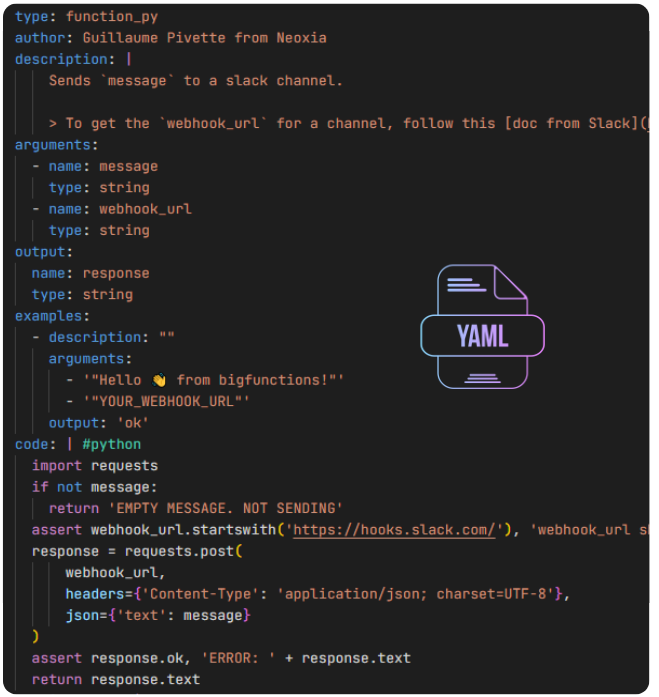

<div class="hero" markdown>

# A Framework<br>for BigQuery functions

Build a catalog of BigQuery functions<br>
using BigFunctions Framework<br>

[Discover the framework :octicons-arrow-right-24:](#discover-the-framework){ .md-button .md-button--primary }

</div>

<br>

---

<br>


## Discover the framework

<div class="lg:two-columns lg:revert-items" markdown>

-   ### A YAML Standard

    Each function is defined in a **yaml file** *(with its author, description, arguments, examples, code, etc)*


    Yaml files are used to **test & deploy the functions** and **generate a documentation website** (such as this website).

-   

</div>


<div class="lg:two-columns" markdown>

-   ### A Command Line Interface

    `bigfun` CLI is installable with one `pip install` and enables you to:

    - get the yaml file of a public function
    - test the function
    - deploy it
    - generate a documentation website (such as this website)


-   

</div>


<div class="lg:two-columns lg:revert-items" markdown>

-   ### A Documentation Website

    The command line interface generates your catalog of the available functions in your company with use cases and examples.

    **Foster self-service for your data-people!**

-   { .primary-border }

</div>


## Get Started!

`bigfun` CLI (command-line-interface) facilitates BigFunctions development, test, deployment, documentation and monitoring.

### 1. Install `bigfun` 🛠️


``` sh
pip install bigfunctions
```

### 2. Use `bigfun` 🔥

``` sh
$ bigfun --help
Usage: bigfun [OPTIONS] COMMAND [ARGS]...

Options:
  --help  Show this message and exit.

Commands:
  deploy      Deploy BIGFUNCTION
  docs        Generate, serve and publish documentation
  get         Download BIGFUNCTION yaml file from unytics/bigfunctions...
  test        Test BIGFUNCTION
```


### 3. Create you first function 👷

Functions are defined as yaml files under `bigfunctions` folder. To create your first function locally, the easiest is to download an existing yaml file of unytics/bigfunctions Github repo.

For instance to download `is_email_valid.yaml` into bigfunctions folder, do:

```sh
bigfun get is_email_valid
```

You can then update the file to suit your needs.


### 4. Deploy you first function 👨‍💻

> 1. Make sure the `gcloud` command is [installed on your computer](https://cloud.google.com/sdk/docs/install)
> 2. Activate the application-default account with `gcloud auth application-default login`. A browser window should open, and you should be prompted to log into your Google account. Once you've done that, `bigfun` will use your oauth'd credentials to connect to BigQuery through BigQuery python client!
> 3. Get or create a `DATASET` where you have permission to edit data and where the function will be deployed.
> 4. The `DATASET` must belong to a `PROJECT` in which you have permission to run BigQuery queries.

You now can deploy the function `is_email_valid` defined in `bigfunctions/is_email_valid.yaml` yaml file by running:

```sh
bigfun deploy is_email_valid
```

> The first time you run this command it will ask for `PROJECT` and `DATASET`.
>
> Your inputs will be written to `config.yaml` file in current directory so that you won't be asked again (unless you delete the entries in `config.yaml`). You can also override this config at deploy time: `bigfun deploy is_email_valid --project=PROJECT --dataset=DATASET`.


Test it with 👀:

```sql
select PROJECT.DATASET.is_email_valid('paul.marcombes@unytics.io')
```

<br>


### 5. Deploy you first javascript function which depends on *npm packages* 👽

*To deploy a **javascript** function* which depends on **npm packages** there are additional requirements *in addition to the ones above*.

> 1. You will need to install each *npm package* on your machine and bundle it into one file. For that, you need to [install *nodejs*](https://nodejs.org/en/download/).
> 2. The bundled js file will be uploaded into a cloud storage bucket in which you must have write access. The bucket name must be provided in `config.yaml` file in a variable named `bucket_js_dependencies`. Users of your functions must have read access to the bucket.

You now can deploy the function `render_template` defined in `bigfunctions/render_template.yaml` yaml file by running:

```sh
bigfun deploy render_template
```

Test it with 👀:

```sql
select PROJECT.DATASET.render_template('Hello {{ user }}', json '{"user": "James"}')
```


<br>


### 6. Deploy you first *remote* function ⚡️

*To deploy a **remote** function* (e.g. python function), there are additional requirements *in addition to the ones of **Deploy you first function** section*.

> 1. A *Cloud Run* service will be deployed to host the code ([as seen here](https://cloud.google.com/bigquery/docs/reference/standard-sql/remote-functions)). So you must have [permissions to deploy a *Cloud Run* service](https://cloud.google.com/run/docs/deploying-source-code#permissions_required_to_deploy) in your project `PROJECT`.
> 2. `gcloud` CLI will be used directly to deploy the service (using `gcloud run deploy`). Then, make sure you are logged in with `gcloud` by calling: `gcloud auth login`. A browser window should also open, and you should be prompted to log into your Google account. WARNING: you read correctly: you have to authenticate twice. Once for bigquery python client (to deploy any function including remote as seen above.) and once now to use `gcloud` (to deploy a *Cloud Run* service).
> 3. A *BigQuery Remote Connection* will be created to link BigQuery with the *Cloud Run* service. You then should have permissions to create a remote connection. *[BigQuery Connection Admin](https://cloud.google.com/bigquery/docs/access-control#bigquery.connectionAdmin)* or *[BigQuery Admin](https://cloud.google.com/bigquery/docs/access-control#bigquery.admin)* roles have these permissions.
> 4. A service account will be automatically created by Google along with the *BigQuery Remote Connection*. BigQuery will use this service account of the remote connection to invoke the *Cloud Run* service. You then must have the permission to authorize this service account to invoke the *Cloud Run* service. This permission is provided in the role *[roles/run.admin](https://cloud.google.com/run/docs/reference/iam/roles)*


You now can deploy the function `faker` defined in `bigfunctions/faker.yaml` yaml file by running:

```sh
bigfun deploy faker
```

Test it with 👀:

```sql
select PROJECT.DATASET.faker("name", "it_IT")
```


<br>


### 7. Host your Documentation on GitHub Pages

> **💡 Note:**
> If you want to host your documentation on GitLab, please check [this link](https://gitlab.com/pages/mkdocs).

#### Steps to Host Your Documentation on GitHub Pages

1. **Create a new repository** on GitHub.
2. **Initialize Git** in your local project:
   ```sh
   git init
   ```
3. Add the remote repository
  ```sh
  git remote add origin <repository-url>
  ```
4. Generate the documentation
  ```sh
    bigfun docs generate
  ```
5. (Optional) Preview the documentation before publishing
  ```sh
  bigfun docs serve
  ```
  Then open http://localhost:8000 in your browser.

6. Add, commit, and push your changes
  ```sh
  git add .
  git commit -m "Add documentation"
  git push origin main
  ```
7. Deploy to GitHub Pages
  ```sh
  mkdocs gh-deploy --force
  ```
8. Access your hosted documentation
  ```sh
  https://<your-github-username>.github.io/<repository-name>/
  ```


<br>


## YAML Syntax for Function Structure

=== "SQL Function"

    ```yaml
      type: function_sql  #(1)! Function type (SQL native)
      author: John Doe  #(2)! Function author
      description: |  #(3)! Clear and concise description
        Multiplies a number by a factor
        (example function for documentation purposes)
      arguments:  #(4)! List of arguments
        - name: num
          type: float64
        - name: factor
          type: float64
      output:  #(5)! Function output
        name: product
        type: float64
      examples:  #(6)! Usage examples
        - description: Basic multiplication
          arguments:
            - 5
            - 3
          output: 15
        - description: Decimal multiplication
          arguments:
            - 2.5
            - 4
          output: 10.0
      code: |  #(7)! SQL implementation
        (
          SELECT num * factor
        )
    ```

    1. <code>type</code>
      <i>(Required)</i>
      Function category declaration.
    2. <code>author</code>
      <i>(Optional)</i>
      Function creator/maintainer identifier.
    3. <code>description</code>
      <i>(Required)</i>
      Clear explanation of the function's purpose and behavior.
    4. <code>arguments</code>
      <i>(Required)</i>
      List of input parameters with BigQuery-compatible type definitions and descriptions.
      **Parameter Structure:**
        Each argument requires:
        - **`name`**
          Valid identifier (snake_case recommended)
          Example: `user_id`, `transaction_amount`
        - **`type`**
          BigQuery-supported data type:
          ```python
          BOOL | INT64 | FLOAT64 | STRING | JSON | DATE | TIMESTAMP
          ```
      [BigQuery Data Types Reference :material-arrow-right:](https://cloud.google.com/bigquery/docs/reference/standard-sql/data-types)
    5.  <code>output</code>
      <i>(Required)</i>
      Definition of the function's return value structure.
      **Output Structure:**
        - **`name`**
          Identifier for the return value (snake_case recommended)
          Example: `result`, `total_amount`
        - **`type`**
          BigQuery-compatible data type:
          ```python
          BOOL | INT64 | FLOAT64 | STRING | JSON | DATE | TIMESTAMP
          ```
      **Example:**
        ```yaml
        output:
          name: final_price
          type: FLOAT64
          description: Total amount after applying discounts and taxes
        ```
      [BigQuery Data Types Reference :material-arrow-right:](https://cloud.google.com/bigquery/docs/reference/standard-sql/data-types)
    6. <code>examples</code>
        <i>(Required)</i>
        List of practical usage demonstrations for the function.
        **Key Elements:**
        - **`description`** : Context explanation
        - **`arguments`** : Input values
        - **`output`** : Expected result
    7. <code>code</code>
      <i>(Required)</i>
      SQL query implementation for the function's logic.


=== "Python Function"

    ```yaml
      type: function_py  #(1)! Python UDF type
      author: John Doe  #(2)! Function creator
      description: |  #(3)!
        Generates a personalized greeting message
        Combines first and last name with a welcome phrase
      arguments:  #(4)! Input parameters
        - name: first_name
          type: string
        - name: last_name
          type: string
      output:  #(5)! Return specification
        name: greeting
        type: string
      examples:  #(6)! Usage demonstrations
        - description: Basic usage
          arguments:
            - "'John'"
            - "'Doe'"
          output: "Hello John Doe"
        - description: Different name
          arguments:
            - "'Marie'"
            - "'Curie'"
          output: "Hello Marie Curie"
      init_code: | #(7)! Initialization code
        # Pre-imported modules (executed once)
        import requests  # Example dependency
      code: | #(9)! Main function logic
        def say_hello(first_name: str, last_name: str) -> str:
            """Create greeting message"""
            return f"Hello {first_name} {last_name}"
      requirements: | #(10)! Python dependencies
        # External libraries needed
        numpy==1.24.2
        requests>=2.28.1
      dockerfile: | #(8)! Custom runtime setup
        image: python:3.9-slim  # Base image
        apt_packages:  # System dependencies
          - libgomp1
        additional_commands: |
          # Additional setup commands
          RUN pip install --upgrade pip
      secrets: | #(14)! Secure configurations
        - name: API_KEY
          description: External service authentication
          documentation_link: https://example.com/api-docs
      max_batching_rows: 1 #(11)! Max rows processed per batch (remote execution)
      quotas: | #(12)! Usage limits
        max_rows_per_user_per_day: 10000000 # Daily user quota
        max_rows_per_query: 2 # Per-query limit
      cloud_run: #(13)! Serverless config
        memory: 2Gi
        concurrency: 80 # Max concurrent requests/instance
        cpu: 2 # vCPU count
    ```

=== "Javascript Function"    

    To be documented

    1. <code>type</code>
      <i>(Required)</i>
      Function category declaration.
    2. <code>author</code>
      <i>(Optional)</i>
      Function creator/maintainer identifier.
    3. <code>description</code>
      <i>(Required)</i>
      Clear explanation of the function's purpose and behavior.
    4. <code>arguments</code>
      <i>(Required)</i>
      List of input parameters with type definitions and descriptions.
      **Parameter Structure:**
        Each argument requires:
        - **`name`**
          Valid Python identifier (snake_case recommended)
          Example: `user_id`, `transaction_amount`
        - **`type`**
          Data type from allowed set:
          ```python
          BOOL | STRING | JSON | INT64 | FLOAT64
          ```
      [Python Type Hints Documentation :material-arrow-right:](https://docs.python.org/3/library/typing.html)
    5. Output structure (name, type).
    6. List of usage examples (description, arguments, output).
    7. <code>init_code</code>
      <i>(Optional)</i>
      Initialization code executed once during container startup, before any function invocation.
      **Example:**
        ```python
        # Pre-load expensive dependencies
        import requests  # HTTP client
        import numpy as np  # Numerical computations
        from google.cloud import bigquery  # GCP integration
        # Initialize shared resources
        client = bigquery.Client()
        model = load_ml_model("gs://bucket/model.pkl")  # One-time model loading
        ```
      **Key Use Cases:**
        - Pre-importing expensive modules to reduce per-request latency
        - Initializing database connections/pools
        - Loading ML models or configuration files
        - Setting up shared caches or global variables
      **⚠️ Important Notes:**
        - Mutable global variables may cause concurrency issues
        - Changes to `init_code` require a new deployment
        - Not suitable for request-specific authentication tokens
      [Python Import System Documentation :material-arrow-right:](https://docs.python.org/3/reference/import.html)
    8. <code>dockerfile</code>
      <i>(Optional)</i>
      Custom Docker container configuration for function packaging.
      **Configurable Elements:**
        - **`image`**
          Base Docker image (e.g., `python:3.9-slim`).
          *Recommendation: Use specific version tags (e.g., `python:3.9.18-slim`)*
        - **`apt_packages`**
          System packages to install:
          ```yaml
          apt_packages:
            - libgomp1  # OpenMP support
            - libpq-dev  # PostgreSQL bindings
          ```
        - **`additional_commands`**
          Custom build commands (executed in order):
          ```dockerfile
          RUN pip install --upgrade pip
          ```
      **⚠️ Important Notes:**
        - Prefer official images for security
        - Don't modify the default `EXPOSE 8080`
    9. <code>code</code>
      <i>(Required)</i>
      Python function implementation containing the core business logic.
      **Format:**
      ```python
      def your_function_name(parameter1: type, parameter2: type) -> return_type:
          """Function docstring explaining purpose and behavior"""
          # Implementation code here
          return result
      ```
      **Example:**
      ```python
      def calculate_price(quantity: int, unit_price: float) -> float:
          """Calculate total price with 20% tax"""
          tax_rate = 0.20
          subtotal = quantity * unit_price
          return subtotal * (1 + tax_rate)
      ```
      **Key Considerations:**
        - Must match parameter names/types defined in `arguments` section
        - Dependencies must be declared in `requirements` section
      [Python Function Best Practices :material-arrow-right:](https://peps.python.org/pep-0008/)
    10. <code>requirements</code>
      <i>(Optional)</i>
      Python packages required by the function, following `requirements.txt` syntax.
      **Format:**
      ```text
      package1==1.2.3
      package2>=4.5.6
      package3  # Comment explaining purpose
      ```
      **Example:**
      ```python
      numpy==1.24.2
      requests>=2.28.1
      google-cloud-storage  # For cloud integration
      ```
      [Python Packaging Documentation :material-arrow-right:](https://packaging.python.org/en/latest/tutorials/managing-dependencies/)
    11. <code>max_batching_rows</code>
      <i>(Optional)</i>
      Maximum number of rows processed in a single batch during remote function execution.
      **Default:**
      1 (single-row processing)
      **Impact:**
      Higher values improve throughput for bulk operations
      Lower values reduce memory consumption per request
      **Use Case:**
      Set to >1 when processing multiple BigQuery rows simultaneously
      **Documentation:**
      [BigQuery Batch Processing Limits :material-arrow-right:](https://cloud.google.com/bigquery/quotas#query_jobs)
    12. <code>quotas</code>
      <i>(Optional)</i>
      Resource limits to prevent abuse and ensure system stability:
        - **<code>max_rows_per_user_per_day</code>**
            Maximum database rows a single user can retrieve in 24 hours.
        - **<code>max_rows_per_query</code>**
            Maximum rows returned per API call.
    13. <i class="optional">(Optional)</i> Cloud Run Configuration
      Configure scaling, compute resources, and deployment settings for your Cloud Run service.
      For advanced configurations, see the [official Cloud Run documentation :material-arrow-right:](https://cloud.google.com/run/docs/).
      ```yaml
        # Docker image deployed to Cloud Run (e.g., from Google Container Registry)
        image: gcr.io/project-id/image:tag

        # Deployment region for the service (default: us-central1)
        region: us-central1  # [See supported regions][cloud-run-regions]

        # Allocated memory per instance (valid: 128Mi to 32Gi, in 64Mi increments)
        memory: 512Mi

        # Number of allocated CPUs per instance (default: 1)
        cpu: 1

        # Maximum concurrent requests per instance (default: 80)
        concurrency: 80  # Set to 1 for strict isolation

        # Maximum request duration (e.g., 300s = 5 minutes)
        timeout: 300s

        # Environment variables (format: KEY1=value1,KEY2=value2)
        set_env_vars: DEBUG=true,MAX_RETRIES=3

        # Minimum number of running instances (avoids cold starts)
        min_instances: 1

        # Maximum number of instances allowed (default: 100)
        max_instances: 100
      ```
    14. <i>(Optional)</i> Secrets

## ❓ FAQ

??? note "How to correctly highlight `sql`, `python` and `javascript` code in yaml files?"

    In yaml files multiline string are by default highlighted as strings.
    That makes reading `code` field hard to read (with all code in the same string color).
    To correctly highlight the code regarding its python / javascript / sql syntax,
    you can install [YAML Embedded Languages VSCode extension](https://marketplace.visualstudio.com/items?itemName=harrydowning.yaml-embedded-languages){ target="_blank" }.


??? note "How to define specific parameters for cloud run of python functions?"

    In yaml files you can add a `cloud_run` field with cloud run parameters.
    Any argument of ['cloud run deploy' command](https://cloud.google.com/sdk/gcloud/reference/run/deploy){ target="_blank" }
    can be put under `cloud_run` field.

    You can see an example [here](https://github.com/unytics/bigfunctions/blob/main/bigfunctions/get_data/load_api_data_into_temp_dataset.yaml#L339){ target="_blank" }.

    You can also put the same config in your `config.yaml` file to define default values
    (useful for defining a default service account for functions).
    The arguments defined in `config.yaml` will be overriden by the arguments (if defined)
    in the function yaml files.


??? note "How to change the cloud run service account for python functions?"

    By default, your default compute service account is used when deploying cloud run.
    To change that, see the previous FAQ item which show how to define specific parameters for cloud run.


??? note "How to generate key pair for encryption / decryption of secrets contained in arguments"

    In order not to pass secrets in plain text in function arguments,
    bigfunctions provides a mechanism to encrypt a secret on the documentation page of a function (for example [here](https://unytics.io/bigfunctions/bigfunctions/send_mail_with_gmail/#encrypt-your-secrets)).
    Only the given function will be able to decrypt it for the given users.

    For this to work you need to:

    1. Generate a key pair for encryption / decryption by running `bigfun config generate-key-pair-for-secrets`.
        - The public key (used for encryption on the website) will be stored in your `config.yaml` and used when you generate your website.
        - The private key (used for decryption by the function) will be printed on the console
    2. Store the private key in a secret named `bigfunctions_private_key` in the [Google Secret Manager](https://console.cloud.google.com/security/secret-manager){ target="_blank" } of the project where you deploy the function.
    3. Give to the service account of the function `Secret Accessor` role to the private key.

    The deployed function will automatically download the private key and decrypt any encrypted secret in arguments tagged as secrets (and check secrets were encrypted for this function and for the user who calls it).
