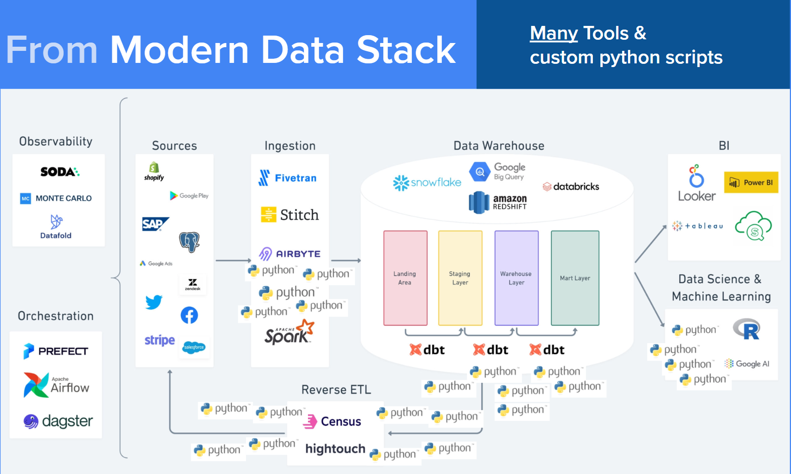

<div class="grid cards no-border" markdown>

-   ## Modern Data Stack is too Complex!

    <figure markdown="span">
        { width="600" }
        <figcaption>The Modern Data Stack is Complex!</figcaption>
    </figure>

    :x: **Tool Sprawl**: A multitude of tools for various tasks complicates the data workflow.

    :x: **Custom Scripting**: Reliance on custom Python scripts introduces complexity and increases maintenance overhead.

    :x: **Lack of Self-Service**: Data analysts often depend on data engineers for complex tasks, hindering agility and efficiency.


-   ## :octicons-arrow-right-24: Future is SQL Data Stack

    <figure markdown="span">
        { width="600" }
        <figcaption>Supercharged Data-Warehouse is All You Need!</figcaption>
    </figure>

    :white_check_mark:  **Simplicity**: Achieve everything with SQL, thus minimizing the need for multiple tools.

    :white_check_mark:  **Centralized Governance**: Control all data processes from a central data warehouse with declarative assets.

    :white_check_mark:  **Self-Service**:  Empower data analysts to perform intricate tasks using SQL functions directly.


</div>


## BigFunctions brings the SQL Data Stack


!!! quote ""

    BigFunctions makes the **SQL data stack** a reality


**BigFunctions** is a framework and a collection of open-source functions that make the SQL data stack a reality. It allows you to build a governed catalog of powerful BigQuery functions within your company.

*   **Governed Catalog**: A framework to build a governed catalog of powerful BigQuery functions.
*   **100+ Ready-to-Use Functions**: Provides more than 100 open-source functions for direct use in BigQuery.
*   **Comprehensive Functionality**: Includes functions for loading, transforming, and activating data.
*   **Community-Driven**: Leverages community-developed functions, and allows contributions.
*   **Familiar Workflow**:  Uses a YAML standard and CLI similar to dbt, making it intuitive for dbt users.

### Benefits for Different Users:

*   **Data Analysts**: Gain new capabilities for loading data from diverse sources or activating data via reverse ETL and leverage a catalog of self-service functions.
*   **Analytics Engineers**: The framework's design is familiar to those who use dbt.
*   **Data Engineers**: Implement software engineering best practices and leverage community-developed functions, preventing the need to reinvent the wheel.
*   **Central Data Teams**: Provide a governed catalog of curated functions to large organizations with maintainable effort.


## Supercharge Your SQL with BigFunctions

BigFunctions offers a variety of functions to manage the data lifecycle, including data ingestion, transformation, and activation.

### Functionality Examples:

*   **Loading Data**: Load data from any file on the internet using SQL.
*   **Transforming Data**: Perform complex data transformations using functions such as the time series forecasting function `prophet`.
*   **Activating Data**: Send emails to target audiences directly from SQL queries and send data to your CRM using activation functions.

Explore all available BigFunctions.


## Get Started with BigFunctions


<div class="grid cards" markdown>

-   :material-clock-fast:{ .lg .middle } __Call Public BigFunctions__

    ---

    You can call public functions directly from your BigQuery project without installation. For example:
    ```sql
    SELECT bigfunctions.eu.faker("name", "it_IT")
    ```

    [Explore Public BigFunctions :octicons-arrow-right-24:](bigfunctions){ .md-button .md-input--stretch .md-button--center }


-   :material-rocket-launch:{ .lg .middle } __Deploy BigFunctions__

    ---

    You can also deploy functions in your GCP project.

    - Install the bigfun CLI: pip install bigfunctions.
    - Deploy a function: bigfun deploy my_bigfunction.
    - Functions are defined using YAML files.

    [Discover the Framework :octicons-arrow-right-24:](framework){ .md-button .md-input--stretch .md-button--center }


-   :fontawesome-solid-people-group:{ .lg .middle } __Join the Community__

    ---

    Benefit from BigFunctions community to get support or help others.

    [Join Slack :octicons-arrow-right-24:](https://join.slack.com/t/unytics/shared_invite/zt-1gbv491mu-cs03EJbQ1fsHdQMcFN7E1Q){ .md-button .md-input--stretch .md-button--center }


-   :fontawesome-solid-person-walking:{ .lg .middle } __Contribute to BigFunctions__

    ---

    BigFunctions is fully open-source, and any contribution is welcome.

    [See Contribution Instructions :octicons-arrow-right-24:](CONTRIBUTING){ .md-button .md-input--stretch .md-button--center }

</div>


---

> The modern data stack is characterized by a collection of tools for data ingestion, transformation, and activation + additional python scripts to address custom needs.
>
> :octicons-arrow-right-24: The Data Workflow is **fragmented** and **hard to manage**.
>
> The future of the data stack is a* **declarative SQL data stack** *where the data warehouse is equipped to handle all data needs using SQL and advanced functions.
>
> :octicons-arrow-right-24: The Data Workflow is* **Simple**.
>


<style>
.md-button--center {
    text-align: center;
}

/* .cards.no-border li, .cards.no-border li:hover {
    border: none!important;
} */

h2 {
    font-weight: 600!important;
    color: rgb(38, 38, 38)!important;
}

.cards.no-border li {
    color: rgb(92, 92, 92);
}

.centered-big-message {
    color: rgb(92, 92, 92);
    font-size: 1.2em;
    margin-top: -0.5em;
}

.quote {
    text-align: center;
    font-style: italic;
    /* font-weight: 600!important; */
    font-size: 1.2em!important;
    color: rgb(250, 250, 250)!important;
    /* color: rgb(92, 92, 92)!important; */
    background-color: var(--md-primary-fg-color)!important;
}

</style>