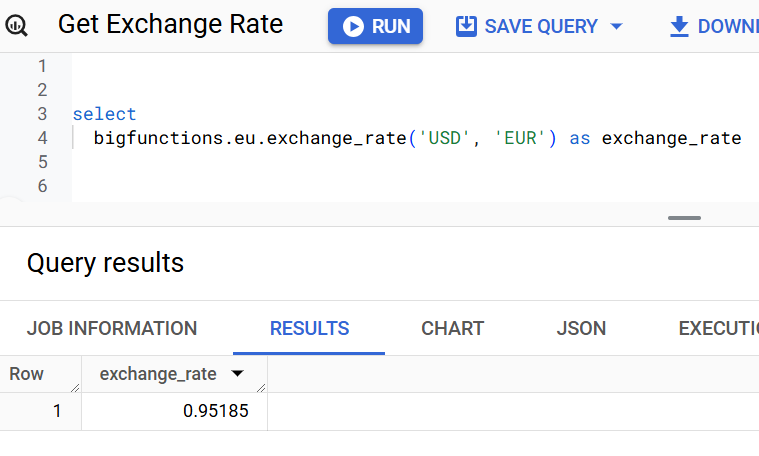
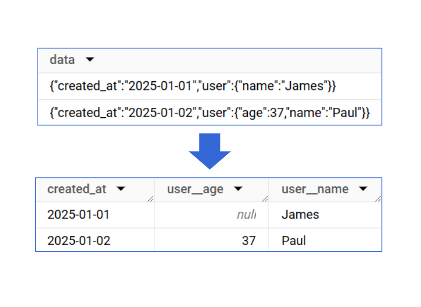

<div class="hero" markdown>

SQL
{ .big-word }

# is all you need

Supercharge **BigQuery** with **BigFunctions**<br>
*to load, transform and activate your data.*<br><br>

[Book a Demo :octicons-arrow-right-24:](https://calendar.app.google/zu54nNMHLVw7jYWy8){ .md-button .md-button--primary }


</div>


<!------------- TECHNOLOGIES UPON SECTION  ----------->
<div class="hero" markdown>

*Taking the most of*
{ .small }

<figure markdown="span">
  { .gray-scale .mt-neg width=200 }
</figure>

</div>

<br>

---

<!------------- POWER OF FUNCTIONS HEADER  ----------->
<div class="hero" markdown>

# The power of functions<br>with the ease of SQL

Ready-to-use BigQuery functions to load, transform, activate.

[Explore Functions :octicons-arrow-right-24:](bigfunctions/){ .md-button }

</div>


<!------------- LOAD FUNCTIONS  ----------->
<div class="hero" markdown>

### 1. LOAD

</div>

<div class="lg:two-columns lg:revert-items" markdown>

-   ## Load Data from any SAAS

    Load data from Salesforce, Hubspot and hundreds of SAAS with one SQL command.

    [Get Started :octicons-arrow-right-24:](bigfunctions/load_api_data/){ .md-button }

-   { .primary-border }

</div>


<div class="lg:two-columns" markdown>

-   ## Load External Data for Enrichment

    Get current and historical `exchange rates`, `weather` or any specific API data to enrich yours.

    [Get Started :octicons-arrow-right-24:](bigfunctions/exchange_rate/){ .md-button }

-   { .primary-border }

</div>


<!------------- TRANSFORM FUNCTIONS  ----------->

<div class="hero" markdown>

### 2. TRANSFORM

</div>

<div class="lg:two-columns lg:revert-items" markdown>

-   ## Make Advanced Transforms

    With BigFunctions, you can do anything in SQL that you can do in python.
    You can for instance convert an `address` to `(latitude, longitude)`
    or get the `country` of an `ip_address`.

    All your transforms are now done in SQL.

    Put them all in dbt!

    [Get Started :octicons-arrow-right-24:](bigfunctions/geocode/){ .md-button }

-   { .primary-border }

</div>

<div class="lg:two-columns" markdown>

-   ## Automatically Flatten Json

    Json data may be hard to manipulate.
    BigFunctions provide some functions to help with that.

    For instance, a function automatically detects json objects schema
    and generate a parsing SQL query to flatten the json column.

    [Get Started :octicons-arrow-right-24:](bigfunctions/sql_to_flatten_json_column/){ .md-button }

-   { .primary-border }

</div>


<!------------- ACTIVATE FUNCTIONS  ----------->


<div class="hero" markdown>

### 3. ACTIVATE

</div>

<div class="lg:two-columns lg:revert-items" markdown>

-   ## Send Chat Message

    Send Slack, Google Chat or Teams message to your teams with the figures of the week.

    Or alert them when something is wrong.

    *It works in SQL, so it works with your SQL orchestrator (be it dbt, sqlmesh, dataform or scheduled queries)*.

    [Get Started :octicons-arrow-right-24:](bigfunctions/send_slack_message/){ .md-button }

-   { .primary-border }

</div>

<div class="lg:two-columns" markdown>

-   ## Send Emails

    Send emails to your teams.

    Better, send emails to your customers!

    Your data-warehouse is the only place where you have a 360° view of your customer.

    So sending email from BigQuery makes a lot of sense.

    [Get Started :octicons-arrow-right-24:](bigfunctions/send_mail/){ .md-button }

-   { .primary-border }

</div>


<!------------- POWER OF FUNCTIONS FOOTER  ----------->


<div class="hero" markdown>

### Load, Transform, Activate

*BigFunctions comes with [150+ ready to use functions](bigfunctions/)*

[Explore Functions :octicons-arrow-right-24:](bigfunctions/){ .md-button }

</div>

<br>

---

<!------------- THE RISE OF SQL DATA STACK  ----------->

<div class="hero" markdown>

# The rise of <br> the SQL-Data-Stack

If BigQuery can perform any task,

*BigQuery + dbt*<br>
*become all you need.*

Say Hi to the SQL-Data-Stack!

</div>


<div class="primary-background" markdown>

<div class="md:two-columns max-width-800" markdown>

-   ## Modern-Data-Stack

    

    :x: **Tool Sprawl**: A multitude of tools for various tasks complicates the data workflow.

    :x: **Custom Scripting**: Reliance on custom Python scripts introduces complexity and increases maintenance overhead.

    :x: **Lack of Self-Service**: Data analysts often depend on data engineers for complex tasks, hindering agility and efficiency.


-   ## SQL-Data-Stack

    

    :white_check_mark: **Simplicity**: Achieve everything with SQL, thus minimizing the need for multiple tools.

    :white_check_mark: **Centralized Governance**: Control all data processes from a central data warehouse with declarative assets.

    :white_check_mark: **Self-Service**:  Empower data analysts to perform intricate tasks using SQL functions directly.

</div>

</div>


---


<!------------- FRAMEWORK  ----------->

<div class="hero" markdown>

# A framework like dbt

Build a Governed Catalog of BigQuery Functions at your Company

</div>


<br>
<br>
<br>


## BigFunctions: the key enabler of the SQL Data Stack

!!! note ""


    **BigFunctions** is a framework and a collection of open-source functions that make the SQL data stack a reality. It allows you to build a governed catalog of powerful BigQuery functions within your company.

    *   **Governed Catalog**: A framework to build a governed catalog of powerful BigQuery functions.
    *   **100+ Ready-to-Use Functions**: Provides more than 100 open-source functions for direct use in BigQuery.
    *   **Comprehensive Functionality**: Includes functions for loading, transforming, and activating data.
    *   **Community-Driven**: Leverages community-developed functions, and allows contributions.
    *   **Familiar Workflow**:  Uses a YAML standard and CLI similar to dbt, making it intuitive for dbt users.

    ### Benefits for Different Users:

    *   **Data Analysts**: Gain new capabilities for loading data from diverse sources or activating data via reverse ETL and leverage a catalog of self-service functions.
    *   **Analytics Engineers**: The framework's design is familiar to those who use dbt.
    *   **Data Engineers**: Implement software engineering best practices and leverage community-developed functions, preventing the need to reinvent the wheel.
    *   **Central Data Teams**: Provide a governed catalog of curated functions to large organizations with maintainable effort.

    ### Functionality Examples:

    *   **Loading Data**: Load data from any file on the internet using SQL.
    *   **Transforming Data**: Perform complex data transformations using functions such as the time series forecasting function `prophet`.
    *   **Activating Data**: Send emails to target audiences directly from SQL queries and send data to your CRM using activation functions.
    Explore all available BigFunctions.


## Get Started with BigFunctions

!!! note ""

    <div class="grid cards" markdown>

    -   :material-clock-fast:{ .lg .middle } __Call Public BigFunctions__

        ---

        You can call public functions directly from your BigQuery project without installation. For example:
        ```sql
        SELECT bigfunctions.eu.faker("name", "it_IT")
        ```

        [Explore Public BigFunctions :octicons-arrow-right-24:](bigfunctions){ .md-button .md-input--stretch .md-button--center }


    -   :material-rocket-launch:{ .lg .middle } __Deploy BigFunctions__

        ---

        You can also deploy functions in your GCP project.

        - Install the bigfun CLI: pip install bigfunctions.
        - Deploy a function: bigfun deploy my_bigfunction.
        - Functions are defined using YAML files.

        [Discover the Framework :octicons-arrow-right-24:](framework){ .md-button .md-input--stretch .md-button--center }


    -   :fontawesome-solid-people-group:{ .lg .middle } __Join the Community__

        ---

        Benefit from BigFunctions community to get support or help others.

        [Join Slack :octicons-arrow-right-24:](https://join.slack.com/t/unytics/shared_invite/zt-1gbv491mu-cs03EJbQ1fsHdQMcFN7E1Q){ .md-button .md-input--stretch .md-button--center }


    -   :fontawesome-solid-person-walking:{ .lg .middle } __Contribute to BigFunctions__

        ---

        BigFunctions is fully open-source, and any contribution is welcome.

        [See Contribution Instructions :octicons-arrow-right-24:](CONTRIBUTING){ .md-button .md-input--stretch .md-button--center }

    </div>
